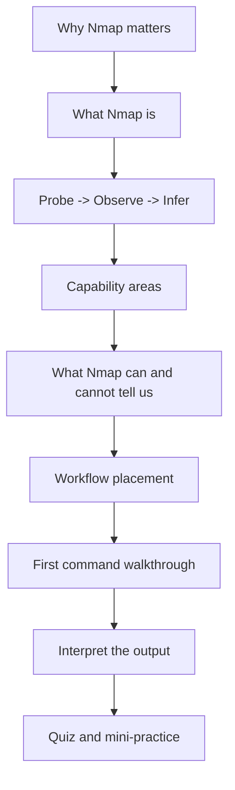
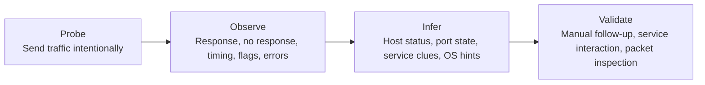
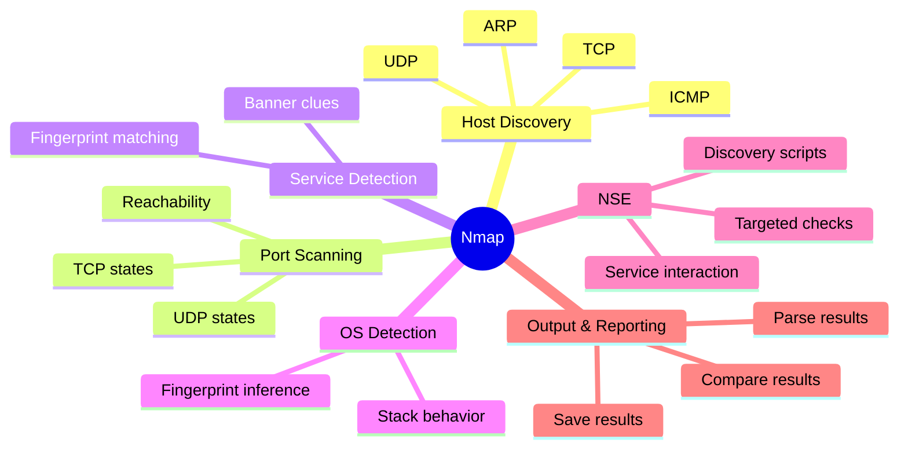
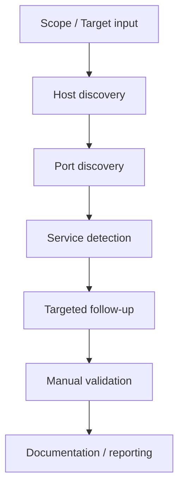

# Lesson 2.1 — What Nmap Is

---

> **🎯 Lesson Goal**  
> By the end of this lesson, we will stop thinking of Nmap as “just a port scanner” and start seeing it as a structured **network reconnaissance and security auditing framework** that helps us turn uncertainty into evidence.

| **Course** | **Module** | **Lesson** | **Estimated Time** | **Difficulty** |
|---|---|---|---:|---|
| Enumeration with Nmap | Module 2 — Introduction to Nmap | 2.1 — What Nmap Is | 30–45 min | Beginner |

| **Prerequisites** | **You will practice** | **Main outcome** |
|---|---|---|
| Basic command-line use, basic networking vocabulary | Reading Nmap output at a high level | Building the right mental model before we touch deeper scan types |

> **🚨 Important**
>
> This course treats Nmap as part of a real enumeration workflow. We are not memorizing flags in isolation. We are learning how to reason about systems, exposure, and evidence.

---

## Table of Contents

- [Lesson Map](#lesson-map)
- [Why This Lesson Matters](#why-this-lesson-matters)
- [Learning Objectives](#learning-objectives)
- [The Hook: The Difference Between Running Nmap and Understanding Nmap](#the-hook-the-difference-between-running-nmap-and-understanding-nmap)
- [What Nmap Actually Is](#what-nmap-actually-is)
- [The Core Mental Model: Probe → Observe → Infer](#the-core-mental-model-probe--observe--infer)
- [What Questions Nmap Helps Us Answer](#what-questions-nmap-helps-us-answer)
- [Nmap’s Major Capability Areas](#nmaps-major-capability-areas)
- [What Nmap Can and Cannot Tell Us](#what-nmap-can-and-cannot-tell-us)
- [Where Nmap Fits in an Enumeration Workflow](#where-nmap-fits-in-an-enumeration-workflow)
- [First Command Walkthrough](#first-command-walkthrough)
- [Interpret the Output](#interpret-the-output)
- [Stop and Think](#stop-and-think)
- [Common Mistakes and Misconceptions](#common-mistakes-and-misconceptions)
- [Defender’s View](#defenders-view)
- [Beyond Nmap](#beyond-nmap)
- [Key Takeaways](#key-takeaways)
- [Knowledge Check Quiz](#knowledge-check-quiz)
- [Quiz Answers](#quiz-answers)
- [Mini Practice Task](#mini-practice-task)
- [Next Lesson Bridge](#next-lesson-bridge)

---

## Lesson Map



> **💡 Tip**
>
> Treat this lesson like a foundation pour. It may feel conceptual, but it makes every later lesson easier because we will understand **why** each Nmap feature exists before we learn **how** to use it.

---

## Why This Lesson Matters

Before we can use a tool well, we need to understand what problem the tool is solving.

When many beginners hear **Nmap**, they think:

- “It finds open ports.”
- “It tells me what’s running.”
- “It’s the first command I run.”

Those are not wrong, but they are incomplete.

Nmap is valuable because it helps us answer multiple reconnaissance questions in a structured way:

- Is the host alive?
- Which ports are reachable?
- Which services appear to be listening?
- What platform clues can we gather?
- What looks exposed, filtered, or worth deeper inspection?
- What do we need to validate manually next?

If we do not have this mental model, Nmap output feels like disconnected technical text.

If we *do* have this mental model, Nmap output starts to read like evidence.

> **📝 Note**
>
> Good operators do not simply “run Nmap.” They use Nmap to reduce uncertainty, generate hypotheses, and decide what to investigate next.

---

## Learning Objectives

By the end of this lesson, we should be able to:

- explain what Nmap is in practical terms
- describe the kinds of reconnaissance questions Nmap helps answer
- identify Nmap’s major capability areas at a high level
- distinguish between what Nmap reports directly and what it infers
- place Nmap in a broader enumeration workflow
- interpret a basic Nmap result without treating it like magic

---

## The Hook: The Difference Between Running Nmap and Understanding Nmap

Imagine two learners sit down at a shell.

Both run:

```bash
nmap 10.10.10.15
```

The first learner sees output and thinks:

> “Cool. Some ports are open.”

The second learner sees output and thinks:

- Did Nmap first confirm the host was alive?
- Which default scan behavior did it use here?
- Are these TCP ports only, or also UDP?
- Is the reported service name confirmed, or just a strong guess?
- What does “not shown: 997 closed ports” imply?
- What should I manually verify next?

Both learners ran the same command.

Only one of them is truly enumerating.

> **🚨 Important**
>
> The goal of this course is not to create people who can type commands from memory.  
> The goal is to create people who understand what the command is doing, what the output means, and what to do next.

---

## What Nmap Actually Is

**Nmap** stands for **Network Mapper**.

At a practical level, Nmap is an open-source tool used to:

- discover live hosts on a network
- identify reachable ports
- classify port states
- fingerprint services and often versions
- infer operating system characteristics
- run script-assisted checks through the Nmap Scripting Engine (NSE)
- save, compare, and report scan results

That means Nmap is not just one thing.

It is simultaneously:

- a **network probing tool**
- a **reconnaissance platform**
- an **enumeration aid**
- a **security auditing utility**
- a **workflow accelerator**

### A better definition

A stronger definition than “Nmap is a port scanner” is:

> **Nmap is a network reconnaissance and security auditing framework that sends carefully chosen probes, observes the responses, and uses those responses to infer useful information about hosts and services.**

That definition matters because it highlights the real engine underneath the tool:

- sending packets
- observing behavior
- interpreting the results

> **💡 Tip**
>
> Nmap does not “see inside” a system. It learns by interacting with the network stack and the services exposed through it.

---

## The Core Mental Model: Probe → Observe → Infer

This is one of the most important ideas in the entire course.



### 1. Probe

Nmap sends something on purpose.

That might be:

- an ARP request
- an ICMP echo request
- a TCP SYN
- a TCP ACK
- a UDP packet
- a protocol-specific service detection probe
- an NSE script-driven interaction

### 2. Observe

Nmap watches what happens next.

It may receive:

- a reply
- a reset
- an ICMP error
- a banner
- no response at all
- a delayed response
- a response with clues in flags, TTL, or other metadata

### 3. Infer

From that behavior, Nmap forms conclusions such as:

- the host appears up
- the port appears open
- the port appears closed
- the port appears filtered
- the service looks like SSH, HTTP, SMB, and so on
- the host resembles a particular operating system family

### 4. Validate

This is the step people skip.

Nmap can tell us a lot, but it does not remove the need for:

- manual connection attempts
- banner grabbing
- HTTP requests
- packet capture
- targeted follow-up tools
- operator judgment

> **⚠️ Warning**
>
> **Inference is not the same as certainty.**  
> Especially in network reconnaissance, missing data, filtering devices, unusual service behavior, and custom configurations can all distort what a scanner sees.

---

## What Questions Nmap Helps Us Answer

Nmap is most useful when we think in terms of questions.

### 1. Host discovery questions

- Is this system alive?
- Which systems in this subnet appear reachable?
- Are we seeing evidence through ARP, ICMP, TCP, or UDP-based discovery?

### 2. Port discovery questions

- Which TCP ports are open?
- Which UDP ports might be open?
- Which ports are closed, filtered, or ambiguous?

### 3. Service identification questions

- What is actually listening on that port?
- Is the reported service name likely correct?
- Is the service default, custom, proxied, or misleading?

### 4. Version and platform questions

- Can we identify a likely software family or version?
- Are there banners or fingerprints that suggest a technology stack?
- Does the host resemble a specific operating system family?

### 5. Follow-up enumeration questions

- Can NSE gather more detail?
- Should we manually connect to the service?
- Is this likely relevant to our objectives?

> **📝 Note**
>
> Tools do not create value by printing output.  
> Tools create value when they help us answer the next useful question.

---

## Nmap’s Major Capability Areas



### Capability overview

| **Capability Area** | **Primary Question** | **What It Gives Us** | **Why It Matters** |
|---|---|---|---|
| Host discovery | Is the target alive? | Up/down evidence | Prevents wasting effort on dead hosts |
| Port scanning | What is reachable? | Open, closed, filtered states | Reveals exposed attack surface |
| Service detection | What is behind the port? | Likely service names and versions | Guides next-step enumeration |
| OS detection | What kind of host is this? | Platform hints | Helps shape hypotheses and tooling |
| NSE | Can we ask deeper questions? | Script-assisted enumeration | Extends Nmap beyond simple probing |
| Output/reporting | How do we preserve this? | Saved artifacts | Enables comparison, reporting, and reuse |

> **💡 Tip**
>
> This is why the phrase “just a port scanner” is too small. Port scanning is one capability area inside a broader reconnaissance framework.

---

## What Nmap Can and Cannot Tell Us

One of the best ways to improve as an operator is to separate **reported facts** from **reasonable inferences**.

### What Nmap can often tell us well

- a host appears reachable
- a given port appears open, closed, or filtered
- a likely service name for an open port
- clues about version or platform
- whether some script-based follow-up checks succeed

### What Nmap cannot guarantee by itself

- that a service is configured securely
- that a version guess is perfect
- that a port is truly “safe” just because it is closed
- that a filtered result means no service exists there
- that a reported service label is the whole story
- that manual validation is unnecessary

| **Nmap Says** | **What That Usually Means** | **What We Should Still Remember** |
|---|---|---|
| `Host is up` | The target responded in some meaningful way | “Up” is evidence of reachability, not total visibility |
| `22/tcp open ssh` | Port 22 accepted traffic in a way consistent with SSH | We should still validate if the service is standard, custom, proxied, or banner-masked |
| `80/tcp open http` | Something HTTP-like is listening | We still need to browse it, inspect headers, and enumerate content |
| `filtered` | A firewall or similar control likely interfered | “Filtered” is uncertainty, not proof of absence |
| Version guess | Nmap matched behavior to known signatures | Fingerprints can be incomplete or misleading |

> **🚨 Important**
>
> The right posture is: **respect the output, but verify the conclusion**.

---

## Where Nmap Fits in an Enumeration Workflow

Nmap is not the entire workflow. It is a major part of it.



### Practical workflow thinking

A simple pattern looks like this:

1. **Identify likely live systems**
2. **Determine exposed ports**
3. **Identify services**
4. **Prioritize what matters**
5. **Manually interact with high-value services**
6. **Document what we found**

This matters because the scan is not the goal.

The scan is the **bridge** between “I know very little about this host” and “I now have concrete avenues for deeper analysis.”

> **📝 Note**
>
> Enumeration is cumulative. Each pass should increase clarity and reduce uncertainty.

---

## First Command Walkthrough

Let’s look at a simple, foundational example:

```bash
nmap 10.10.10.15
```

### Command anatomy

| **Command Part** | **Meaning** |
|---|---|
| `nmap` | Launches the Nmap tool |
| `10.10.10.15` | Tells Nmap which target to assess |
| *No extra flags yet* | We are relying on Nmap’s default behavior for this environment and privilege level |

> **💡 Tip**
>
> A simple command is still doing several things under the hood. Even when the syntax is short, the behavior is not trivial.

### What this command is *trying* to do conceptually

At a high level, Nmap will try to answer:

- Does the target appear up?
- Which ports should I scan?
- What port states do I observe?
- Which service labels should I attach to the open ports?

We will unpack the exact defaults later in the course. For now, the point is to build the mental model that even a “basic” Nmap command is already a multi-stage reconnaissance action.

---

## Interpret the Output

Below is a representative example of the kind of output we may see:

```text
Starting Nmap 7.xx ( https://nmap.org ) at 2026-03-23 10:00 UTC
Nmap scan report for 10.10.10.15
Host is up (0.021s latency).
Not shown: 997 closed tcp ports
PORT    STATE SERVICE
22/tcp  open  ssh
80/tcp  open  http
443/tcp open  https
Nmap done: 1 IP address (1 host up) scanned in 2.31 seconds
```

### Annotated reading

| **Output Line** | **How We Should Read It** | **Why It Matters** |
|---|---|---|
| `Nmap scan report for 10.10.10.15` | This is the target Nmap is reporting on | Confirms which host this result belongs to |
| `Host is up` | The host responded in a meaningful way | We have evidence of liveness/reachability |
| `0.021s latency` | Nmap observed a rough response time | This can hint at proximity or network conditions, but should not be overinterpreted |
| `Not shown: 997 closed tcp ports` | Nmap scanned a default TCP set and is summarizing most of the closed results | This is cleaner than printing hundreds of closed ports |
| `22/tcp open ssh` | TCP port 22 appears open and looks like SSH | This is a strong next-step candidate for validation |
| `80/tcp open http` | Port 80 appears open and HTTP-like | Likely worth visiting manually or enumerating further |
| `443/tcp open https` | Port 443 appears open and HTTPS-like | Another likely high-value service |
| `1 host up` | Nmap completed its report for one target | Useful sanity check for scan scope |

> **🚨 Important**
>
> Notice what the output is *not* saying.  
> It is not saying:
> - the SSH configuration is secure
> - the web app is low risk
> - the service guess is infallible
> - there is nothing else worth checking manually

### Output interpretation mindset

When reading Nmap output, always ask:

1. What does Nmap **directly observe**?
2. What is Nmap **inferring**?
3. What do I need to **verify manually**?

That habit alone will make our enumeration much stronger.

---

## Stop and Think

Before moving on, pause and answer these mentally.

> **📝 Note**
>
> Do not scroll to the guidance immediately. Try to reason it out first.

### Question 1

If Nmap reports:

```text
80/tcp open http
```

does that prove the target is running a normal public website?

<details>
<summary><strong>✅ Reveal guidance</strong></summary>

No.

It tells us that something on port 80 behaved in a way consistent with HTTP. That could be:

- a standard web server
- a reverse proxy
- a custom application
- a redirector
- an admin panel
- a service intentionally disguised or minimally responsive

Nmap gives us a valuable clue, not the full story.

</details>

### Question 2

If Nmap says `Host is up`, does that mean we have complete visibility into the target?

<details>
<summary><strong>✅ Reveal guidance</strong></summary>

No.

It means the target responded in a way that gave Nmap evidence of liveness or reachability. A host can be “up” while many services remain filtered, hidden, segmented, or otherwise difficult to observe.

</details>

### Question 3

If Nmap labels a service as `ssh`, should we stop there?

<details>
<summary><strong>✅ Reveal guidance</strong></summary>

No.

That is usually a strong clue, but the professional next step is to validate:

- can we connect?
- what banner appears?
- what version or implementation is present?
- are there authentication methods, host keys, or policy clues we can gather?

</details>

---

## Common Mistakes and Misconceptions

> **⚠️ Warning**
>
> These are some of the most common ways beginners accidentally weaken their own enumeration.

### Mistake 1: Treating Nmap like magic

This usually sounds like:

- “Nmap just knows what’s there.”
- “It says HTTP, so it must be a normal website.”
- “If it didn’t show up, it doesn’t exist.”

Reality: Nmap is probing and inferring. Its conclusions are useful, but bounded by what it can observe.

---

### Mistake 2: Thinking “open port” is the final answer

An open port is not the destination. It is the beginning of a more focused investigation.

- Open 22? Validate SSH.
- Open 80? Browse it, fingerprint it, enumerate content.
- Open 445? Gather SMB-specific information.

---

### Mistake 3: Ignoring what is *not* shown

If Nmap summarizes hundreds of closed ports, that matters.

If a port is filtered, that matters.

If a host is up but very little is visible, that matters.

Absence, summary, filtering, and ambiguity are all part of the evidence picture.

---

### Mistake 4: Confusing service labels with certainty

A service label is often helpful, but it is still a classification result, not divine truth.

---

### Mistake 5: Skipping manual validation

This is one of the biggest quality gaps in beginner workflows.

Nmap should often lead us to:

- `curl`
- `nc`
- browser inspection
- protocol-specific clients
- packet capture
- service-specific enumeration tools

> **💡 Tip**
>
> Strong operators use Nmap to prioritize manual attention, not to replace it.

---

## Defender’s View

It is useful to remember that Nmap is not only meaningful to the operator running it. It is also meaningful to the environment receiving it.

From the defender’s perspective, Nmap activity may appear as:

- bursts of connection attempts
- repeated SYN packets
- unusual ICMP activity
- traffic to many ports in quick succession
- service probes that look like fingerprinting
- script-driven interactions that stand out in logs

This matters for two reasons:

1. It reminds us that scanning is observable.
2. It helps us understand why different scan types, speeds, and techniques matter later in the course.

> **📝 Note**
>
> Even in purely educational lab environments, it is valuable to think about **how the traffic looks from the other side**. That mindset improves both offensive and defensive understanding.

---

## Beyond Nmap

Nmap is a major starting point, but it does not finish the job.

Once Nmap gives us useful clues, we often move into tool- or protocol-specific follow-up.

| **Nmap finds** | **Likely next move** |
|---|---|
| `22/tcp open ssh` | Try manual SSH validation, banner inspection, auth-method observation |
| `80/tcp open http` | Browse it, inspect headers, test routes, fingerprint technologies |
| `443/tcp open https` | Check certificate details, headers, redirects, app behavior |
| `445/tcp open netbios-ssn` or SMB-like results | Gather shares, host info, signing status, domain/workgroup clues |
| `53/tcp` or `53/udp` | Test DNS behavior and zone/query responses |

> **🚨 Important**
>
> Nmap gives us **direction**.  
> Good enumeration comes from what we do with that direction next.

---

## Key Takeaways

> **💡 Tip**
>
> If you only remember a handful of ideas from this lesson, make them these:

- Nmap is more than “just a port scanner.”
- A better mental model is: **probe, observe, infer, validate**.
- Nmap helps answer questions about hosts, ports, services, and exposure.
- Output should be read as evidence, not magic.
- Reported service names and states are starting points for deeper validation.
- Nmap fits into a broader workflow; it is not the entire workflow by itself.

### What changed in our understanding?

| **Before this lesson, we might have thought...** | **After this lesson, we should understand...** |
|---|---|
| “Nmap finds open ports.” | Nmap is a broader reconnaissance and auditing framework. |
| “The output is the answer.” | The output is evidence that guides the next question. |
| “If it says HTTP, then it is a website and I’m done.” | Service identification is a clue that should lead to manual follow-up. |
| “Running the command is the skill.” | Understanding the behavior and interpreting the result is the skill. |

---

## Knowledge Check Quiz

### 1. In the context of this course, which definition best describes Nmap?

A. A password-cracking tool  
B. A packet sniffer used only for passive capture  
C. A network reconnaissance and security auditing framework  
D. A web vulnerability scanner only

---

### 2. Which sequence best reflects the mental model we want to use when thinking about Nmap?

A. Exploit → Persist → Report  
B. Probe → Observe → Infer → Validate  
C. Scan → Trust → Move on  
D. Guess → Brute force → Confirm

---

### 3. If Nmap reports `80/tcp open http`, what is the best interpretation?

A. The target definitely runs Apache  
B. The target definitely hosts a public website  
C. Something on port 80 behaved in a way consistent with HTTP and should be validated further  
D. The service is safe because it is common

---

### 4. Which of the following is **not** a major Nmap capability area?

A. Host discovery  
B. Service detection  
C. Operating system fingerprinting  
D. Guaranteed exploit generation

---

### 5. Why is it a mistake to treat Nmap output like absolute truth?

A. Because Nmap never works  
B. Because all services intentionally lie  
C. Because Nmap often relies on observed behavior and inference, which still requires validation  
D. Because Nmap cannot detect open ports

---

### 6. What is the most professional next step after finding an open service?

A. Assume the label is complete and move on  
B. Validate it manually and use the result to guide deeper enumeration  
C. Ignore it until exploitation time  
D. Delete the output because Nmap already summarized it

---

## Quiz Answers

<details>
<summary><strong>Reveal quiz answers</strong></summary>

### 1. Correct answer: C

Nmap is best understood here as a **network reconnaissance and security auditing framework**.

### 2. Correct answer: B

The core mental model is:

**Probe → Observe → Infer → Validate**

### 3. Correct answer: C

`80/tcp open http` is a strong clue, not the entire story. We still validate manually.

### 4. Correct answer: D

Nmap is not a guaranteed exploit generator. That is outside its core role.

### 5. Correct answer: C

Nmap often relies on packet behavior and service responses to form useful conclusions. Those conclusions should be respected but verified.

### 6. Correct answer: B

Professional enumeration continues with manual validation and deeper, service-specific follow-up.

</details>

---

## Mini Practice Task

> **🚨 Important**
>
> This is intentionally small. The goal is not to perform a giant scan. The goal is to practice **thinking correctly** about what the output means.

### Task

Against a lab host you are authorized to assess, run a simple Nmap command such as:

```bash
nmap <target-ip>
```

### As you review the output, answer these questions in your notes

1. What evidence suggests the host is up?
2. Which ports appear open?
3. Which service labels are shown?
4. Which of those labels are facts, and which are inferences?
5. What manual validation step would you take next for each open service?

### Suggested note-taking format

| **Observed Output** | **What Nmap is telling me** | **What I still need to verify** |
|---|---|---|
| `Host is up` | Target responded meaningfully | How complete my visibility is |
| `22/tcp open ssh` | Port 22 behaves like SSH | Banner, version, auth behavior |
| `80/tcp open http` | Port 80 behaves like HTTP | App type, headers, content, routes |

> **💡 Tip**
>
> This note-taking habit becomes extremely valuable later. It forces us to separate **scanner output** from **operator conclusions**.

---

## Next Lesson Bridge

In this lesson, we built the mental model for what Nmap is.

In the next lesson, we will make that model more concrete by looking at **real-world use cases** for Nmap and how different operators use it for:

- host discovery
- attack surface mapping
- security auditing
- service identification
- deeper enumeration planning

> **📝 Note**
>
> Think of this lesson as the “what” and “why.”  
> The next lesson begins to answer: **where and when do we actually use it?**

---

## End-of-Lesson Recap

> **One-sentence summary:**  
> Nmap is a reconnaissance framework that helps us probe networks, observe responses, infer useful information, and decide what to validate next.

---
