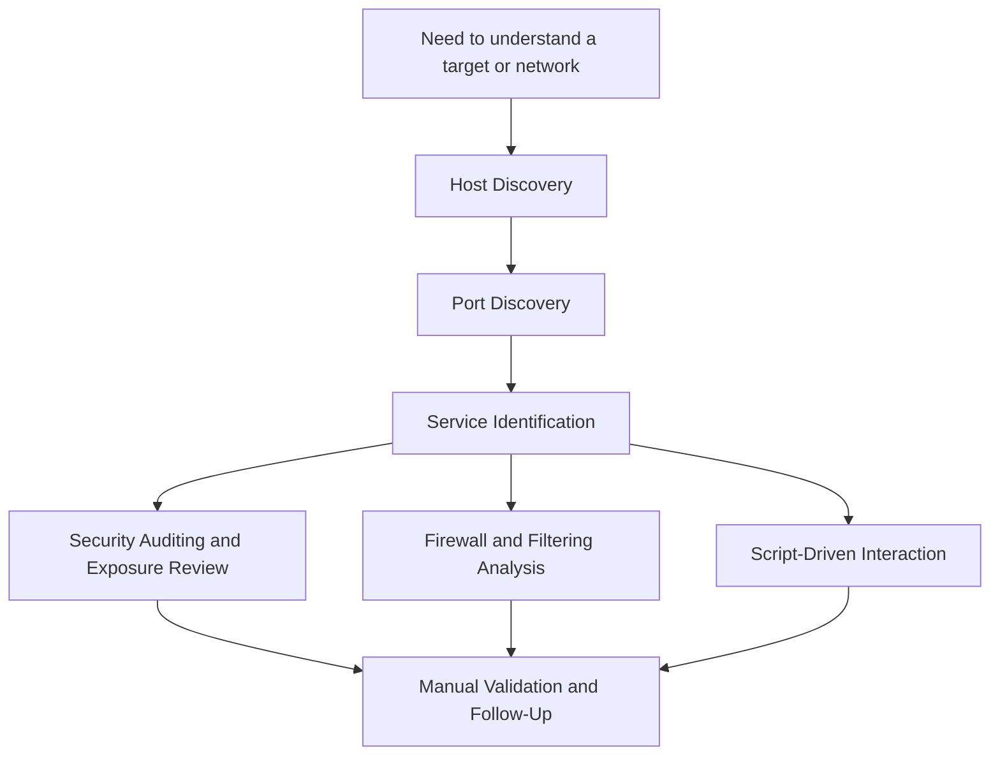

# Lesson 2.2 — Core Use Cases

## Lesson Overview

In the previous lesson, we established what Nmap is at a high level. In this lesson, we go one level deeper and focus on **what we actually use Nmap for in practice**.

This matters because many beginners treat Nmap like a single-purpose command they run at the beginning of an engagement, lab, or assessment. In reality, Nmap supports several distinct use cases, and each one answers a different kind of question.

For example:

- Sometimes we need to know **which hosts are alive**.
- Sometimes we need to know **which ports are exposed**.
- Sometimes we need to know **what service is actually behind a port**.
- Sometimes we want to learn whether **filtering, firewalls, or packet controls** are shaping the results.
- Sometimes we want to move beyond simple probing and use **script-driven interaction** to gather richer information.

If we do not separate these use cases mentally, it becomes easy to misuse options, misread output, or jump to conclusions. This lesson helps us build a cleaner mental model so we can choose the right kind of scan for the right objective.

---

## Why This Matters

A large part of technical maturity is learning to ask the right question before choosing a tool or command.

Nmap can perform many jobs, but the command we choose should follow the question we are trying to answer.

For example:

- If we want to know whether any systems in a subnet are up, we probably do **not** need deep version detection yet.
- If we already know a host is alive and only need to map exposed services, host discovery may not be the main concern.
- If we see a port as `filtered`, the next useful question may be about **network controls**, not just “is the service open?”
- If we find an open service, the next step may be **deeper interaction**, not simply more port scanning.

Understanding use cases makes our work:

- more precise
- faster
- easier to interpret
- easier to document
- less noisy and less wasteful

This lesson gives us the operational categories we will keep using for the rest of the course.

---

## Prerequisites / What We Should Already Know

Before starting this lesson, we should already be comfortable with:

- the idea that Nmap is more than “just a port scanner”
- very basic networking vocabulary such as host, port, service, and protocol
- basic command-line usage

We do **not** need to know every scan type yet. This lesson is about the *why* behind common Nmap use cases before we go deeper into mechanics.

---

## Learning Objectives

By the end of this lesson, we should be able to:

- explain Nmap’s major real-world use cases in plain language
- distinguish host discovery from port discovery
- explain why service identification matters more than port numbers alone
- describe how Nmap can help with security auditing and exposure review
- recognize how scan results can reveal firewall or packet-filter behavior
- explain what script-driven interaction means at a high level
- choose the most appropriate use-case category for a simple enumeration goal

---

## Table of Contents

- [Host Discovery](#host-discovery)
- [Port Discovery](#port-discovery)
- [Service Identification](#service-identification)
- [Security Auditing and Exposure Review](#security-auditing-and-exposure-review)
- [Firewall and Filtering Analysis](#firewall-and-filtering-analysis)
- [Script-Driven Interaction](#script-driven-interaction)
- [How These Use Cases Fit Together](#how-these-use-cases-fit-together)
- [Command Walkthroughs](#command-walkthroughs)
- [Common Mistakes and Misinterpretations](#common-mistakes-and-misinterpretations)
- [Key Takeaways](#key-takeaways)
- [Knowledge Check Quiz](#knowledge-check-quiz)
- [Quiz Answers](#quiz-answers)
- [Mini Practice Task](#mini-practice-task)

---

<a id="host-discovery"></a>
## 1) Host Discovery

Host discovery answers a very basic but very important question:

> Which systems appear to be alive or reachable?

Before we worry about what ports are open, what services are running, or which operating system a target might be using, we often need to know whether the target is there at all.

### Why host discovery matters

Host discovery helps us avoid wasting time scanning nonexistent, unreachable, or currently offline systems. It is often the first step when we are dealing with:

- a subnet
- a list of IP addresses
- an unknown network segment
- an environment where we need to separate live systems from dead space

In practical terms, host discovery lets us narrow the field.

Instead of trying to deeply inspect every address in a range, we first ask:

- Which hosts respond?
- Which addresses appear active?
- Which systems should we investigate further?

### What Nmap may use for host discovery

Depending on context, privilege level, target type, and options, Nmap may use methods such as:

- ARP requests on a local network
- ICMP echo requests
- TCP-based probes
- UDP-based probes

We do not need to master each one yet. At this stage, what matters is the mental model:

> Host discovery is about proving or inferring that a system is present and responsive enough to matter.

### Example situations

- We have `192.168.56.0/24` and need to quickly find active lab systems.
- We were given ten target IPs and want to know which ones are currently online.
- We want to reduce noise and scan only live hosts before doing deeper inspection.

### Example command

```bash
nmap -sn 192.168.56.0/24
```

At a high level, `-sn` tells Nmap to perform host discovery without doing a full port scan.

### What host discovery does **not** answer

A host being “up” does **not** tell us:

- what ports are open
- what services are running
- whether those services are exploitable
- what OS is on the host

It only answers the earlier question: **does this target appear alive?**

---

<a id="port-discovery"></a>
## 2) Port Discovery

Once we know a host is alive, the next major question is often:

> What is this host exposing to the network?

That is the role of port discovery.

### Why port discovery matters

A host might be alive but useless from our current perspective if it exposes nothing relevant. On the other hand, one host with only a few open ports may give us a very strong foothold or a clear path for follow-up enumeration.

Port discovery helps us identify:

- which TCP ports appear open
- which UDP ports may be open
- which ports appear closed
- which ports appear filtered or ambiguous

This matters because exposed ports define much of the host’s visible attack surface.

### Thinking in terms of exposure

Ports are not the goal by themselves. They are evidence of **reachable network-facing functionality**.

If port 22 is open, that suggests an SSH service may be reachable.

If port 80 is open, that suggests HTTP is exposed.

If port 445 is open, that suggests SMB may be accessible.

Port discovery therefore acts as a bridge between “the host exists” and “here is what we can meaningfully investigate next.”

### Example situations

- We already know a system is alive and want to identify its exposed TCP surface.
- We want to compare common-port scanning against full-port scanning.
- We want to check whether a service we expect to be exposed is actually reachable.

### Example command

```bash
nmap 192.168.56.10
```

By default, Nmap scans a common set of TCP ports, giving us a first-pass view of exposed services.

### Example full-port command

```bash
nmap -p- 192.168.56.10
```

This asks Nmap to scan the full TCP port range.

### What port discovery does **not** fully answer

Port discovery may show us that a port is open, but it does not always prove exactly what service is behind it.

That leads directly into the next use case.

---

<a id="service-identification"></a>
## 3) Service Identification

Once we know which ports are open, a more useful question becomes:

> What is actually running behind those ports?

This is where service identification becomes critical.

### Why service identification matters

Port numbers provide hints, not certainty.

For example:

- Port 80 often suggests HTTP, but it might be something unusual.
- Port 22 often suggests SSH, but assumptions can still be wrong.
- A service may run on a non-standard port.
- A banner may reveal product, version, or implementation details that matter a great deal.

That is why mature enumeration does not stop at “open port found.”

We want to know:

- what service appears to be listening
- whether Nmap can identify the product family
- whether it can identify a version
- whether that service matches the port we expected

### Why this changes our next steps

Consider the difference between these two outcomes:

- `443/tcp open https`
- `443/tcp open ssl/vpn`

Those are very different follow-up paths.

Or compare:

- `8080/tcp open http-proxy`
- `8080/tcp open http Apache Tomcat`

Again, the port number alone is not enough. The service identity shapes what we do next.

### Example command

```bash
nmap -sV 192.168.56.10
```

At a high level, `-sV` tells Nmap to attempt service/version detection.

### Why this is powerful

Service identification can help us:

- prioritize targets
- choose follow-up tools
- recognize technology stacks
- spot odd service placement
- begin mapping risk and exposure

### What service identification still cannot guarantee

Even when Nmap reports a service name and version, we should still treat it as evidence to validate, not infallible truth.

Why?

Because:

- banners can be hidden or misleading
- services can be customized
- detection is fingerprint-based in many cases
- proxies, gateways, and wrappers can distort what we see

So the mature mental model is:

> Nmap helps us form strong hypotheses about services, but we still validate important findings manually.

---

<a id="security-auditing-and-exposure-review"></a>
## 4) Security Auditing and Exposure Review

Another core use case for Nmap is broader **security auditing**.

This means using scan results to answer questions such as:

- What is exposed that should not be?
- What appears reachable from this vantage point?
- Are there unnecessary services listening?
- Are default or risky services exposed externally?
- Does the observed surface align with what the environment is supposed to look like?

### Why this matters beyond offensive work

Nmap is widely used not only by penetration testers and red teamers, but also by:

- defenders
- system administrators
- network engineers
- asset management teams
- compliance and security review teams

That is because Nmap is useful anywhere someone needs to compare **expected exposure** with **actual exposure**.

### Security auditing is not only about vulnerabilities

This is important.

A useful security audit question is not always “Is there a known CVE here?”

Sometimes the more important question is:

- Why is this service exposed at all?
- Why is this administrative port reachable from this segment?
- Why is an old protocol still enabled?
- Why does this system answer differently than the baseline?

In many cases, the risk begins with **exposure and misconfiguration**, not with an immediately exploitable bug.

### Example scenarios

- Confirming that only required web and SSH services are exposed on a server.
- Verifying whether a database port is accidentally reachable from a user network.
- Comparing lab findings to a system owner’s stated architecture.
- Reviewing whether a segmentation boundary behaves the way it is supposed to behave.

### Example command idea

```bash
nmap -sV -oA web-tier-baseline 192.168.56.20-25
```

This sort of approach starts to move beyond one-off scanning and toward documentation, baselining, and review.

### Key mindset here

> Security auditing with Nmap is not just about “finding something cool.” It is about comparing reality to expectation.

---

<a id="firewall-and-filtering-analysis"></a>
## 5) Firewall and Filtering Analysis

One of the most useful things Nmap can help us understand is not just what is open, but how the network seems to be **controlling traffic**.

This leads to another important use case:

> What do these results suggest about filtering, firewall behavior, or packet-handling policy?

### Why this matters

A port state is not just an answer about the application. Sometimes it is an answer about the network path.

For example:

- `open` suggests the probe reached a service that responded in a way consistent with openness.
- `closed` suggests the host is reachable and responded in a way consistent with no service listening there.
- `filtered` often suggests packet filtering, dropping, or another obstacle that prevents Nmap from deciding cleanly.

That means scan results can tell us more than “service yes or no.”

They can also help us ask:

- Is a firewall dropping packets?
- Is something rejecting connections explicitly?
- Are different ports handled differently?
- Is the host up, but certain probes suppressed or blocked?

### Why this is strategically useful

Imagine we scan a host and observe:

- one port clearly `open`
- several ports clearly `closed`
- several ports `filtered`

That pattern suggests a lot about the environment:

- the host is likely reachable
- some traffic is getting through normally
- some ports may be protected by filtering rules
- the path and policy matter just as much as the service state

### Example situations

- Determining whether a firewall is likely in play.
- Identifying whether the lack of response should be interpreted as absence or filtering.
- Comparing results from different scan types to understand packet-handling behavior.
- Investigating whether a service is hidden behind filtering rather than truly absent.

### Important caution

We should never overclaim.

`filtered` does **not** automatically mean “there is definitely an important hidden service behind this port.”

But it also does **not** mean “nothing is there.”

It means the observed traffic behavior prevents clean classification.

That is valuable information in its own right.

---

<a id="script-driven-interaction"></a>
## 6) Script-Driven Interaction

Eventually, simple probing is not enough. We may want to interact with services more meaningfully.

This is where Nmap’s **Nmap Scripting Engine (NSE)** becomes relevant.

At a high level, script-driven interaction means:

> Using Nmap to perform richer protocol-aware checks against a target service.

### Why this matters

A basic scan may tell us:

- port 80 is open
- port 445 is open
- port 25 is open

That is useful, but limited.

A script-assisted approach may help us gather more context, such as:

- supported protocol features
- banners and metadata
- service-specific details
- configuration clues
- category-specific information relevant to follow-up enumeration

### Important framing

In this course, we want to understand NSE as an **extension layer**, not as magic.

NSE lets Nmap go beyond “probe and label” into “interact and learn more.”

### Example command

```bash
nmap --script banner 192.168.56.10
```

Or, against a known web service:

```bash
nmap -p 80 --script http-title,http-headers 192.168.56.10
```

We will go much deeper into NSE later. For now, the key point is conceptual:

> Script-driven interaction is one of Nmap’s core use cases because it helps bridge the gap between simple discovery and deeper service-specific enumeration.

### Why this does not replace manual validation

Even strong script output is still part of an evidence-gathering process.

It helps us:

- enrich findings
- speed up investigation
- spot obvious clues
- prioritize next steps

But we still validate important results manually when it matters.

---

<a id="how-these-use-cases-fit-together"></a>
## 7) How These Use Cases Fit Together

These categories are easier to use when we see them as a progression rather than as isolated features.



This is not the only possible sequence, but it is a useful learning model.

We often move through questions like this:

1. Is the host there?
2. What is reachable?
3. What is actually running?
4. Does the exposure match expectations?
5. Do the results suggest filtering or controls?
6. Should we interact more deeply using scripts or manual follow-up?

That progression is a big part of disciplined enumeration.

---

<a id="command-walkthroughs"></a>
## 8) Command Walkthroughs

This lesson is still conceptual, so the commands below are meant to connect each use case to the kind of question it answers.

### Walkthrough 1: Host Discovery Only

```bash
nmap -sn 192.168.56.0/24
```

**What we are asking:**
Which systems in this subnet appear alive?

**What this is good for:**
- narrowing the target set
- quick initial network awareness
- reducing wasted scans

**What it does not tell us:**
- open ports
- service versions
- application details

### Walkthrough 2: First-Pass Port Discovery

```bash
nmap 192.168.56.10
```

**What we are asking:**
Which common TCP ports appear exposed on this host?

**What this is good for:**
- quick surface mapping
- initial service triage
- deciding whether deeper scanning is worth it

### Walkthrough 3: Full TCP Port Discovery

```bash
nmap -p- 192.168.56.10
```

**What we are asking:**
What does the full TCP exposure of this host look like?

**What this is good for:**
- finding non-standard ports
- avoiding tunnel vision around only common services
- building a fuller picture of exposure

### Walkthrough 4: Service Identification

```bash
nmap -sV 192.168.56.10
```

**What we are asking:**
What services and likely versions are behind the open ports?

**What this is good for:**
- selecting follow-up tools
- identifying likely technologies
- prioritizing targets

### Walkthrough 5: Script-Driven Interaction

```bash
nmap -p 80 --script http-title,http-headers 192.168.56.10
```

**What we are asking:**
Can we extract richer, service-specific information from this web service?

**What this is good for:**
- metadata gathering
- service-specific clues
- faster follow-up enumeration

### Visual Summary


---

<a id="common-mistakes-and-misinterpretations"></a>
## 9) Common Mistakes and Misinterpretations

### Mistake 1: Treating every scan as the same job

Not every objective requires the same kind of scan. A host discovery task is different from a version detection task.

### Mistake 2: Confusing “host up” with “useful target”

A host may be alive but expose nothing relevant from our vantage point.

### Mistake 3: Stopping at port numbers

Knowing that a port is open is useful, but knowing what is behind it is usually more useful.

### Mistake 4: Assuming service names are always certain

Nmap’s service detection is often strong, but important results should still be validated.

### Mistake 5: Treating `filtered` as meaningless

A filtered result often tells us something important about packet handling, network controls, or scan visibility.

### Mistake 6: Using NSE as a substitute for thinking

Scripts are valuable, but they support investigation. They do not replace reasoning or manual confirmation.

---

<a id="key-takeaways"></a>
## 10) Key Takeaways

- Nmap supports several distinct use cases, not just “port scanning.”
- Host discovery answers whether systems appear alive.
- Port discovery maps exposed network-facing ports.
- Service identification tells us what may actually be running behind those ports.
- Security auditing uses Nmap to compare observed exposure with expected exposure.
- Firewall and filtering analysis helps us interpret what traffic behavior suggests about network controls.
- Script-driven interaction extends Nmap into richer service-aware enumeration.
- Mature operators choose scan behavior based on the question they are trying to answer.

---

<a id="knowledge-check-quiz"></a>
## 11) Knowledge Check Quiz

### 1. What is the main goal of host discovery?

A. To identify software versions on open ports  
B. To determine which systems appear alive or reachable  
C. To exploit services automatically  
D. To identify operating systems with certainty  

### 2. Why is port discovery useful?

A. Because it reveals which ports may define the reachable attack surface  
B. Because it always proves which application is running  
C. Because it replaces service detection completely  
D. Because it guarantees exploitability  

### 3. Why is service identification more useful than port numbers alone?

A. Because all services always run on standard ports  
B. Because port numbers never matter  
C. Because the actual service behind a port shapes our next steps  
D. Because service detection is always perfect  

### 4. Which statement best describes security auditing with Nmap?

A. It is only about finding CVEs  
B. It is about comparing actual exposure to expected exposure  
C. It is only useful for external attackers  
D. It is mainly about password brute forcing  

### 5. What can a `filtered` result suggest?

A. The host definitely does not exist  
B. There is absolutely no service there  
C. Traffic behavior prevented clean classification, often due to filtering or controls  
D. The service is confirmed vulnerable  

### 6. What is the best high-level description of script-driven interaction?

A. It lets Nmap gather richer service-specific information using scripts  
B. It turns Nmap into a guaranteed exploitation tool  
C. It eliminates the need for manual validation  
D. It only works against web servers  

---

<a id="quiz-answers"></a>
## 12) Quiz Answers

<details>
  <summary>Show Answers</summary>

**1.** **B** — Host discovery is about determining which systems appear alive or reachable.  
**2.** **A** — Port discovery helps us identify reachable ports that define visible network exposure.  
**3.** **C** — What is actually running behind a port often matters more than the port number alone.  
**4.** **B** — Security auditing with Nmap often means comparing observed exposure to what should be exposed.  
**5.** **C** — `filtered` often suggests packet handling or filtering prevented a clear decision.  
**6.** **A** — NSE allows richer, protocol-aware, script-driven information gathering.

</details>

---

<a id="mini-practice-task"></a>
## 13) Mini Practice Task

Choose one host in your lab environment and write down three separate questions you could ask with Nmap:

1. one **host discovery** question  
2. one **port discovery** question  
3. one **service identification** question  

Then map each question to an appropriate Nmap command.

### Example template

```text
Target: ______________________

Host discovery question:
________________________________________
Command:
________________________________________

Port discovery question:
________________________________________
Command:
________________________________________

Service identification question:
________________________________________
Command:
________________________________________
```

### Reflection prompt

After writing your three commands, ask yourself:

- Did I choose the command because I understood the use case?
- Or did I choose it because I vaguely remembered a flag?

That difference matters. This course is about building the first habit.

---

## Next Lesson

In **Lesson 2.3 — Nmap Architecture at a High Level**, we will look at the major functional components that sit behind these use cases: host discovery, port scanning, version detection, OS detection, NSE, and output/reporting.
