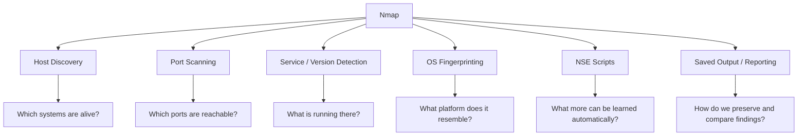

# Lesson 2.1 — What Nmap Is

## Lesson Overview

In this lesson, we establish a clear mental model for **what Nmap actually is**, what it is designed to do, and where it fits inside a real-world enumeration workflow. We are not memorizing flags yet. We are building a foundation.

Nmap is often introduced as “a port scanner,” but that description is too narrow. Nmap is better understood as a **network reconnaissance and security auditing framework** that can help us discover hosts, identify exposed ports, fingerprint services, infer operating systems, and extend scan behavior through scripting.

That distinction matters. If we think of Nmap as just a tool for “finding open ports,” we will underuse it and misunderstand its output. If we understand it as part of a larger enumeration methodology, we can use it much more effectively.

---

## Why This Matters

Before we use a tool well, we need to understand what problem it solves.

When we run Nmap against a target, we are not asking only one question. We may be asking several:

- Is this host alive?
- Which ports are reachable?
- Which services appear to be running?
- What versions or banners can be identified?
- Does the host appear filtered by a firewall?
- Can we learn more through Nmap’s scripting engine?

If we do not understand those categories, scan results can look like disconnected technical noise. Once we do understand them, the results start to read like structured evidence.

This lesson gives us the vocabulary and framing needed for the rest of the course.

---

## Prerequisites / What We Should Already Know

Before starting this lesson, we should already be comfortable with the following:

- Basic command-line usage
- The idea that enumeration comes before exploitation
- Very basic network concepts such as hosts, IP addresses, ports, and services

We do **not** need deep packet-level knowledge yet. We will build that as the course progresses.

---

## Learning Objectives

By the end of this lesson, we should be able to:

- Explain what Nmap is in practical terms
- Describe the major problem areas Nmap helps solve
- Distinguish Nmap from narrower labels such as “just a port scanner”
- Name Nmap’s major capability areas at a high level
- Place Nmap inside a broader enumeration workflow
- Recognize what Nmap can tell us directly versus what still requires manual validation

---

## Table of Contents

1. What Nmap Is at a High Level  
2. Why Nmap Still Matters  
3. What Kinds of Questions Nmap Helps Us Answer  
4. Nmap’s Major Capability Areas  
5. Nmap as a Reconnaissance Framework, Not Just a Port Scanner  
6. What Nmap Can and Cannot Do  
7. How Nmap Fits Into Our Workflow  
8. First Command Walkthrough  
9. Common Mistakes and Misinterpretations  
10. Key Takeaways  
11. Knowledge Check Quiz  
12. Quiz Answers  
13. Mini Practice Task  

---

# 1) What Nmap Is at a High Level

**Nmap** stands for **Network Mapper**.

At a practical level, Nmap is an open-source tool used for:

- discovering hosts on a network
- identifying reachable ports
- detecting services and, where possible, versions
- making educated guesses about operating systems
- performing script-driven interaction with targets
- helping analysts and operators understand exposure, reachability, and attack surface

That means Nmap is both:

- a **scanner**, because it sends probes and analyzes responses
- an **enumeration aid**, because it helps us collect structured information about hosts and services

Nmap operates by sending network traffic in carefully chosen ways and then interpreting the responses, missing responses, timing patterns, and protocol behavior it observes.

That last point is critical.

Nmap is not “magic.” It does not somehow know what exists on a host without interaction. It learns by **probing**, **observing**, and **inferring**.

---

# 2) Why Nmap Still Matters

There are many network tools, but Nmap remains central because it solves a very common problem extremely well:

> We need to quickly build an evidence-based picture of what is reachable and potentially interesting on a target.

In practice, Nmap is valuable because it combines several strengths:

### It is broad
It does more than one narrow task. We can use it for host discovery, port discovery, service detection, operating system fingerprinting, scripting, and output/reporting.

### It is flexible
We can scan a single host, a list of hosts, a range, or an entire subnet. We can perform quick high-level checks or slow careful inspection.

### It is operator-friendly
Its output is readable enough for interactive use, but structured enough to be saved, compared, parsed, and integrated into workflows.

### It scales
The same tool can be used for a fast local check against one host or a larger structured sweep across a network segment.

### It is methodology-friendly
Nmap fits naturally into the broader cycle of:

- discover
- verify
- prioritize
- follow up
- document

In other words, Nmap is still relevant not because it is flashy, but because it remains extremely useful.

---

# 3) What Kinds of Questions Nmap Helps Us Answer

When we use Nmap correctly, we are turning vague uncertainty into more specific questions and answers.

## Question Category 1: Host Discovery

We may need to determine whether a host appears alive or reachable.

Examples:

- Is `10.10.10.15` responding at all?
- Which systems in `10.10.10.0/24` appear up?
- Is the target reachable through ARP, ICMP, TCP, or UDP-based discovery?

## Question Category 2: Port Discovery

Once we know a host is up, we want to know what it exposes.

Examples:

- Which TCP ports are open?
- Which UDP ports may be open?
- Are certain ports closed, filtered, or ambiguous?

## Question Category 3: Service Identification

Ports by themselves are not the end goal. We want to know what is listening there.

Examples:

- Is port 22 actually SSH?
- Is port 80 Apache, Nginx, IIS, or something custom?
- Does port 443 expose a web application, VPN endpoint, or management interface?

## Question Category 4: Version and Platform Clues

Sometimes we can learn more about the technology stack.

Examples:

- Which software version is exposed?
- Are there banner clues?
- Does the host fingerprint suggest a particular operating system?

## Question Category 5: Script-Assisted Enumeration

Some questions go beyond “what port is open?” and into service interaction.

Examples:

- Can a service be queried more deeply?
- Are there default scripts that gather useful metadata?
- Are there protocol-specific checks worth running?

These are the kinds of questions that transform Nmap from a simple scanner into a much broader enumeration tool.

---

# 4) Nmap’s Major Capability Areas

At a high level, Nmap can be thought of as several capability areas working together.

## 4.1 Host Discovery

This answers the question:

> Which systems appear to be alive?

This can involve ARP, ICMP, TCP, or UDP-based discovery depending on environment, privilege, and options used.

## 4.2 Port Scanning

This answers the question:

> Which ports appear open, closed, or filtered?

This is the part many people associate with Nmap first, but it is only one piece of the whole picture.

## 4.3 Service and Version Detection

This answers the question:

> What is actually running behind those ports?

Nmap can often identify a likely service and, in many cases, a likely version or software family.

## 4.4 OS Detection

This answers the question:

> What operating system or TCP/IP stack characteristics does this host resemble?

This is not perfect certainty. It is fingerprint-based inference.

## 4.5 Nmap Scripting Engine (NSE)

This answers the question:

> Can we extend the scan with scripted logic?

NSE lets Nmap do more than simple probing. It can interact with services, gather richer information, and perform targeted checks.

## 4.6 Output and Reporting

This answers the question:

> How do we preserve and reuse what we found?

Good operators do not just run scans. They save results, compare them, parse them, and turn them into notes and follow-up actions.

---

# 5) Nmap as a Reconnaissance Framework, Not Just a Port Scanner

Calling Nmap “a port scanner” is not wrong, but it is incomplete.

A more useful mental model is this:

> Nmap is a reconnaissance framework built around network probing and response analysis.

Why is that a better model?

Because in real work, we rarely care about ports in isolation.

We care about:

- which hosts exist
- which hosts are reachable
- what attack surface they expose
- how that surface is filtered
- what services are present
- what technology stack is likely involved
- what deserves manual follow-up

A port number is only a clue.

A result such as:

```text
22/tcp open ssh
80/tcp open http
445/tcp open microsoft-ds
```

is useful not because the numbers are interesting on their own, but because they suggest:

- remote administration
- a web application or web service
- SMB-based exposure and possible Windows-oriented follow-up

So the real value of Nmap is not merely “finding ports.”

The real value is helping us transform a target from **unknown** into **structured investigative hypotheses**.

---

# 6) What Nmap Can and Cannot Do

Understanding tool boundaries is part of using the tool well.

## What Nmap Can Do Well

Nmap is strong at:

- identifying live hosts
- classifying port states
- fingerprinting services
- collecting initial evidence efficiently
- helping us prioritize where to investigate next
- saving results in formats that support documentation and automation

## What Nmap Cannot Do by Itself

Nmap cannot replace:

- manual reasoning
- protocol understanding
- service-specific investigation
- application-layer exploration
- operator judgment

For example:

- Nmap may tell us that an HTTP service exists, but not explain the entire application logic behind it.
- Nmap may identify SSH, but not tell us whether account policy, key usage, or trust relationships create practical opportunity.
- Nmap may label something as filtered, but that still requires interpretation.

This is why enumeration is never just “run one tool and move on.”

Nmap gives us **evidence and direction**. We still need to think.

---

# 7) How Nmap Fits Into Our Workflow

Nmap is best used as part of a larger sequence.


This course will repeatedly come back to that workflow.

A strong operator does not just launch a big scan and stare at the output.
A strong operator:

1. defines the question
2. chooses the scan intentionally
3. reads the results carefully
4. identifies what is fact vs inference
5. validates important findings manually
6. documents everything cleanly

That is how Nmap becomes part of a professional methodology instead of a button we press.

---

# 8) First Command Walkthrough

At this stage, our goal is not to perform a deep scan. It is simply to begin reading Nmap like a tool we will work with throughout the course.

## 8.1 View the Basic Help

```bash
nmap --help
```

Why this matters:

- It shows us the major feature families.
- It helps us get used to Nmap’s language.
- It reinforces that Nmap supports multiple categories of behavior, not just one “scan mode.”

As you skim the help output, notice how the options naturally cluster around themes such as:

- target specification
- host discovery
- scan techniques
- port specification
- service/version detection
- OS detection
- timing/performance
- output
- scripting

That structure reflects how Nmap is meant to be used.

## 8.2 Run a Minimal Local Scan

```bash
nmap localhost
```

What this does conceptually:

- chooses a target (`localhost`)
- runs a default scan profile
- reports what Nmap can infer from that target

What to look for in the output:

- Did Nmap identify the host as up?
- Which ports were reported?
- What service names were guessed?
- Which parts are explicit facts, and which parts are labels or educated guesses?

## 8.3 Read the Result Like an Analyst

Suppose we see something like:

```text
PORT     STATE SERVICE
22/tcp   open  ssh
631/tcp  open  ipp
```

A beginner might stop at “two open ports.”

A better analytical reading would be:

- The host is reachable.
- At least two TCP services accepted probes in a way that Nmap interpreted as open.
- Nmap associates those ports with SSH and IPP.
- These service labels are useful starting points, but important findings should still be verified with follow-up interaction.

That is the mindset we want from the beginning.

---

# 9) Visual Summary



This diagram is intentionally simple. Later lessons will break each branch apart in more detail.

---

# 10) Common Mistakes and Misinterpretations

## Mistake 1: Thinking Nmap is only for open port discovery

This is the most common oversimplification. Nmap does much more than list open ports.

## Mistake 2: Treating service labels as absolute truth

Nmap’s service labels are often very useful, but they are still the result of fingerprinting and interpretation. Important findings deserve validation.

## Mistake 3: Assuming “no result” means “nothing exists” 

A missing response can reflect filtering, timing behavior, firewall rules, packet loss, or scan design choices. Absence of evidence is not always evidence of absence.

## Mistake 4: Running large scans without a question in mind

When we scan without a clear objective, we often create noise instead of insight.

## Mistake 5: Forgetting that enumeration continues after Nmap

Nmap is a starting point for many investigations, not the end of them.

---

# 11) Key Takeaways

- Nmap is best understood as a **network reconnaissance and security auditing tool**, not merely a simple port scanner.
- It helps us answer questions about **hosts, ports, services, versions, operating systems, and service-level behavior**.
- Its major capability areas include **host discovery, port scanning, service/version detection, OS detection, NSE, and output/reporting**.
- Nmap produces **evidence**, but evidence still requires interpretation.
- Strong enumeration uses Nmap as part of a larger workflow that includes **manual validation and structured documentation**.

---

# 12) Knowledge Check Quiz

## Questions

1. What does the name **Nmap** stand for, and why is that name more informative than simply calling it a port scanner?
2. Name at least four major capability areas of Nmap.
3. Why is it useful to think of Nmap as part of a broader enumeration workflow instead of as a one-step solution?
4. What is the difference between a direct observation and an inference in Nmap output?
5. Why should service identification results sometimes be validated manually?
6. What kinds of questions does host discovery answer that differ from port scanning?
7. Why can “no response” be dangerous to interpret too casually?
8. What role does saved scan output play in professional workflow?

---

# 13) Quiz Answers

<details>
<summary>Show answers</summary>

### 1) What does the name Nmap stand for, and why is that name more informative than simply calling it a port scanner?
Nmap stands for **Network Mapper**. That name is more useful because the tool helps map hosts, ports, services, filters, and platform clues rather than only identifying open ports.

### 2) Name at least four major capability areas of Nmap.
Possible answers include:

- host discovery
- port scanning
- service/version detection
- OS detection
- Nmap Scripting Engine (NSE)
- output/reporting

### 3) Why is it useful to think of Nmap as part of a broader enumeration workflow instead of as a one-step solution?
Because Nmap helps us gather evidence and direction, but it does not replace manual reasoning, service-specific investigation, or validation.

### 4) What is the difference between a direct observation and an inference in Nmap output?
A direct observation is something supported immediately by the scan behavior or response, such as a host replying or a port responding in a specific way. An inference is an interpretation layered on top of that evidence, such as a likely service type or OS family.

### 5) Why should service identification results sometimes be validated manually?
Because fingerprinting is useful but not infallible. Manual interaction helps confirm what is actually running and may reveal details automated probing missed.

### 6) What kinds of questions does host discovery answer that differ from port scanning?
Host discovery focuses on whether systems appear alive or reachable. Port scanning focuses on what exposed ports those systems present.

### 7) Why can “no response” be dangerous to interpret too casually?
Because it may reflect filtering, timing, packet loss, or probe design rather than true absence of a service or host.

### 8) What role does saved scan output play in professional workflow?
It supports documentation, comparison, reproducibility, reporting, and structured follow-up.

</details>

---

# 14) Mini Practice Task

## Practice Goal

Use Nmap in the most basic way possible and begin training yourself to read output like evidence.

## Task

1. Run:

```bash
nmap --help
```

2. Skim the help output and write down the major feature families you notice.

3. Then run:

```bash
nmap localhost
```

4. Record the following in your notes:

- Was the host reported as up?
- Which ports were shown?
- Which service labels were shown?
- Which findings feel like direct observations?
- Which findings feel like inferences?
- What would you want to verify manually next?

## Reflection Prompt

Write 4–6 sentences answering this question:

> Why is it more accurate to describe Nmap as a reconnaissance framework than as “just a port scanner”?

---

## Suggested Notes Template

```markdown
### Lesson 2.1 Notes

**Target:** localhost

**Command(s) Run:**
- nmap --help
- nmap localhost

**Observed Facts:**
- 

**Likely Inferences:**
- 

**Questions for Follow-Up:**
- 

**Why This Matters:**
- 
```

---

## Closing Thought

This lesson is deliberately conceptual.

We are not trying to memorize Nmap yet. We are trying to understand what category of tool it is, why it remains foundational, and how we should think when reading its output.

That mindset will make every later lesson more meaningful.
