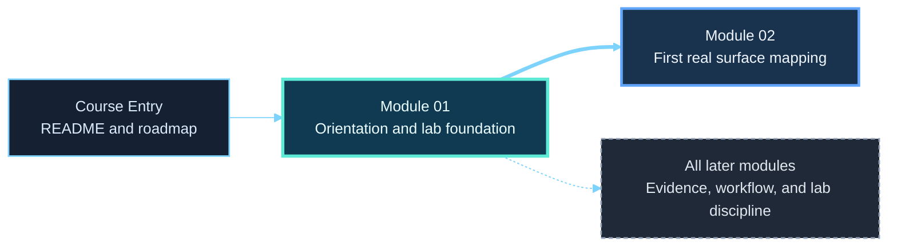

# Module 01 - Orientation and Assessment Workflow

**Phase I - Orientation and Surface Mapping**

### Learn how the course works, how the workflow fits together, and how to build the lab that the rest of the course will actually use.

*This module introduces the course, establishes the assessment lifecycle, teaches scope and lab discipline, walks the learner through building the real course workspace, and finishes by turning that environment into an analyst-ready starting point for Module 02.*

---

> **🧭 Start Here**
>
> Work through this module in this order:
> [Lesson 1.1](lessons/module-01-lesson-1-1-what-hack-the-basics-is-and-how-to-learn-through-it.md) ->
> [Lesson 1.2](lessons/module-01-lesson-1-2-the-assessment-lifecycle-from-first-contact-to-final-deliverable.md) ->
> [Lesson 1.3](lessons/module-01-lesson-1-3-scope-rules-of-engagement-and-lab-discipline.md) ->
> [Lab 01](labs/module-01-lab-01-build-your-assessment-workspace-and-note-system.md) ->
> [Lesson 1.4](lessons/module-01-lesson-1-4-hypothesis-driven-testing-and-the-analyst-mindset.md).
>
> That order is intentional. The lab is the center of the module, not optional setup.

## Module Overview

Module 01 is where `Hack the Basics` stops being an abstract course idea and becomes a usable working environment.

The visible topics are:

- what this course is trying to teach
- how a realistic assessment workflow is structured
- what scope, authorization, and lab discipline mean in practice
- how to think like an analyst before the first real scan

But the real module-level deliverable is more concrete:

- a Windows 11 host prepared for the course
- Kali WSL as the attack and analysis platform
- a VMware host-only target network
- `GOAD-Mini-DC01`, `GOAD-Mini-WS01`, and `META-TGT`
- a reusable assessment note workspace
- clean reset points that later modules can inherit without guesswork

By the end of Module 01, the learner should be operationally ready for Module 02.

---

## At a Glance

| Area | Details |
|---|---|
| **Series** | Hack the Basics |
| **Phase** | Phase I - Orientation and Surface Mapping |
| **Module** | 01 - Orientation and Assessment Workflow |
| **Role** | Turn the learner from “new to the repo” into “ready to work from a stable lab and note system” |
| **Level** | Beginner |
| **Format** | Self-paced, Markdown-first, GitHub-native |

| Builds On | Prepares Next | Core Outputs |
|---|---|---|
| Basic computing, terminal comfort, and willingness to work carefully in legal labs | Module 02 network enumeration, Module 03 service reasoning, and every later workflow decision in the course | lifecycle map, scope note, VM inventory, network notes, snapshot map, guided lab baseline, field reference |

---

## Why This Module Exists

Most early-stage offensive security learning breaks down before the first important technical result.

Common failure patterns look like this:

- the learner starts with tools before they understand the workflow
- the lab is assembled loosely and never documented cleanly
- notes stay vague until later modules need exact evidence
- the environment changes constantly because no stable reset model exists

Module 01 exists to prevent that.

It gives the learner:

- a mental model for the whole course
- a workflow model for the whole assessment
- a bounded lab model for the whole repo
- a note and artifact model for the whole learning path

That is why this module belongs first.

---

## The Real Deliverable

The main success condition for Module 01 is not “read four lessons.”

The main success condition is:

> the learner can sit down at a stable workspace, explain what the environment contains, know what is in scope, know where evidence belongs, and begin Module 02 without rebuilding context from memory

The intended course lab baseline is:

- Windows 11 host platform
- Kali WSL as the attack machine
- VMware Workstation Pro for the target VMs
- one host-only target segment at `192.168.57.0/24`
- `GOAD-Mini-DC01` at `192.168.57.10`
- `GOAD-Mini-WS01` at `192.168.57.31`
- `META-TGT` at `192.168.57.25`
- clean baseline snapshots plus a Kali WSL export

If those pieces are not clear, later modules inherit friction immediately.

---

## Module Position in the Course

> **🧠 Mental Model**
>
> Module 01 does not delay the technical work.
> It creates the environment and habits that make the technical work usable.

---

## Recommended Learner Flow

| Step | Why it comes here | What the learner leaves with |
|---|---|---|
| [Lesson 1.1](lessons/module-01-lesson-1-1-what-hack-the-basics-is-and-how-to-learn-through-it.md) | Sets expectations before the learner starts treating the repo like disconnected notes | A realistic model for how to use the course |
| [Lesson 1.2](lessons/module-01-lesson-1-2-the-assessment-lifecycle-from-first-contact-to-final-deliverable.md) | Gives the learner the course-wide workflow spine before specific lab details | A phase-aware model for where later tasks fit |
| [Lesson 1.3](lessons/module-01-lesson-1-3-scope-rules-of-engagement-and-lab-discipline.md) | Defines the lab boundary, asset roles, reset logic, and what must be documented before building | A safe and deliberate lab plan |
| [Lab 01](labs/module-01-lab-01-build-your-assessment-workspace-and-note-system.md) | Turns the module into a real environment with artifacts and reset points | The actual course lab plus a Module 02-ready workspace |
| [Lesson 1.4](lessons/module-01-lesson-1-4-hypothesis-driven-testing-and-the-analyst-mindset.md) | Teaches the reasoning habit after the learner has real environment notes and validation data to think about | Stronger observation, inference, validation, and next-step discipline |

---

## What to Use During the Module

| Artifact | Purpose | When to use it |
|---|---|---|
| [Reference Cheat Sheet](references/module-01-reference-cheat-sheet.md) | Fast reminder of workflow, lifecycle, scope discipline, and analyst habits | During the whole module and later review |
| [Assessment Lifecycle Map](references/module-01-assessment-lifecycle-map.md) | Quick visual reminder of how the course models assessment work | During Lesson 1.2 and later orientation resets |
| [Notes Workspace Template](references/module-01-notes-workspace-template.md) | Starter structure for admin notes, evidence folders, target tracking, and lab-automation planning | During Lesson 1.3 and Lab 01 |
| [GOAD Lab Operations Reference](references/module-01-goad-lab-operations-reference.md) | Day-to-day operator reference for starting, stopping, validating, and recovering the GOAD portion of the lab after the build | After Lab 01 and in later Windows and AD modules |

---

## Module Outputs That Must Exist Before Module 02

Treat the following as required, not nice-to-have:

- a working course lab that Kali WSL can reach
- a written scope note
- a VM inventory with names, roles, IPs, and snapshot state
- network notes that preserve the host-only baseline
- a snapshot map for the target VMs
- one first analyst note that uses observation, inference, validation, and next-step language

If those outputs do not exist, the Module 02 handoff is weak.

---

## Reading Strategy

### If this is your first pass

1. Work in the documented order.
2. Read Lesson 1.3 before touching the lab build.
3. Build the lab while creating the note artifacts, not afterward.
4. Do not skip Lesson 1.4 just because the lab is already built.

### If you are returning as a reference

- start with the [reference cheat sheet](references/module-01-reference-cheat-sheet.md)
- revisit Lesson 1.2 if later modules feel disconnected from the larger workflow
- revisit Lesson 1.3 before rebuilding or changing the lab baseline
- open the [GOAD lab operations reference](references/module-01-goad-lab-operations-reference.md) for day-to-day use after the build is complete

---

## How This Sets Up Module 02

Module 02 assumes the learner can already answer:

- what assets are in scope right now?
- what network position am I scanning from?
- where should scan output be saved?
- where will host tracking and service notes live?
- what clean state should I revert to if the lab drifts?

Module 01 is where those answers are created.

That is why the module is foundational rather than introductory filler.

---

## Module Navigation

| Previous | Next |
|---|---|
| [Hack the Basics README](../../README.md) | [Module 02 - Network Enumeration with Nmap](../02-enumeration-using-nmap/README.md) |

---

**Module 01 is complete when the learner has both context and infrastructure: a clear workflow, a stable lab, usable notes, and a clean handoff into real surface mapping.**

