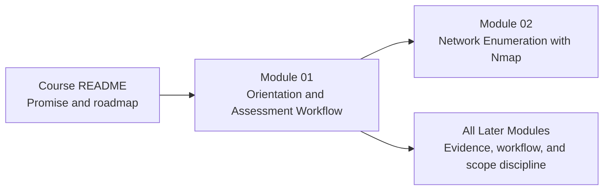

# Module 01 - Orientation and Assessment Workflow

**Phase I - Orientation and Surface Mapping**

### Learn how this course works, how an assessment actually flows, and how to build a lab workspace that supports disciplined practice.

*This opening module establishes the learner mindset, assessment lifecycle, scope and safety rules, note-taking habits, and a guided VMware lab operation with topology, snapshots, and a Module 02-ready note system that the rest of the course will assume from the start.*

---

> **🧭 Start Here**
>
> If you are new to `Hack the Basics`, begin with [Lesson 1.1](lessons/module-01-lesson-1-1-what-hack-the-basics-is-and-how-to-learn-through-it.md), then work through the assessment lifecycle, lab discipline, and analyst mindset in order. Keep the [reference cheat sheet](references/module-01-reference-cheat-sheet.md) and [notes workspace template](references/module-01-notes-workspace-template.md) open while you build your lab.

## Module Overview

Module 01 is the operating-system layer for the rest of the course.

Before the learner starts scanning, fingerprinting, intercepting traffic, or attacking services, they need a strong answer to a different set of questions:

- what kind of course is this really?
- how should a self-paced learner move through it?
- what does an assessment workflow look like from beginning to end?
- what belongs inside legal scope and lab discipline?
- what kind of workspace and note system supports reliable technical work?
- how should a beginner actually build the lab so later hands-on practice starts quickly?

That is the role of Module 01.

It gives the learner:

- the course-wide workflow vocabulary
- the assessment lifecycle model used across all later modules
- the scope, safety, and evidence habits the repo expects
- a concrete lab workspace built in VMware Workstation Pro
- a documented VM naming, topology, and snapshot baseline
- a resettable baseline model for future per-lab setup scripts
- a clear Module 02 handoff for scan storage, host tracking, and evidence handling

The intended lab baseline for this course is:

- VMware Workstation Pro as the host platform
- a Kali VM as the attack machine
- a Metasploit or Metasploitable-style practice target VM
- a configurable Linux VM for later lessons and labs
- a Windows 11 VM that carries forward into later Windows and AD work

This module makes that environment part of the learning workflow rather than a separate setup chore.
The goal is to remove setup friction early so later modules can stay focused on practice instead of rebuilding the lab mentally every time.

---

## At a Glance

| Area | Details |
|---|---|
| **Series** | Hack the Basics |
| **Phase** | Phase I - Orientation and Surface Mapping |
| **Module** | 01 - Orientation and Assessment Workflow |
| **Role** | Establish learner mindset, workflow, scope discipline, evidence habits, and workspace design |
| **Level** | Beginner |
| **Format** | Self-paced, Markdown-first, GitHub-native |

| Builds On | Prepares Next | Core Artifacts |
|---|---|---|
| Basic computing, terminal comfort, and willingness to work carefully in legal labs | Module 02 network enumeration, Module 03 service reasoning, and every later workflow decision in the course | lifecycle map, notes workspace template, guided workspace lab, field reference |

---

## Why This Module Exists

Most early-stage offensive security training fails before the first real technical lesson.

It either:

- throws the learner into tooling without a workflow
- or assumes the learner already knows how to structure lab work, notes, evidence, and scope decisions

That creates predictable problems:

- random practice
- bad note hygiene
- weak follow-up logic
- poor scope discipline
- shallow confidence built on command copying

Module 01 is designed to prevent that.

It teaches the learner how to work through the rest of the course like an analyst:

- understanding what phase they are in
- knowing what the current step is trying to prove
- building notes and lab habits that survive beyond one box or one weekend

---

## Module Position in the Course

> **🧠 Mental Model**
>
> Module 01 does not teach the first tool.
> It teaches the learner how to use the whole course and how to reason about technical work before tools take over.

---

## Lesson Path

| Lesson | Role in the Journey | What the learner leaves with |
|---|---|---|
| [Lesson 1.1](lessons/module-01-lesson-1-1-what-hack-the-basics-is-and-how-to-learn-through-it.md) | Explains what the course is, how to use it, and what learner success looks like | A realistic, workflow-first way to move through the course |
| [Lesson 1.2](lessons/module-01-lesson-1-2-the-assessment-lifecycle-from-first-contact-to-final-deliverable.md) | Establishes the assessment lifecycle as the course-wide operating model | A durable framework for understanding where any task fits |
| [Lesson 1.3](lessons/module-01-lesson-1-3-scope-rules-of-engagement-and-lab-discipline.md) | Teaches authorization, scope, safety, evidence handling, and lab hygiene | A safer and more professional way to build and use the lab |
| [Lesson 1.4](lessons/module-01-lesson-1-4-hypothesis-driven-testing-and-the-analyst-mindset.md) | Teaches evidence-based reasoning, note quality, and next-step decision discipline | The analyst mindset needed before enumeration begins |

---

## What to Use During the Module

| Artifact | Purpose | When to use it |
|---|---|---|
| [Reference Cheat Sheet](references/module-01-reference-cheat-sheet.md) | Fast reminder of lifecycle stages, scope discipline, note prompts, and analyst habits | During the whole module and later review |
| [Assessment Lifecycle Map](references/module-01-assessment-lifecycle-map.md) | Visual map of how the course models assessment work from first contact to reporting | During Lesson 1.2 and whenever later modules feel disconnected |
| [Notes Workspace Template](references/module-01-notes-workspace-template.md) | Starter structure for the VMware lab, VM inventory, note folders, evidence capture, and future setup-script planning | During Lesson 1.3 and the module lab |
| [Module Lab](labs/module-01-lab-01-build-your-assessment-workspace-and-note-system.md) | Turns the module into a guided operation with explicit VM roles, topology, snapshots, reset planning, and a Module 02-ready workspace handoff | After Lesson 1.4 |

---

## Reading Strategy

### If this is your first pass

1. Read every lesson in order before you rush into Module 02.
2. Treat the lifecycle and scope sections as operational requirements, not soft introductions.
3. Build the workspace as you go, not after the fact.
4. Start using observation, inference, and validation language immediately in your notes.

### If you are returning as a reference

- start with the [reference cheat sheet](references/module-01-reference-cheat-sheet.md)
- revisit Lesson 1.2 when later modules feel disconnected from the overall workflow
- revisit Lesson 1.3 whenever you are rebuilding the lab or need to check scope and evidence habits
- revisit Lesson 1.4 whenever you catch yourself tool-hopping without a clear next question

---

## What Makes This Module Different

Many introductory security modules are either motivational filler or legal boilerplate.

This module aims for something more useful:

- a real course-usage guide instead of generic welcome text
- a workflow model that later lessons actually reuse
- lab discipline that connects to the learner’s actual VM setup
- a guided lab operation with topology, checkpoints, and reset logic instead of “figure this part out yourself”
- note-taking and evidence habits that make future modules stronger

The goal is not to delay the technical content.
The goal is to make the technical content work better from the first real scan onward.

---

## Module Navigation

| Previous | Next |
|---|---|
| [Hack the Basics README](../../README.md) | [Module 02 - Network Enumeration with Nmap](../02-enumeration-using-nmap/README.md) |

---

**Use Module 01 to build the habits the whole course depends on: clear scope, a stable lab, usable notes, and disciplined next-step thinking.**

