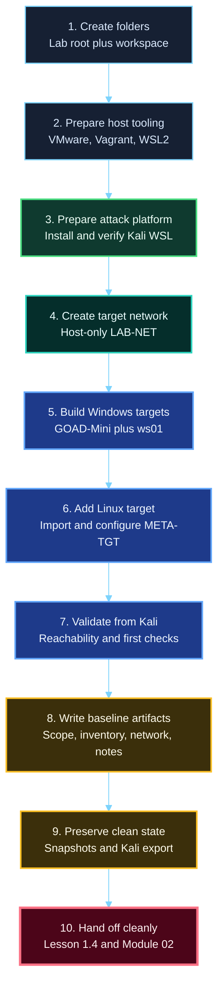
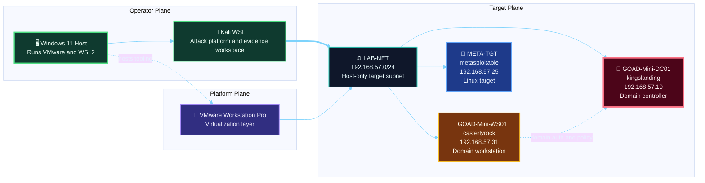

<div align="center">

**Hack the Basics · Phase I**

`Module 01 · Orientation and Assessment Workflow`

</div>

# Module 01 Lab 01 - Build Your Assessment Workspace and Note System

---

> **🛠 Practice**
>
> Build the real `Hack the Basics` course baseline on one Windows 11 host using Kali WSL as the attack platform and three VMware targets: `GOAD-Mini-DC01`, `GOAD-Mini-WS01`, and `META-TGT`.
>
> This lab has two deliverables:
>
> 1. a working, resettable environment
> 2. a note workspace that Module 02 can use immediately

| **Course** | **Module** | **Lab** | **Estimated Time** | **Difficulty** |
|---|---|---|---:|---|
| Hack the Basics | Module 01 - Orientation and Assessment Workflow | 01 - Build Your Assessment Workspace and Note System | 4-6 hours | Beginner to early intermediate |

| **Prerequisites** | **You will practice** | **Main outputs** |
|---|---|---|
| Lessons 1.1-1.3, Windows 11 host, admin rights on the host, enough RAM and disk for VMware guests | Building the lab, validating the environment, documenting the baseline, and creating the first reusable note artifacts | Kali WSL baseline, `GOAD-Mini-DC01`, `GOAD-Mini-WS01`, `META-TGT`, scope note, VM inventory, network notes, snapshot map, first analyst note |

> **🚨 Important**
>
> Do not treat this as a generic install checklist.
> The point is not only to make systems boot.
> The point is to leave Module 01 with a stable course baseline and a clear evidence workspace.

---

## Table of Contents

- [Lab Map](#lab-map)
- [Why This Lab Matters](#why-this-lab-matters)
- [What You Are Building](#what-you-are-building)
- [Final Naming and IP Plan](#final-naming-and-ip-plan)
- [Workspace Layout](#workspace-layout)
- [Network Topology](#network-topology)
- [Host Requirements](#host-requirements)
- [Build Order](#build-order)
- [Step 1 - Create the Windows Lab and Workspace Folders](#step-1---create-the-windows-lab-and-workspace-folders)
- [Step 2 - Download the Required Software and Assets](#step-2---download-the-required-software-and-assets)
- [Step 3 - Install VMware Workstation Pro](#step-3---install-vmware-workstation-pro)
- [Step 4 - Install Vagrant and the VMware Components](#step-4---install-vagrant-and-the-vmware-components)
- [Step 5 - Install and Verify WSL2](#step-5---install-and-verify-wsl2)
- [Step 6 - Install and Prepare Kali WSL](#step-6---install-and-prepare-kali-wsl)
- [Step 7 - Build the VMware Host-Only Target Network](#step-7---build-the-vmware-host-only-target-network)
- [Step 8 - Clone GOAD onto a Windows-Backed Path](#step-8---clone-goad-onto-a-windows-backed-path)
- [Step 9 - Install `GOAD-Mini + ws01`](#step-9---install-goad-mini--ws01)
- [Step 10 - Import and Configure `META-TGT`](#step-10---import-and-configure-meta-tgt)
- [Step 11 - Validate the Lab from Kali WSL](#step-11---validate-the-lab-from-kali-wsl)
- [Step 12 - Create the Module 01 Note Artifacts](#step-12---create-the-module-01-note-artifacts)
- [Step 13 - Save the Clean Baseline Snapshots and Kali Export](#step-13---save-the-clean-baseline-snapshots-and-kali-export)
- [Build Complete Checklist](#build-complete-checklist)
- [Common Setup Problems](#common-setup-problems)
- [Next Lesson Handoff](#next-lesson-handoff)

---

## Lab Map



---

## Why This Lab Matters

This lab is the operational center of Module 01.

If it goes well, the learner leaves with:

- a stable environment to scan and enumerate
- durable asset names and IPs
- a clear operator position
- a written record of scope and network context
- clean reset points for later modules

If it goes badly, later modules inherit:

- avoidable rebuild work
- weak note quality
- confusion about which systems are real targets
- inconsistent network assumptions

That is why the lab belongs in the middle of the module instead of being tucked away at the end.

---

## What You Are Building

The course baseline has four important pieces:

- one Windows 11 host
- one Kali WSL instance
- one GOAD Mini domain controller and workstation pair
- one Metasploitable2 Linux target

Those assets are not equal.

| Asset | Layer | Role |
|---|---|---|
| Windows 11 host | operator environment | runs VMware and WSL2 |
| Kali WSL | operator environment | attack and analysis platform |
| `GOAD-Mini-DC01` | target environment | domain controller target |
| `GOAD-Mini-WS01` | target environment | domain workstation target |
| `META-TGT` | target environment | intentionally vulnerable Linux target |

---

## Final Naming and IP Plan

Use these names and keep them stable.

| Item | Type | Name to use | Planned IP |
|---|---|---|---|
| Host machine | Windows 11 host | your real Windows hostname | host-side only |
| Attack machine | WSL distro | `kali-linux` or your installed Kali WSL distro name | WSL-side only |
| Domain controller | VMware VM | `GOAD-Mini-DC01` | `192.168.57.10` |
| Domain workstation | VMware VM | `GOAD-Mini-WS01` | `192.168.57.31` |
| Linux target | VMware VM | `META-TGT` | `192.168.57.25` |

### Guest hostnames

| VMware VM | Guest hostname |
|---|---|
| `GOAD-Mini-DC01` | `kingslanding` |
| `GOAD-Mini-WS01` | `casterlyrock` |
| `META-TGT` | keep the default `metasploitable` hostname unless you deliberately change it |

---

## Workspace Layout

Create one durable parent folder on a Windows drive.

Recommended example:

```text
E:\HackTheBasicsLab\
```

Inside it, use this structure:

```text
E:\HackTheBasicsLab\
  downloads\
  exports\
  goad\
  vmware\
    META-TGT\
  assessment-workspace\
    00-admin\
    01-target-notes\
    02-evidence\
      scans\
      screenshots\
      outputs\
    03-analysis\
    04-reporting\
    05-lab-automation\
      initial-config\
      per-lab\
```

Use the [notes workspace template](../references/module-01-notes-workspace-template.md) as the content guide once the folders exist.

---

## Network Topology

Use one dedicated VMware host-only network for all target systems.



### Read this literally

- the Windows host runs VMware and WSL2
- Kali WSL is the attack platform
- the VMware guests are the target systems
- the target systems live on one host-only subnet
- later modules should assume that subnet and those target names unless a module explicitly changes them

---

## Host Requirements

Before you start, make sure the Windows host has:

- Windows 11
- admin rights
- enough free disk space
- enough free memory

### Practical minimums

- free disk: `100 GB`
- RAM: `16 GB` workable, `24 GB` more comfortable

This lab is moderate in size.
Do not start it on a machine that is already close to full disk or memory pressure.

---

## Build Order

Follow this order:

1. create the Windows lab and note-workspace folders
2. download the required software and assets
3. install VMware
4. install Vagrant and the VMware utility
5. install WSL2
6. install Kali WSL
7. build the host-only target network
8. clone GOAD on a Windows-backed path
9. install `GOAD-Mini + ws01`
10. import and configure `META-TGT`
11. validate the lab from Kali WSL
12. write the Module 01 note artifacts
13. create the clean snapshots and export Kali WSL

Do not skip the validation and artifact steps.
They are part of “done.”

---

## Step 1 - Create the Windows Lab and Workspace Folders

Create the parent folder and subfolders shown earlier.

At minimum, you should end this step with:

```text
downloads\
exports\
goad\
vmware\
assessment-workspace\
```

Then create the note-workspace skeleton:

```text
assessment-workspace\
  00-admin\
  01-target-notes\
  02-evidence\
  03-analysis\
  04-reporting\
  05-lab-automation\
```

### Create these starter files now

Inside `assessment-workspace\00-admin\`, create empty files for:

- `scope.md`
- `vm-inventory.md`
- `network-notes.md`

Inside `assessment-workspace\05-lab-automation\`, create:

- `snapshot-map.md`

Inside `assessment-workspace\03-analysis\`, create:

- `observations.md`

We will fill them in later in this lab.

---

## Step 2 - Download the Required Software and Assets

Download these items before you start installing.

| Download | Install on | Save under | Why you need it |
|---|---|---|---|
| VMware Workstation Pro for Windows | Windows 11 host | `downloads` | runs the target VMs |
| Microsoft Visual C++ Redistributable x64 | Windows 11 host | `downloads` | common dependency for the Windows-side Vagrant workflow |
| Vagrant for Windows | Windows 11 host | `downloads` | GOAD uses Vagrant to provision VMware VMs |
| Vagrant VMware Utility | Windows 11 host | `downloads` | required for Vagrant plus VMware integration |
| Metasploitable2 image | VMware target | `downloads` | Linux target for early enumeration and service work |

Download GOAD later by cloning it from Kali WSL.

---

## Step 3 - Install VMware Workstation Pro

On the Windows host:

1. Run the VMware Workstation Pro installer as Administrator.
2. Complete the installer with normal desktop defaults.
3. Launch VMware once after installation.
4. Confirm it opens cleanly.

### If the installer throws a local-groups error

Open an elevated Command Prompt and run:

```cmd
net localgroup /add "Users"
net localgroup /add "Authenticated Users"
```

Then rerun the installer.

### Verification checkpoint

Before moving on:

- VMware opens normally
- you can reach `Edit > Virtual Network Editor`

---

## Step 4 - Install Vagrant and the VMware Components

On the Windows host, install these in order:

1. Microsoft Visual C++ Redistributable x64
2. Vagrant for Windows
3. Vagrant VMware Utility

Then open Windows PowerShell as Administrator and run:

```powershell
vagrant.exe plugin install vagrant-reload vagrant-vmware-desktop winrm winrm-fs winrm-elevated
```

### Verify the install

Run:

```powershell
vagrant.exe --version
vagrant.exe plugin list
```

Do not continue until that works.

---

## Step 5 - Install and Verify WSL2

Open Windows PowerShell as Administrator and run:

```powershell
wsl --install
wsl --set-default-version 2
```

Reboot if Windows asks you to.

Then verify:

```powershell
wsl -l -v
```

If no Linux distributions exist yet, that is expected.

---

## Step 6 - Install and Prepare Kali WSL

Install Kali WSL using one of these:

1. install `Kali Linux` from the Microsoft Store
2. or run:

```powershell
wsl --install -d kali-linux
```

Launch Kali WSL and complete the initial Linux user setup.

Inside Kali WSL, install the baseline packages:

```bash
sudo apt update
sudo apt install -y git python3 python3-pip python3-venv libpython3-dev nmap iputils-ping net-tools
```

Verify:

```bash
python3 --version
git --version
nmap --version
vagrant.exe --version
```

### Important GOAD path rule

When you run GOAD from WSL, the repo must live on a Windows-backed path such as:

```text
/mnt/c/...
```

or:

```text
/mnt/e/...
```

Do not clone GOAD only inside the Linux filesystem under your WSL home directory.

---

## Step 7 - Build the VMware Host-Only Target Network

In VMware Workstation Pro:

1. Open `Edit > Virtual Network Editor`.
2. Click `Change Settings` if VMware asks for elevation.
3. Pick an unused VMnet, for example `VMnet2`.
4. Set it to `Host-only`.
5. Set the subnet to `192.168.57.0`.
6. Set the subnet mask to `255.255.255.0`.
7. Disable VMware DHCP for this network.
8. Apply the changes.

### Record these values

| Setting | Value |
|---|---|
| VMware network | `VMnet2` |
| Label in this course | `LAB-NET` |
| Subnet | `192.168.57.0/24` |
| DHCP | disabled |

### Verify the host-side adapter

On Windows, open `ncpa.cpl` and confirm the host-only adapter exists.

---

## Step 8 - Clone GOAD onto a Windows-Backed Path

From Kali WSL, if your lab folder is `E:\HackTheBasicsLab`:

```bash
cd /mnt/e/HackTheBasicsLab/goad
git clone https://github.com/Orange-Cyberdefense/GOAD.git
cd GOAD
```

If your lab folder is `C:\HackTheBasicsLab`, adjust the drive letter:

```bash
cd /mnt/c/HackTheBasicsLab/goad
git clone https://github.com/Orange-Cyberdefense/GOAD.git
cd GOAD
```

Verify with:

```bash
pwd
```

The path must begin with `/mnt/`.

---

## Step 9 - Install `GOAD-Mini + ws01`

From inside the GOAD repo in Kali WSL:

```bash
./goad.sh
```

At the GOAD prompt, run:

```text
set_provider vmware
set_lab GOAD-Mini
set_ip_range 192.168.57
set_extensions ws01
config
check
install
```

### What these commands do

| Command | Purpose |
|---|---|
| `set_provider vmware` | uses VMware as the target platform |
| `set_lab GOAD-Mini` | selects the smaller AD baseline |
| `set_ip_range 192.168.57` | aligns GOAD to the host-only subnet |
| `set_extensions ws01` | adds the workstation target |
| `config` | confirms settings |
| `check` | verifies dependencies |
| `install` | builds and provisions the lab |

When the install finishes, run:

```text
status
set_as_default
```

### Expected GOAD target state

| VMware VM | Guest hostname | Role | Expected IP |
|---|---|---|---|
| `GOAD-Mini-DC01` | `kingslanding` | domain controller | `192.168.57.10` |
| `GOAD-Mini-WS01` | `casterlyrock` | domain workstation | `192.168.57.31` |

### If GOAD fails during the build

Fix the reported dependency first.
Do not guess and do not destroy the lab blindly.

### Preferred recovery if `ws01` fails during extension provisioning

If Ansible reports:

```text
ERROR! the role 'common' was not found
```

set the role path manually in Kali WSL:

```bash
export ANSIBLE_CONFIG=/mnt/e/HackTheBasicsLab/goad/GOAD/extensions/ws01/ansible/ansible.cfg
export ANSIBLE_ROLES_PATH=/mnt/e/HackTheBasicsLab/goad/GOAD/extensions/ws01/ansible/roles:/mnt/e/HackTheBasicsLab/goad/GOAD/ansible/roles
./goad.sh
```

Adjust `/mnt/e/...` to your real path if needed.

If `status` shows:

```text
GOAD-Mini-WS01            not running
```

recover with:

```text
load <your-instance-id>
status
start_vm GOAD-Mini-WS01
status
provision_extension ws01
```

For deeper day-to-day GOAD operations after the build, use the [GOAD lab operations reference](../references/module-01-goad-lab-operations-reference.md).

---

## Step 10 - Import and Configure `META-TGT`

Extract the Metasploitable2 files into:

```text
E:\HackTheBasicsLab\vmware\META-TGT\
```

Then in VMware Workstation Pro:

1. Click `File > Open`.
2. Open the Metasploitable2 `.vmx` file.
3. When VMware asks whether you moved or copied it, choose `I Copied It`.
4. Rename the VMware inventory entry to `META-TGT`.

### Attach it to the target network

1. Open `VM > Settings`.
2. Select `Network Adapter`.
3. Set it to `Custom: Specific virtual network`.
4. Choose `VMnet2` or whichever VMnet you assigned to `LAB-NET`.

### Configure the static IP

Log in with the typical default credentials:

```text
Username: msfadmin
Password: msfadmin
```

Then become root and set the interface:

```bash
sudo -s
cp /etc/network/interfaces /etc/network/interfaces.bak
nano /etc/network/interfaces
```

Use:

```text
auto lo
iface lo inet loopback

auto eth0
iface eth0 inet static
    address 192.168.57.25
    netmask 255.255.255.0
```

Restart networking and verify:

```bash
/etc/init.d/networking restart
ifconfig eth0
```

The target should show `192.168.57.25`.

---

## Step 11 - Validate the Lab from Kali WSL

Do not accept “the VMs booted” as proof.
Validate from the actual attack platform.

### Confirm `META-TGT`

```bash
ping -c 1 192.168.57.25
```

### Validate the Windows targets with direct port checks

```bash
nmap -Pn -p 53,88,135,389,445 192.168.57.10
nmap -Pn -p 135,139,445,3389 192.168.57.31
```

### Validate the Linux target

```bash
nmap -Pn -p 21,22,23,80 192.168.57.25
```

### Optional whole-subnet visibility check

```bash
nmap -sn 192.168.57.0/24
```

### Validation goal

By the end of this step, you should know:

- Kali WSL can reach the target subnet
- `GOAD-Mini-DC01` responds at `192.168.57.10`
- `GOAD-Mini-WS01` responds at `192.168.57.31`
- `META-TGT` responds at `192.168.57.25`

If that is not true, stop and fix the networking before moving on.

---

## Step 12 - Create the Module 01 Note Artifacts

This step is mandatory.

Open the files you created earlier and record the baseline while it is still fresh.

### 1. `scope.md`

Write a short note like:

```text
Authorized learner lab scope:
- Windows 11 host running VMware and WSL2
- Kali WSL attack platform
- GOAD-Mini-DC01
- GOAD-Mini-WS01
- META-TGT
- host-only target subnet 192.168.57.0/24

Exclusions:
- non-lab home devices
- unrelated host networks
- any external systems not intentionally attached to this course lab
```

### 2. `vm-inventory.md`

Create a table with:

- asset name
- role
- guest hostname if applicable
- IP
- snapshot state
- notes

At minimum, it should include the Windows host, Kali WSL, `GOAD-Mini-DC01`, `GOAD-Mini-WS01`, and `META-TGT`.

### 3. `network-notes.md`

Record:

- VMware network name such as `VMnet2`
- course label `LAB-NET`
- subnet `192.168.57.0/24`
- host-only design
- DHCP disabled
- Kali WSL as the attack position

### 4. `snapshot-map.md`

Pre-fill the intended clean state:

```text
GOAD-Mini-DC01 -> dc01-clean
GOAD-Mini-WS01 -> ws01-clean
META-TGT -> meta-clean
Kali WSL export -> kali-wsl-clean.tar
```

### 5. First analyst note

Inside `03-analysis\observations.md` or your preferred note file, write one short entry like:

```text
Current phase: Orientation
Question: Is the course baseline reachable and documented well enough for Module 02?
Observation: Kali WSL reaches 192.168.57.10, 192.168.57.31, and 192.168.57.25; inventory and network notes created.
Inference: The lab is likely ready for first-pass enumeration work.
Validation needed: Confirm later scan output is saved cleanly into the workspace and that host tracking stays consistent.
Next step: Move to Lesson 1.4, then begin Module 02 surface mapping.
```

This is the first point where the module turns infrastructure into workflow.

---

## Step 13 - Save the Clean Baseline Snapshots and Kali Export

Now save the baseline before later modules start changing it.

### Create the VMware snapshots

In VMware Workstation Pro, create:

| VM | Snapshot name |
|---|---|
| `GOAD-Mini-DC01` | `dc01-clean` |
| `GOAD-Mini-WS01` | `ws01-clean` |
| `META-TGT` | `meta-clean` |

Do not use vague names.

### Export Kali WSL

In Windows PowerShell:

```powershell
wsl -l -v
wsl --shutdown
wsl --export kali-linux E:\HackTheBasicsLab\exports\kali-wsl-clean.tar
```

If your distro is named differently, substitute the real name shown by `wsl -l -v`.

### Update `snapshot-map.md`

Replace the placeholder lines with the actual snapshot and export details, including the date if helpful.

---

## Build Complete Checklist

Do not call the lab complete until all of these are true:

- VMware Workstation Pro is installed and opens cleanly
- Vagrant and the required plugins are installed on Windows
- WSL2 is installed
- Kali WSL launches and can run `git`, `python3`, `nmap`, and `vagrant.exe`
- one host-only target network exists for the course
- `GOAD-Mini-DC01` exists and answers at `192.168.57.10`
- `GOAD-Mini-WS01` exists and answers at `192.168.57.31`
- `META-TGT` exists and answers at `192.168.57.25`
- Kali WSL can reach all three targets
- `scope.md`, `vm-inventory.md`, `network-notes.md`, and `snapshot-map.md` exist
- one first analyst note exists
- `dc01-clean`, `ws01-clean`, and `meta-clean` exist
- `kali-wsl-clean.tar` exists

---

## Common Setup Problems

### GOAD was cloned inside the WSL Linux filesystem

Move it.
GOAD should run from a Windows-backed path like `/mnt/c/...` or `/mnt/e/...`.

### Vagrant works on Windows but not from Kali WSL

Test:

```bash
vagrant.exe --version
```

If that fails, fix the Windows-side install first.

### The GOAD VMs are on the wrong subnet

Check:

- the GOAD `set_ip_range` value
- the VMware host-only subnet
- whether another VMware host-only network is using the same range

### `META-TGT` still has the wrong address

Recheck:

- the VMware adapter is attached to the right VMnet
- the `/etc/network/interfaces` file is correct
- networking restarted successfully

### Kali WSL can reach `META-TGT` but not the Windows targets

That often means:

- GOAD did not finish provisioning cleanly
- the Windows VMs are still booting
- you are relying on ping instead of `nmap -Pn`

### The lab works but the notes do not exist yet

The lab is not finished.
Go back and complete Step 12 before moving on.

---

## Next Lesson Handoff

With the lab built and documented, return to
[Lesson 1.4 - Hypothesis-Driven Testing and the Analyst Mindset](../lessons/module-01-lesson-1-4-hypothesis-driven-testing-and-the-analyst-mindset.md).

That lesson now has a real environment to work from.

The learner should be able to reason from:

- actual hostnames
- actual target IPs
- actual validation notes
- actual note artifacts

That is the right handoff into the final Module 01 mindset work, and then into Module 02.
