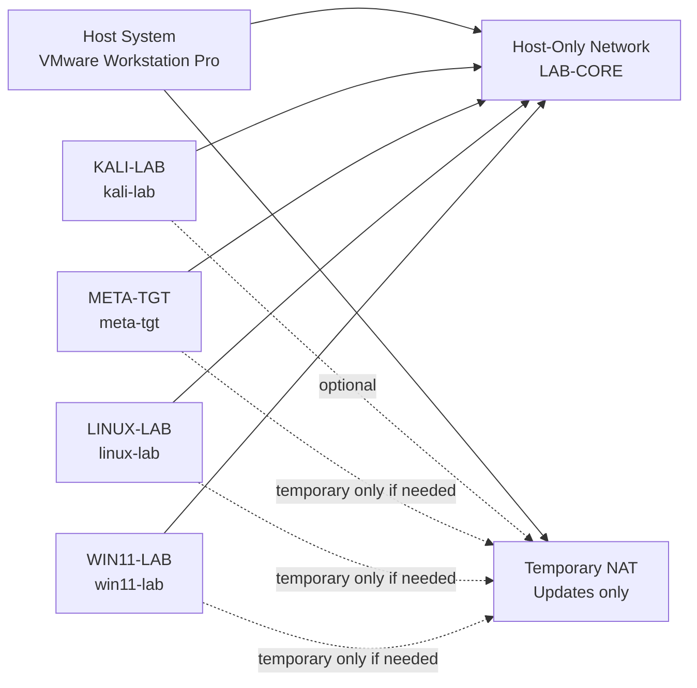

<div align="center">

**Hack the Basics · Phase I**

`Module 01 · Orientation and Assessment Workflow`

</div>

# Module 01 Lab 01 - Build Your Assessment Workspace and Note System

---

> **🛠 Practice**
>
> Build the full Module 01 lab baseline in a way that is usable, resettable, and ready for later modules: a documented VMware workspace, four clearly named VMs, one primary host-only lab network, clean snapshots, a note system, and a future setup-script model that Module 02 can inherit immediately.

| **Course** | **Module** | **Lab** | **Estimated Time** | **Difficulty** |
|---|---|---|---:|---|
| Hack the Basics | Module 01 - Orientation and Assessment Workflow | 01 - Build Your Assessment Workspace and Note System | 2.5-5 hours | Beginner |

| **Prerequisites** | **You will practice** | **Main outputs** |
|---|---|---|
| Lessons 1.1-1.4, VMware Workstation Pro, install media or prepared images for the baseline VMs | Planning topology, building VMs in a disciplined order, recording evidence, creating clean reset points, and leaving a usable Module 02 handoff | VM inventory, network plan, note workspace, scope and ROE notes, clean snapshots, snapshot map, first analyst note |

> **🚨 Important**
>
> This lab is not a generic "install a few VMs" exercise.
> It is the operational baseline for the rest of the course.
> If the environment is unclear now, later modules inherit that confusion.

---

## Table of Contents

- [Lab Role in the Course](#lab-role-in-the-course)
- [Scenario](#scenario)
- [What Success Looks Like](#what-success-looks-like)
- [Baseline Architecture Decisions](#baseline-architecture-decisions)
- [VM Inventory and Reuse Plan](#vm-inventory-and-reuse-plan)
- [Network Topology and Trust Boundaries](#network-topology-and-trust-boundaries)
- [Workspace Layout](#workspace-layout)
- [Build Workflow](#build-workflow)
- [Phase 0 - Prepare the Host, Media, and Parent Folder](#phase-0---prepare-the-host-media-and-parent-folder)
- [Phase 1 - Create the Note Workspace Before the VMs](#phase-1---create-the-note-workspace-before-the-vms)
- [Phase 2 - Lock in VM Names, Guest Hostnames, and Roles](#phase-2---lock-in-vm-names-guest-hostnames-and-roles)
- [Phase 3 - Prepare the VMware Networks First](#phase-3---prepare-the-vmware-networks-first)
- [Phase 4 - Build `KALI-LAB`](#phase-4---build-kali-lab)
- [Phase 5 - Build `META-TGT`](#phase-5---build-meta-tgt)
- [Phase 6 - Build `LINUX-LAB`](#phase-6---build-linux-lab)
- [Phase 7 - Build `WIN11-LAB`](#phase-7---build-win11-lab)
- [Phase 8 - Finish the Inventory, Scope Note, and Safety Record](#phase-8---finish-the-inventory-scope-note-and-safety-record)
- [Phase 9 - Create the Clean Snapshot Baseline](#phase-9---create-the-clean-snapshot-baseline)
- [Phase 10 - Define the Automation and Reset Model](#phase-10---define-the-automation-and-reset-model)
- [Phase 11 - Write the First Analyst Note and Module 02 Handoff](#phase-11---write-the-first-analyst-note-and-module-02-handoff)
- [Validation Checklist](#validation-checklist)
- [Common Failure Modes](#common-failure-modes)
- [Close-Out Reflection](#close-out-reflection)

---

## Lab Role in the Course

This lab performs the baseline-build job for the whole course.

It should leave you with:

- one stable attacker workstation
- three clearly documented target platforms
- a network design you can explain without guessing
- clean reset points before later labs start mutating systems
- a note structure that can store scan output, screenshots, reasoning, and reporting drafts

This lab prepares:

- Module 02 by giving you a place to store target lists, scan plans, raw output, and host observations
- Module 03 by preserving service-role context for each host
- later Windows, Linux, and AD-adjacent modules by keeping `LINUX-LAB` and `WIN11-LAB` in the baseline from the beginning

> **🧠 Mental Model**
>
> Module 01 is not front-loaded housekeeping.
> It is where you build the environment and documentation habits that make later technical work easier to trust.

---

## Scenario

You are setting up a legal practice lab before any real enumeration begins.

Your job is to build a VMware-based assessment workspace that can answer these questions cleanly:

- what systems are in scope?
- what is each system for?
- what network are those systems on?
- how do you reset them before later labs?
- where will evidence, observations, and follow-up tasks live once scanning starts?

You are not trying to create the most advanced lab possible.
You are trying to create the smallest strong baseline that supports the course.

---

## What Success Looks Like

At the end of the lab, another learner should be able to read your notes and understand:

- which four VMs exist and why
- which VMware network is the primary lab segment
- which machines may temporarily use NAT and when
- what the clean snapshots are called
- where future baseline configure scripts and per-lab setup scripts belong
- where Module 02 scan outputs should be saved

### Required artifacts

| Artifact | Where it should live | What it should contain |
|---|---|---|
| Scope note | `assessment-workspace/00-admin/scope.md` | lab-only authorization boundary and in-scope systems |
| Rules of engagement note | `assessment-workspace/00-admin/rules-of-engagement.md` | isolation, allowed actions, and network safety rules |
| VM inventory | `assessment-workspace/00-admin/vm-inventory.md` | VM names, guest hostnames, roles, OS details, current state |
| Network notes | `assessment-workspace/00-admin/network-notes.md` | VMware network IDs, working labels, IP notes, NAT policy |
| Snapshot map | `assessment-workspace/05-lab-automation/snapshot-map.md` | clean snapshot names and what each one represents |
| Daily analyst note | your preferred notes location | one entry using question, observation, inference, validation, next step |

---

## Baseline Architecture Decisions

This lab uses the course baseline defined in Module 01.

### Core design choices

| Area | Decision | Why it exists |
|---|---|---|
| Host platform | VMware Workstation Pro | common baseline across the course |
| Primary attacker system | `KALI-LAB` | attack, analysis, note-adjacent workflow, saved outputs |
| Early practice target | `META-TGT` | intentionally vulnerable target for repeated beginner practice |
| Flexible Linux target | `LINUX-LAB` | future services, web, and Linux-focused labs |
| Windows target | `WIN11-LAB` | later Windows and AD-adjacent work |
| Primary lab network | one host-only segment | isolation, repeatability, easier mental model |
| Internet access | temporary NAT only when needed | safer defaults and less accidental cross-network drift |
| Reset model | one mandatory clean snapshot per VM | stable baseline for future setup scripts |
| Automation model | baseline configure scripts plus later per-lab scripts | reuse the same machines instead of rebuilding new ones |

### Resource-planning note

If your host hardware is limited, still build all four baseline VMs now.
You do not need to run all of them simultaneously for most early modules.
The important part is having the baseline documented and snapshotted.

---

## VM Inventory and Reuse Plan

| VMware VM name | Guest hostname | Primary role now | Later module reuse |
|---|---|---|---|
| `KALI-LAB` | `kali-lab` | attacker workstation, tooling, saved output staging | almost every later module |
| `META-TGT` | `meta-tgt` | intentionally vulnerable early target | Module 02, Module 03, early service and foothold practice |
| `LINUX-LAB` | `linux-lab` | configurable Linux platform for service and web scenarios | web, service, foothold, Linux privesc modules |
| `WIN11-LAB` | `win11-lab` | Windows workstation baseline | Windows, auth, later internal movement, AD-adjacent work |

### Why these names matter

Use the exact VMware names above and record the guest hostnames exactly once.
That gives later notes, screenshots, and setup scripts stable nouns.

If you improvise names now, you create needless ambiguity later.

---

## Network Topology and Trust Boundaries

Use one primary host-only network for the course baseline.
In your notes, give it a working label such as `LAB-CORE` even if the actual VMware identifier is `VMnet1` or another VMnet number.

Use temporary NAT only when a VM genuinely needs internet access for updates, package installs, or image preparation.
Do not leave vulnerable targets permanently exposed to NAT out of laziness.



### Recommended network policy

| Item | Recommended choice | What to record |
|---|---|---|
| Core lab segment | one host-only VMware network | VMnet number, subnet, DHCP behavior, your label |
| Vulnerable target exposure | host-only only by default | which targets should never stay on NAT |
| NAT usage | temporary, task-bound, documented | who used NAT, when, and why |
| Bridged networking | avoid for this baseline | only note it if you deliberately choose it later |
| IP plan | record assigned IPs after first boot | current IP, interface name, and whether static or DHCP |

> **⚠️ Warning**
>
> If you cannot answer "what network am I standing on right now?" before you start scanning, the lab is not ready.

---

## Workspace Layout

Create one durable parent folder for both VM files and the assessment note system.

Recommended structure:

```text
hack-the-basics-lab/
  vmware/
    KALI-LAB/
    META-TGT/
    LINUX-LAB/
    WIN11-LAB/
  install-media/
  exports/
  assessment-workspace/
    00-admin/
      scope.md
      rules-of-engagement.md
      vm-inventory.md
      network-notes.md
    01-target-notes/
      target-summary.md
      host-tracking.md
    02-evidence/
      scans/
      screenshots/
      outputs/
    03-analysis/
      observations.md
      hypotheses.md
      follow-up-queue.md
    04-reporting/
      findings-drafts.md
      timeline.md
    05-lab-automation/
      initial-config/
      per-lab/
      snapshot-map.md
```

### Folder design rules

- keep VM files and notes under one parent folder so the lab is easy to back up and explain
- do not store evidence only in terminal scrollback
- create the automation folders now even though the scripts come later
- keep admin notes separate from evidence and reporting

---

## Build Workflow

Use this build order exactly:

1. prepare the host, media, and parent folder
2. create the note workspace and admin files
3. define names, hostnames, and roles before creating any VM
4. prepare VMware networking
5. build `KALI-LAB`
6. build `META-TGT`
7. build `LINUX-LAB`
8. build `WIN11-LAB`
9. finish the inventory and safety records
10. create clean snapshots
11. define the reset and automation model
12. write the first analyst note and Module 02 handoff

Do not start with whichever image feels easiest.
Build order is part of friction reduction.

---

## Phase 0 - Prepare the Host, Media, and Parent Folder

Before you open VMware, confirm the following:

- VMware Workstation Pro is installed and launches correctly
- you have the ISOs or prepared images you intend to use
- you have enough disk space for four VMs plus snapshots
- you have enough RAM to run at least `KALI-LAB` and one target together
- you have picked one durable parent folder for the full lab

### Record this immediately

In `assessment-workspace/00-admin/network-notes.md` or a temporary scratch note, record:

- VMware Workstation Pro version
- host operating system
- where the parent lab folder lives
- which VM images or ISOs you plan to use

### Checkpoint

You should now know:

- where every VM will be stored
- what media you are using
- whether your host can support the baseline

---

## Phase 1 - Create the Note Workspace Before the VMs

Create the `assessment-workspace/` structure before the first VM.

Why this matters:

- it gives you somewhere to record decisions while you build
- it keeps the first IPs, credentials, and network observations from getting lost
- it makes the lab feel like an assessment workspace, not a random VM folder

### Minimum files to create now

- `00-admin/scope.md`
- `00-admin/rules-of-engagement.md`
- `00-admin/vm-inventory.md`
- `00-admin/network-notes.md`
- `05-lab-automation/snapshot-map.md`

### Seed each file with one useful heading

Suggested starters:

| File | Starter heading |
|---|---|
| `scope.md` | `# Module 01 Lab Scope` |
| `rules-of-engagement.md` | `# Learner Lab Rules of Engagement` |
| `vm-inventory.md` | `# VMware Baseline Inventory` |
| `network-notes.md` | `# VMware Network Notes` |
| `snapshot-map.md` | `# Baseline Snapshot Map` |

### Checkpoint

Before you create a VM, you should already have a place to write down:

- names
- IPs
- credentials
- snapshot decisions
- scope boundaries

---

## Phase 2 - Lock in VM Names, Guest Hostnames, and Roles

Define the exact VMware names and the guest hostnames now.

| VMware name | Guest hostname | Primary note to preserve during build |
|---|---|---|
| `KALI-LAB` | `kali-lab` | interfaces, IPs, package changes, tool-state notes |
| `META-TGT` | `meta-tgt` | source image, default credentials, exposed services |
| `LINUX-LAB` | `linux-lab` | distro, users, service role, future lab purpose |
| `WIN11-LAB` | `win11-lab` | Windows build, local users, role in later modules |

### Add these columns to `vm-inventory.md`

- VMware VM name
- guest hostname
- operating system
- baseline role
- primary VMware network
- temporary NAT allowed?
- current IP
- snapshot status
- notes

### Checkpoint

If you renamed one machine three different ways across your notes, fix that now.
Stable names are part of lab quality.

---

## Phase 3 - Prepare the VMware Networks First

Do not build the machines and hope the topology works itself out later.

### Required network decision

Choose one host-only network to act as `LAB-CORE`.

Record:

- actual VMware network ID such as `VMnet1` or `VMnet2`
- your working label `LAB-CORE`
- subnet
- whether VMware DHCP is enabled
- whether you expect static addressing later

### NAT policy

Write one short policy in `rules-of-engagement.md`:

- NAT may be enabled temporarily for updates
- NAT must be disabled or disconnected when the update task is complete
- vulnerable targets should live on the host-only network by default

### Initial validation

Before building all four VMs, verify you can identify:

- the host-only network
- the NAT network
- which adapters you intend to attach to each machine

### Checkpoint

You should now know what the "normal" network state for each VM will be.

---

## Phase 4 - Build `KALI-LAB`

Build the Kali VM first because later labs assume it is the operator workstation.

### During build, record the following

- OS version or image used
- VMware VM name and guest hostname
- virtual disk location
- RAM and CPU allocation
- primary network adapter choice
- whether a temporary NAT adapter was used
- first observed IP address and interface name after boot

### Baseline decisions for `KALI-LAB`

| Area | Recommended choice |
|---|---|
| Primary role | attack and analysis workstation |
| Normal network state | host-only connected to `LAB-CORE` |
| NAT usage | allowed temporarily for updates or package installs |
| Evidence role | stores scan output, screenshots, and exported command results |
| Future automation role | baseline configure script can standardize tools or folders later |

### Validate before moving on

- the VM boots reliably
- the hostname is set to `kali-lab`
- you can identify the host-only interface
- the current IP is recorded in `vm-inventory.md`
- any temporary NAT use is recorded in `network-notes.md`

### Checkpoint

You now have the machine later modules will assume exists from the start.

---

## Phase 5 - Build `META-TGT`

Build the intentionally vulnerable practice target second.

This machine reduces friction in the early course because it gives you a target that is meant to be explored repeatedly.

### During build, record the following

- source image or distribution used
- default credentials if the image ships with them
- known exposed services at baseline, if documented by the image author
- primary network placement
- any temporary NAT use during setup
- first observed IP address after boot

### Baseline decisions for `META-TGT`

| Area | Recommended choice |
|---|---|
| Primary role | early practice target for enumeration and basic attack-path reasoning |
| Normal network state | host-only only |
| NAT usage | avoid by default; document carefully if temporarily required |
| Evidence role | first repeatable scan target in Module 02 |
| Future automation role | likely minimal baseline automation, later scenario resets mostly via snapshot |

### Validate before moving on

- the VM boots and is reachable on the host-only network
- the guest hostname is recorded as `meta-tgt`
- any known credentials are saved in an appropriate admin note
- the current IP is recorded
- you can explain why this machine exists in one sentence

---

## Phase 6 - Build `LINUX-LAB`

Build the configurable Linux target third.

This is the machine the course can mutate into later service, web, and Linux-focused scenarios instead of forcing you to build a new VM every time.

### During build, record the following

- distro and version
- guest hostname
- local users created at baseline
- chosen network adapter state
- first observed IP address after boot
- what you expect this machine to support later

### Baseline decisions for `LINUX-LAB`

| Area | Recommended choice |
|---|---|
| Primary role | flexible Linux target for service and application labs |
| Normal network state | host-only connected to `LAB-CORE` |
| NAT usage | temporary only for updates or package install |
| Evidence role | later web, service, and Linux host notes |
| Future automation role | strong candidate for both baseline configure and per-lab scenario scripts |

### Validate before moving on

- the VM boots and stays reachable on the host-only network
- the hostname is recorded as `linux-lab`
- the baseline user list is written down
- the current IP is recorded
- you have a short note on how this machine differs from `META-TGT`

---

## Phase 7 - Build `WIN11-LAB`

Build the Windows baseline last.

It may not be used heavily in the earliest modules, but it should exist now so later modules do not introduce Windows as a side project.

### During build, record the following

- Windows edition and build
- guest hostname
- local accounts created
- whether the VM used temporary NAT during setup or updates
- primary host-only network connection
- first observed IP address after boot

### Baseline decisions for `WIN11-LAB`

| Area | Recommended choice |
|---|---|
| Primary role | Windows baseline for later auth, privilege, and AD-adjacent learning |
| Normal network state | host-only connected to `LAB-CORE` |
| NAT usage | temporary only when needed |
| Evidence role | future Windows inventory, user context, and host-state notes |
| Future automation role | baseline PowerShell setup and later scenario-specific lab scripts |

### Validate before moving on

- the VM boots reliably
- the hostname is set to `win11-lab`
- the local account names are recorded
- the current IP is recorded
- you can explain why Windows is in the baseline even before the AD-focused modules

---

## Phase 8 - Finish the Inventory, Scope Note, and Safety Record

Now that the machines exist, finish the admin record instead of relying on memory.

### Complete `vm-inventory.md`

For each VM, capture:

- VMware name
- guest hostname
- OS/version
- lab role
- network placement
- current IP
- temporary NAT policy
- current snapshot status
- later module reuse notes

### Complete `scope.md`

State clearly:

- this environment is a legal learner lab only
- the in-scope systems are the four baseline VMs you created
- the primary lab segment is the host-only network you documented
- non-lab systems and unrelated networks are excluded

### Complete `rules-of-engagement.md`

Record at minimum:

- keep vulnerable targets isolated on the host-only lab segment by default
- document credentials, IP changes, and snapshot changes as they happen
- snapshot before meaningful changes in future labs
- do not assume NAT or bridged access is harmless just because this is a home lab

### Checkpoint

A reader should now be able to understand the environment without opening VMware.

---

## Phase 9 - Create the Clean Snapshot Baseline

This phase is mandatory.

Do not wait until after later configuration drift has already started.

### When to take the snapshots

Take the clean snapshot only after:

- the VM boots correctly
- the hostname is set
- the primary network placement is confirmed
- the current IP is recorded
- the VM role is documented

### Required snapshot names

| VM | Required clean snapshot name |
|---|---|
| `KALI-LAB` | `kali-clean` |
| `META-TGT` | `meta-clean` |
| `LINUX-LAB` | `linux-clean` |
| `WIN11-LAB` | `win11-clean` |

### Record in `snapshot-map.md`

For each snapshot, write:

- VM name
- snapshot name
- date created
- what the machine contained at that moment
- what later scripts should assume

### Checkpoint

If you had to rebuild or re-run a later lab tomorrow, these snapshots should be the place you return to first.

---

## Phase 10 - Define the Automation and Reset Model

The scripts do not have to exist yet.
The model does.

### Create the future script placeholders

Inside `05-lab-automation/initial-config/`, record the planned baseline script names:

- `kali-baseline.sh`
- `meta-baseline.sh`
- `linux-baseline.sh`
- `win11-baseline.ps1`

Inside `05-lab-automation/per-lab/`, record that later labs should use names tied to the module or scenario, for example:

- `module-02-enum-reset.sh`
- `module-04-linux-web-scenario.sh`
- `module-12-win11-privesc-setup.ps1`

### Write the standard reset workflow

Add this logic to `snapshot-map.md` or another automation planning note:

1. revert the target VM to its clean snapshot
2. confirm the VM is back on the expected baseline network
3. run the baseline configure script if the future lab requires one
4. run the per-lab setup script for the scenario
5. perform the lab work
6. revert again before re-running the scenario

### Why this matters

This keeps the course on a reusable baseline model instead of turning each later lab into a permanent mutation of the machines.

---

## Phase 11 - Write the First Analyst Note and Module 02 Handoff

Finish by proving the workspace is usable, not just assembled.

### Write one analyst-quality daily note

Use this structure:

```text
Date:
Current module / lab:
Environment or VM in use:
Question being answered:
Observation:
Inference:
Validation needed:
Next step:
```

Suggested first question:

`What does my lab baseline contain, and what must stay true before I begin Module 02 scanning?`

### Write the Module 02 handoff note

In a short note, answer:

- where will scan targets be tracked?
- where will Nmap output files be saved?
- where will screenshots go?
- where will service hypotheses and follow-up tasks live?
- which snapshots will you revert to if a later module changes the baseline unexpectedly?

### Recommended answers mapped to the workspace

| Need | Recommended location |
|---|---|
| scan targets and host tracking | `01-target-notes/host-tracking.md` |
| raw scan outputs | `02-evidence/scans/` |
| screenshots | `02-evidence/screenshots/` |
| interpretation and follow-up | `03-analysis/observations.md`, `03-analysis/hypotheses.md`, `03-analysis/follow-up-queue.md` |
| later finding drafts | `04-reporting/findings-drafts.md` |

---

## Validation Checklist

Do not call this lab complete unless all of these are true:

- all four baseline VMs exist with the exact intended names
- each VM has a recorded guest hostname and role
- one host-only network has been chosen and documented as the core lab segment
- temporary NAT usage rules are written down
- the assessment workspace exists with admin, evidence, analysis, reporting, and automation areas
- `scope.md`, `rules-of-engagement.md`, `vm-inventory.md`, `network-notes.md`, and `snapshot-map.md` all exist
- each VM has a clean snapshot with the required name
- the future baseline-script and per-lab-script model is documented
- you have one analyst note entry using observation, inference, and validation language
- you can explain exactly where Module 02 scan output will be saved

---

## Common Failure Modes

### "I built the VMs first and planned the notes later."

That usually leads to missing IP history, lost credentials, and weak snapshot records.

### "Everything is on NAT because it was easier."

That weakens isolation and makes it harder to reason about what traffic belongs to the lab.

### "I will remember which VM is which."

You will not.
Document the roles while the build is fresh.

### "I only need Kali and one target right now."

You may only need that pair powered on today.
You still benefit from establishing the course baseline now so later modules are not blocked by more setup debt.

### "The snapshot names do not matter."

They matter as soon as a later script or workflow says "revert to `linux-clean` first."

---

## Close-Out Reflection

Write a short close-out note that answers:

1. Which part of your lab design most reduces friction for Module 02?
2. Which VM do you expect to mutate most often later, and why?
3. Which note file will matter most once you start saving scan output?
4. If you had to rebuild the lab next week, what information in your notes would save you the most time?

---

> **📝 Note**
>
> A successful Module 01 lab is not impressive because it is large.
> It is successful because it is clear, deliberate, resettable, and easy to reuse.
