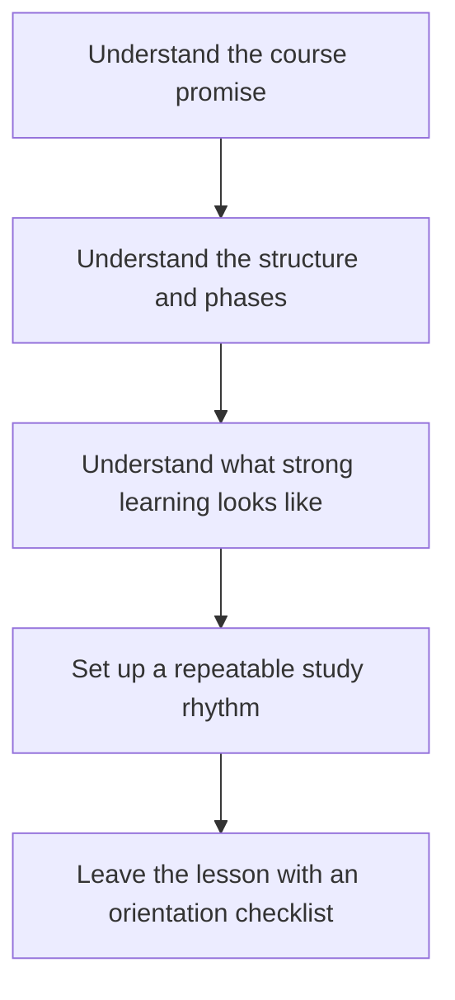
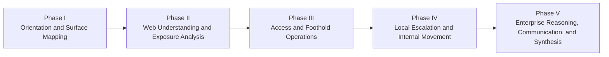

<div align="center">

**Hack the Basics · Phase I**

`Module 01 · Orientation and Assessment Workflow`

</div>

# Lesson 1.1 — What Hack the Basics Is and How to Learn Through It

---

> **🎯 Lesson Objective**
>
> By the end of this lesson, we will understand what `Hack the Basics` is trying to teach, how the course is meant to be used, and what learner success looks like if we treat the material as a workflow-training system instead of a pile of tips.

| **Course** | **Module** | **Lesson** | **Estimated Time** | **Difficulty** |
|---|---|---|---:|---|
| Hack the Basics | Module 01 — Orientation and Assessment Workflow | 1.1 — What Hack the Basics Is and How to Learn Through It | 30–45 min | Beginner |

| **Prerequisites** | **You will practice** | **Main outcome** |
|---|---|---|
| Basic command-line comfort and willingness to learn carefully | Reading the course as a progression, setting expectations, and starting an orientation checklist | A realistic mental model for how to study and practice through the repository |

> **🚨 Important**
>
> This lesson is not filler.
> It defines how the learner should approach the entire course.
> If this part is skipped, later modules are much easier to misuse as disconnected tool notes.

---

## Table of Contents

- [Lesson Map](#lesson-map)
- [Why This Lesson Matters](#why-this-lesson-matters)
- [Learning Objectives](#learning-objectives)
- [The Practical Problem This Lesson Solves](#the-practical-problem-this-lesson-solves)
- [What Hack the Basics Is Actually Trying to Teach](#what-hack-the-basics-is-actually-trying-to-teach)
- [What This Course Is Not](#what-this-course-is-not)
- [How the Course Is Structured](#how-the-course-is-structured)
- [Why Workflow-First Learning Matters So Much](#why-workflow-first-learning-matters-so-much)
- [What Learner Success Looks Like Here](#what-learner-success-looks-like-here)
- [How to Move Through a Module the Right Way](#how-to-move-through-a-module-the-right-way)
- [How to Study Self-Paced Without Losing Structure](#how-to-study-self-paced-without-losing-structure)
- [What Artifacts You Should Leave Behind](#what-artifacts-you-should-leave-behind)
- [Your Initial Orientation Checklist](#your-initial-orientation-checklist)
- [A Practical Learning Rhythm for This Course](#a-practical-learning-rhythm-for-this-course)
- [Walkthrough 1: Reading the Repo Like a Course Instead of a Notes Dump](#walkthrough-1-reading-the-repo-like-a-course-instead-of-a-notes-dump)
- [Walkthrough 2: Turning One Lesson Into Notes and a Reusable Artifact](#walkthrough-2-turning-one-lesson-into-notes-and-a-reusable-artifact)
- [Stop and Think](#stop-and-think)
- [Common Mistakes and Misconceptions](#common-mistakes-and-misconceptions)
- [Defender’s View](#defenders-view)
- [Key Takeaways](#key-takeaways)
- [Knowledge Check Quiz](#knowledge-check-quiz)
- [Quiz Answers](#quiz-answers)
- [Mini Practice Task](#mini-practice-task)
- [Next Lesson Bridge](#next-lesson-bridge)
- [End-of-Lesson Recap](#end-of-lesson-recap)

---

## Lesson Map



> **💡 Tip**
>
> The course is designed to be used like a guided operating system for assessment work.
> Read it that way from the start.

---

## Why This Lesson Matters

When learners start a new offensive security course, they often carry one of two bad assumptions:

- “I should collect commands as fast as possible.”
- “I’ll understand the workflow later once I know more tools.”

Both assumptions fail.

If the learner starts with command collection alone, they usually end up with:

- poor sequencing
- weak note quality
- shallow confidence
- lots of copied syntax with weak interpretation

This lesson matters because it reorients the learner toward a better goal:

> becoming someone who can explain why the current step exists, what evidence it produced, and what the next step should be

That is the standard the whole course is built around.

---

## Learning Objectives

By the end of this lesson, we should be able to:

- explain what `Hack the Basics` is designed to teach
- describe how the phases and modules fit together
- define what learner success looks like in this course
- use a better self-paced study rhythm
- identify the habits that will make later modules work better
- leave behind an orientation checklist instead of a vague first impression

---

## The Practical Problem This Lesson Solves

Suppose a learner opens the repository and immediately clicks into a later module.

They may find:

- commands
- labs
- worksheets
- route maps
- scan workflows

But without a strong orientation, they may not know:

- why the course is ordered this way
- what they should preserve while working
- how lessons and artifacts are meant to interact
- what makes a practice session successful

Lesson 1.1 solves that by answering:

- what kind of repository this is
- how it is meant to be used
- how to avoid learning it badly

---

## What Hack the Basics Is Actually Trying to Teach

At the highest level, this course teaches offensive security as a progression of thinking.

That means:

- workflow before tool fixation
- evidence before assumption
- repeatable practice before one-off tricks
- clear reasoning before hype

### The course promise in plain language

By the end of the course, the learner should be able to move through a realistic lab assessment and explain:

- what they observed
- what they inferred
- what they validated
- why the next step made sense

That is a much higher standard than:

- “I ran the tool”
- “I got a shell once”
- “I remember the flag”

> **🧠 Mental Model**
>
> The real subject of the course is not “tools.”
> The real subject is how technical work becomes meaningful through sequence, evidence, and decision-making.

---

## What This Course Is Not

Understanding the boundaries matters almost as much as understanding the promise.

This course is not meant to be:

- an instant-hacker shortcut repo
- a loose exploit catalog
- a red-team tradecraft specialization
- a random collection of commands
- a replacement for legal authorization and lab safety

That matters because learners often sabotage themselves by expecting the wrong product.

If you expect:

- instant exploitation
- no repetition
- no notes
- no workflow discipline

then this course will feel slower than it is.

In reality, it is simply structured.

---

## How the Course Is Structured

The course follows one large workflow arc.



### Why that matters

This structure keeps the learner from trying to understand exploitation before they can map the environment.

It also means every module should answer:

- why it appears here
- what it builds on
- what it prepares next

Once you understand that, the repo stops feeling like a folder tree and starts feeling like a designed curriculum.

---

## Why Workflow-First Learning Matters So Much

A learner can memorize commands quickly and still perform weakly in a real assessment flow.

Why?
Because real work requires answering:

- what phase am I in?
- what question am I asking?
- what evidence would count?
- what should happen next?

Tool-first learning tends to hide those questions.

Workflow-first learning makes them unavoidable.

### Example

Tool-first mindset:

```text
I need to run Nmap because that is what people do first.
```

Workflow-first mindset:

```text
I need to establish what hosts are reachable from this position so I can map the visible surface deliberately.
```

The tool may be the same later.
The thinking is much stronger.

---

## What Learner Success Looks Like Here

This course treats success differently than many beginner resources do.

### Weak success metric

- finished the lesson
- copied the command
- solved the box somehow

### Strong success metric

- can explain the current phase
- can describe what evidence was collected
- can separate direct observation from inference
- left behind reusable notes or artifacts
- knows what should happen next and why

| Weak outcome | Strong outcome |
|---|---|
| “I got through it.” | “I can explain the workflow and reproduce it.” |
| “I copied the syntax.” | “I understand what question the syntax was answering.” |
| “I solved one practice target.” | “I built a habit that transfers to the next module.” |

---

## How to Move Through a Module the Right Way

The module structure is intentional.

### On a first pass

1. Read the README first.
2. Work through the lessons in order.
3. Keep the reference artifact nearby.
4. Use the worksheet or template while reading, not after.
5. Finish with the lab or guided exercise.

### On later passes

- jump to the reference cheat sheet
- revisit the specific lesson where your understanding feels weak
- use the artifacts during practice instead of rebuilding them from memory every time

This pattern matters because the repo is designed to work in two modes:

- as a course
- as a later reference system

---

## How to Study Self-Paced Without Losing Structure

Self-paced learning often fails when learners try to replace structure with mood.

That usually sounds like:

- “I’ll just explore whatever feels interesting.”
- “I’ll do the lab later.”
- “I don’t need notes yet.”

The better approach is simpler and stricter.

### Strong self-paced habits

- keep lessons in sequence on the first pass
- write short notes during reading
- capture exact nouns, outputs, and questions
- revisit unclear sections before moving ahead
- treat artifacts as working tools, not bonus files

> **🚨 Important**
>
> Self-paced does not mean unstructured.
> In this course, the sequence itself is part of the teaching.

---

## What Artifacts You Should Leave Behind

The course expects visible outputs from your learning.

Examples include:

- note templates
- scan worksheets
- route maps
- service triage sheets
- wordlists
- report stubs

In Module 01, the first artifacts are simpler but just as important:

- a workspace layout
- a VM inventory
- a lifecycle map
- a first note-taking structure

Those become the foundation for later work.

---

## Your Initial Orientation Checklist

Use this checklist before moving on.

### Course understanding

- I can explain what the course is trying to teach.
- I understand that workflow matters more than random tool use.
- I understand that the modules are sequenced on purpose.

### Learning approach

- I will read modules in order on the first pass.
- I will use the artifacts while learning, not only later.
- I will keep notes that separate observation from inference.

### Lab readiness

- I know that Module 01 will define the VMware-based lab baseline.
- I am prepared to document my VM roles and note structure.
- I understand that safe, legal lab use is mandatory.

### Evidence discipline

- I know vague notes are not enough.
- I know reusable evidence matters more than terminal memory.
- I know later modules depend on the habits I build now.

---

## A Practical Learning Rhythm for This Course

You do not need an elaborate study system.
You need a consistent one.

### A workable rhythm

1. Read the lesson.
2. Write three to five lines of notes.
3. Update the relevant artifact.
4. Do the mini practice.
5. Record one sentence on what should come next.

### Why this works

It forces:

- active reading
- note reuse
- better transitions between lessons
- stronger recall later

---

## Walkthrough 1: Reading the Repo Like a Course Instead of a Notes Dump

A weak way to read the repo:

- search for the tool you want
- skip the surrounding modules
- copy whatever looks useful

A stronger way:

1. open the module README
2. understand the module’s role
3. read the lessons in order
4. use the reference artifact
5. complete the lab or guided exercise

The second approach gives the learner both understanding and structure.

---

## Walkthrough 2: Turning One Lesson Into Notes and a Reusable Artifact

Suppose you finish a lesson and only remember:

- “that was useful”

That is not enough.

A stronger close-out looks like:

```text
Lesson:
What phase or workflow job it taught:
Three exact ideas I want to keep:
One artifact I updated:
One question I still have:
What should come next:
```

This is the kind of habit that makes the course cumulative instead of disposable.

---

## Stop and Think

> **🛠 Practice**
>
> Before reading on, answer these in your own notes:
>
> 1. What is this course trying to teach that a loose notes repo would not?
> 2. What would weak learner success look like here?
> 3. What artifact or habit from Module 01 will probably matter most later?

<details>
<summary><strong>Possible answer</strong></summary>

1. The course teaches a sequence of reasoning, evidence, and next-step decisions rather than disconnected commands.
2. Weak success would be copying syntax without understanding phase, purpose, or evidence quality.
3. A consistent note and evidence habit will likely matter most because every later module depends on it.

</details>

---

## Common Mistakes and Misconceptions

### Mistake 1: Treating the intro module like skippable setup

It defines the whole operating model of the course.

### Mistake 2: Expecting instant exploitation

The course is structured to build understanding before later tactics.

### Mistake 3: Reading passively without leaving artifacts

If nothing reusable remains after a lesson, the learner is leaving value behind.

### Mistake 4: Using the repo like search results

The course is designed sequentially.
Search is useful later, not as the first learning strategy.

### Mistake 5: Thinking structure slows progress

In practice, structure prevents relearning the same basics badly.

---

## Defender’s View

Even though this is an offensive security course, defenders benefit from the same mindset:

- clear workflows
- disciplined evidence handling
- better note quality
- stronger phase awareness

The first lesson is really about professional technical work, not just offensive workflow.

---

## Key Takeaways

- `Hack the Basics` teaches workflow, evidence, and reasoning, not just tools.
- The repo is structured intentionally and should be read that way.
- Strong learning in this course produces reusable artifacts and cleaner next-step decisions.
- Module 01 matters because it defines how the whole course should be used.
- A disciplined self-paced rhythm is part of the curriculum, not a side concern.

---

## Knowledge Check Quiz

### 1. What is the strongest summary of what this course is trying to teach?

A. Fast command memorization
B. A progression of workflow, evidence, and decision-making across an assessment
C. Only web exploitation
D. Random box-solving tricks

### 2. Which of the following best matches learner success in this course?

A. “I remember some flags.”
B. “I copied the syntax.”
C. “I can explain what I observed, what I inferred, and why the next step makes sense.”
D. “I skipped the first module.”

### 3. Why should a learner read modules in order on a first pass?

A. Because the repo search is broken
B. Because the sequence itself teaches prerequisites and transitions
C. Because later modules are always easier
D. Because labs never matter

### 4. Which habit is most aligned with this course?

A. Treat artifacts as optional extras
B. Keep vague notes to save time
C. Use a repeatable read -> note -> artifact -> practice rhythm
D. Skip intros and jump to tools

### 5. Why does Module 01 belong at the start?

A. It delays the interesting work
B. It defines the workflow, expectations, and habits that later technical modules depend on
C. It teaches final reporting only
D. It replaces the rest of the course

---

## Quiz Answers

### 1. Correct answer: B

The course is fundamentally about structured technical thinking across an assessment workflow.

### 2. Correct answer: C

That matches the core course promise directly.

### 3. Correct answer: B

The repo is intentionally sequenced, and that sequence does real instructional work.

### 4. Correct answer: C

The course is built around repeatable workflow habits and reusable outputs.

### 5. Correct answer: B

Module 01 establishes the foundation the rest of the course assumes.

---

## Mini Practice Task

Open your notes and write:

1. one sentence explaining what this course is trying to teach
2. three habits you will commit to using in later modules
3. one reason you should not skip Module 01

Keep it short, but make it specific.

---

## Next Lesson Bridge

Now that we understand how the course should be used, we need the course-wide workflow model that all later modules will reuse:

- where an assessment starts
- what each phase is trying to produce
- how work moves from first contact to final deliverable

That is the job of [Lesson 1.2](module-01-lesson-1-2-the-assessment-lifecycle-from-first-contact-to-final-deliverable.md).

---

## End-of-Lesson Recap

Lesson 1.1 established the first mental model of the course:

- this is a workflow-first curriculum
- the sequence matters
- learner success is measured by reasoning and reusable outputs
- artifacts are part of the teaching
- Module 01 exists to shape how every later lesson will be read and practiced

With that orientation in place, the next step is to learn the assessment lifecycle that the whole course is built around.
