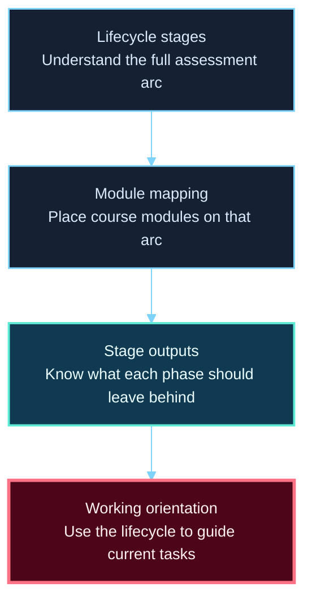

**Hack the Basics · Phase I**

`Module 01 · Orientation and Assessment Workflow`

# Lesson 1.2 — The Assessment Lifecycle from First Contact to Final Deliverable

---

> **🎯 Lesson Objective**
>
> By the end of this lesson, we will understand the assessment lifecycle as the course-wide operating model so later lessons feel like connected stages of one larger workflow rather than unrelated technical topics.

| **Course** | **Module** | **Lesson** | **Estimated Time** | **Difficulty** |
|---|---|---|---:|---|
| Hack the Basics | Module 01 — Orientation and Assessment Workflow | 1.2 — The Assessment Lifecycle from First Contact to Final Deliverable | 35–50 min | Beginner |

| **Prerequisites** | **You will practice** | **Main outcome** |
|---|---|---|
| Lesson 1.1 or equivalent understanding of the course promise | Mapping activities to phases, identifying expected outputs, and connecting current work to later work | A practical lifecycle model the learner can reuse through the whole course |

> **🚨 Important**
>
> The assessment lifecycle is not abstract project management.
> It is the mental map that keeps later technical work organized, prioritized, and interpretable.

---

## Table of Contents

- [Lesson Map](#lesson-map)
- [Why This Lesson Matters](#why-this-lesson-matters)
- [Learning Objectives](#learning-objectives)
- [The Practical Problem This Lesson Solves](#the-practical-problem-this-lesson-solves)
- [What We Mean by an Assessment Lifecycle](#what-we-mean-by-an-assessment-lifecycle)
- [Why Technical Learners Need a Lifecycle Model Early](#why-technical-learners-need-a-lifecycle-model-early)
- [The Six Lifecycle Stages in This Course](#the-six-lifecycle-stages-in-this-course)
- [Stage 1: Orientation](#stage-1-orientation)
- [Stage 2: Surface Mapping](#stage-2-surface-mapping)
- [Stage 3: Service and Application Understanding](#stage-3-service-and-application-understanding)
- [Stage 4: Validation and Access](#stage-4-validation-and-access)
- [Stage 5: Post-Access and Expansion](#stage-5-post-access-and-expansion)
- [Stage 6: Reporting and Close-Out](#stage-6-reporting-and-close-out)
- [How Modules Map Onto the Lifecycle](#how-modules-map-onto-the-lifecycle)
- [Why the Lifecycle Is Not Strictly Linear](#why-the-lifecycle-is-not-strictly-linear)
- [What Each Stage Should Leave Behind](#what-each-stage-should-leave-behind)
- [A Practical Phase-Mapping Workflow](#a-practical-phase-mapping-workflow)
- [Walkthrough 1: Placing Module 02 in the Larger Workflow](#walkthrough-1-placing-module-02-in-the-larger-workflow)
- [Walkthrough 2: Why Reporting Starts Before the Final Module](#walkthrough-2-why-reporting-starts-before-the-final-module)
- [Stop and Think](#stop-and-think)
- [Common Mistakes and Misconceptions](#common-mistakes-and-misconceptions)
- [Defender’s View](#defenders-view)
- [Key Takeaways](#key-takeaways)
- [Knowledge Check Quiz](#knowledge-check-quiz)
- [Quiz Answers](#quiz-answers)
- [Mini Practice Task](#mini-practice-task)
- [Next Lesson Bridge](#next-lesson-bridge)
- [End-of-Lesson Recap](#end-of-lesson-recap)

---

## Lesson Map

> **💡 Tip**
>
> When a learner gets lost in a technical module, one of the fastest recovery questions is:
> “What phase of the assessment am I in right now?”

---

## Why This Lesson Matters

Without a lifecycle model, technical learning becomes fragmented.

The learner may understand:

- scanning
- web routes
- auth surfaces
- footholds

but still fail to understand how those things fit together in real work.

That creates common problems:

- random sequencing
- weak prioritization
- poor handoffs between modules
- confusion about what “success” looks like in the current phase

This lesson matters because it prevents later modules from feeling like isolated skill islands.

---

## Learning Objectives

By the end of this lesson, we should be able to:

- explain what an assessment lifecycle is and why it matters
- describe the six major lifecycle stages used in this course
- map modules and activities onto the correct phase
- explain what outputs each phase should leave behind
- recognize that phases can loop without becoming random
- use the lifecycle to orient current and future work

---

## The Practical Problem This Lesson Solves

Imagine a learner says:

> “I know how to run some scans and I know some web basics, but I’m not sure how an assessment is supposed to flow.”

That is a real problem.

Because once the learner is unsure about the flow, they also become unsure about:

- what to do first
- what to save
- what to prioritize
- what can wait
- what the current activity is trying to produce

Lesson 1.2 solves that by giving the learner a durable structure:

- a phase model
- a set of guiding questions
- a way to place every later module inside the same larger assessment story

---

## What We Mean by an Assessment Lifecycle

An assessment lifecycle is the sequence of phases that turns technical actions into a coherent engagement.

It includes:

- orientation
- visibility building
- deeper interpretation
- controlled validation
- post-access work
- reporting and communication

This matters because an action changes meaning depending on where it sits in the lifecycle.

### Example

Opening a route map during early recon means:

- building visibility

Opening a route map after a foothold may mean:

- correlating internal and external access paths

The artifact can be similar.
The phase gives it purpose.

---

## Why Technical Learners Need a Lifecycle Model Early

Beginners often want to delay “workflow thinking” until after they know more technical detail.

That is backwards.

The lifecycle helps you decide:

- what technical detail matters now
- what should be recorded
- what belongs later
- why a module appears where it does

> **🧠 Mental Model**
>
> The lifecycle is the course’s spine.
> Modules are attached to that spine.
> Without it, the curriculum turns back into a pile of parts.

---

## The Six Lifecycle Stages in This Course

```mermaid
%%{init: {"theme":"base","flowchart":{"curve":"basis","htmlLabels":true},"themeVariables":{"primaryTextColor":"#e8f0ff","lineColor":"#7dd3fc","fontSize":"14px"}}}%%
flowchart LR
    O["1. Orientation<br/>Environment, scope, constraints"] --> S["2. Surface Mapping<br/>What is visible and reachable?"]
    S --> U["3. Service and App Understanding<br/>What does the exposed surface mean?"]
    U --> V["4. Validation and Access<br/>What deserves direct testing next?"]
    V --> P["5. Post-Access and Expansion<br/>What changed after access?"]
    P --> R["6. Reporting and Close-Out<br/>What evidence must survive?"]

    classDef orientation fill:#0f3a52,stroke:#5eead4,color:#ecfeff,stroke-width:3px;
    classDef mapping fill:#1e3a8a,stroke:#60a5fa,color:#eff6ff,stroke-width:2.5px;
    classDef understanding fill:#312e81,stroke:#a78bfa,color:#f5f3ff,stroke-width:2.5px;
    classDef validation fill:#78350f,stroke:#fbbf24,color:#fffbeb,stroke-width:2.5px;
    classDef postaccess fill:#4c0519,stroke:#fb7185,color:#fff1f2,stroke-width:2.5px;
    classDef reporting fill:#334155,stroke:#cbd5e1,color:#f8fafc,stroke-width:2.5px;

    class O orientation;
    class S mapping;
    class U understanding;
    class V validation;
    class P postaccess;
    class R reporting;
```

Each stage asks a different question.
That is the simplest way to keep them straight.

---

## Stage 1: Orientation

### Main question

What is the environment, what is authorized, and what constraints define the work?

### Typical tasks

- reading scope
- identifying the lab environment
- setting up the workspace
- defining note structure
- clarifying assumptions

### Typical outputs

- scope note
- VM inventory
- workspace layout
- lifecycle awareness

This is where Module 01 starts.

---

## Stage 2: Surface Mapping

### Main question

What is visible and reachable from this position?

### Typical tasks

- host discovery
- port scanning
- first-pass web target confirmation
- basic route and service identification

### Typical outputs

- target lists
- open-port notes
- first route maps
- saved scan artifacts

Modules 02 and parts of 04 live heavily here.

---

## Stage 3: Service and Application Understanding

### Main question

What do the visible services, routes, and application clues probably mean?

### Typical tasks

- service-role interpretation
- host-role reasoning
- web surface classification
- triage and prioritization

### Typical outputs

- host-role notes
- service triage queues
- application surface maps
- route classifications

Module 03 and Module 04 both deepen this stage.

---

## Stage 4: Validation and Access

### Main question

What deserves direct testing, controlled validation, or authenticated interaction next?

### Typical tasks

- auth flow analysis
- controlled proxy work
- hidden content discovery
- vulnerability testing
- common service attack-path validation

### Typical outputs

- testing queues
- credential hypotheses
- validated routes
- footholds

This stage spans multiple later modules because it includes both web and non-web validation.

---

## Stage 5: Post-Access and Expansion

### Main question

What changed after access, and what new visibility or privilege paths now exist?

### Typical tasks

- local enumeration
- privilege escalation reasoning
- internal movement
- pivoting
- post-foothold note refinement

### Typical outputs

- privilege path notes
- pivot maps
- post-access artifacts
- expanded environment understanding

Later Linux, Windows, pivoting, and AD modules live here.

---

## Stage 6: Reporting and Close-Out

### Main question

What evidence, decisions, and findings need to survive beyond the technical session?

### Typical tasks

- organizing notes
- drafting findings
- preserving timelines
- describing impact carefully
- closing the loop on what was validated

### Typical outputs

- report-ready evidence
- findings drafts
- timelines
- capstone deliverables

This stage appears explicitly later, but it begins much earlier than learners expect.

---

## How Modules Map Onto the Lifecycle

The lifecycle is not identical to module numbers, but the mapping is strong enough to be useful.

| Lifecycle stage | Modules that strongly support it |
|---|---|
| Orientation | Module 01 |
| Surface Mapping | Modules 02 and early Module 04 |
| Service and App Understanding | Modules 03-04 |
| Validation and Access | Modules 05-10 |
| Post-Access and Expansion | Modules 11-14 |
| Reporting and Close-Out | Modules 15-16, supported by earlier evidence habits |

This is why the course order matters.

---

## Why the Lifecycle Is Not Strictly Linear

Real assessments loop.

You may:

- scan
- interpret
- test
- discover something new
- return to scanning or mapping

That does not mean the lifecycle is useless.
It means it is iterative.

### Strong interpretation

- “I am looping back into surface mapping because new evidence changed what is visible.”

### Weak interpretation

- “The workflow is random, so I’ll just do whatever next.”

The lifecycle gives those loops meaning instead of chaos.

---

## What Each Stage Should Leave Behind

Strong technical work leaves artifacts at every stage.

| Stage | Minimum useful artifact |
|---|---|
| Orientation | scope note and workspace structure |
| Surface Mapping | saved outputs and target lists |
| Service/App Understanding | triage notes and route or service maps |
| Validation and Access | test queue and validated observations |
| Post-Access and Expansion | privilege or pivot notes |
| Reporting and Close-Out | report-ready evidence and findings drafts |

This is a good reminder that later reporting quality starts with earlier note quality.

---

## A Practical Phase-Mapping Workflow

When you start any later task, ask:

1. What phase of the lifecycle does this belong to?
2. What question is this phase trying to answer?
3. What artifact should this phase leave behind?
4. What later phase will depend on that artifact?

This simple workflow will help keep the entire course coherent.

---

## Walkthrough 1: Placing Module 02 in the Larger Workflow

Suppose a learner asks:

> “Where does Nmap fit?”

The strongest answer is not:

- “early”

The stronger answer is:

- Module 02 mainly supports surface mapping
- it helps us learn what is visible and reachable
- its artifacts become inputs to later service interpretation and web recon

That is lifecycle thinking in practice.

---

## Walkthrough 2: Why Reporting Starts Before the Final Module

A common beginner mistake is to think reporting only begins in the final modules.

In reality:

- if you do not preserve evidence early
- if you do not separate observation from inference
- if you do not record timestamps or exact outputs

then final reporting quality is already damaged.

This is why lifecycle thinking matters from Module 01 onward.

---

## Stop and Think

> **🛠 Practice**
>
> Before reading on, answer:
>
> 1. Which lifecycle stage does Module 02 primarily support?
> 2. Which lifecycle stage becomes stronger if you keep better notes in Module 01?
> 3. What artifact should orientation leave behind that later modules depend on?

<strong>Possible answer</strong>

1. Module 02 primarily supports surface mapping.
2. Reporting and close-out become much stronger when early notes are disciplined.
3. Orientation should leave behind a scope note, workspace structure, and clear lab inventory.

---

## Common Mistakes and Misconceptions

### Mistake 1: Treating the lifecycle as abstract theory

It is a practical map for organizing the technical work.

### Mistake 2: Assuming reporting only matters at the end

Good reporting begins with early evidence discipline.

### Mistake 3: Thinking loops invalidate the lifecycle

Loops are normal; the lifecycle still provides structure.

### Mistake 4: Using phases as labels without outputs

Every phase should leave behind something usable.

### Mistake 5: Forgetting that module order is tied to workflow order

The curriculum sequence mirrors lifecycle dependency on purpose.

---

## Defender’s View

Lifecycle thinking matters defensively too.

Defenders also benefit from knowing:

- where they are in an investigation
- what evidence should exist at each stage
- how early note quality affects final conclusions

This is another reminder that disciplined technical reasoning transfers across roles.

---

## Key Takeaways

- The assessment lifecycle is the course-wide operating model.
- Each stage asks a different question and should leave behind distinct outputs.
- Modules are easier to understand when mapped to the lifecycle.
- Real assessments loop, but they do not become random.
- Strong early evidence handling improves later reporting and decision-making.

---

## Knowledge Check Quiz

### 1. What is the main value of the assessment lifecycle in this course?

A. It replaces technical skill
B. It provides a structure that makes technical tasks meaningful and connected
C. It only matters in the capstone
D. It is just project-management vocabulary

### 2. Which stage most directly asks, “What is visible and reachable from here?”

A. Orientation
B. Surface Mapping
C. Reporting and Close-Out
D. Post-Access and Expansion

### 3. Why is the lifecycle still useful even though real assessments loop?

A. Because loops never happen
B. Because loops still occur inside a meaningful phase model instead of pure randomness
C. Because later modules ignore earlier ones
D. Because reports write themselves

### 4. Which artifact best fits the orientation stage?

A. final findings draft
B. reverse shell log
C. scope note and workspace inventory
D. privilege escalation chain

### 5. Why does reporting effectively begin early?

A. Because early evidence and notes determine what can be trusted later
B. Because Module 15 appears before Module 02
C. Because reporting replaces testing
D. Because screenshots alone are enough

---

## Quiz Answers

### 1. Correct answer: B

The lifecycle connects tasks, outputs, and decisions across the full assessment.

### 2. Correct answer: B

Surface mapping is where reachability and visibility are built deliberately.

### 3. Correct answer: B

The workflow may loop, but the loop still has phase context and purpose.

### 4. Correct answer: C

Orientation should leave behind scope, environment, and workflow structure.

### 5. Correct answer: A

Late reporting quality depends heavily on early evidence quality.

---

## Mini Practice Task

Use the [assessment lifecycle map](../references/module-01-assessment-lifecycle-map.md) and write:

1. which phase you think Module 02 belongs to
2. one artifact that phase should produce
3. one later phase that depends on that artifact

Keep it to three or four lines.

---

## Next Lesson Bridge

Now that we have the lifecycle model, we need the rules that keep the learner safe, authorized, and organized inside the lab:

- scope
- rules of engagement
- VM discipline
- evidence handling

That is the job of [Lesson 1.3](module-01-lesson-1-3-scope-rules-of-engagement-and-lab-discipline.md).

---

## End-of-Lesson Recap

Lesson 1.2 gave the course a durable operating map.

We now know:

- what the major lifecycle stages are
- what questions they ask
- what artifacts they should leave behind
- how later modules fit into the larger flow

The next step is to make that workflow safe and usable inside an actual lab environment.
