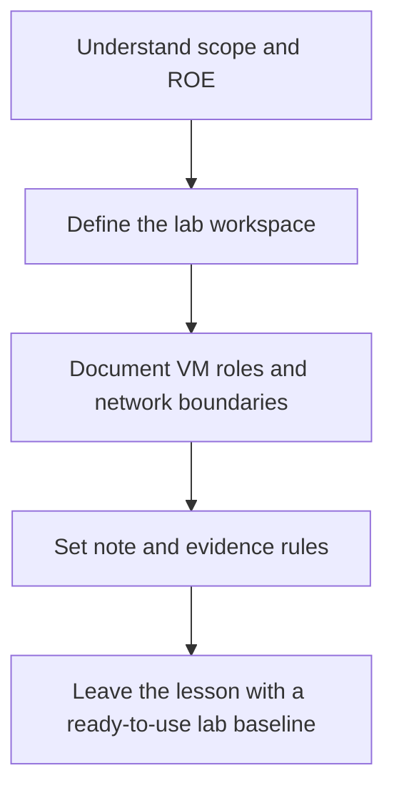
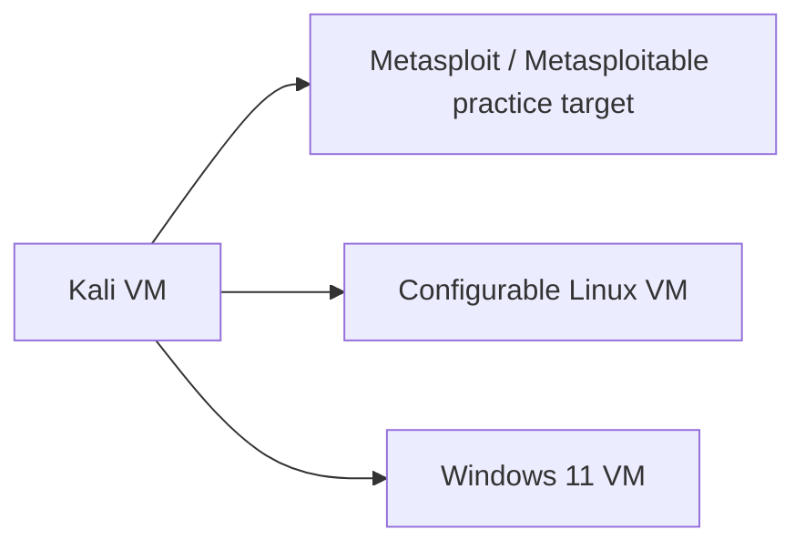
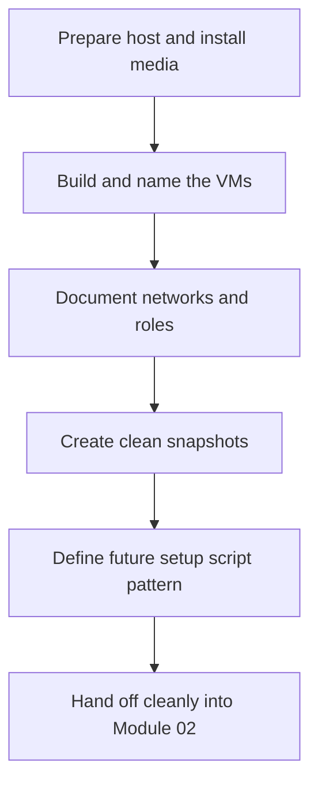

<div align="center">

**Hack the Basics · Phase I**

`Module 01 · Orientation and Assessment Workflow`

</div>

# Lesson 1.3 — Scope, Rules of Engagement, and Lab Discipline

---

> **🎯 Lesson Objective**
>
> By the end of this lesson, we will understand how to work inside a legal lab with clear scope, safer operational habits, and a documented VMware-based workspace that a beginner can build step by step and reset cleanly for later labs.

| **Course** | **Module** | **Lesson** | **Estimated Time** | **Difficulty** |
|---|---|---|---:|---|
| Hack the Basics | Module 01 — Orientation and Assessment Workflow | 1.3 — Scope, Rules of Engagement, and Lab Discipline | 45–65 min | Beginner |

| **Prerequisites** | **You will practice** | **Main outcome** |
|---|---|---|
| Lessons 1.1-1.2, willingness to work carefully in legal labs | Defining scope, documenting environment boundaries, and turning the VMware lab into a reusable workspace | A safer, clearer, step-by-step lab setup and evidence discipline before technical enumeration begins |

> **🚨 Important**
>
> Technical curiosity does not override authorization.
> This lesson treats scope and lab discipline as part of technical competence, not as legal fine print.

---

## Table of Contents

- [Lesson Map](#lesson-map)
- [Why This Lesson Matters](#why-this-lesson-matters)
- [Learning Objectives](#learning-objectives)
- [The Practical Problem This Lesson Solves](#the-practical-problem-this-lesson-solves)
- [What Scope Really Means in Practice](#what-scope-really-means-in-practice)
- [Rules of Engagement for a Learner Lab](#rules-of-engagement-for-a-learner-lab)
- [Why Lab Discipline Is a Technical Skill](#why-lab-discipline-is-a-technical-skill)
- [The Course Lab Baseline in VMware Workstation Pro](#the-course-lab-baseline-in-vmware-workstation-pro)
- [The Beginner Build Goal: Remove Friction Before the Real Work Starts](#the-beginner-build-goal-remove-friction-before-the-real-work-starts)
- [Step-by-Step Lab Build Order](#step-by-step-lab-build-order)
- [Step 1: Prepare the Host and the Install Media](#step-1-prepare-the-host-and-the-install-media)
- [Step 2: Create the Naming Convention Before the Machines](#step-2-create-the-naming-convention-before-the-machines)
- [Step 3: Define the Lab Networks First](#step-3-define-the-lab-networks-first)
- [Step 4: Build the Kali VM](#step-4-build-the-kali-vm)
- [Step 5: Build the Metasploit or Metasploitable Practice Target](#step-5-build-the-metasploit-or-metasploitable-practice-target)
- [Step 6: Build the Configurable Linux VM](#step-6-build-the-configurable-linux-vm)
- [Step 7: Build the Windows 11 VM](#step-7-build-the-windows-11-vm)
- [Step 8: Create the Clean Baseline Snapshots](#step-8-create-the-clean-baseline-snapshots)
- [Step 9: Define the Future Setup Script Pattern](#step-9-define-the-future-setup-script-pattern)
- [VM Roles and Why They Exist](#vm-roles-and-why-they-exist)
- [Kali as the Attack and Analysis Workstation](#kali-as-the-attack-and-analysis-workstation)
- [The Metasploit or Metasploitable Practice Target](#the-metasploit-or-metasploitable-practice-target)
- [The Configurable Linux VM](#the-configurable-linux-vm)
- [The Windows-11 VM for Later Modules](#the-windows-11-vm-for-later-modules)
- [Network Layout, Isolation, and Snapshot Discipline](#network-layout-isolation-and-snapshot-discipline)
- [Evidence Handling and Note Hygiene](#evidence-handling-and-note-hygiene)
- [What to Record Before You Touch a Target](#what-to-record-before-you-touch-a-target)
- [Observation vs Inference vs Validation in Lab Setup](#observation-vs-inference-vs-validation-in-lab-setup)
- [A Practical Lab-Readiness Workflow](#a-practical-lab-readiness-workflow)
- [Walkthrough 1: Documenting the VMware Lab Correctly](#walkthrough-1-documenting-the-vmware-lab-correctly)
- [Walkthrough 2: Writing a Usable Scope Note for a Practice Lab](#walkthrough-2-writing-a-usable-scope-note-for-a-practice-lab)
- [Walkthrough 3: Planning for Resettable Lab Setup Scripts](#walkthrough-3-planning-for-resettable-lab-setup-scripts)
- [Stop and Think](#stop-and-think)
- [Common Mistakes and Misconceptions](#common-mistakes-and-misconceptions)
- [Defender’s View](#defenders-view)
- [Key Takeaways](#key-takeaways)
- [Knowledge Check Quiz](#knowledge-check-quiz)
- [Quiz Answers](#quiz-answers)
- [Mini Practice Task](#mini-practice-task)
- [Next Lesson Bridge](#next-lesson-bridge)
- [End-of-Lesson Recap](#end-of-lesson-recap)

---

## Lesson Map



> **💡 Tip**
>
> A disciplined lab makes later modules easier.
> A messy lab makes later modules ambiguous, fragile, and harder to trust.

---

## Why This Lesson Matters

Beginners often think scope and lab setup are secondary details.

In practice, poor discipline here causes problems everywhere else:

- confusing IP and hostname records
- uncertain VM roles
- accidental cross-network mistakes
- lost evidence
- broken trust in later findings

This lesson matters because the learner’s workspace becomes part of the technical workflow.

If the workspace is unclear, then:

- scan outputs become harder to interpret
- screenshots lose context
- service-role notes drift
- later reporting quality drops

---

## Learning Objectives

By the end of this lesson, we should be able to:

- explain what scope and rules of engagement mean in a learner lab
- describe the course’s VMware Workstation Pro lab baseline
- document the roles of Kali, the Metasploit or Metasploitable practice target, the Linux VM, and the Windows 11 VM
- explain why isolation, snapshots, and network notes matter
- preserve stronger evidence and note hygiene
- leave behind a usable scope note and lab inventory

---

## The Practical Problem This Lesson Solves

Suppose a learner says:

- “I have some VMs”
- “I think one is Kali”
- “I’m not sure which network they’re on”
- “I can just remember the details later”

That may sound manageable in the moment.
But once later modules begin, it becomes a serious problem.

The learner may no longer know:

- which host was intended to be attacked
- which VM was supposed to act as infrastructure versus a target
- which IP was captured from which network
- whether a change was made before or after a snapshot

Lesson 1.3 fixes that by turning lab setup into a documented part of the assessment workflow.

---

## What Scope Really Means in Practice

Scope means the boundaries of what you are authorized to touch and how.

In a learner lab, that still matters.

### Scope includes

- which VMs are part of the lab
- what network segments are allowed
- what actions are acceptable in that environment
- what systems are intentionally excluded

### Why this matters even at home

Because “it’s my machine” is not the same as “every connected thing is part of the lab.”

The habit we want is:

> always know what environment you are standing in before you act

---

## Rules of Engagement for a Learner Lab

Rules of engagement in a training lab are often simpler than in a real engagement, but they still exist.

Examples include:

- keep intentionally vulnerable targets isolated
- know which networks are host-only versus NAT
- avoid blending lab and non-lab traffic carelessly
- snapshot before major changes
- record credentials and configuration changes in one place

### Strong ROE thinking

- “I know what this VM is for.”
- “I know what network this action is happening on.”
- “I know why this action belongs here.”

### Weak ROE thinking

- “I’ll figure out the topology later.”
- “I think this IP is the right one.”
- “It is probably fine because this is only practice.”

---

## Why Lab Discipline Is a Technical Skill

Lab discipline is not separate from technical skill.

It improves:

- output trustworthiness
- repeatability
- troubleshooting
- later note quality
- transition between modules

### Example

If you know:

- which snapshot was taken before enabling a service
- which network the VM lived on
- what the VM’s role was supposed to be

then later scan results become easier to interpret and repeat.

That is a technical advantage, not just cleanliness.

---

## The Course Lab Baseline in VMware Workstation Pro

This course assumes a learner workspace built in VMware Workstation Pro.

### Core lab components

| Component | Role in the course |
|---|---|
| VMware Workstation Pro | host platform for managing the lab |
| Kali VM | primary attack, analysis, and operator workstation |
| Metasploit or Metasploitable-style target | intentionally vulnerable practice target |
| Basic Linux VM | configurable Linux target for services and later Linux labs |
| Windows 11 VM | Windows and future AD-adjacent learning platform |

### Why this baseline works

It gives the learner:

- one clear attacker system
- one intentionally vulnerable target for early repetition
- one flexible Linux target for later service and privilege work
- one Windows system that stays relevant deep into the course

---

## The Beginner Build Goal: Remove Friction Before the Real Work Starts

Because this is a beginner course, the lab should not feel like a separate project you have to survive before learning begins.

The beginner build goal is simple:

- create the machines in a clear order
- give each one a durable name
- put them on an intentional network
- capture the clean baseline state
- make later resets easy

If we do that well, later hands-on modules become much easier to start.

If we do it badly, every later lab inherits avoidable friction.

> **📝 Note**
>
> This lesson is deliberately trying to reduce setup pain.
> The lab should become an enablement system for practice, not a recurring source of confusion.

---

## Step-by-Step Lab Build Order

Use this order unless you have a very good reason not to.

1. Prepare the host and installation media.
2. Choose the naming convention.
3. Define the lab networks.
4. Build Kali.
5. Build the intentionally vulnerable practice target.
6. Build the configurable Linux VM.
7. Build the Windows 11 VM.
8. Create clean baseline snapshots.
9. Define the future setup-script and reset model.

This order works because it gets:

- the attacker machine ready early
- the simplest practice target in place early
- the longer-term Linux and Windows assets ready before later modules need them

---

## Step 1: Prepare the Host and the Install Media

Before opening the “new VM” wizard repeatedly, gather what you need.

### Confirm the host baseline

- VMware Workstation Pro is installed
- you know where the VM files will live
- you have enough disk and memory for the four-VM lab
- you know whether any VM will temporarily need internet access during setup

### Gather the install sources

- Kali installer or prepared Kali image
- a Metasploit or Metasploitable-style practice image
- a Linux distribution image for the configurable Linux VM
- Windows 11 installation media

### Create one parent directory

For example:

```text
hack-the-basics-lab/
  vmware/
  notes/
  exports/
```

This sounds simple, but it reduces later sprawl immediately.

---

## Step 2: Create the Naming Convention Before the Machines

Do this before you create the first VM.

Recommended names:

- `KALI-LAB`
- `META-TGT`
- `LINUX-LAB`
- `WIN11-LAB`

### Why define this first

Because beginners often create VMs named:

- `kali-final`
- `newlinux2`
- `windows-test`

Those names age badly and make later notes harder to trust.

Good names should tell you:

- what the machine is
- what role it plays
- whether it is long-lived or scenario-specific

---

## Step 3: Define the Lab Networks First

Before the VMs are all running, decide how they should connect.

### Beginner-friendly default

- one host-only network for the core lab
- optional NAT only when a machine needs internet during setup or updates
- no unnecessary bridged networking into unrelated networks

### What to record

- VMware network name
- which VMs will share it
- when NAT is temporary versus permanent
- whether any VM should stay isolated from the others for a specific reason

### Why this matters

Later questions like:

- “Why can Kali not see the target?”
- “Why did this IP change?”
- “Was this machine on the lab network or not?”

often trace back to sloppy early network decisions.

---

## Step 4: Build the Kali VM

Build Kali first because it is the learner’s operator position for the rest of the course.

### While creating it, record:

- VM name
- OS version
- CPU and memory choices
- disk location
- network adapter choice
- whether shared folders are enabled

### After first boot, capture:

- hostname
- current IP and interface name
- where notes and outputs will live
- any first configuration changes

### Why Kali comes first

Because the whole lab is easier to reason about when the learner’s standing position is defined early.

---

## Step 5: Build the Metasploit or Metasploitable Practice Target

Build the intentionally vulnerable practice target second.

### Record:

- source image
- hostname
- expected role
- known credentials if relevant
- expected services or product surfaces
- network placement

### Why it comes second

It gives the learner a quick, repeatable target for early scanning and later guided attack-path practice.

This is one of the fastest ways to make the course feel hands-on early.

---

## Step 6: Build the Configurable Linux VM

Build the long-lived Linux lab machine next.

### Record:

- distribution and version
- hostname
- network placement
- baseline users
- what the machine is reserved for later

### Why it matters now

Even if later Linux-focused modules are far away, a clean baseline created early is much easier to preserve than one improvised later under time pressure.

---

## Step 7: Build the Windows 11 VM

Build the Windows 11 VM as part of the baseline rather than waiting until the Windows-heavy modules.

### Record:

- version/build
- hostname
- local accounts
- network placement
- current snapshot plan

### Why build it now

Because the course should feel like one growing lab, not a new environment every few modules.

This also makes the future Windows and AD path feel planned from the start.

---

## Step 8: Create the Clean Baseline Snapshots

Once each machine is installed, named, and minimally documented, create the clean reset points.

Recommended names:

- `kali-clean`
- `meta-clean`
- `linux-clean`
- `win11-clean`

### The purpose of these snapshots

- return to a known state
- support repeated practice
- make future lab setup scripts safe to re-run after a reset

This is one of the most important beginner-friction reducers in the whole module.

If the learner can reset cleanly, they are much more likely to practice repeatedly.

---

## Step 9: Define the Future Setup Script Pattern

The course should eventually support:

- one initial configure script per baseline VM
- later per-lab setup scripts that intentionally change a VM into a lesson-specific scenario

### The intended model

1. revert the VM to the clean baseline snapshot
2. run the lab’s setup script
3. complete the lab
4. revert again when needed

### Why define this now even before scripts exist

Because it shapes how the learner thinks about the lab:

- baseline state matters
- repeatability matters
- later hands-on modules should start quickly

This is the bridge between Module 01 setup discipline and future “lab setup scripts.”

---

## VM Roles and Why They Exist

The lab is easier to use when each VM has a durable job.



### The core rule

Do not let VMs become generic blobs.
If a VM exists, its job should be clear.

---

## Kali as the Attack and Analysis Workstation

Kali is the learner’s primary operator position.

That means it should hold:

- tooling
- notes access
- saved outputs
- the learner’s stable working environment

### Good Kali habits

- keep the machine stable
- record network interfaces and IPs
- know where outputs are saved
- avoid mixing unrelated experiments into the same workspace blindly

Kali is not just “the box with tools.”
It is the place from which evidence is generated and preserved.

---

## The Metasploit or Metasploitable Practice Target

This target exists to give the learner an intentionally vulnerable practice system early in the course.

### Why it matters

- it supports repetition without guesswork
- it provides a safe target for early service and attack-path practice
- it lowers the risk of learners improvising against unclear targets

### What to document

- snapshot state
- services expected to be exposed
- default credentials if relevant
- where it sits on the network

> **📝 Note**
>
> The exact vulnerable VM can vary, but its role should stay consistent: a deliberately unsafe practice target inside an isolated lab.

---

## The Configurable Linux VM

This VM is not only an early target.
It is a flexible platform for later modules.

Examples of later use:

- enabling or disabling services
- changing users and permissions
- creating Linux privilege-escalation scenarios
- hosting small web or service labs

That means your notes should preserve:

- the distro
- major service changes
- user and role changes
- snapshot history

---

## The Windows-11 VM for Later Modules

The Windows 11 VM matters even though its deeper use appears later.

Why build it now?

- it becomes part of the stable lab inventory
- it supports future Windows and AD-related lessons
- it helps the learner think long-term about the environment

### Good notes to keep

- Windows version and build
- local accounts used in the lab
- network placement
- later configuration changes
- snapshot names and reasons

---

## Network Layout, Isolation, and Snapshot Discipline

The lab baseline should be intentionally designed, not improvised.

### Useful questions

- which VMs need host-only networking?
- which VMs need NAT, if any?
- what should stay isolated from the broader environment?
- when should a fresh snapshot be taken?

### Snapshot discipline

Take a snapshot:

- before enabling a major service
- before installing risky software
- before beginning a lab that changes the target state
- before a lesson that may intentionally destabilize the VM

### Why this matters

Snapshots are not just convenience.
They make the lab repeatable.

---

## Evidence Handling and Note Hygiene

Even the lab setup phase should leave behind usable notes.

At minimum, capture:

- VM names
- IPs and hostnames
- network roles
- credentials and access method notes
- snapshots and state changes
- where evidence and outputs will live

Weak note:

```text
Windows VM set up.
```

Strong note:

```text
WIN11-LAB on host-only network VMnet2; snapshot baseline-win11-clean created before service changes; intended for later Windows, auth, and AD-adjacent modules.
```

---

## What to Record Before You Touch a Target

Before later technical work begins, record:

1. what VM or network you are using
2. what its intended role is
3. what is in scope
4. what is excluded
5. what you expect to learn from the next action

This small discipline prevents a surprising amount of later confusion.

---

## Observation vs Inference vs Validation in Lab Setup

This distinction still applies, even here.

### Observation

- Kali and Linux VM are on the same host-only network
- the Windows 11 VM has a clean baseline snapshot
- the Metasploit or Metasploitable target exposes known services

### Inference

- the Kali VM should be able to reach the practice targets directly
- later lessons will be easier to repeat because the baseline is documented

### Validation

- confirm connectivity later in Module 02
- confirm the intended services are actually reachable from the Kali position

This keeps even setup notes technically honest.

---

## A Practical Lab-Readiness Workflow



### Working sequence

1. Prepare the host, files, and install media.
2. Build each VM in a defined order.
3. Assign each VM a durable role and record it.
4. Record network placement and intended isolation.
5. Create the notes workspace.
6. Record the baseline state of each VM.
7. Create the clean reset snapshots.
8. Define where future setup scripts will live.
9. Save the setup so scanning can begin without ambiguity later.

---

## Walkthrough 1: Documenting the VMware Lab Correctly

A weak inventory:

```text
Kali, Linux, Windows, metasploit box.
```

A stronger inventory:

```text
Kali-LAB:
- role: attacker and analysis workstation
- network: VMnet2 host-only

META-TGT:
- role: intentionally vulnerable practice target
- network: VMnet2 host-only
- snapshot: meta-clean

LINUX-LAB:
- role: configurable Linux service and privesc target
- network: VMnet2 host-only
- snapshot: linux-clean

WIN11-LAB:
- role: later Windows and AD-adjacent work
- network: VMnet2 host-only
- snapshot: win11-clean
```

The second version is much more useful when later modules begin.
It also makes future setup script targeting much easier because the VM roles are explicit.

---

## Walkthrough 2: Writing a Usable Scope Note for a Practice Lab

Weak scope note:

```text
Testing local lab VMs.
```

Stronger scope note:

```text
Authorized lab scope:
- Kali-LAB
- META-TGT
- LINUX-LAB
- WIN11-LAB

Purpose:
- practice course workflows inside isolated VMware Workstation Pro lab

Exclusions:
- non-lab home devices
- unrelated host networks
- any external systems not intentionally attached to the course lab
```

That stronger note makes your environment defensible and easier to reason about later.

---

## Walkthrough 3: Planning for Resettable Lab Setup Scripts

You do not need to implement scripts yet to benefit from the pattern.

A strong planning note could look like:

```text
Baseline snapshots:
- kali-clean
- meta-clean
- linux-clean
- win11-clean

Future automation model:
- one baseline configure script per VM
- one per-lab setup script when a module needs intentional state changes
- always revert to clean snapshot before re-running a lab setup script
```

That note makes later automation much easier to design cleanly.

---

## Stop and Think

> **🛠 Practice**
>
> Before reading on, write:
>
> 1. the role of each of your four core VMs
> 2. one network or isolation decision that matters
> 3. one snapshot you should probably create before moving to Module 02

<details>
<summary><strong>Possible answer</strong></summary>

1. Kali is the attack and analysis workstation; the Metasploit or Metasploitable VM is the intentionally vulnerable target; the Linux VM is the configurable Linux target; the Windows 11 VM is the later Windows and AD-adjacent platform.
2. Keeping the core lab on a host-only network matters so intentionally vulnerable targets stay isolated.
3. A clean baseline snapshot for each VM before technical changes begin is a strong starting point.

</details>

---

## Common Mistakes and Misconceptions

### Mistake 1: Treating scope as obvious

If you do not write it down, it often stops being obvious later.

### Mistake 2: Letting VMs exist without durable roles

That makes the lab harder to reuse and harder to interpret.

### Mistake 3: Forgetting network context

Many later technical questions depend on where the VM is standing.

### Mistake 4: Skipping snapshots

This makes practice brittle and harder to repeat.

### Mistake 5: Recording setup vaguely

Weak setup notes become weak evidence later.

---

## Defender’s View

This lesson also reinforces strong defensive habits:

- knowing what assets exist
- knowing where they sit
- documenting configuration intent
- controlling segmentation and isolation

Good asset and environment hygiene is useful on both sides of security work.

---

## Key Takeaways

- Scope and rules of engagement are part of technical discipline.
- The lab baseline should be documented in VMware Workstation Pro, not improvised mentally.
- Kali, the Metasploit or Metasploitable target, the Linux VM, and the Windows 11 VM should each have a durable role.
- Network placement, snapshots, and evidence notes matter before any later technical module begins.
- Clean baseline snapshots and a future setup-script pattern reduce friction for later hands-on labs.
- Strong setup notes make later enumeration clearer and more repeatable.

---

## Knowledge Check Quiz

### 1. Why does scope still matter in a learner lab?

A. It does not matter at all
B. Because the habit of knowing what is authorized and in bounds is part of professional technical work
C. Because VMware blocks all mistakes automatically
D. Because only reporting modules use scope

### 2. What is the strongest reason to document VM roles clearly?

A. It looks organized
B. It prevents later ambiguity and makes the lab reusable across modules
C. It replaces note-taking
D. It makes snapshots unnecessary

### 3. Which is the strongest setup note?

A. “Windows VM installed.”
B. “`WIN11-LAB` on host-only network; clean baseline snapshot created; reserved for later Windows and AD-adjacent modules.”
C. “I think this is the Windows box.”
D. “Will remember later.”

### 4. Why is snapshot discipline important?

A. Because it helps make the lab repeatable and recoverable after changes
B. Because it replaces scope
C. Because only Linux needs it
D. Because notes are unnecessary if snapshots exist

### 5. What should be recorded before touching a target later?

A. only the tool name
B. VM role, network position, scope, and the question being asked
C. nothing, to stay fast
D. only screenshots

---

## Quiz Answers

### 1. Correct answer: B

Scope discipline is part of how serious technical work stays trustworthy.

### 2. Correct answer: B

Clear roles make later labs and notes easier to interpret and repeat.

### 3. Correct answer: B

It captures role, network placement, and snapshot state clearly.

### 4. Correct answer: A

Snapshots make the lab more stable and reusable over time.

### 5. Correct answer: B

Those details frame the meaning of the next action.

---

## Mini Practice Task

Use the [notes workspace template](../references/module-01-notes-workspace-template.md) and create:

1. a VM inventory entry for each core VM
2. one short scope note for the lab
3. one snapshot naming rule you will use consistently
4. one sentence defining how future per-lab setup scripts should use those snapshots

---

## Next Lesson Bridge

With the lab defined and the scope boundaries clear, the final step in Module 01 is to teach the reasoning habit that later technical modules depend on:

- asking better questions
- separating observation from inference
- deciding what should happen next

That is the job of [Lesson 1.4](module-01-lesson-1-4-hypothesis-driven-testing-and-the-analyst-mindset.md).

---

## End-of-Lesson Recap

Lesson 1.3 turned lab setup into a real part of the course workflow.

We now know how to:

- define scope in a learner lab
- document the VMware-based workspace clearly
- preserve VM roles, network placement, and snapshot history
- treat setup notes as part of evidence quality

The final lesson of the module will build the analyst mindset needed to use that workspace well.
