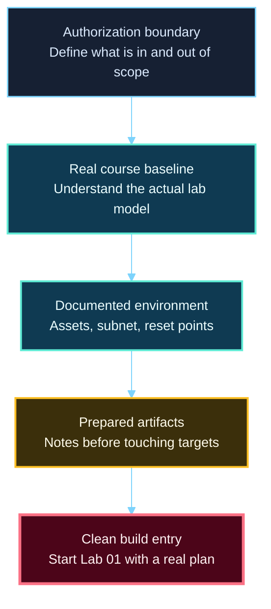
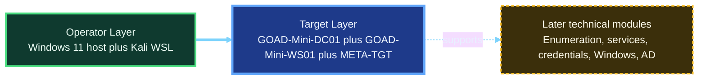

<div align="center">

**Hack the Basics · Phase I**

`Module 01 · Orientation and Assessment Workflow`

</div>

# Lesson 1.3 — Scope, Rules of Engagement, and Lab Discipline

---

> **🎯 Lesson Objective**
>
> By the end of this lesson, we will understand how to define scope inside a learner lab, how the course baseline is structured, what must be documented before technical work begins, and how to enter the lab build with a clean plan instead of improvisation.

| **Course** | **Module** | **Lesson** | **Estimated Time** | **Difficulty** |
|---|---|---|---:|---|
| Hack the Basics | Module 01 — Orientation and Assessment Workflow | 1.3 — Scope, Rules of Engagement, and Lab Discipline | 35–50 min | Beginner |

| **Prerequisites** | **You will practice** | **Main outcome** |
|---|---|---|
| Lessons 1.1–1.2 and willingness to work carefully in legal labs | Defining the lab boundary, documenting the baseline, and planning the note artifacts that will survive into Module 02 | A clear operational plan for Lab 01 |

> **🚨 Important**
>
> This lesson is about how to build and use the lab correctly.
> The next document, [Lab 01](../labs/module-01-lab-01-build-your-assessment-workspace-and-note-system.md), is where the actual build happens.
> Keep those roles separate: concept here, execution there.

---

## Table of Contents

- [Lesson Map](#lesson-map)
- [Why This Lesson Matters](#why-this-lesson-matters)
- [Learning Objectives](#learning-objectives)
- [The Practical Problem This Lesson Solves](#the-practical-problem-this-lesson-solves)
- [What Scope and Lab Discipline Actually Mean Here](#what-scope-and-lab-discipline-actually-mean-here)
- [The Core Mental Model](#the-core-mental-model)
- [What Questions This Lesson Helps Us Answer](#what-questions-this-lesson-helps-us-answer)
- [Major Components of the Module 01 Lab Plan](#major-components-of-the-module-01-lab-plan)
- [What This Lesson Can and Cannot Tell Us](#what-this-lesson-can-and-cannot-tell-us)
- [Where This Fits in a Real Workflow](#where-this-fits-in-a-real-workflow)
- [Walkthrough: Turning the Course Baseline Into a Usable Scope and Lab Plan](#walkthrough-turning-the-course-baseline-into-a-usable-scope-and-lab-plan)
- [Interpret the Plan Like an Analyst](#interpret-the-plan-like-an-analyst)
- [Stop and Think](#stop-and-think)
- [Common Mistakes and Misconceptions](#common-mistakes-and-misconceptions)
- [Defender's View](#defenders-view)
- [Beyond the Build Checklist](#beyond-the-build-checklist)
- [Key Takeaways](#key-takeaways)
- [Knowledge Check Quiz](#knowledge-check-quiz)
- [Quiz Answers](#quiz-answers)
- [Mini Practice Task](#mini-practice-task)
- [Next Lesson Bridge](#next-lesson-bridge)
- [End-of-Lesson Recap](#end-of-lesson-recap)

---

## Lesson Map



> **🧠 Mental Model**
>
> A strong learner lab is not just a set of machines.
> It is a controlled environment with known assets, known boundaries, known reset points, and known places for evidence to live.

---

## Why This Lesson Matters

Many learners treat lab setup as separate from the real technical work.

That usually leads to avoidable problems:

- unclear target roles
- forgotten IPs and hostnames
- missing scope notes
- no snapshot discipline
- weak handoffs into later modules

This lesson matters because the course lab is not just background infrastructure.
It is the environment every later practical module will assume.

If the environment is sloppy, later learning becomes slower, less trustworthy, and harder to repeat.

---

## Learning Objectives

By the end of this lesson, we should be able to:

- explain what “scope” means even in a learner lab
- describe the actual Module 01 course baseline accurately
- distinguish the operator environment from the target environment
- define what must be recorded before technical work begins
- explain the course reset model and why snapshots matter
- enter Lab 01 knowing what artifacts should exist when the build is done

---

## The Practical Problem This Lesson Solves

Suppose a learner opens the lab guide and starts building immediately.

They may be able to make machines boot, but still fail to answer:

- what exactly is in scope?
- which systems are targets versus operator infrastructure?
- what subnet should remain stable throughout the course?
- what notes should exist before scanning starts?
- what state should later labs return to?

This lesson solves that problem by defining the lab model before the build starts.

---

## What Scope and Lab Discipline Actually Mean Here

In this course, scope is not only a legal warning.
It is a practical statement of what environment we are allowed to touch and why.

For Module 01, scope means:

- the learner is working in a legal practice environment only
- the Windows host, Kali WSL, and VMware targets have distinct roles
- the target subnet is intentionally isolated
- later modules should inherit this baseline rather than improvising new infrastructure casually

Lab discipline means:

- naming things clearly
- documenting the environment while it is still clean
- treating snapshots and exports as part of repeatability
- keeping observation, inference, and validation honest even during setup

---

## The Core Mental Model

The course lab has two layers.



The operator layer is where the learner works.
The target layer is what the learner enumerates, interprets, tests, and later attacks.

That distinction matters because confusing those layers creates messy notes and sloppy reasoning.

Examples:

- the Windows host is part of the learner workspace, not the attack target set
- Kali WSL is the attack and analysis position, not a target to mutate casually
- the VMware guests are the course targets and must have stable names and reset points

---

## What Questions This Lesson Helps Us Answer

This lesson should help the learner answer:

- what assets belong in the course baseline?
- what role does each asset play?
- what network are the targets supposed to live on?
- what should be saved in notes before Module 02 begins?
- what should be reverted or preserved before later modules mutate the lab?

Those are the questions that make the lab usable rather than merely assembled.

---

## Major Components of the Module 01 Lab Plan

### 1. Authorization boundary

The lab exists for legal learning only.
That means the learner should be able to name:

- what assets are in scope
- what networks are in scope
- what is excluded

### 2. Stable baseline architecture

The course baseline is:

- Windows 11 host
- Kali WSL
- VMware Workstation Pro
- `GOAD-Mini-DC01`
- `GOAD-Mini-WS01`
- `META-TGT`
- one host-only target subnet at `192.168.57.0/24`

### 3. Asset-role clarity

Each asset must have a durable job:

| Asset | Role |
|---|---|
| Windows host | runs VMware and WSL |
| Kali WSL | attack and analysis platform |
| `GOAD-Mini-DC01` | AD and Windows infrastructure target |
| `GOAD-Mini-WS01` | domain-joined workstation target |
| `META-TGT` | intentionally vulnerable Linux target for early repetition |

### 4. Reset model

The course needs repeatability.
That means:

- clean VMware snapshots for the target VMs
- one clean Kali WSL export
- a documented snapshot map
- a habit of reverting before later scenario changes

### 5. Artifact model

Before Module 02 starts, the learner should already have:

- a scope note
- a VM inventory
- network notes
- a snapshot map
- one first analyst note using observation, inference, validation, and next-step language

---

## What This Lesson Can and Cannot Tell Us

This lesson can tell us:

- why the baseline exists
- how the baseline is bounded
- what the learner must document
- what the lab outputs should look like

This lesson cannot replace:

- the actual build steps in [Lab 01](../labs/module-01-lab-01-build-your-assessment-workspace-and-note-system.md)
- the day-to-day GOAD operating commands in the [GOAD operations reference](../references/module-01-goad-lab-operations-reference.md)
- the later enumeration logic in Module 02

That boundary keeps the lesson focused.

---

## Where This Fits in a Real Workflow

This lesson still belongs to the Orientation phase of the assessment lifecycle.

At this stage, the real questions are:

- what environment am I working in?
- what assets and constraints define that environment?
- what records should exist before I start gathering technical evidence?

That is why this lesson appears before the build and before the final analyst-mindset lesson.
It defines the environment that the learner will soon reason from.

---

## Walkthrough: Turning the Course Baseline Into a Usable Scope and Lab Plan

Suppose we want to write the minimum strong planning note before opening the lab guide.

A weak version would be:

```text
Need to build the hacking lab.
```

A stronger version looks like this:

```text
Authorized learner lab scope:
- Windows 11 host running VMware and WSL2
- Kali WSL attack platform
- GOAD-Mini-DC01 at 192.168.57.10
- GOAD-Mini-WS01 at 192.168.57.31
- META-TGT at 192.168.57.25
- host-only target subnet 192.168.57.0/24

Purpose:
- build the stable course baseline used by later modules

Required artifacts after build:
- scope note
- VM inventory
- network notes
- snapshot map
- first analyst note

Reset model:
- VMware clean snapshots for each target VM
- Kali WSL clean export
```

That note is useful because it preserves:

- the actual asset set
- the actual boundary
- the actual outputs the lab should leave behind

That is what a self-learner needs before starting a long setup process.

---

## Interpret the Plan Like an Analyst

Do not read the lab plan passively.
Read it as a sequence of claims that should later be validated.

Example:

```text
Observation: the intended target subnet is 192.168.57.0/24 and the named targets are GOAD-Mini-DC01, GOAD-Mini-WS01, and META-TGT.
Inference: later Module 02 scans should be launched from Kali WSL against that subnet and those specific target IPs.
Validation: after Lab 01, confirm those hosts actually respond from the Kali position and record the results in the workspace.
```

That is the right standard.
Even the build plan should already be shaping later evidence quality.

---

## Stop and Think

> **🛠 Practice**
>
> Before moving into Lab 01, write four short answers:
>
> 1. Which asset in this module is the attack platform?
> 2. Which assets are the targets?
> 3. What network should stay stable for later modules?
> 4. Which note artifact will help Module 02 most immediately?

<details>
<summary><strong>Possible answer</strong></summary>

1. Kali WSL is the attack and analysis platform.
2. `GOAD-Mini-DC01`, `GOAD-Mini-WS01`, and `META-TGT` are the target systems.
3. The host-only target subnet at `192.168.57.0/24` should stay stable.
4. The VM inventory and network notes will help Module 02 immediately because scans need target names, IPs, and a clear network position.

</details>

---

## Common Mistakes and Misconceptions

### Mistake 1: Treating scope as obvious

If scope is not written down, it usually becomes ambiguous later.

### Mistake 2: Treating the host and targets as one blended environment

That makes notes and next-step logic weaker immediately.

### Mistake 3: Thinking snapshots are optional polish

Without reset points, the course baseline drifts fast.

### Mistake 4: Building first and documenting later

That usually produces incomplete inventories and weak evidence trails.

### Mistake 5: Thinking Module 01 is mostly theory

The real job of this module is to leave behind a working lab and reusable workspace.

---

## Defender's View

This lesson also reinforces habits that matter on the defensive side:

- documenting asset roles
- preserving known-good baselines
- understanding network boundaries
- recording what changed and when

Good security work depends on controlled environments and trustworthy records on both sides of the field.

---

## Beyond the Build Checklist

Even a perfectly built lab still requires judgment.

The learner will still need to:

- notice when later modules drift the environment
- refresh snapshots when the baseline changes intentionally
- record new credentials or service changes carefully
- avoid promoting guesswork into “facts” too early

That is why the final lesson in the module is still necessary.
The lab gives us a working environment.
The analyst mindset teaches us how to think inside it.

---

## Key Takeaways

- Scope in this course means a clearly bounded learner environment, not just a legal warning.
- The real Module 01 baseline is Windows host + Kali WSL + VMware targets, not an improvised VM collection.
- Asset roles, network notes, snapshots, and exports are part of the curriculum, not setup trivia.
- Lab 01 should leave behind both infrastructure and artifacts.
- A self-learner should enter the build knowing exactly what “done” looks like.

---

## Knowledge Check Quiz

### 1. What is the strongest summary of scope in Module 01?

A. Only a legal disclaimer with no workflow value  
B. A clear definition of what assets, networks, and actions belong inside the learner lab  
C. A list of tools to install  
D. A replacement for note-taking

### 2. Which environment is the learner's main attack position?

A. `GOAD-Mini-DC01`  
B. `META-TGT`  
C. Kali WSL  
D. The Windows host-only adapter itself

### 3. Why does snapshot discipline belong in Module 01?

A. Because later labs should inherit a repeatable baseline  
B. Because snapshots replace evidence notes  
C. Because only AD labs need them  
D. Because the host system becomes a target later

### 4. Which artifact helps Module 02 most directly?

A. A random screenshot folder with no context  
B. A VM inventory and network notes that preserve names, roles, and IPs  
C. A list of favorite tools  
D. A vague “lab is ready” note

### 5. Why does Lesson 1.3 appear before the main lab build?

A. To teach the build commands themselves in full detail  
B. To define the lab boundary, roles, and outputs before execution begins  
C. Because the lab is optional afterward  
D. Because Lesson 1.4 no longer matters

---

## Quiz Answers

<details>
<summary><strong>Reveal quiz answers</strong></summary>

### 1. Correct answer: B

Scope here defines the actual learner environment and keeps later work bounded and understandable.

### 2. Correct answer: C

Kali WSL is the course attack and analysis platform.

### 3. Correct answer: A

Snapshots matter because later labs need a trusted place to return to.

### 4. Correct answer: B

Module 02 needs clear target nouns and network context immediately.

### 5. Correct answer: B

The lesson exists to remove ambiguity before the learner starts building.

</details>

---

## Mini Practice Task

Use the [notes workspace template](../references/module-01-notes-workspace-template.md) and draft:

1. one short scope note
2. one initial VM inventory table header
3. one line naming the target subnet
4. one line describing the reset model you expect to use after the lab build

Keep it short.
The point is to enter the lab with structure already in place.

---

## Next Lesson Bridge

The next step is the center of the module:
[Lab 01 - Build Your Assessment Workspace and Note System](../labs/module-01-lab-01-build-your-assessment-workspace-and-note-system.md).

The lab should now make sense:

- the boundary is clear
- the baseline is clear
- the outputs are clear
- the reset model is clear

Build the environment first.
Then we will return for the final lesson and use that real environment to sharpen our analyst thinking.

---

## End-of-Lesson Recap

Lesson 1.3 defined the lab contract before the build starts.

We now know:

- what is in scope
- what the real course baseline contains
- what artifacts the build must leave behind
- why snapshots, exports, and note discipline matter now instead of later

That is the right place to start Lab 01.
