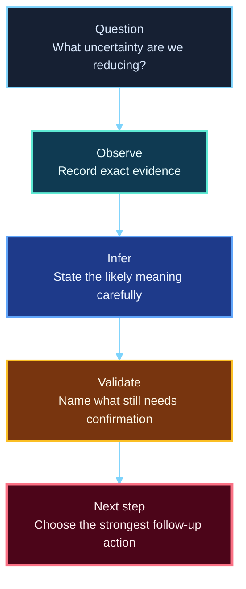

<div align="center">

**Hack the Basics · Phase I**

`Module 01 · Orientation and Assessment Workflow`

</div>

# Lesson 1.4 — Hypothesis-Driven Testing and the Analyst Mindset

---

> **🎯 Lesson Objective**
>
> By the end of this lesson, we will understand how to move from environment setup into disciplined technical reasoning by asking better questions, separating observation from inference, recording validation needs, and choosing stronger next steps from the real Module 01 lab.

| **Course** | **Module** | **Lesson** | **Estimated Time** | **Difficulty** |
|---|---|---|---:|---|
| Hack the Basics | Module 01 — Orientation and Assessment Workflow | 1.4 — Hypothesis-Driven Testing and the Analyst Mindset | 30–45 min | Beginner |

| **Prerequisites** | **You will practice** | **Main outcome** |
|---|---|---|
| Lessons 1.1-1.3 and Lab 01 completed | Turning lab observations into notes, inferences, validation questions, and cleaner next-step logic | The reasoning habit that bridges Module 01 into Module 02 |

> **🚨 Important**
>
> This lesson comes after the lab on purpose.
> We are no longer reasoning from hypothetical machines.
> We are reasoning from the actual course baseline we just built and documented.

---

## Table of Contents

- [Lesson Map](#lesson-map)
- [Why This Lesson Matters](#why-this-lesson-matters)
- [Learning Objectives](#learning-objectives)
- [The Practical Problem This Lesson Solves](#the-practical-problem-this-lesson-solves)
- [What We Mean by an Analyst Mindset](#what-we-mean-by-an-analyst-mindset)
- [The Core Mental Model](#the-core-mental-model)
- [What Questions This Topic Helps Us Answer](#what-questions-this-topic-helps-us-answer)
- [Major Components of Strong Analyst Thinking](#major-components-of-strong-analyst-thinking)
- [What This Topic Can and Cannot Tell Us](#what-this-topic-can-and-cannot-tell-us)
- [Where This Fits in a Real Workflow](#where-this-fits-in-a-real-workflow)
- [Walkthrough 1 - Reading the Fresh Lab Like an Analyst](#walkthrough-1---reading-the-fresh-lab-like-an-analyst)
- [Walkthrough 2 - Turning a Reachability Result Into a Better Next Question](#walkthrough-2---turning-a-reachability-result-into-a-better-next-question)
- [Walkthrough 3 - Writing a Stronger Daily Note Entry](#walkthrough-3---writing-a-stronger-daily-note-entry)
- [Interpret the Reasoning Standard](#interpret-the-reasoning-standard)
- [Stop and Think](#stop-and-think)
- [Common Mistakes and Misconceptions](#common-mistakes-and-misconceptions)
- [Defender's View](#defenders-view)
- [Beyond the Surface](#beyond-the-surface)
- [Key Takeaways](#key-takeaways)
- [Knowledge Check Quiz](#knowledge-check-quiz)
- [Quiz Answers](#quiz-answers)
- [Mini Practice Task](#mini-practice-task)
- [Next Lesson Bridge](#next-lesson-bridge)
- [End-of-Module Recap](#end-of-module-recap)

---

## Lesson Map



> **🧠 Mental Model**
>
> The analyst mindset is how we keep technical work honest.
> It stops us from turning output into certainty too early.

---

## Why This Lesson Matters

The lab is now built.
That is necessary, but not sufficient.

Many learners make the same mistake at this point:

- they see reachable targets
- they feel ready to start scanning
- they skip the reasoning discipline that makes later output meaningful

This lesson matters because Module 02 will immediately ask the learner to turn packets, ports, and silence into evidence.

If the learner cannot already separate:

- what they observed
- what they suspect
- what still needs validation

then later modules will become tool-heavy and weaker than they should be.

---

## Learning Objectives

By the end of this lesson, we should be able to:

- define hypothesis-driven testing in simple practical terms
- separate observation, inference, and validation in notes
- use exact nouns when recording technical details
- choose next steps based on the current question and phase
- turn the Module 01 lab baseline into a cleaner Module 02 starting point

---

## The Practical Problem This Lesson Solves

Suppose a learner finishes Lab 01 and writes:

```text
Lab is up. Looks good. Ready to hack.
```

That note is not useful enough.

It does not preserve:

- what was actually observed
- what target state is known
- what is only inferred
- what should be checked next

This lesson solves that problem by giving the learner a stronger thinking pattern before the first real enumeration module begins.

---

## What We Mean by an Analyst Mindset

An analyst mindset means technical curiosity with structure.

It means working from:

- a current question
- the evidence available now
- bounded inferences
- explicit validation needs
- a next step chosen for a reason

It does not mean:

- jumping to the most exciting tool
- calling guesses “facts”
- collecting output without deciding what it means
- skipping note quality because the work feels preliminary

---

## The Core Mental Model

Use this model repeatedly:

```text
Question -> Observe -> Infer -> Validate -> Choose next step
```

Each part has a job.

| Part | Job |
|---|---|
| Question | defines what uncertainty we are trying to reduce |
| Observe | records what we directly saw |
| Infer | states what the evidence probably suggests |
| Validate | names what still needs confirmation |
| Next step | chooses the smallest useful action that reduces uncertainty |

This is the bridge from Module 01 into every later technical module.

---

## What Questions This Topic Helps Us Answer

This lesson should help the learner answer:

- what do I know for sure right now?
- what am I only assuming?
- what should be checked next before I get more confident?
- what note would still make sense tomorrow or next week?

Those questions matter more than “which tool should I launch first?”

---

## Major Components of Strong Analyst Thinking

### 1. Start with a real question

Bad:

- “Time to run some tools.”

Better:

- “What is reachable from Kali WSL on the target subnet?”

### 2. Preserve direct observations

Good observations use exact nouns:

- IPs
- hostnames
- ports
- route paths
- commands
- output snippets

### 3. Keep inferences bounded

An inference should sound like:

- likely
- probably
- suggests
- may indicate

That language keeps the reasoning honest.

### 4. Name the validation need

This is what turns notes into workflow.

If the learner cannot say what still needs confirmation, they are often mistaking evidence for certainty.

### 5. Choose the next step by purpose

The next step should reduce uncertainty.
It should not merely feel interesting.

---

## What This Topic Can and Cannot Tell Us

This lesson can tell us:

- how to think about the fresh lab baseline
- how to record evidence more honestly
- how to frame better next-step questions for Module 02

This lesson cannot replace:

- the actual scanning mechanics in Module 02
- later protocol and service interpretation in Modules 02-03
- deeper attack-path decisions in later modules

Its job is to improve the quality of thinking before those modules begin.

---

## Where This Fits in a Real Workflow

This lesson still belongs to the Orientation phase, but it points directly into Surface Mapping.

Right now, the learner should be able to say:

- the environment exists
- the targets are named
- the subnet is known
- the baseline notes exist
- the next step is to gather visibility deliberately

That is exactly where Module 02 begins.

---

## Walkthrough 1 - Reading the Fresh Lab Like an Analyst

Suppose the learner has just completed the validation step from Lab 01.

A weak reaction is:

```text
Everything seems fine.
```

A stronger interpretation is:

```text
Question: Is the course baseline reachable from the attack position?
Observation: Kali WSL reaches 192.168.57.10, 192.168.57.31, and 192.168.57.25; expected ports answer on each target.
Inference: The host-only lab baseline is likely ready for first-pass surface mapping.
Validation: Confirm in Module 02 that saved scan output and host tracking remain consistent with the baseline notes.
Next step: Begin controlled host discovery and first-pass port mapping from Kali WSL.
```

That note is much more reusable because it preserves both evidence and intent.

---

## Walkthrough 2 - Turning a Reachability Result Into a Better Next Question

Suppose we know:

- `GOAD-Mini-DC01` responds on `53`, `88`, `135`, `389`, and `445`
- `GOAD-Mini-WS01` responds on `135`, `139`, `445`, and `3389`
- `META-TGT` responds on `21`, `22`, `23`, and `80`

A weak next thought is:

- “Looks exploitable.”

A stronger next thought is:

- `GOAD-Mini-DC01` likely plays a domain infrastructure role
- `GOAD-Mini-WS01` looks like a workstation or Windows service host
- `META-TGT` looks like the early Linux service target

But those are still inferences, not final truths.

The stronger question for Module 02 is:

> what does careful first-pass network enumeration show from the Kali position, and how should that evidence be saved for later service reasoning?

That is the right transition into the next module.

---

## Walkthrough 3 - Writing a Stronger Daily Note Entry

Weak daily note:

```text
Built the lab. Ready for the next module.
```

Stronger daily note:

```text
Current phase: Orientation
Question: Is the Module 01 baseline ready for disciplined surface mapping?
Observation: Windows host, Kali WSL, GOAD-Mini-DC01, GOAD-Mini-WS01, and META-TGT documented; target subnet recorded as 192.168.57.0/24; validation checks from Kali WSL succeeded.
Inference: The environment is likely stable enough to begin Module 02 without rebuilding context.
Validation needed: Confirm scan outputs are saved into the workspace cleanly and host tracking stays aligned to the baseline inventory.
Next step: Start Module 02 and use the saved inventory plus network notes as the initial scan context.
```

That note is action-oriented and trustworthy.

---

## Interpret the Reasoning Standard

The course wants the learner to sound more like this:

```text
Observation: 192.168.57.10 answers on the expected Windows and AD-related ports from Kali WSL.
Inference: The target is likely the domain controller in the course baseline.
Validation: Confirm identity through later enumeration and preserve the result in host tracking notes.
```

Not like this:

```text
DC confirmed.
```

The first version is stronger because it preserves:

- evidence
- confidence level
- what still needs to happen

That is the standard to keep.

---

## Stop and Think

> **🛠 Practice**
>
> Pick one asset from your fresh lab and write:
>
> 1. one observation
> 2. one bounded inference
> 3. one validation need
> 4. one next step

<details>
<summary><strong>Possible answer</strong></summary>

Observation:

- `META-TGT` responds on `21`, `22`, `23`, and `80` from Kali WSL.

Inference:

- it is likely the intentionally vulnerable Linux service target for early enumeration and service reasoning.

Validation:

- confirm service behavior and save the first-pass output in Module 02.

Next step:

- begin controlled surface mapping against `192.168.57.25` and record the results in host tracking notes.

</details>

---

## Common Mistakes and Misconceptions

### Mistake 1: Treating every clue like proof

Output often suggests more than it proves.

### Mistake 2: Writing notes without exact nouns

If IPs, hostnames, and ports are missing, notes become weaker fast.

### Mistake 3: Choosing next steps by excitement

The next step should answer the current question, not just launch the most famous tool.

### Mistake 4: Thinking setup notes do not count as evidence

Module 01 already teaches evidence habits.
It does not begin later.

### Mistake 5: Treating the analyst mindset as separate from the technical modules

The analyst mindset is what makes the technical modules useful.

---

## Defender's View

This same reasoning discipline helps defenders:

- preserve exact observations
- avoid overstating confidence too early
- choose follow-up based on uncertainty reduction
- build better incident and triage notes

The habit is broader than offensive workflow.

---

## Beyond the Surface

The analyst mindset still needs support from:

- real technical knowledge
- careful validation in later modules
- stronger service interpretation
- better note systems as the environment grows

This lesson does not replace those things.
It makes them easier to use well.

---

## Key Takeaways

- A strong analyst note begins with a real question.
- Observation, inference, and validation should stay separate.
- Exact nouns make the Module 01 baseline reusable in later modules.
- Better next steps reduce uncertainty instead of chasing novelty.
- This lesson is the reasoning bridge from Module 01 into Module 02.

---

## Knowledge Check Quiz

### 1. What is the strongest summary of a hypothesis in this course?

A. A final statement of certainty  
B. A structured, testable idea about what may be true  
C. A replacement for evidence  
D. A note that does not need follow-up

### 2. Which note is strongest?

A. “DC is up.”  
B. “Looks like Windows stuff.”  
C. “Observation: 192.168.57.10 answers on 53, 88, 135, 389, and 445; Inference: likely AD infrastructure target; Validation: confirm identity during later enumeration.”  
D. “Need more tools.”

### 3. Why are exact nouns important in Module 01 notes?

A. They make notes reusable and trustworthy in later modules  
B. They only matter in the reporting module  
C. They replace screenshots entirely  
D. They are mostly decorative

### 4. What should guide the next step most strongly?

A. whichever tool feels most exciting  
B. the current question, evidence, and phase  
C. habit alone  
D. random experimentation

### 5. Why does Lesson 1.4 appear after the lab?

A. Because the lab replaces reasoning  
B. Because the learner can now reason from a real environment and real artifacts  
C. Because Module 02 no longer needs notes  
D. Because Lesson 1.3 already covered hypothesis testing fully

---

## Quiz Answers

### 1. Correct answer: B

A hypothesis is a bounded, testable idea that helps guide the next useful action.

### 2. Correct answer: C

It preserves the evidence, the likely meaning, and the validation need.

### 3. Correct answer: A

Later modules depend on exact nouns and trustworthy baseline notes.

### 4. Correct answer: B

Good next steps follow from the current question and evidence.

### 5. Correct answer: B

The lab gives the learner a real baseline to reason from, which makes this lesson more concrete and useful.

---

## Mini Practice Task

Open your Module 01 workspace and write one short entry that includes:

1. current phase
2. question
3. observation
4. inference
5. validation needed
6. next step

Use one real fact from your fresh lab build.

---

## Next Lesson Bridge

Module 01 now hands directly into [Module 02 - Network Enumeration with Nmap](../../02-enumeration-using-nmap/README.md).

That handoff should feel clean:

- the environment exists
- the targets are named
- the subnet is documented
- the baseline notes exist
- the learner knows how to think about evidence before scanning begins

The next job is no longer orientation.
It is deliberate visibility.

---

## End-of-Module Recap

Module 01 was built to do two things at once:

- give the learner a strong foundation
- leave behind the real workspace the rest of the course will use

Across the module, we now know how to:

- read the course as a workflow-first learning system
- understand the assessment lifecycle
- define scope and lab discipline before technical work begins
- build the actual course baseline and document it
- write notes that separate observation, inference, and validation

That means the learner should now be ready for Module 02 not only conceptually, but operationally.
