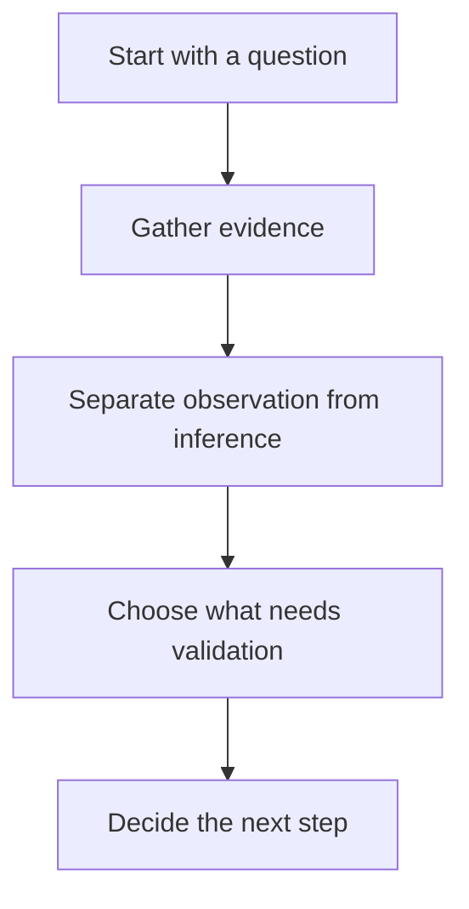
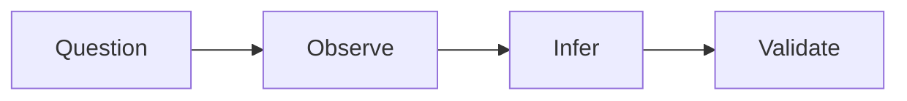
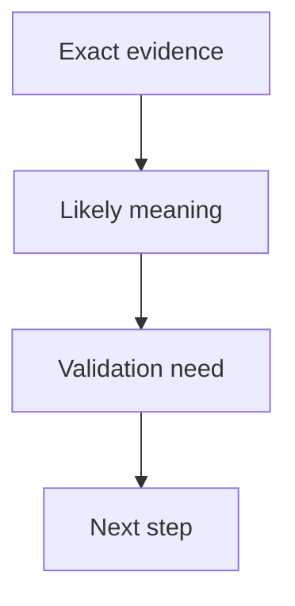

<div align="center">

**Hack the Basics · Phase I**

`Module 01 · Orientation and Assessment Workflow`

</div>

# Lesson 1.4 — Hypothesis-Driven Testing and the Analyst Mindset

---

> **🎯 Lesson Objective**
>
> By the end of this lesson, we will understand how to move from curiosity and output collection into a more disciplined analyst mindset built around questions, evidence, inference, validation, and next-step decisions.

| **Course** | **Module** | **Lesson** | **Estimated Time** | **Difficulty** |
|---|---|---|---:|---|
| Hack the Basics | Module 01 — Orientation and Assessment Workflow | 1.4 — Hypothesis-Driven Testing and the Analyst Mindset | 40–60 min | Beginner |

| **Prerequisites** | **You will practice** | **Main outcome** |
|---|---|---|
| Lessons 1.1-1.3, basic note-taking willingness | Asking better questions, separating evidence from interpretation, and choosing next steps more deliberately | The analyst mindset needed before scanning, service interpretation, and later validation work |

> **🚨 Important**
>
> This lesson is where the module becomes operational.
> Without this mindset, later modules are much easier to reduce into random commands and output collecting.

---

## Table of Contents

- [Lesson Map](#lesson-map)
- [Why This Lesson Matters](#why-this-lesson-matters)
- [Learning Objectives](#learning-objectives)
- [The Practical Problem This Lesson Solves](#the-practical-problem-this-lesson-solves)
- [What We Mean by an Analyst Mindset](#what-we-mean-by-an-analyst-mindset)
- [Why Curiosity Alone Is Not Enough](#why-curiosity-alone-is-not-enough)
- [The Core Testing Model: Question -> Observe -> Infer -> Validate](#the-core-testing-model-question---observe---infer---validate)
- [What a Hypothesis Looks Like in Technical Work](#what-a-hypothesis-looks-like-in-technical-work)
- [Observation vs Inference vs Validation](#observation-vs-inference-vs-validation)
- [Why Exact Nouns Matter So Much](#why-exact-nouns-matter-so-much)
- [What Makes a Strong Next-Step Decision](#what-makes-a-strong-next-step-decision)
- [How Weak Thinking Shows Up in Notes](#how-weak-thinking-shows-up-in-notes)
- [A Practical Evidence-Triage Workflow](#a-practical-evidence-triage-workflow)
- [Walkthrough 1: Reading a Small Port List Like an Analyst](#walkthrough-1-reading-a-small-port-list-like-an-analyst)
- [Walkthrough 2: Turning a Web Clue Into a Better Next Question](#walkthrough-2-turning-a-web-clue-into-a-better-next-question)
- [Walkthrough 3: Writing a Stronger Daily Note Entry](#walkthrough-3-writing-a-stronger-daily-note-entry)
- [Stop and Think](#stop-and-think)
- [Common Mistakes and Misconceptions](#common-mistakes-and-misconceptions)
- [Defender’s View](#defenders-view)
- [Key Takeaways](#key-takeaways)
- [Knowledge Check Quiz](#knowledge-check-quiz)
- [Quiz Answers](#quiz-answers)
- [Mini Practice Task](#mini-practice-task)
- [Next Lesson Bridge](#next-lesson-bridge)
- [End-of-Module Recap](#end-of-module-recap)

---

## Lesson Map



> **💡 Tip**
>
> A better analyst is not the person who runs the most tools.
> It is the person who asks better questions and records clearer answers.

---

## Why This Lesson Matters

Many learners can produce output.
Fewer can explain what the output means.

That gap is where a lot of weak security learning lives.

Without a better reasoning model, the learner may:

- chase every clue equally
- confuse labels with proof
- make notes that describe noise instead of evidence
- choose the next step based on excitement instead of logic

This lesson matters because it builds the thought pattern later modules depend on.

---

## Learning Objectives

By the end of this lesson, we should be able to:

- explain what hypothesis-driven testing means in this course
- distinguish observation, inference, and validation cleanly
- write stronger notes using exact nouns and better claims
- choose next steps based on evidence and workflow context
- recognize weak analyst habits before they harden
- carry this mindset into Module 02 and beyond

---

## The Practical Problem This Lesson Solves

Suppose you see:

```text
80/tcp  open  http
443/tcp open  https
```

A weak response:

- “Interesting web server.”

A stronger response:

- What question am I asking here?
- What is directly observed?
- What does that suggest?
- What should I validate next?

Lesson 1.4 solves the problem of moving from:

- output collection

to:

- evidence-based reasoning

That is the mindset shift the entire rest of the course needs.

---

## What We Mean by an Analyst Mindset

An analyst mindset means working from:

- clear questions
- bounded claims
- usable evidence
- reasoned next steps

It does **not** mean:

- sounding formal
- pretending certainty
- collecting huge amounts of output without purpose

### Strong analyst habits

- define the current question
- capture exact evidence
- separate what is known from what is suspected
- choose the next step for a reason

---

## Why Curiosity Alone Is Not Enough

Curiosity is helpful.
But on its own, it often produces:

- wandering
- over-testing
- weak notes
- poor prioritization

Curiosity becomes much stronger when paired with structure.

### Better framing

Instead of:

- “I wonder what happens if I run this”

prefer:

- “I want to test whether this host exposes web services, because that would change the next workflow”

That single change makes the action easier to justify and the result easier to interpret.

---

## The Core Testing Model: Question -> Observe -> Infer -> Validate

This is the main reasoning model the course will keep returning to.



### Question

What are you trying to learn?

### Observe

What did you actually see?

### Infer

What does the evidence suggest?

### Validate

What still needs confirmation?

This model will appear again and again in later modules.

---

## What a Hypothesis Looks Like in Technical Work

A hypothesis is a testable idea about what may be true.

### Example hypotheses

- this host may expose web services worth mapping
- this certificate name may correspond to an admin-related surface
- this service mix may indicate a domain-related host role

These are not claims of certainty.
They are structured next-step ideas.

### Why hypotheses are useful

They prevent aimless testing.
They also make failures informative.

If the hypothesis is wrong, that still teaches something.

---

## Observation vs Inference vs Validation

This distinction is the single most important writing habit in the early course.

| Category | Question |
|---|---|
| Observation | what did I directly see? |
| Inference | what does that suggest? |
| Validation | what still needs to be confirmed? |

### Example

```text
Observation: 443/tcp is open and the page title is "Acme Portal"
Inference: the host likely exposes a user-facing web application
Validation: confirm routes, cert names, and auth behavior
```

This note is much more trustworthy than:

```text
Found the portal.
```

---

## Why Exact Nouns Matter So Much

Vague notes are hard to reuse.
Exact nouns make technical work portable.

### Capture exact things

- IPs
- ports
- hostnames
- URLs
- titles
- share names
- service names
- route names

### Weak note

```text
Interesting service found.
```

### Strong note

```text
10.10.10.15 exposes 80/tcp and 443/tcp; HTTPS title "Acme Portal"; redirect behavior still unverified.
```

Later modules depend on this kind of specificity.

---

## What Makes a Strong Next-Step Decision

A strong next step is usually:

- tied to the current question
- supported by the evidence already collected
- appropriate to the current lifecycle phase
- likely to reduce uncertainty meaningfully

### Weak next step

- run a random tool because it might be useful

### Strong next step

- use Nmap host discovery and first-pass scan logic because the current phase is surface mapping and we still do not know what is reachable from the Kali VM

That is exactly the kind of decision Module 02 will start formalizing.

---

## How Weak Thinking Shows Up in Notes

Weak reasoning often produces weak notes.

Examples:

- “Looks vulnerable”
- “Interesting host”
- “Might be domain controller”
- “Probably admin panel”

These notes are not automatically wrong.
They are just incomplete.

A better note gives:

- the evidence
- the likely meaning
- the uncertainty
- the next step

---

## A Practical Evidence-Triage Workflow

Use this small workflow every time you collect something new.

1. Write the exact observation.
2. Write one careful inference.
3. Write what still needs validation.
4. Write the most natural next step.



This takes seconds once it becomes a habit.

---

## Walkthrough 1: Reading a Small Port List Like an Analyst

Suppose you later see:

```text
22/tcp  open  ssh
80/tcp  open  http
```

Weak note:

```text
SSH and HTTP found.
```

Stronger note:

```text
Observation: 22/tcp and 80/tcp open
Inference: host may support both remote administration and a visible web surface
Validation: confirm the web route behavior and gather service details later
Next step: begin disciplined surface mapping rather than guessing host role fully yet
```

---

## Walkthrough 2: Turning a Web Clue Into a Better Next Question

Suppose you later observe:

```text
HTTPS certificate SAN includes admin.lab.local
```

Weak next thought:

- “Admin box!”

Stronger next thought:

- Observation: cert SAN includes `admin.lab.local`
- Inference: the environment may expose an admin-related hostname
- Validation: confirm whether that hostname resolves and behaves distinctly
- Next step: document the clue and validate it during later web recon

That is the reasoning quality the course wants.

---

## Walkthrough 3: Writing a Stronger Daily Note Entry

Weak daily note:

```text
Worked on the lab. Found some useful things.
```

Stronger daily note:

```text
Current phase: Orientation
Question: Is the lab baseline documented well enough for Module 02?
Observation: Kali, META-TGT, LINUX-LAB, and WIN11-LAB inventoried; host-only network selected; clean snapshots named.
Inference: The lab is likely ready for early enumeration practice.
Validation: Confirm connectivity and save first scan artifacts in Module 02.
Next step: Begin network visibility work from the Kali VM.
```

That note is actionable, reusable, and honest.

---

## Stop and Think

> **🛠 Practice**
>
> Before reading on, choose one fact from your own current lab and write:
>
> 1. one observation
> 2. one inference
> 3. one validation need
> 4. one next step

<details>
<summary><strong>Possible answer</strong></summary>

Observation:

- the Windows 11 VM has a clean baseline snapshot and lives on the host-only lab network

Inference:

- it is likely ready to serve as a stable future Windows target

Validation:

- confirm later that the Kali VM can reach it from the expected position

Next step:

- record the VM details in the inventory and preserve the snapshot name in notes

</details>

---

## Common Mistakes and Misconceptions

### Mistake 1: Treating every clue like proof

Labels and hints are not the same as validation.

### Mistake 2: Writing notes without structure

If the note does not preserve evidence, it will be harder to trust later.

### Mistake 3: Choosing next steps by excitement

The next step should reduce uncertainty, not just feel interesting.

### Mistake 4: Skipping exact nouns

Exact hostnames, routes, and ports matter more than impressions.

### Mistake 5: Thinking the analyst mindset starts after the basics

It starts here, before the first real scan.

---

## Defender’s View

Defenders also benefit from the same reasoning habits:

- clearer evidence
- better incident notes
- more honest confidence levels
- better prioritization

This lesson is about disciplined technical thinking, not only offensive workflow.

---

## Key Takeaways

- Hypothesis-driven testing begins with better questions.
- Observation, inference, and validation should stay separate in notes.
- Exact nouns make technical notes reusable and trustworthy.
- Strong next steps reduce uncertainty and fit the current phase.
- This mindset is the bridge into later enumeration modules.

---

## Knowledge Check Quiz

### 1. What best describes a hypothesis in this course?

A. A final claim of certainty
B. A testable idea about what may be true
C. A replacement for evidence
D. A guess that does not need follow-up

### 2. Which note is strongest?

A. “Probably vulnerable host.”
B. “Interesting machine.”
C. “Observation: 80/tcp and 443/tcp open; Inference: likely web surface; Validation: confirm route behavior and titles.”
D. “Need more tools.”

### 3. Why are exact nouns important?

A. They make notes more reusable and trustworthy later
B. They are only useful in reporting
C. They replace screenshots entirely
D. They slow down the learner too much

### 4. What should guide the next step most strongly?

A. whichever tool is most popular
B. the current evidence, question, and lifecycle phase
C. what feels exciting
D. randomness

### 5. Why does this lesson belong before Module 02?

A. Because later modules do not use reasoning
B. Because later scanning and recon work depend on stronger evidence and next-step thinking
C. Because Nmap cannot run without it
D. Because it is only about legal warnings

---

## Quiz Answers

### 1. Correct answer: B

A hypothesis is a structured, testable idea that guides the next action.

### 2. Correct answer: C

It preserves the evidence, likely meaning, and validation need clearly.

### 3. Correct answer: A

Exact nouns are what make notes useful later.

### 4. Correct answer: B

Good next steps follow from the current question and evidence, not from tool hype.

### 5. Correct answer: B

Later technical modules work much better when the learner already thinks this way.

---

## Mini Practice Task

Write one daily note entry using this structure:

1. current phase
2. question being asked
3. observation
4. inference
5. validation needed
6. next step

Use your actual lab workspace if possible.

---

## Next Lesson Bridge

Module 01 now hands directly into the technical work of [Module 02 - Network Enumeration with Nmap](../../02-enumeration-using-nmap/README.md).

That handoff should feel clear:

- the workspace exists
- scope is documented
- the lifecycle is understood
- the learner knows how to think about evidence

Now the next phase can begin:

- figuring out what is reachable from the Kali VM
- mapping the visible surface deliberately
- turning packets and silence into evidence

---

## End-of-Module Recap

Module 01 established the operating habits that the rest of `Hack the Basics` will depend on.

Across the module, we learned how to:

- understand the course as a workflow-first curriculum
- read the assessment lifecycle as the spine of later technical work
- define scope and lab discipline inside a VMware-based learner workspace
- write stronger notes with cleaner evidence and next-step logic

That means the learner should now be ready for Module 02 not just emotionally, but operationally.

The next step is to move from orientation into visibility:

- which hosts are there?
- which ports respond?
- what can we actually see from our current network position?
