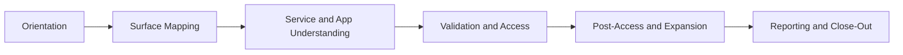

# Module 01 Assessment Lifecycle Map

---

> **📝 Map Purpose**
>
> Use this page as the course-wide operating map for understanding where a task belongs in the larger assessment flow.

## Lifecycle Diagram



---

## Phase Questions

| Phase | Main question | Typical outputs |
|---|---|---|
| Orientation | what are we doing, in what environment, and under what limits? | scope note, VM inventory, workspace setup |
| Surface Mapping | what is reachable and visible from here? | host lists, scan artifacts, route maps |
| Service and App Understanding | what do those visible things probably mean? | host-role notes, app maps, triage queues |
| Validation and Access | what deserves direct testing or controlled validation next? | test queues, auth checks, footholds |
| Post-Access and Expansion | what changed after access and what can we now see? | local enum notes, pivot maps, privilege paths |
| Reporting and Close-Out | what evidence, findings, and workflow history must be preserved? | final notes, findings, report material |

---

## Mini Phase-Mapping Exercise

Use this prompt during Module 01:

```text
Current task:
Which lifecycle phase does it belong to?
What evidence should it produce?
What later phase will depend on it?
```

---

## Design Notes

This map is intended to stay useful across the entire course, not only inside Module 01.
