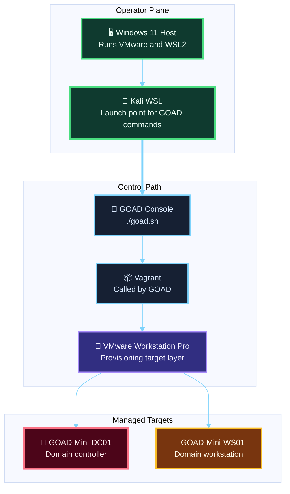

<div align="center">

# Module 01 GOAD Lab Operations Reference

**Windows 11 Host + Kali WSL + VMware + GOAD-Mini + WS01**

</div>

---

> **Use This For**
>
> Fast, repeatable operations on the course GOAD lab after the build is complete: starting it, stopping it, checking status, rerunning provisioning, opening the VMs, troubleshooting `ws01`, and preserving clean snapshots.

| Best paired with | Main job | Assumption |
|---|---|---|
| Module 01 lab build guide | Act as the day-to-day operating manual for the GOAD part of the course lab | `GOAD-Mini + ws01` has already been installed or partially installed |

---

## Table of Contents

- [1. What This Reference Covers](#1-what-this-reference-covers)
- [2. Lab Model](#2-lab-model)
- [3. Where You Run Commands](#3-where-you-run-commands)
- [4. Core Names and Addresses](#4-core-names-and-addresses)
- [5. GOAD Console Basics](#5-goad-console-basics)
- [6. Daily Start-Up Workflow](#6-daily-start-up-workflow)
- [7. Daily Shut-Down Workflow](#7-daily-shut-down-workflow)
- [8. Command Reference](#8-command-reference)
- [9. How to Interact with the Machines](#9-how-to-interact-with-the-machines)
- [10. VMware Snapshot Workflow](#10-vmware-snapshot-workflow)
- [11. Rerunning Provisioning Safely](#11-rerunning-provisioning-safely)
- [12. Preferred Recovery for `ws01`](#12-preferred-recovery-for-ws01)
- [13. Useful Files and Paths](#13-useful-files-and-paths)
- [14. Fast Copy-Paste Sequences](#14-fast-copy-paste-sequences)

---

## 1. What This Reference Covers

This reference is about operating the GOAD side of the course lab after the build.

It answers:

- how do I start the lab?
- how do I stop the lab?
- where do I run the commands?
- how do I open the Windows VMs?
- how do I snapshot them?
- how do I recover `ws01` if extension provisioning fails?
- what GOAD commands matter most day to day?

It does not replace the main build guide.
It assumes the lab has already been created or partially created.

---

## 2. Lab Model

The GOAD part of this course baseline is:

- `GOAD-Mini-DC01`
- `GOAD-Mini-WS01`

It runs as VMware VMs created and managed by GOAD through Vagrant.

That means:

- GOAD is the orchestration layer
- Vagrant is the provisioning/runtime control layer under GOAD
- VMware Workstation Pro is where the actual VMs live and where you can open consoles and snapshots

### Clean mental model



### What belongs where

| Layer | What you do there |
|---|---|
| Kali WSL | run `./goad.sh`, launch GOAD commands, run scanning commands |
| GOAD console | start, stop, load, status, provision, extension operations |
| VMware Workstation Pro | open VM consoles, confirm power state, take snapshots |
| Guest OS | verify IPs, log in, inspect local issues, perform in-guest troubleshooting |

---

## 3. Where You Run Commands

### Kali WSL

Use Kali WSL for:

- `./goad.sh`
- `status`
- `start`
- `stop`
- `start_vm`
- `stop_vm`
- `restart_vm`
- `provision_extension ws01`
- validation scans with `nmap`

### Windows host

Use the Windows host for:

- launching VMware Workstation Pro
- opening the VMware console for each VM
- taking snapshots
- exporting or backing up files on the Windows filesystem

### Inside the guest VMs

Use the guest OS console only when needed:

- check the current IP
- confirm the VM actually booted
- fix a network or WinRM problem
- log in for visual verification

---

## 4. Core Names and Addresses

Use these values consistently.

| Item | Name | Expected IP |
|---|---|---|
| GOAD instance | example: `f34171-goad-mini-vmware` | n/a |
| Domain controller VM | `GOAD-Mini-DC01` | `192.168.57.10` |
| Domain workstation VM | `GOAD-Mini-WS01` | `192.168.57.31` |
| DC hostname | `kingslanding` | `192.168.57.10` |
| WS01 hostname | `casterlyrock` | `192.168.57.31` |
| Domain | `sevenkingdoms.local` | n/a |

### Network

| Label | Value |
|---|---|
| VMware network | your host-only lab network, for example `VMnet2` |
| Course label | `LAB-NET` |
| Target subnet | `192.168.57.0/24` |

---

## 5. GOAD Console Basics

Start the GOAD console from Kali WSL inside the GOAD repo:

```bash
cd /mnt/e/HackTheBasicsLab/goad/GOAD
./goad.sh
```

If your GOAD repo is on `C:`, use the equivalent `/mnt/c/...` path.

### First commands to know

When no instance is loaded:

```text
list
load <instance_id>
config
check
```

When an instance is loaded:

```text
status
start
stop
start_vm <vm_name>
stop_vm <vm_name>
restart_vm <vm_name>
provision_extension ws01
set_as_default
```

---

## 6. Daily Start-Up Workflow

This is the normal way to bring the GOAD lab online for a practice session.

### From Kali WSL

```bash
cd /mnt/e/HackTheBasicsLab/goad/GOAD
./goad.sh
```

If your instance is not auto-loaded:

```text
list
load <instance_id>
```

Then:

```text
status
start
status
```

### What `start` does

`start` brings up the current lab instance through the provider layer.
In your case, that means VMware-backed VMs managed through Vagrant.

### If only one VM needs to be started

Use:

```text
start_vm GOAD-Mini-DC01
start_vm GOAD-Mini-WS01
```

### Recommended verification after start

```text
status
```

Then from Kali WSL:

```bash
nmap -Pn -p 53,88,135,389,445 192.168.57.10
nmap -Pn -p 135,139,445,3389 192.168.57.31
```

---

## 7. Daily Shut-Down Workflow

When you are done with the GOAD lab for the day:

### From the GOAD console

```text
status
stop
status
```

### If you only want to power off one VM

```text
stop_vm GOAD-Mini-WS01
stop_vm GOAD-Mini-DC01
```

### Use `stop`, not `destroy`

`stop` powers off the lab cleanly.

`destroy` is destructive in GOAD terms and is not part of normal daily operation.
Do not use it unless you explicitly intend to rebuild.

---

## 8. Command Reference

### Instance management

| Command | What it does | When to use it |
|---|---|---|
| `list` | lists GOAD instances in the workspace | find the instance id |
| `load <instance_id>` | loads an existing instance | switch to the correct lab |
| `unload` | unloads the current instance | leave the active instance context |
| `set_as_default` | makes the current instance auto-load next time | keep your main lab as default |
| `delete` | removes the selected instance metadata and files | only if you intentionally want to remove it |

### Power and state

| Command | What it does | When to use it |
|---|---|---|
| `status` | shows current VM states | first command to run when unsure |
| `start` | starts the current lab | normal session startup |
| `stop` | stops the current lab | normal session shutdown |
| `destroy` | destroys the current lab infrastructure | rebuild only, not routine use |

### Per-VM control

| Command | What it does | When to use it |
|---|---|---|
| `start_vm GOAD-Mini-DC01` | starts only the DC | DC is off but you need it |
| `start_vm GOAD-Mini-WS01` | starts only WS01 | WS01 failed to come up |
| `stop_vm GOAD-Mini-DC01` | stops only the DC | targeted shutdown |
| `stop_vm GOAD-Mini-WS01` | stops only WS01 | targeted shutdown |
| `restart_vm <vm_name>` | restarts one VM | after network or provisioning issues |

### Provisioning and extension commands

| Command | What it does | When to use it |
|---|---|---|
| `check` | checks dependencies | before building or debugging environment issues |
| `install` | full install for the current settings | initial build only |
| `provide` | provider-only run | rebuild VM provisioning without full Ansible flow |
| `provision_lab` | reruns the base lab Ansible playbooks | reapply GOAD-Mini base config |
| `provision <playbook>` | runs one specific playbook | targeted rerun of part of the base lab |
| `provision_extension ws01` | reruns only the `ws01` extension provisioning | preferred extension recovery path |
| `install_extension ws01` | provides and provisions the extension | install an extension onto an existing instance |
| `update_instance_files` | rebuilds merged workspace/provider files | after changing instance metadata or extensions |

### Good default operator rhythm

If you are unsure where to start:

```text
status
start_vm GOAD-Mini-WS01
status
provision_extension ws01
```

or for a full session:

```text
status
start
status
```

---

## 9. How to Interact with the Machines

There are three common ways to interact with the GOAD VMs.

### 1. VMware console

This is the safest and most reliable first choice.

Use it when:

- a VM is booting
- the network is broken
- WinRM is failing
- you want to confirm login or IP state directly

#### How

1. Open VMware Workstation Pro on Windows.
2. In the left inventory, open:
   - `GOAD-Mini-DC01`
   - `GOAD-Mini-WS01`
3. Use the VM console window directly.

### 2. GOAD and Vagrant control

Use GOAD commands from Kali WSL to:

- start
- stop
- restart
- reprovision

This is control-plane interaction, not guest desktop interaction.

### 3. RDP or guest login

Use this when the VM is already healthy and you want an OS session.

#### WS01

The extension docs define:

- Administrators:
  - `tywin.lannister`
  - `jaime.lannister`
- RDP Users:
  - `Lannister`

Reference: [ws01.md](/home/eroc/dev/repos/GOAD/docs/mkdocs/docs/extensions/ws01.md#L16)

#### DC01

The GOAD-Mini config gives `Remote Desktop Users` on the DC to:

- `Small Council`
- `Baratheon`

Reference: [config.json](/home/eroc/dev/repos/GOAD/ad/GOAD-Mini/data/config.json#L11)

### Special note about bootstrap access

For some GOAD troubleshooting cases, the docs explicitly say to connect to the VM with:

```text
vagrant / vagrant
```

That is especially noted for the `ws01` rearm scenario in [ws01.md](/home/eroc/dev/repos/GOAD/docs/mkdocs/docs/extensions/ws01.md#L10).

If the machine is broken or not domain-ready, use the VMware console first.

---

## 10. VMware Snapshot Workflow

GOAD does not manage VMware snapshots for you.
You take snapshots in VMware Workstation Pro.

### When to snapshot

Take a snapshot:

- after the base lab is fully healthy
- before risky labs
- before changing AD or workstation state in a way you may want to undo

### Baseline snapshot names for this course

| VM | Snapshot name |
|---|---|
| `GOAD-Mini-DC01` | `dc01-clean` |
| `GOAD-Mini-WS01` | `ws01-clean` |

### How to create a snapshot

In VMware Workstation Pro:

1. Make sure the VM is in the state you want to preserve.
2. Right-click the VM.
3. Choose `Snapshot > Take Snapshot`.
4. Use the exact snapshot name.
5. Add a short description if helpful.

### How to restore a snapshot

In VMware Workstation Pro:

1. Right-click the VM.
2. Choose `Snapshot > Snapshot Manager`.
3. Select the snapshot.
4. Click `Go To`.

### Snapshot rule

Do not snapshot halfway through a broken provisioning attempt and call it baseline.
Only snapshot a known-good state.

---

## 11. Rerunning Provisioning Safely

Use the smallest effective rerun.

### If the whole base GOAD-Mini lab needs to be reapplied

From the loaded instance:

```text
provision_lab
```

### If only the `ws01` extension failed

Use:

```text
provision_extension ws01
```

This is the preferred non-destructive extension recovery.

### If a single VM is just powered off

Do not reprovision first.
Just start it:

```text
start_vm GOAD-Mini-WS01
status
```

### If workspace/provider files need regeneration

Use:

```text
update_instance_files
```

Then rerun the smallest necessary operation.

---

## 12. Preferred Recovery for `ws01`

This is the exact recovery path that matched the course lab troubleshooting.

### Problem A: Ansible cannot find the shared `common` role

If the extension fails with an error like:

```text
ERROR! the role 'common' was not found
```

set these variables in Kali WSL before relaunching GOAD:

```bash
export ANSIBLE_CONFIG=/mnt/e/HackTheBasicsLab/goad/GOAD/extensions/ws01/ansible/ansible.cfg
export ANSIBLE_ROLES_PATH=/mnt/e/HackTheBasicsLab/goad/GOAD/extensions/ws01/ansible/roles:/mnt/e/HackTheBasicsLab/goad/GOAD/ansible/roles
```

Adjust the `/mnt/e/...` path to your actual Windows-backed GOAD path.

Then relaunch:

```bash
./goad.sh
```

### Problem B: `GOAD-Mini-WS01` is not running

If `status` shows:

```text
GOAD-Mini-WS01            not running
```

recover with:

```text
load <instance_id>
status
start_vm GOAD-Mini-WS01
status
provision_extension ws01
```

### Why this is the preferred recovery

- it keeps the existing `GOAD-Mini` lab
- it avoids destroying the instance
- it reruns only the failed workstation extension work

### Validate after recovery

From Kali WSL:

```bash
nmap -Pn -p 135,139,445,3389 192.168.57.31
```

If that looks healthy, take or refresh the `ws01-clean` snapshot.

---

## 13. Useful Files and Paths

### GOAD repo

Example:

```text
/mnt/e/HackTheBasicsLab/goad/GOAD
```

### Workspace instance folder

GOAD stores instance data under the repo `workspace/` directory.

Example:

```text
/mnt/e/HackTheBasicsLab/goad/GOAD/workspace/f34171-goad-mini-vmware
```

Important contents include:

| Path | Purpose |
|---|---|
| `workspace/<instance_id>/instance.json` | instance metadata |
| `workspace/<instance_id>/inventory` | merged provider inventory |
| `workspace/<instance_id>/ws01_inventory` | extension inventory |
| `workspace/<instance_id>/provider/Vagrantfile` | merged provider build file |

Reference: [instances.md](/home/eroc/dev/repos/GOAD/docs/mkdocs/docs/instances.md#L1)

### Extension inventory host declaration

The `ws01` extension inventory expects:

- host `ws01`
- `ansible_host={{ip_range}}.31`

That is defined in [inventory](/home/eroc/dev/repos/GOAD/extensions/ws01/inventory#L1).

---

## 14. Fast Copy-Paste Sequences

### Open GOAD and load the lab

```bash
cd /mnt/e/HackTheBasicsLab/goad/GOAD
./goad.sh
```

Then:

```text
list
load f34171-goad-mini-vmware
status
```

### Start the whole GOAD lab

```text
start
status
```

### Stop the whole GOAD lab

```text
stop
status
```

### Start only WS01

```text
start_vm GOAD-Mini-WS01
status
```

### Rerun only the WS01 extension

```text
provision_extension ws01
```

### Fix the `common` role issue and relaunch

```bash
export ANSIBLE_CONFIG=/mnt/e/HackTheBasicsLab/goad/GOAD/extensions/ws01/ansible/ansible.cfg
export ANSIBLE_ROLES_PATH=/mnt/e/HackTheBasicsLab/goad/GOAD/extensions/ws01/ansible/roles:/mnt/e/HackTheBasicsLab/goad/GOAD/ansible/roles
cd /mnt/e/HackTheBasicsLab/goad/GOAD
./goad.sh
```

### Validate both GOAD targets from Kali WSL

```bash
nmap -Pn -p 53,88,135,389,445 192.168.57.10
nmap -Pn -p 135,139,445,3389 192.168.57.31
```
