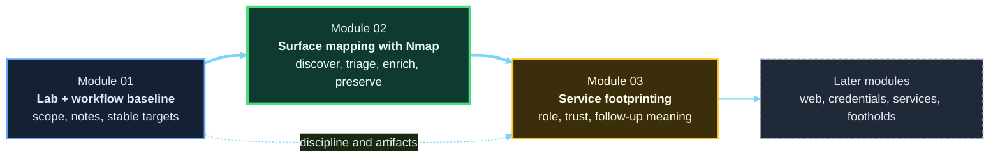

# Module 02 - Network Enumeration with Nmap

**Phase I - Orientation and Surface Mapping**

### Learn to turn the Module 01 lab into a disciplined scanning workflow with real artifacts, real follow-up questions, and repeatable hands-on reps.

*This module teaches host discovery, port scanning, enrichment, interpretation, and scan workflow design as one connected practice loop rather than a pile of unrelated flags.*

---

> **🧭 Start Here**
>
> Work through this module in order:
> [Lesson 2.1](lessons/module-02-lesson-2-1-how-network-scanning-works-and-why-nmap-matters.md) ->
> [Lesson 2.2](lessons/module-02-lesson-2-2-host-discovery-and-target-definition-in-practice.md) ->
> [Lesson 2.3](lessons/module-02-lesson-2-3-tcp-udp-and-port-state-interpretation.md) ->
> [Lesson 2.4](lessons/module-02-lesson-2-4-service-detection-os-clues-and-script-assisted-enumeration.md) ->
> [Lesson 2.5](lessons/module-02-lesson-2-5-saving-results-tuning-scans-and-building-a-repeatable-nmap-workflow.md) ->
> [Lab 01](labs/module-02-lab-01-repeatable-nmap-workflow.md).
>
> Do not wait until the final lab to touch the keyboard. Each lesson now includes a required checkpoint that updates the same shared assessment workspace from Module 01.

## Module Overview

Module 02 is the first point in the course where the learner uses the real course lab to answer live technical questions.

The job of this module is not just to teach Nmap syntax.
It is to teach how scanning works as a repeatable process of:

- choosing scope intentionally
- using the correct network position
- sending probes deliberately
- reading replies and silence carefully
- separating observation from inference
- preserving output as reusable evidence
- routing the next step into service-specific follow-up

This is the first real technical surface-mapping module in the course.
It establishes the habits that Module 03 and everything after it will depend on.

---

## At a Glance

| Area | Details |
|---|---|
| **Series** | Hack the Basics |
| **Phase** | Phase I - Orientation and Surface Mapping |
| **Module** | 02 - Network Enumeration with Nmap |
| **Role** | Foundational attack-surface mapping, scan interpretation, and first-pass host profiling |
| **Level** | Beginner to early intermediate |

| Builds On | Prepares Next | Core Artifacts |
|---|---|---|
| Module 01 workflow mindset, scope discipline, shared note workspace, and stable lab baseline | Module 03 service footprinting, later web recon, credential reasoning, and service triage | scan planning worksheet, saved scan outputs, host-tracking updates, follow-up queue entries, repeatable workflow lab, Nmap cheat sheet |

---

## Working Baseline for This Module

Module 02 assumes the learner is scanning from the environment established in Module 01.

| Layer | Expected baseline |
|---|---|
| Operator position | Kali WSL |
| Virtualization platform | VMware Workstation Pro on the Windows 11 host |
| Target subnet | `LAB-NET` on `192.168.57.0/24` |
| Canonical Windows targets | `GOAD-Mini-DC01` at `192.168.57.10`, `GOAD-Mini-WS01` at `192.168.57.31` |
| Canonical Linux target | `META-TGT` at `192.168.57.25` |

> **🧠 Mental Model**
>
> Module 01 created the lab, the note structure, and the reset model.
> Module 02 is where we start using that baseline as a real assessment environment instead of setup work.

---

## Why This Module Exists

Before a learner can reason about services, applications, identities, or attack paths, they need a reliable way to answer:

- what systems appear reachable from here?
- which ports behave as open, closed, or filtered?
- what evidence is strong, weak, or ambiguous?
- what should be saved for later comparison?
- what deserves deeper follow-up next?

That is the role of this module.

Nmap is the instrument.
Judgment is the real subject.

---

## Module Position in the Course

> **🧠 Mental Model**
>
> Module 01 gave us the assessment mindset and stable lab.
> Module 02 teaches us how to see the exposed surface from that lab.
> Module 03 teaches us how to interpret what that exposed surface means.

---

## Lesson Path

| Lesson | Role in the Journey | Required learner checkpoint |
|---|---|---|
| [Lesson 2.1](lessons/module-02-lesson-2-1-how-network-scanning-works-and-why-nmap-matters.md) | Builds the scanning mental model before commands take over | Complete the scan planning worksheet and define the first target question |
| [Lesson 2.2](lessons/module-02-lesson-2-2-host-discovery-and-target-definition-in-practice.md) | Teaches target definition and host discovery as one workflow | Save a discovery sweep and update host tracking with live hosts |
| [Lesson 2.3](lessons/module-02-lesson-2-3-tcp-udp-and-port-state-interpretation.md) | Explains TCP, UDP, port-state meaning, and filter-aware scan types | Run small focused scans and explain how scan type changed the evidence |
| [Lesson 2.4](lessons/module-02-lesson-2-4-service-detection-os-clues-and-script-assisted-enumeration.md) | Adds service, OS, and NSE-driven enrichment | Compare basic and enriched scans and capture service clues for Module 03 |
| [Lesson 2.5](lessons/module-02-lesson-2-5-saving-results-tuning-scans-and-building-a-repeatable-nmap-workflow.md) | Turns isolated commands into repeatable process, including quieter and more deliberate scan design | Build a reusable scan directory, naming convention, and handoff-ready note pattern |

---

## Shared Workspace Use

This module should write into the same `assessment-workspace/` created in Module 01.

Recommended working locations:

- `assessment-workspace/00-admin/scope.md`
- `assessment-workspace/00-admin/network-notes.md`
- `assessment-workspace/01-target-notes/host-tracking.md`
- `assessment-workspace/02-evidence/scans/m02/`
- `assessment-workspace/03-analysis/follow-up-queue.md`

If Module 02 creates artifacts anywhere else, the handoff into Module 03 becomes weaker immediately.

> **📝 Output Convention**
>
> Module 02 uses a short scan root to reduce typing friction:
> `assessment-workspace/02-evidence/scans/m02/`
>
> In command-heavy examples, we set:
> `M2SCAN=assessment-workspace/02-evidence/scans/m02`
> and save files like `meta-triage-YYYY-MM-DD` or `dc01-udp-YYYY-MM-DD`.

---

## What to Use During the Module

| Artifact | Purpose | When to use it |
|---|---|---|
| [Reference Cheat Sheet](references/module-02-reference-cheat-sheet.md) | Fast field reference for host discovery, scan types, interpretation, artifact capture, and baseline paths | During checkpoints, labs, and later review |
| [Scan Planning Worksheet](references/module-02-scan-planning-worksheet.md) | Helps the learner define scope, target lists, scan questions, output paths, and note destinations before running commands | At Lesson 2.1, Lesson 2.2, Lesson 2.5, and the module lab |
| [Module Lab](labs/module-02-lab-01-repeatable-nmap-workflow.md) | Pulls the full module into one guided operational workflow using the Module 01 baseline | After completing Lesson 2.5 |

---

## Reading and Practice Strategy

### If this is your first pass

1. Read the lessons in order.
2. Complete the lesson checkpoint before moving on.
3. Save output into the shared workspace instead of terminal-only experimentation.
4. Keep notes on observation, inference, validation, and next-step ideas.
5. Treat the final lab as synthesis, not your first time using Nmap in the module.

### If you are returning as a reference

- start with the [reference cheat sheet](references/module-02-reference-cheat-sheet.md)
- reopen the lesson that matches the confusion you are trying to resolve
- compare current scan output against the workflow patterns taught in Lesson 2.5
- use the lab if you need to rebuild your full scanning rhythm from scope to follow-up queue

---

## What Makes This Module Different

Most Nmap material teaches flags first.
This module teaches evidence first and then makes the learner use that evidence in the real course lab.

That means the center of the module is not:

- giant command dumps
- cargo-cult scan profiles
- placeholder labs with no artifact trail
- pretending scan output is objective truth

It is:

- scan intent
- packet-level reasoning
- uncertainty handling
- cumulative learner checkpoints
- output interpretation
- repeatable workflow design
- clean handoff into Module 03

---

## Module Navigation

| Previous | Next |
|---|---|
| [Module 01 - Orientation and Assessment Workflow](../01-orientation-and-assessment-workflow/README.md) | [Module 03 - Service Footprinting and Common Infrastructure Enumeration](../03-service-footprinting-and-common-infrastructure-enumeration/README.md) |

---

**Read this module like an operator: ask what the scan is proving, what it is only suggesting, where the evidence should be saved, and which service families deserve follow-up next.**

