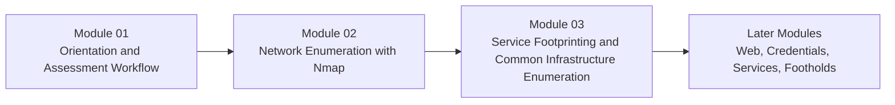

# Module 02 - Network Enumeration with Nmap

**Phase I - Orientation and Surface Mapping**

### Learn to read network behavior as evidence, not just run scans.

*This module turns Nmap from a command-line habit into a disciplined workflow for host discovery, port interpretation, service enrichment, and repeatable attack-surface mapping.*

---

> **🧭 Start Here**
>
> If you are new to this module, begin with [Lesson 2.1](lessons/module-02-lesson-2-1-how-network-scanning-works-and-why-nmap-matters.md), work straight through to Lesson 2.5, then use the [reference cheat sheet](references/module-02-reference-cheat-sheet.md) during labs and later review.

## Module Overview

Module 02 is where `Hack the Basics` moves from orientation into deliberate technical visibility.

The job of this module is not just to teach Nmap syntax.
It is to teach how scanning works as a process of:

- choosing scope intentionally
- sending probes deliberately
- reading replies and silence carefully
- separating observation from inference
- capturing output in a way that supports later follow-up

This is the first real technical surface-mapping module in the course.
It establishes the evidence habits that Module 03 and everything after it will depend on.

---

## At a Glance

| Area | Details |
|---|---|
| **Series** | Hack the Basics |
| **Phase** | Phase I - Orientation and Surface Mapping |
| **Module** | 02 - Network Enumeration with Nmap |
| **Role** | Foundational attack-surface mapping and scan interpretation |
| **Level** | Beginner to early intermediate |
| **Format** | Self-paced, Markdown-first, GitHub-native |

| Builds On | Prepares Next | Core Artifacts |
|---|---|---|
| Module 01 workflow mindset, scope discipline, note hygiene | Module 03 service footprinting, later web recon, credential reasoning, and service triage | scan planning worksheet, saved scan outputs, repeatable workflow lab, Nmap cheat sheet |

---

## Why This Module Exists

Before a learner can reason about services, applications, identities, or attack paths, they need a reliable way to answer:

- what systems appear reachable from here?
- which ports behave as open, closed, or filtered?
- what evidence is strong, weak, or ambiguous?
- what deserves deeper follow-up?

That is the role of this module.

Nmap is the instrument.
Judgment is the real subject.

---

## Module Position in the Course

> **🧠 Mental Model**
>
> Module 01 gave us the assessment mindset.
> Module 02 teaches us how to see the exposed surface.
> Module 03 teaches us how to interpret what that surface means.

---

## Lesson Path

| Lesson | Role in the Journey | What the learner leaves with |
|---|---|---|
| [Lesson 2.1](lessons/module-02-lesson-2-1-how-network-scanning-works-and-why-nmap-matters.md) | Builds the scanning mental model before commands take over | A clear probe -> observe -> infer -> validate framework |
| [Lesson 2.2](lessons/module-02-lesson-2-2-host-discovery-and-target-definition-in-practice.md) | Teaches target definition and host discovery as one workflow | A cleaner way to decide what is actually there |
| [Lesson 2.3](lessons/module-02-lesson-2-3-tcp-udp-and-port-state-interpretation.md) | Explains TCP, UDP, and port-state meaning | Better interpretation of open, closed, filtered, and ambiguous results |
| [Lesson 2.4](lessons/module-02-lesson-2-4-service-detection-os-clues-and-script-assisted-enumeration.md) | Adds service, OS, and NSE-driven enrichment | A stronger way to move from port states into host hypotheses |
| [Lesson 2.5](lessons/module-02-lesson-2-5-saving-results-tuning-scans-and-building-a-repeatable-nmap-workflow.md) | Turns isolated commands into repeatable process | Saved artifacts, scan hygiene, and a usable Nmap workflow |

---

## What to Use During the Module

| Artifact | Purpose | When to use it |
|---|---|---|
| [Reference Cheat Sheet](references/module-02-reference-cheat-sheet.md) | Fast field reference for host discovery, scan types, interpretation, and workflow rhythm | During labs, practice, and later review |
| [Scan Planning Worksheet](references/module-02-scan-planning-worksheet.md) | Helps learners define scope, target lists, and scan intent before running commands | Before or during Lesson 2.2 and Lesson 2.5 |
| [Module Lab](labs/module-02-lab-01-repeatable-nmap-workflow.md) | Pulls the module into a single end-to-end workflow | After completing Lesson 2.5 |

---

## Reading Strategy

### If this is your first pass

1. Read the lessons in order.
2. Run commands only after understanding what question the scan is asking.
3. Keep notes on observation, inference, and next-step ideas.
4. Save output files early instead of relying on terminal scrollback.

### If you are returning as a reference

- start with the [reference cheat sheet](references/module-02-reference-cheat-sheet.md)
- jump into the lesson that matches the confusion you are trying to resolve
- compare current scan output against the workflow patterns taught in Lesson 2.5

---

## What Makes This Module Different

Most Nmap material teaches flags first.
This module teaches evidence first.

That means the visual and instructional center of the module is not:

- giant command dumps
- cargo-cult scan profiles
- pretending scan output is objective truth

It is:

- scan intent
- packet-level reasoning
- uncertainty handling
- output interpretation
- repeatable workflow design

---

## Module Navigation

| Previous | Next |
|---|---|
| [Module 01 - Orientation and Assessment Workflow](../01-orientation-and-assessment-workflow/README.md) | [Module 03 - Service Footprinting and Common Infrastructure Enumeration](../03-service-footprinting-and-common-infrastructure-enumeration/README.md) |

---

**Read this module like an operator: ask what the scan is proving, what it is only suggesting, and what deserves follow-up next.**

