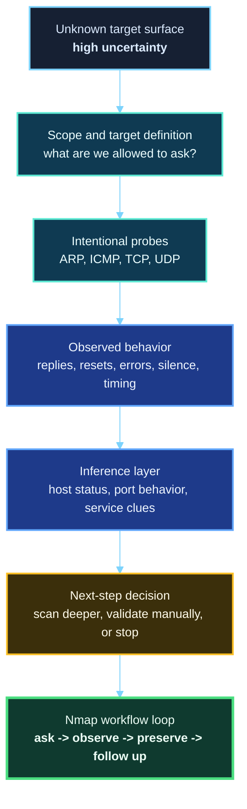
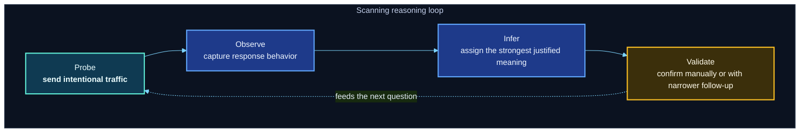
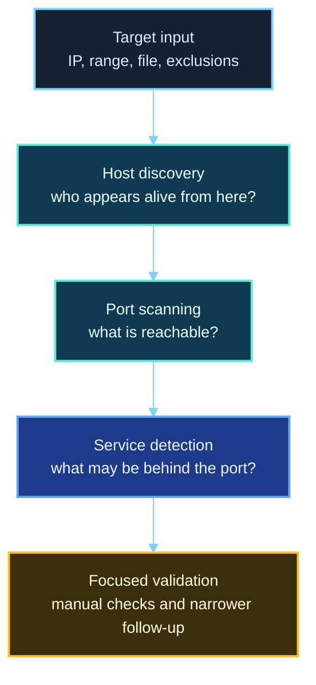
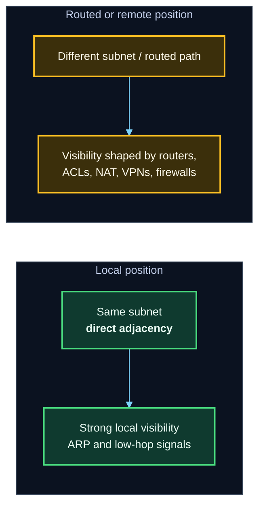
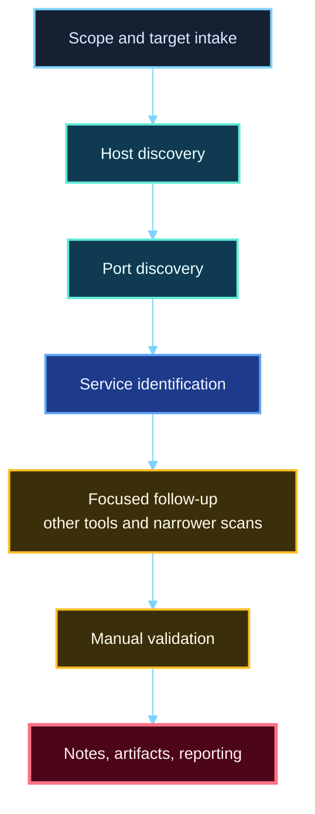

<div align="center">

**Hack the Basics · Phase I**

`Module 02 · Network Enumeration with Nmap`

</div>

# Lesson 2.1 — How Network Scanning Works and Why Nmap Matters

---

> **🎯 Lesson Objective**  
> By the end of this lesson, we will stop treating scanning like a mysterious black box and start understanding it as a deliberate process of **sending network probes, observing responses, and turning those observations into evidence**.

| **Course** | **Module** | **Lesson** | **Estimated Time** | **Difficulty** |
|---|---|---|---:|---|
| Hack the Basics | Module 02 — Network Enumeration with Nmap | 2.1 — How Network Scanning Works and Why Nmap Matters | 35–50 min | Beginner |

| **Prerequisites** | **You will practice** | **Main outcome** |
|---|---|---|
| Basic command-line use, basic networking vocabulary, basic IP addressing | Thinking from packets to conclusions, separating observation from inference, defining scan scope at a high level | Building the right scanning mental model before we move into practical host discovery and scan types |

> **🚨 Important**
>
> This lesson is deliberately foundational. We are not trying to memorize commands yet. We are building the model that makes every later Nmap lesson make sense.

---

## Table of Contents

- [Lesson Map](#lesson-map)
- [Why This Lesson Matters](#why-this-lesson-matters)
- [Learning Objectives](#learning-objectives)
- [The Real Problem Scanning Is Trying to Solve](#the-real-problem-scanning-is-trying-to-solve)
- [What Network Scanning Actually Observes](#what-network-scanning-actually-observes)
- [The Core Mental Model: Probe → Observe → Infer → Validate](#the-core-mental-model-probe--observe--infer--validate)
- [Host Discovery vs Port Scanning vs Service Detection](#host-discovery-vs-port-scanning-vs-service-detection)
- [What Different Responses Can Mean](#what-different-responses-can-mean)
- [Targets and Scope: What Are We Actually Scanning?](#targets-and-scope-what-are-we-actually-scanning)
- [Local Networks vs Routed and Remote Networks](#local-networks-vs-routed-and-remote-networks)
- [Why Target Definition Matters More Than Beginners Expect](#why-target-definition-matters-more-than-beginners-expect)
- [Why Nmap Matters in Real Assessments](#why-nmap-matters-in-real-assessments)
- [Where Nmap Fits in the Workflow](#where-nmap-fits-in-the-workflow)
- [First Target Definition Walkthrough](#first-target-definition-walkthrough)
- [Read a Simple Scan Result Like an Analyst](#read-a-simple-scan-result-like-an-analyst)
- [Stop and Think](#stop-and-think)
- [Common Mistakes and Misconceptions](#common-mistakes-and-misconceptions)
- [Defender’s View](#defenders-view)
- [Key Takeaways](#key-takeaways)
- [Knowledge Check Quiz](#knowledge-check-quiz)
- [Quiz Answers](#quiz-answers)
- [Mini Practice Task](#mini-practice-task)
- [Next Lesson Bridge](#next-lesson-bridge)

---

## Lesson Map



> **💡 Tip**
>
> This lesson is about *how scanning works*, not just *how to run a scanner*. That distinction is what separates “I ran a command” from “I understand the evidence.”

---

## Why This Lesson Matters

When beginners first meet Nmap, they often absorb the wrong idea too early.

They think:

- “Nmap checks ports.”
- “Nmap tells me what services are there.”
- “Nmap is the first thing you run.”

Those ideas are not completely wrong, but they are too shallow to support real enumeration.

The real value of scanning is that it helps us reduce uncertainty.

Before we probe a target, we may not know:

- whether the host is even reachable
- whether it exists on the network path we think it does
- which ports respond at all
- whether the lack of a response means closed, filtered, rate-limited, or simply not visible from our position
- which systems deserve deeper follow-up first

Scanning exists to help answer those questions.

That is why this lesson comes first in Module 2. Before we learn host discovery flags, TCP scan types, UDP reality, service detection, and NSE workflows, we need to understand what a scanner is actually doing on the wire and why that behavior matters.

> **📝 Note**
>
> Good scanning is not about generating output. Good scanning is about creating trustworthy evidence that helps you choose the next move.

---

## Learning Objectives

By the end of this lesson, we should be able to:

- explain what network scanning is really doing at a high level
- distinguish between host discovery, port scanning, and service detection
- describe how replies, resets, ICMP errors, and timeouts affect interpretation
- define targets and scan scope in a more deliberate way
- explain why scanning results are partly observation and partly inference
- place Nmap in a realistic enumeration workflow

---

## The Real Problem Scanning Is Trying to Solve

At the beginning of an assessment, the environment is mostly unknown.

We may have:

- a single IP address
- a hostname
- a subnet range
- a list of targets from scope documentation
- a foothold on one system and a guess that more systems exist nearby

But none of that automatically tells us what is reachable from where we are standing.

That is the problem scanning helps solve.

### Scanning is about visibility

A scanner is not reading a magical inventory database.

It is trying to learn, from our current network position:

- which systems respond
- which network paths appear reachable
- which ports accept or reject traffic
- which services reveal identifying behavior
- where ambiguity remains

That means scanning is always tied to **perspective**.

What you can see from:

- your Kali WSL instance on the same subnet
- a cloud host on the public internet
- a pivot host inside an internal segment
- a VPN-connected position

...may be very different.

> **🚨 Important**
>
> A scan result is not a universal truth about the target.  
> It is a statement about what the target looked like **from your current position, with your current probe choices, at that moment in time**.

### Think of scanning like asking structured questions

We can frame scanning as a sequence of practical questions:

1. **Is anything there?**
2. **Can I reach it from here?**
3. **Which ports behave like they are open, closed, or filtered?**
4. **What service clues appear behind those ports?**
5. **What should I validate manually next?**

This turns scanning from “run tool, read output” into “ask question, collect evidence, choose next step.”

---

## What Network Scanning Actually Observes

At a high level, scanning works by sending traffic on purpose and paying attention to what comes back.

That may sound obvious, but this is where the right mindset begins.

A scanner does not directly observe:

- the full internal configuration of the target
- the exact application code behind a service
- every firewall rule in the path
- whether a service is securely configured

Instead, it observes **behavior**.

### What kinds of behavior can be observed?

Depending on the probe, a scanner may observe:

- an ARP reply
- an ICMP echo reply
- an ICMP unreachable message
- a TCP SYN/ACK
- a TCP RST
- a UDP response
- a banner or protocol-specific reply
- no response at all
- delayed responses or timing anomalies

That behavior becomes raw evidence.

### What can we learn from that behavior?

From these observations, we may infer things like:

- the host appears alive
- the host may be ignoring one probe type but responding to another
- the port appears open
- the port appears closed
- a filter or firewall is likely interfering
- the service resembles SSH, HTTP, SMB, DNS, and so on
- the host stack behaves somewhat like a specific OS family

That final step matters: much of scanning is not direct certainty. It is **disciplined inference**.

| **What the scanner sees** | **What it may infer** |
|---|---|
| ARP reply | A host on the local network is alive at that IP |
| TCP SYN/ACK from a target port | That port appears open for TCP |
| TCP RST | That port appears closed for TCP |
| ICMP destination unreachable | A host or network control is rejecting or blocking traffic |
| No response | The port may be filtered, the host may be silent, or the network path may hide visibility |
| Banner-like response | The service may match a known protocol or version |

> **⚠️ Warning**
>
> Silence is not simple. A lack of response does **not** automatically mean “nothing is there.” It may mean the target, service, or network control chose not to answer in a way we can easily interpret.

---

## The Core Mental Model: Probe → Observe → Infer → Validate

This is the mental model we will return to throughout the entire module.



### 1. Probe

We choose what to send.

Examples include:

- ARP requests
- ICMP echo requests
- TCP SYN packets
- TCP ACK packets
- UDP packets
- version-detection probes
- script-driven protocol interactions

Each probe asks a slightly different question.

### 2. Observe

We look at how the environment responds.

This includes not just obvious replies, but also:

- the type of reply
- whether the reply is immediate or delayed
- whether the response comes from the target or a filtering device
- whether nothing returns at all

### 3. Infer

Based on that behavior, the scanner forms a classification.

Examples:

- host appears up
- port appears open
- port appears closed
- port appears filtered
- service looks like HTTP or SSH
- OS clues suggest a particular family

### 4. Validate

This is where mature enumeration begins.

We should often follow scan output with:

- manual connection attempts
- protocol-aware clients
- browser interaction
- banner grabbing
- packet capture
- targeted service enumeration

> **🚨 Important**
>
> Scanners help us prioritize effort. They do not remove the need for judgment.

---

## Host Discovery vs Port Scanning vs Service Detection

One of the easiest ways to stay mentally organized is to separate these stages clearly.

Many beginners flatten them into one idea called “scanning.”

That creates confusion later.



### Host discovery

This stage asks:

- Is the host alive?
- Does anything at this address respond meaningfully?
- Which systems in this target set appear reachable?

This is not yet the same thing as identifying open services.

### Port scanning

This stage asks:

- Which ports respond as open?
- Which ports respond as closed?
- Which ports appear filtered or ambiguous?

This is about exposed transport-level surface.

### Service detection

This stage asks:

- What is probably listening behind the open port?
- Can we identify service family or version clues?
- Is the service standard, proxied, disguised, or uncertain?

This is where the scanner starts moving from transport visibility into application clues.

| **Stage** | **Main question** | **Typical outcome** |
|---|---|---|
| Host discovery | Is the system alive and reachable? | Up/down evidence |
| Port scanning | Which ports are exposed from here? | Open/closed/filtered states |
| Service detection | What appears to be listening? | Protocol and version clues |

> **💡 Tip**
>
> Keeping these stages separate makes output easier to reason about later. A host can be up even if most ports are filtered. A port can be open even if service detection remains uncertain.

---

## What Different Responses Can Mean

To use scanners well, we need to become comfortable with the idea that **different network reactions mean different things**.

### Meaningful reply

A meaningful reply often gives strong evidence.

Examples include:

- ARP reply on a local network
- ICMP echo reply
- TCP SYN/ACK from a port
- application banner or recognizable service response

These usually reduce uncertainty quickly.

### Reset response

A TCP RST is also useful.

Why?

Because it often means:

- the host is there
- the target stack processed the packet
- the specific port is not accepting connections in the way an open service would

So even a “closed” answer is still valuable evidence.

### ICMP error or unreachable message

ICMP errors may suggest:

- host unreachable
- port unreachable
- administratively prohibited behavior
- network filtering or path-based rejection

The details matter, but the high-level lesson is simple: ICMP often helps explain *why* a connection did not succeed.

### No response at all

This is where beginners make the biggest mistakes.

No response can mean many things:

- the host is down
- the port is filtered
- the firewall silently dropped the packet
- the service is rate-limiting or not responding to that probe type
- the path between you and the target is hiding information

Silence is data, but it is ambiguous data.

### Timing behavior

The speed and consistency of responses can also matter.

Timing may hint at:

- local vs remote proximity
- packet loss
- rate limiting
- filtering behavior
- unstable paths

We should be careful not to overinterpret latency, but we also should not ignore timing completely.

| **Observed behavior** | **What it often suggests** | **What to remember** |
|---|---|---|
| Direct reply | Strong evidence of reachability or service behavior | Good evidence, but still context-dependent |
| RST | The target stack rejected the attempt | Often means closed, not invisible |
| ICMP error | A path or host-level rejection occurred | Useful for interpretation, especially with UDP and filtered paths |
| No response | Ambiguity remains | Silence is not proof of absence |
| Slow or inconsistent reply | Network conditions or controls may be affecting visibility | Timing helps, but is not a final answer by itself |

---

## Targets and Scope: What Are We Actually Scanning?

Before scanning can be done well, target definition has to be done well.

This sounds administrative, but it is actually technical.

A poorly defined target set creates:

- wasted scan time
- noisy output
- missed systems
- accidental out-of-scope behavior
- confusion about what results mean

### Common target shapes

In practice, targets are often provided as:

- a single IP address
- a hostname
- a subnet or CIDR range
- a list of addresses in a file
- a scope set with exclusions

### Example target expressions

These examples are just to build comfort with what target definition can look like.

```bash
nmap 192.168.57.25
nmap 192.168.57.0/24
nmap 192.168.57.10,25,31
nmap -iL assessment-workspace/02-evidence/scans/m02/targets.txt
nmap 192.168.57.0/24 --exclude 192.168.57.31
```

### What target definition should make us ask

Before scanning, we should think:

- Is this a single host problem or a subnet visibility problem?
- Are we defining scope narrowly enough to stay disciplined?
- Are we excluding systems we should not touch?
- Are hostnames resolving where we think they resolve?
- Am I scanning from the right network position for this question?

> **📝 Note**
>
> “What do I want to learn?” should shape “What exactly am I targeting?”

---

## Local Networks vs Routed and Remote Networks

Not every target behaves the same way from every location.

This matters a lot in scanning.

### Local network context

If you are on the same local Layer 2 segment, you may benefit from:

- ARP-based discovery
- low-latency responses
- stronger confidence about whether a host is physically present on that subnet

### Routed or remote context

If the target is behind routers, firewalls, VPN boundaries, or network controls, then visibility may change because:

- ARP is no longer relevant end-to-end
- ICMP may be filtered
- some TCP probe types may work better than others
- intermediate devices may answer, block, or modify behavior
- latency and routing complexity affect interpretation



### Why this matters for beginners

A new learner may run the same scan from two different places and get different results, then assume one of the scans is “wrong.”

Sometimes neither is wrong.

They are simply showing:

- different vantage points
- different network controls
- different reachable surfaces

> **🚨 Important**
>
> Scanning is always tied to network position.  
> Where you scan from is part of the evidence.

---

## Why Target Definition Matters More Than Beginners Expect

Many scanning problems begin *before* the first probe is ever sent.

### Mistargeting wastes effort

If we scan a wide subnet when we only need a few systems, we create noise.

If we scan too narrowly, we miss relationships between hosts.

If we forget exclusions, we create avoidable risk.

### Good scope definition improves interpretation

Suppose we scan:

- a single host because we are validating one ticketed asset
- an entire `/24` because we are mapping a lab segment
- a set of internal addresses from a pivot host because we suspect hidden services deeper in the environment

Those are different jobs.

The same tool may be used in all three cases, but the **goal**, **volume**, and **interpretation strategy** change.

### Real operators think about scan cost

Every scan has a cost in:

- time
- network noise
- analyst attention
- output review effort
- potential detection surface

That does not mean “never scan broadly.”

It means broad scans should be intentional, not lazy.

| **Poor habit** | **Stronger habit** |
|---|---|
| “Just scan everything.” | Define the smallest target set that answers the current question. |
| “One IP is enough; I don’t need context.” | Decide whether neighboring hosts or the broader segment matter. |
| “The command is what matters.” | The command should match the question and the scope. |
| “If the scan returned little, there must be little there.” | Ask whether the target definition or vantage point limited what you could observe. |

---

## Why Nmap Matters in Real Assessments

Now that we have the mental model for scanning itself, we can answer a more practical question:

Why does **Nmap** matter so much?

Because Nmap is one of the most flexible and battle-tested tools for turning the scanning process into a repeatable workflow.

### What Nmap gives us

Nmap helps us perform and combine:

- host discovery
- port scanning
- service detection
- OS fingerprinting
- script-assisted enumeration
- structured output and artifact capture
- workflow tuning for different environments

That combination is what makes it foundational.

Nmap is not just useful because it can scan.
It is useful because it helps us move from:

> “I know almost nothing about this target”

to:

> “I now have a defensible map of what appears reachable and what deserves deeper investigation.”

### Nmap is a workflow bridge

In a real assessment, Nmap often sits between initial scope input and later specialized enumeration.

For example:

- Nmap identifies open web services that later drive browser recon and proxy work.
- Nmap identifies SSH, SMB, DNS, SMTP, or database services that later drive protocol-specific enumeration.
- Nmap helps show which systems are worth revisiting from a pivot host later.

This is why Nmap shows up early in so many workflows: it helps convert unknown space into prioritized next steps.

> **💡 Tip**
>
> The value of Nmap is not that it ends the investigation.  
> The value of Nmap is that it tells us **where deeper investigation should begin**.

---

## Where Nmap Fits in the Workflow

Scanning is not the whole assessment.
Nmap is not the whole workflow.

But it is a major early engine inside that workflow.



### In plain language

A common rhythm looks like this:

1. define the target set
2. identify likely live hosts
3. identify exposed ports
4. identify likely services
5. prioritize the most meaningful surfaces
6. move into service-specific or web-specific follow-up
7. preserve evidence and notes

### Why this ordering matters

Later modules depend on this discipline.

We cannot enumerate services well if we do not first know what is exposed.
We cannot test web targets well if we do not first identify the relevant web surfaces.
We cannot prioritize credential operations well if we do not know where authentication surfaces exist.

That is why this module exists this early in the course spine.

---

## First Target Definition Walkthrough

Before we go deeper into practical discovery in the next lesson, let’s look at a few target patterns and what they imply.

### Example 1: A single host

```bash
nmap 192.168.57.25
```

This is often appropriate when:

- a lab gives us one target
- a ticket or scope statement names one asset
- we are validating one system before broadening

### Example 2: A subnet

```bash
nmap 192.168.57.0/24
```

This is often appropriate when:

- we are mapping a local lab segment
- we need context across a full range
- we are performing discovery before narrowing focus

### Example 3: A curated list of targets

```bash
nmap -iL assessment-workspace/02-evidence/scans/m02/targets.txt
```

This is useful when:

- scope arrives as a list
- targets come from recon notes
- we want repeatable, controlled scan sets

### Example 4: A target set with exclusions

```bash
nmap 192.168.57.0/24 --exclude 192.168.57.31
```

This is useful when:

- one system is out of scope
- one host is fragile or intentionally excluded
- we need to preserve discipline while scanning the rest of the segment

### The lesson here

The syntax matters, but the more important idea is:

> **Target definition is part of the analysis, not just setup.**

---

## Read a Simple Scan Result Like an Analyst

We are not going deep into scan types yet, but we *can* start practicing how to think about output.

Consider this example:

```text
Starting Nmap 7.xx ( https://nmap.org ) at 2026-03-29 12:00 UTC
Nmap scan report for 192.168.57.25
Host is up (0.0018s latency).
Not shown: 998 closed tcp ports
PORT    STATE SERVICE
22/tcp  open  ssh
80/tcp  open  http
Nmap done: 1 IP address (1 host up) scanned in 1.84 seconds
```

### What we can say with reasonable confidence

- The target responded in a way that let Nmap classify it as up.
- A large default set of TCP ports was scanned.
- Port 22 behaved as open and was labeled as SSH.
- Port 80 behaved as open and was labeled as HTTP.
- Most scanned TCP ports were closed.

### What we should not pretend this tells us completely

- whether the SSH service is standard or hardened
- whether the HTTP service is a normal public site, a redirector, or a custom app
- whether UDP services also matter here
- whether filtered or segmented services might exist elsewhere in the environment
- whether the current vantage point reveals the host’s full exposure

### Analyst mindset

When reading scan output, ask:

1. What did the scanner directly observe?
2. What is it inferring from that behavior?
3. What should I validate next?

That habit keeps us from treating scanner output like magic.

---

## Stop and Think

Pause here and reason through these before revealing the guidance.

### Question 1

If a scan shows no response from a target host, does that prove the host does not exist?

<details>
<summary><strong>✅ Reveal guidance</strong></summary>

No.

It may mean the host is down, but it may also mean:

- a firewall dropped the probe
- the host ignored that probe type
- your vantage point was limited
- the path between you and the target prevented visibility

Silence is ambiguous.

</details>

### Question 2

If a port returns a TCP RST, was the scan useless?

<details>
<summary><strong>✅ Reveal guidance</strong></summary>

No.

A reset is still evidence.
It often means the host is there and that the specific port is closed for the probe you sent.
That is useful information.

</details>

### Question 3

If Nmap labels a service as `http`, should we assume we fully understand the application behind it?

<details>
<summary><strong>✅ Reveal guidance</strong></summary>

No.

It tells us the behavior is consistent with HTTP, which is valuable. But we still need to browse it, inspect headers, observe redirects, map routes, and validate what kind of application it actually is.

</details>

### Question 4

If two scans from two different machines produce different results, does one of them have to be wrong?

<details>
<summary><strong>✅ Reveal guidance</strong></summary>

Not necessarily.

They may reflect different network positions, filtering rules, routing paths, or visibility constraints. Scanning results are viewpoint-dependent.

</details>

---

## Common Mistakes and Misconceptions

> **⚠️ Warning**
>
> These mistakes are common precisely because scanning feels deceptively simple on the surface.

### Mistake 1: Treating scanning like magic

This sounds like:

- “The tool just knows what is there.”
- “If it says open, I’m done.”
- “If it says nothing, nothing is there.”

Reality: scanners send probes, observe behavior, and classify the result.

---

### Mistake 2: Confusing host discovery with service discovery

A host being up does **not** mean we know which services matter.
An open port does **not** mean we understand the application behind it.

These are different stages.

---

### Mistake 3: Ignoring vantage point

A result from:

- an external host
- a VPN position
- a pivot host inside the environment
- a machine on the same subnet

...may differ dramatically.

That is not a bug. That is network reality.

---

### Mistake 4: Scanning without thinking about target definition

Beginners often focus on flags and forget the more important question:

> “Am I even scanning the right thing, from the right place, for the right reason?”

---

### Mistake 5: Treating all non-responses the same

No response is not automatically “closed.”
No response is not automatically “down.”

Silence often means uncertainty.

---

### Mistake 6: Forgetting that output must lead somewhere

The scan is not the accomplishment.
The accomplishment is using the scan to decide what to investigate next.

---

## Defender’s View

It helps to remember that scanning is not only meaningful to the operator. It is also meaningful to the environment receiving the traffic.

From a defender’s perspective, scanning may appear as:

- bursts of connection attempts across many ports
- repeated SYN traffic
- unusual ICMP activity
- periodic service probes and banner checks
- a host touching many internal systems in quick succession

Why does this matter?

Because it reminds us that scanning:

1. creates observable traffic
2. can be rate-limited, filtered, or alerted on
3. should be used deliberately and professionally

Even in lab environments, it is worth asking:

- what would this look like in logs?
- what would a firewall see?
- what would an IDS or EDR sensor infer?

That mindset improves both offense and defense.

---

## Key Takeaways

> **💡 Tip**
>
> If you only keep a few ideas from this lesson, keep these.

- Scanning is a process of sending probes, observing behavior, and making disciplined inferences.
- Host discovery, port scanning, and service detection are related but distinct stages.
- Replies, resets, ICMP errors, and silence all carry meaning.
- Silence is often ambiguous, not definitive.
- Network position shapes what a scan can reveal.
- Nmap matters because it turns this process into a repeatable reconnaissance workflow.
- Good scanning is not about producing output. It is about creating trustworthy next steps.

### What changed in our understanding?

| **Before this lesson, we might have thought...** | **After this lesson, we should understand...** |
|---|---|
| “Scanning means checking ports.” | Scanning is a broader evidence-gathering process tied to probes and responses. |
| “No reply means nothing is there.” | No reply often means uncertainty, filtering, or limited visibility. |
| “Nmap gives me the answer.” | Nmap gives evidence that helps us choose the next question. |
| “The command is the skill.” | The skill is matching scope, probe choice, and interpretation to the problem. |

---

## Knowledge Check Quiz

### 1. What is the most accurate description of network scanning in this course?

A. Reading the target’s internal configuration directly  
B. Sending deliberate probes and interpreting the resulting behavior  
C. Exploiting services automatically  
D. Capturing only passive traffic without interacting with the target

---

### 2. Which sequence best describes the mental model for this module?

A. Guess → brute force → confirm  
B. Probe → observe → infer → validate  
C. Scan → trust → exploit  
D. Ping → exploit → report

---

### 3. Which stage is primarily about determining whether a system appears alive?

A. Host discovery  
B. Service detection  
C. Exploitation  
D. Privilege escalation

---

### 4. What can a TCP RST often tell us?

A. The target definitely runs HTTP  
B. The host does not exist  
C. The target stack rejected the attempt and the port may be closed  
D. The scanner failed and should be ignored

---

### 5. Why is “no response” dangerous to overinterpret?

A. Because all targets always answer eventually  
B. Because silence can result from filtering, path visibility, or probe mismatch, not just absence  
C. Because scanners do not record timeouts  
D. Because no response always means open

---

### 6. Why does target definition matter before scanning?

A. Because it only affects report formatting  
B. Because it determines the legal department’s mood  
C. Because it shapes what question we are asking, what systems we touch, and how meaningful the output will be  
D. Because target definition replaces the need for scanning

---

### 7. Why is Nmap foundational in assessments?

A. Because it guarantees exploitation  
B. Because it combines discovery, classification, and structured follow-up support in one workflow tool  
C. Because it is only useful for web applications  
D. Because it sees inside systems without needing network interaction

---

## Quiz Answers

<details>
<summary><strong>Reveal quiz answers</strong></summary>

### 1. Correct answer: B

Scanning is best understood as sending deliberate probes and interpreting the resulting behavior.

### 2. Correct answer: B

The core model is:

**Probe → Observe → Infer → Validate**

### 3. Correct answer: A

Host discovery asks whether a system appears alive and reachable.

### 4. Correct answer: C

A TCP RST is often useful evidence that the target processed the packet and rejected the attempt, which commonly indicates a closed port.

### 5. Correct answer: B

Silence is ambiguous. It may reflect filtering, path limitations, or a probe type the target chose not to answer.

### 6. Correct answer: C

Target definition is part of the analysis. It determines what question we are asking and how meaningful the resulting evidence will be.

### 7. Correct answer: B

Nmap is foundational because it supports discovery, classification, and structured follow-up in a repeatable workflow.

</details>

---

## Mini Practice Task

> **🚨 Important**
>
> This is a thinking exercise first. The goal is not to perform a massive scan. The goal is to practice matching a scan to a question.

### Task

Using the Module 01 baseline, complete the [scan planning worksheet](../references/module-02-scan-planning-worksheet.md) for one of the following:

- a full discovery pass against `LAB-NET` on `192.168.57.0/24`
- a first-pass scan of `META-TGT` at `192.168.57.25`
- a first-pass scan of `GOAD-Mini-DC01` at `192.168.57.10`

Before you run anything beyond a tiny validation command, answer these questions in your notes:

1. What exact question am I trying to answer with this first scan?
2. Why is this the right target set for that question?
3. Why is Kali WSL the correct current vantage point?
4. Where will the saved output go inside `assessment-workspace/`?
5. What would count as direct observation, and what would still be only inference?
6. What should happen next if the result is ambiguous?

### Suggested note-taking template

| **Question** | **My answer** |
|---|---|
| What is my target set? |  |
| Why this scope? |  |
| What is my vantage point? | Kali WSL on `LAB-NET` |
| Where will I save the output? | `assessment-workspace/02-evidence/scans/m02/` |
| What useful responses do I expect? |  |
| What kinds of ambiguity may appear? |  |
| What would I do after the first scan? |  |

> **💡 Tip**
>
> If you build this habit now, later scan tuning becomes much more intentional. You will stop firing commands into the dark and start asking deliberate network questions.

---

## Next Lesson Bridge

In this lesson, we built the conceptual model for scanning.

In the next lesson, we will turn that model into action by focusing on **host discovery and target definition in practice**.

That means we will start answering:

- how do we identify live systems efficiently?
- what discovery methods work in different situations?
- how do we define targets cleanly using ranges, files, CIDR notation, and exclusions?
- what tradeoffs appear when visibility is limited?

> **📝 Note**
>
> Think of this lesson as the “how scanning works” foundation.  
> The next lesson is where we begin turning that foundation into deliberate discovery technique.

---

## End-of-Lesson Recap

> **One-sentence summary:**  
> Network scanning is the disciplined process of sending targeted probes, interpreting how systems respond, and using those observations to map reachable surface and choose the next step.

---
