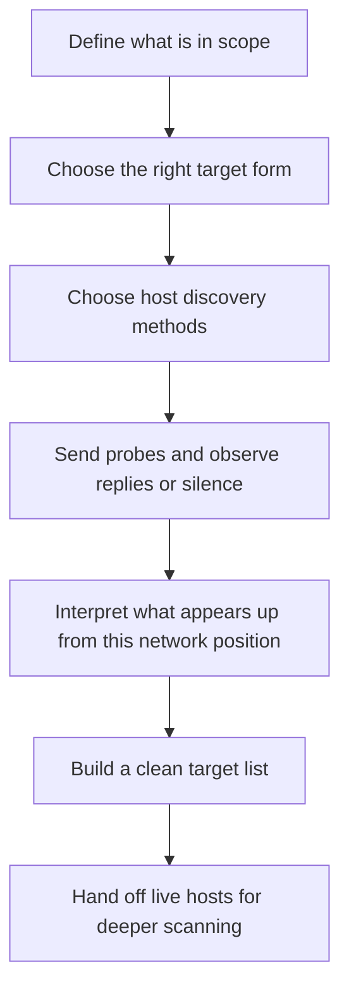
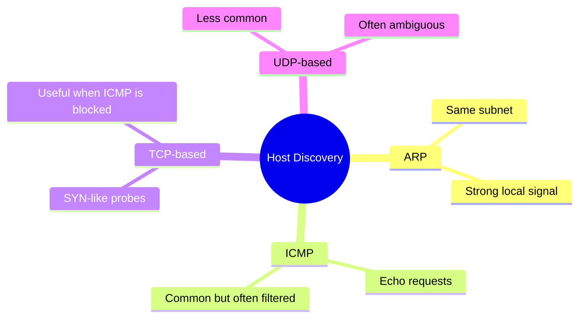
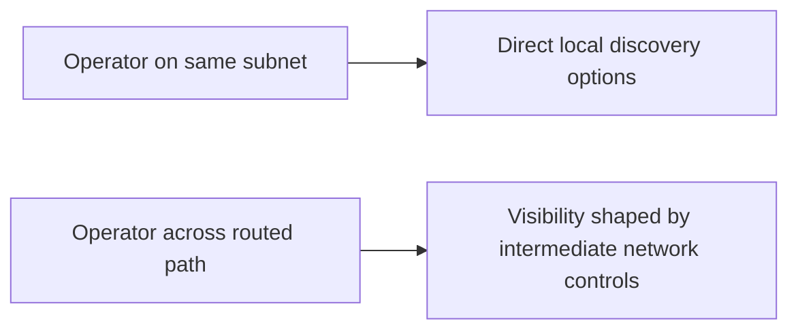
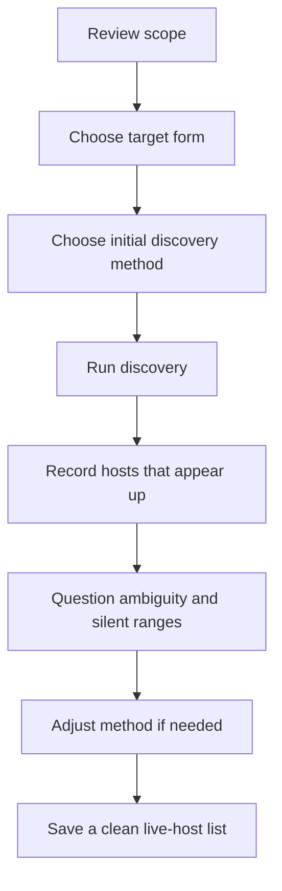

<div align="center">

**Hack the Basics · Phase I**

`Module 02 · Network Enumeration with Nmap`

</div>

# Lesson 2.2 — Host Discovery and Target Definition in Practice

---

> **🎯 Lesson Objective**  
> By the end of this lesson, we will be able to treat host discovery as a deliberate process of **defining the right target set, choosing sensible discovery methods, and interpreting silence and replies without fooling ourselves**.

| **Course** | **Module** | **Lesson** | **Estimated Time** | **Difficulty** |
|---|---|---|---:|---|
| Hack the Basics | Module 02 — Network Enumeration with Nmap | 2.2 — Host Discovery and Target Definition in Practice | 40–55 min | Beginner |

| **Prerequisites** | **You will practice** | **Main outcome** |
|---|---|---|
| Lesson 2.1, basic command-line use, basic IP addressing and subnet awareness | Defining targets, running host discovery, interpreting which systems appear alive from your current position | Building a clean, repeatable workflow for answering the question: **what is actually here, and what should I scan next?** |

> **🚨 Important**
>
> This lesson is not about “finding every host on earth.” It is about building disciplined host discovery habits so that later scans are faster, cleaner, and more trustworthy.

---

## Table of Contents

- [Lesson Map](#lesson-map)
- [Why This Lesson Matters](#why-this-lesson-matters)
- [Learning Objectives](#learning-objectives)
- [The Practical Problem This Lesson Solves](#the-practical-problem-this-lesson-solves)
- [What Host Discovery Actually Tries to Answer](#what-host-discovery-actually-tries-to-answer)
- [Why Target Definition and Host Discovery Belong Together](#why-target-definition-and-host-discovery-belong-together)
- [Common Ways to Define Targets in Nmap](#common-ways-to-define-targets-in-nmap)
- [Discovery Method Families at a Glance](#discovery-method-families-at-a-glance)
- [ARP Discovery on Local Networks](#arp-discovery-on-local-networks)
- [ICMP-Based Discovery](#icmp-based-discovery)
- [TCP-Based Discovery](#tcp-based-discovery)
- [UDP-Based Discovery](#udp-based-discovery)
- [Why Network Position Changes the Result](#why-network-position-changes-the-result)
- [False Negatives, Silent Hosts, and Rate Limiting](#false-negatives-silent-hosts-and-rate-limiting)
- [A Practical Host Discovery Workflow](#a-practical-host-discovery-workflow)
- [First Command Walkthrough: A Basic Discovery Sweep](#first-command-walkthrough-a-basic-discovery-sweep)
- [Read the Output Like an Analyst](#read-the-output-like-an-analyst)
- [Second Walkthrough: Using Target Lists and Exclusions](#second-walkthrough-using-target-lists-and-exclusions)
- [Stop and Think](#stop-and-think)
- [Common Mistakes and Misconceptions](#common-mistakes-and-misconceptions)
- [Defender’s View](#defenders-view)
- [Key Takeaways](#key-takeaways)
- [Knowledge Check Quiz](#knowledge-check-quiz)
- [Quiz Answers](#quiz-answers)
- [Mini Practice Task](#mini-practice-task)
- [Next Lesson Bridge](#next-lesson-bridge)

---

## Lesson Map



> **💡 Tip**
>
> Good host discovery saves time twice: first by reducing waste, and second by making later scan results easier to reason about.

---

## Why This Lesson Matters

Before we can ask deeper questions about open ports, services, or operating systems, we need to answer a simpler question first:

**which systems appear to be there at all?**

That sounds basic, but it is one of the easiest places to make bad assumptions.

A beginner may scan a subnet, see only a few replies, and conclude:

- “Only these hosts exist.”
- “Everything else must be down.”
- “If it didn’t answer my first probe, it probably isn’t important.”

That is dangerous thinking.

A host discovery result is shaped by:

- your network position
- the probe types you chose
- the firewall and filtering behavior in the path
- the host’s own response policy
- timing, packet loss, and rate limiting

So the point of this lesson is not just to run `nmap -sn`.

The point is to understand how to:

- define the right target set
- choose sensible discovery methods
- interpret replies carefully
- avoid mistaking **silence** for **absence**
- leave behind a clean list of live hosts for the next phase

> **📝 Note**
>
> Host discovery is not glamorous, but it is one of the cleanest examples of professional enumeration: narrow the question, gather evidence, preserve the result, and move forward deliberately.

---

## Learning Objectives

By the end of this lesson, we should be able to:

- explain what host discovery is trying to prove
- define targets using IPs, ranges, CIDR notation, files, and exclusions
- distinguish between ARP, ICMP, TCP-based, and UDP-based discovery methods
- explain why the same host may appear visible from one position and invisible from another
- recognize why false negatives happen during discovery
- build a small, repeatable workflow for identifying live systems before deeper scans

---

## The Practical Problem This Lesson Solves

Imagine we are given a small lab subnet and told:

> “Find out what is alive and prepare a clean target list for enumeration.”

That assignment sounds simple.

But several questions immediately appear:

- Are we on the same subnet as the targets, or reaching them through routers?
- Should we scan one IP, a range, or a file of targets?
- Are there exclusions we must avoid touching?
- Which discovery method will actually work well from where we are?
- If some hosts stay silent, are they really down, or just hard to observe?

That is the real job of Lesson 2.2.

We are learning how to move from:

- a vague target space

into:

- a cleaner, evidence-based set of hosts worth scanning next

This is where target discipline starts becoming part of technical skill rather than just project administration.

---

## What Host Discovery Actually Tries to Answer

Host discovery is the stage where we ask:

- Does anything at this address respond meaningfully?
- Which systems in this target set appear reachable from here?
- Which discovery method gives us the strongest signal in this environment?
- What should count as enough evidence that a host is “up” for our purposes?

That last point matters.

In many real environments, “up” does **not** mean:

- every port is visible
- every protocol responds
- the host will answer ping
- the host is easy to enumerate

Instead, it usually means something narrower:

> **we have enough evidence from one or more probes to say this address appears to correspond to a live system from our current vantage point**.

### Host discovery is not port scanning

Host discovery comes before deeper port work.

Its job is not to tell us:

- which service is running on port 80
- whether TCP 22 is open
- what OS family is likely present

Its job is to answer the more foundational question:

- **which addresses are worth that deeper attention at all?**

| **Question** | **Stage** |
|---|---|
| Is anything there? | Host discovery |
| Which ports are reachable? | Port scanning |
| What is behind the port? | Service detection |
| What should I manually validate? | Follow-up enumeration |

> **🚨 Important**
>
> Host discovery narrows the field. It does not complete the investigation.

---

## Why Target Definition and Host Discovery Belong Together

Many beginners think target definition is separate from technical scanning.

In practice, they are tightly connected.

If we define targets poorly, we create problems such as:

- scanning far more systems than we actually need
- missing important systems because our range is incomplete
- confusing ourselves with noisy output
- accidentally touching excluded systems
- wasting time on hosts that were never relevant

### Host discovery is only as good as the target set

Suppose we are given:

- one IP address
- a small `/24` subnet
- a hostname list
- a file exported from scope notes

Each of those shapes the discovery workflow differently.

The host discovery question is not just:

> “How do I send a probe?”

It is also:

> “What exact set of things am I probing, and why did I choose that set?”

### Good target definition forces good questions

Before running discovery, we should think:

- Do I need a single host check or a network sweep?
- Is CIDR notation the cleanest way to express this scope?
- Do I already have a vetted target file?
- Are there out-of-scope IPs I must explicitly exclude?
- Are hostnames resolving where I think they resolve?

> **💡 Tip**
>
> Clean enumeration often starts with clean target expression.

---

## Common Ways to Define Targets in Nmap

Nmap is flexible about how targets can be supplied.

That flexibility is useful, but only if we stay deliberate.

### Single host

Useful when we want to validate one address quickly.

```bash
nmap -sn 192.168.56.10
```

### CIDR range

Useful when scope is expressed as a subnet.

```bash
nmap -sn 192.168.56.0/24
```

### Explicit range or multiple hosts

Useful when we only care about a handful of addresses.

```bash
nmap -sn 192.168.56.10,12,15
nmap -sn 192.168.56.20-30
```

### Input file

Useful when scope has already been curated or exported into a list.

```bash
nmap -sn -iL targets.txt
```

### Exclusions

Useful when a broader range contains systems we must avoid.

```bash
nmap -sn 10.10.10.0/24 --exclude 10.10.10.5,10.10.10.7
```

### Target definition comparison

| **Target form** | **Good for** | **Common risk** |
|---|---|---|
| Single IP | Quick validation of one system | Too narrow if the real question is subnet visibility |
| CIDR range | Broad discovery across a subnet | Easy to overscan if scope is not precise |
| Comma/range list | Focused checks against selected systems | Easy to make formatting mistakes or omit hosts |
| Input file | Reusable and documented target sets | Trusting a stale or unreviewed file |
| Exclusions | Staying disciplined inside larger ranges | Forgetting to preserve exclusions in later commands |

> **📝 Note**
>
> In real workflows, one of the best habits you can build is preserving target inputs as artifacts: target files, exclusion lists, and notes about why a given range was used.

---

## Discovery Method Families at a Glance

Host discovery is not one technique. It is a family of techniques.

Different networks and hosts respond differently, so it helps to think in categories.



| **Method family** | **What it relies on** | **Where it tends to work best** | **Common limitation** |
|---|---|---|---|
| ARP | Local Layer 2 resolution behavior | Same subnet discovery | Not an end-to-end routed discovery method |
| ICMP | Ping-style network replies | Environments where ICMP is allowed | Often filtered or deprioritized |
| TCP-based | Response behavior on selected TCP ports | When ICMP is blocked but services are reachable | Can miss hosts that do not answer on the chosen ports |
| UDP-based | UDP and ICMP error behavior | Some specialized environments | Ambiguous and often slower or less reliable |

> **💡 Tip**
>
> A strong operator does not fall in love with one probe type. They choose the one that best fits the environment and the question.

---

## ARP Discovery on Local Networks

ARP-based discovery is one of the strongest forms of host discovery **when you are on the same local network segment**.

Why?

Because ARP is not trying to ask a distant host, “Will you answer ping?”

It is asking the local network:

> “Who has this IP address?”

If a live system on the local subnet owns that address, it may answer with its MAC address.

### Why ARP is powerful locally

When you are on the same subnet, ARP often gives:

- fast answers
- strong evidence that a host exists on that segment
- fewer false negatives than relying only on ICMP echo replies

### Why ARP is not universal

ARP is a local-network protocol.

That means it is useful for local discovery, but not as a general end-to-end method across routers and segmented paths.

### Practical intuition

If you are sweeping a subnet you directly sit on, ARP-based discovery is often one of the best first signals available.

If you are scanning across routed boundaries, ARP will not be the main story.

> **📝 Note**
>
> This is one of the earliest examples of a recurring rule in enumeration: **your network position changes what counts as a good probe**.

---

## ICMP-Based Discovery

ICMP-based discovery is the classic “ping-style” approach many people imagine first.

At a high level, the idea is simple:

- send an ICMP probe
- see whether a meaningful ICMP response comes back

### Why it is useful

ICMP can be:

- simple
- fast
- widely understood
- a good first test in permissive lab environments

### Why it can mislead beginners

Many systems and networks:

- filter ICMP echo requests
- rate-limit ICMP behavior
- deprioritize responses
- allow some ICMP messages but not others

So a missing ICMP reply does **not** prove the host is down.

It may simply mean that ICMP is not the best discovery method from your position.

### The right mindset for ICMP

Think of ICMP as one discovery instrument, not the definition of liveness itself.

| **ICMP result** | **How to read it** |
|---|---|
| Clear reply | Strong evidence the host is alive |
| No reply | Ambiguous; could be filtering, silence, rate limiting, or actual downtime |
| ICMP error behavior | Useful signal about path or host behavior, not necessarily proof of total absence |

> **⚠️ Warning**
>
> “Ping failed, therefore host is down” is one of the most common beginner mistakes in network discovery.

---

## TCP-Based Discovery

TCP-based discovery asks a slightly different question than ICMP.

Instead of asking for a ping-style response, it asks whether the target behaves in a meaningful way when we attempt TCP communication.

This is often useful when:

- ICMP is filtered
- we suspect a host is alive because services exist behind firewalls
- we want discovery tied more directly to service-bearing behavior

### Why TCP discovery can be effective

If a host responds to a TCP-based probe with:

- a SYN/ACK
- a RST
- another meaningful TCP reaction

then we have evidence that:

- the host or stack is there
- the path is at least partially working
- some kind of TCP interpretation occurred

That can be enough to treat the host as “up” for discovery purposes.

### Practical tradeoff

TCP-based discovery depends on probe choice.

If we choose ports poorly, we may miss hosts that are alive but not responsive on those ports.

So TCP discovery is powerful, but it is still conditional.

### Conceptual examples

Common TCP-based host discovery strategies include probing ports that are likely to produce a reaction, such as:

- common web ports
- management ports
- service ports already suggested by environment knowledge

> **💡 Tip**
>
> TCP-based discovery is a good reminder that “host up” can be proven by more than one kind of evidence.

---

## UDP-Based Discovery

UDP-based discovery is usually less intuitive for beginners because UDP itself is less conversational than TCP.

With TCP, a lot of meaning comes from connection-oriented behavior.

With UDP, interpretation often depends on:

- application-specific replies
- ICMP unreachable messages
- silence that remains ambiguous

### Why UDP discovery can matter

Some environments expose services that are primarily UDP-based.

In those cases, UDP discovery can provide useful evidence that a host or service is alive.

### Why UDP discovery can feel messy

UDP often involves more ambiguity because:

- no response may mean open, filtered, ignored, or simply not understood
- useful feedback may come indirectly through ICMP errors
- rate limiting can distort interpretation

So while UDP-based discovery has value, it is usually not the simplest first choice for beginners unless the environment specifically calls for it.

> **📝 Note**
>
> The important lesson here is not “avoid UDP forever.” It is “understand that some discovery methods produce cleaner evidence than others.”

---

## Why Network Position Changes the Result

The same host can look very different depending on where we stand.

This is one of the most important lessons in all of scanning.

### Same-subnet position

If we are on the same subnet, we may benefit from:

- ARP visibility
- lower latency
- fewer intermediate filtering devices
- stronger local confidence about host presence

### Routed or remote position

If we are separated by routers, VPN boundaries, NAT, ACLs, or firewalls, then discovery results may be shaped by:

- packet filtering
- route asymmetry
- ACL decisions
- device-generated replies
- dropped packets that create ambiguity



### Why this matters operationally

A host that seems invisible from one position may become visible after:

- moving to a different segment
- pivoting through another host
- using a different probe type
- narrowing the question to a service-aware discovery method

> **🚨 Important**
>
> Scan results are always tied to perspective.  
> “I did not see it from here” is not the same as “it does not exist.”

---

## False Negatives, Silent Hosts, and Rate Limiting

Host discovery is full of opportunities for false confidence.

The biggest danger is the false negative:

> a host exists, but our discovery process fails to identify it.

### Why false negatives happen

Common reasons include:

- ICMP filtering
- firewalls silently dropping packets
- using discovery methods that do not fit the environment
- target rate limiting
- packet loss or unstable connectivity
- scanning too quickly for the environment
- probing ports that do not produce useful TCP behavior

### Silent hosts are not always absent hosts

A system can stay silent because:

- security policy is blocking the probe
- the service is not listening where we guessed
- the host is configured to ignore that method
- the path strips or suppresses useful feedback

### Rate limiting matters more than beginners expect

Some networks and hosts do answer—but not happily at high rates.

If we move too fast, we may create:

- incomplete discovery
- distorted timing behavior
- inconsistent results across repeated scans

### The correct professional posture

When discovery is unclear, the right response is not blind certainty.

It is:

- adjust method
- adjust scope
- slow down if needed
- compare results
- validate assumptions before moving on

| **Problem** | **Why it happens** | **Professional response** |
|---|---|---|
| Host appears down but may not be | Probe type was a poor fit | Try an alternate discovery method |
| Results differ between scans | Timing, rate limiting, network instability | Slow down and compare artifacts |
| Only a few hosts respond on a subnet | Filtering or vantage-point limitations | Reassess position and method, not just the hosts |
| Sweep feels noisy or confusing | Scope was too broad or poorly defined | Tighten target definition and preserve exclusions |

> **⚠️ Warning**
>
> One of the worst habits in enumeration is treating the first incomplete answer as the final truth.

---

## A Practical Host Discovery Workflow

Now let’s turn the concepts into a simple workflow we can actually reuse.



### Step 1: Review the scope

Before scanning, know:

- which IPs or networks are in scope
- whether exclusions exist
- whether you are verifying one host or discovering many

### Step 2: Choose the cleanest target expression

Examples:

- single IP for quick validation
- CIDR range for subnet discovery
- target file for curated workflows
- exclusions when the range is broader than the allowed set

### Step 3: Choose an initial discovery method that fits your position

Examples:

- same subnet: ARP-aware discovery may be strong
- routed environment: ICMP or TCP-based discovery may be more useful
- special environment: tailor the probe to what you actually expect to succeed

### Step 4: Record which hosts appear up

Do not just eyeball the terminal and move on.

Capture:

- which hosts responded
- how many hosts were scanned
- how many were reported up
- which method produced the result

### Step 5: Challenge the gaps

If a result feels incomplete, ask:

- Is this range truly empty?
- Or did my method fail to see part of it?

### Step 6: Save a clean handoff artifact

The best outcome of host discovery is often a simple artifact:

- a host list
- a set of notes
- a saved output file
- a target file for the next scan stage

> **💡 Tip**
>
> Host discovery becomes much more useful once it leaves behind something reusable.

---

## First Command Walkthrough: A Basic Discovery Sweep

Let’s start with a foundational example:

```bash
nmap -sn 192.168.56.0/24
```

### Command anatomy

| **Command Part** | **Meaning** |
|---|---|
| `nmap` | Launches Nmap |
| `-sn` | Tells Nmap to perform host discovery without proceeding into a normal port scan |
| `192.168.56.0/24` | Defines the target subnet |

### What this command is trying to do

At a high level, we are asking:

- Which hosts in this subnet appear alive?
- Which addresses produce enough evidence to treat them as live systems?
- Which systems should be passed into deeper port scanning later?

### Why `-sn` matters here

This is a discovery-focused workflow.

We are intentionally not trying to do everything at once.

That matters because it keeps the question narrow:

> first identify live systems, then deepen only where it makes sense

---

## Read the Output Like an Analyst

A representative discovery result may look like this:

```text
Starting Nmap 7.xx ( https://nmap.org ) at 2026-03-29 09:00 UTC
Nmap scan report for 192.168.56.1
Host is up (0.0012s latency).
Nmap scan report for 192.168.56.10
Host is up (0.0024s latency).
Nmap scan report for 192.168.56.101
Host is up (0.0031s latency).
Nmap done: 256 IP addresses (3 hosts up) scanned in 3.41 seconds
```

### Annotated reading

| **Output line** | **How we should read it** | **Why it matters** |
|---|---|---|
| `Nmap scan report for 192.168.56.1` | Nmap is reporting a target that produced enough evidence to list | Confirms a specific live candidate |
| `Host is up` | A meaningful response was observed | This address appears to map to a live system from our current position |
| `0.0012s latency` | Rough observed response timing | Helpful context, but not something to overinterpret |
| `256 IP addresses (3 hosts up)` | Nmap evaluated the full subnet target set and found three hosts that appeared alive | Gives us a quick scope-to-result summary |

### What the output does *not* mean

It does **not** automatically mean:

- only three systems truly exist anywhere in the network
- the other 253 addresses are guaranteed dead
- all three hosts are equally interesting
- we now know their open ports or services

It means something narrower and more defensible:

> using this discovery workflow, from this network position, Nmap identified three addresses that appear to correspond to live systems.

> **🚨 Important**
>
> The strongest habit you can build here is careful wording.  
> Good analysts avoid saying more than the evidence supports.

---

## Second Walkthrough: Using Target Lists and Exclusions

Discovery becomes more practical once we stop thinking only in terms of one-off subnet sweeps.

Sometimes the cleaner workflow is to use a target file.

### Example: curated targets from a file

```bash
nmap -sn -iL targets.txt
```

This is useful when:

- scope came from a project file
- you exported a live list from earlier work
- you want repeatability between teammates or between lab sessions

### Example: broad range with exclusions

```bash
nmap -sn 10.10.10.0/24 --exclude 10.10.10.5,10.10.10.7
```

This is useful when:

- scope is mostly a subnet
- a few addresses are known to be out of scope
- infrastructure systems should be avoided during a particular exercise

### Why these habits matter

These are not just convenience features.

They help us build:

- reproducible workflows
- cleaner documentation
- fewer accidental scope mistakes
- easier handoff into later scans

> **📝 Note**
>
> A target file is often one of the smallest but most useful artifacts you can create during enumeration.

---

## Stop and Think

Before moving on, pause and answer these mentally.

> **📝 Note**
>
> Try to reason them out before reading the guidance.

### Question 1

If a host does not answer an ICMP-based discovery probe, does that prove the host is down?

<details>
<summary><strong>✅ Reveal guidance</strong></summary>

No.

It may mean:

- ICMP is filtered
- the host is configured not to answer that way
- the path suppresses useful replies
- rate limiting or packet loss affected the result
- the host is actually down

The point is that silence is ambiguous.

</details>

### Question 2

Why might ARP-based discovery be stronger than ICMP on a local subnet?

<details>
<summary><strong>✅ Reveal guidance</strong></summary>

Because ARP is tied to local Layer 2 address resolution.

On the same subnet, it often provides direct evidence that a system owns an IP address on that segment. In many cases, this makes it a stronger local discovery signal than relying only on ping-style ICMP replies.

</details>

### Question 3

If a `/24` sweep reports only two hosts up, should we conclude that every other address is truly unused?

<details>
<summary><strong>✅ Reveal guidance</strong></summary>

Not automatically.

That result may reflect:

- the actual environment
- the chosen discovery method
- filtering
- rate limiting
- your network position

The right next step is to assess whether the result is believable for that environment and adjust method if needed.

</details>

---

## Common Mistakes and Misconceptions

> **⚠️ Warning**
>
> Host discovery is a small step, but it is full of easy mistakes that can poison the rest of the workflow.

### Mistake 1: Treating “no ping reply” as “host down”

This is probably the most common beginner error.

A host can be:

- alive
- reachable in other ways
- worth scanning later

...while still ignoring a particular discovery probe.

---

### Mistake 2: Mixing scope carelessness with technical confidence

Beginners sometimes scan a broad range and then speak confidently about the environment without checking:

- whether the range was correct
- whether exclusions mattered
- whether the target form matched the question

---

### Mistake 3: Forgetting that discovery is perspective-dependent

A host may appear invisible from one network position and obvious from another.

If we forget that, we start mistaking our visibility limits for facts about the environment.

---

### Mistake 4: Using only one discovery method and trusting it completely

Different probe types answer different versions of the liveness question.

When the result is unclear, strong operators compare methods instead of arguing with reality.

---

### Mistake 5: Failing to preserve the result

If discovery identifies live hosts but we do not capture:

- the host list
- the method used
- the exclusions applied
- the scan output

then we often end up redoing work or losing confidence in later steps.

> **💡 Tip**
>
> Enumeration quality often comes down to whether you can defend your own workflow afterward.

---

## Defender’s View

Even host discovery traffic can be meaningful from the defender’s perspective.

A discovery sweep may appear as:

- repeated ARP requests across a subnet
- bursts of ICMP echo traffic
- TCP probes to common ports across many IPs
- timing patterns that suggest broad reconnaissance

This matters for two reasons:

1. It reminds us that even “basic” discovery is observable.
2. It helps us understand why probe choice, rate, and scope control matter later.

> **📝 Note**
>
> Thinking about how host discovery looks from the other side improves both offensive discipline and defensive intuition.

---

## Key Takeaways

> **💡 Tip**
>
> If you only carry a few ideas forward from this lesson, make them these:

- Host discovery asks which systems appear alive from your current network position.
- Target definition and host discovery are tightly connected.
- ARP, ICMP, TCP-based, and UDP-based discovery methods each have different strengths and weaknesses.
- Silence is ambiguous; a missing reply is not always proof that a host is down.
- False negatives are common enough that we should respect them as a workflow risk.
- The best output of host discovery is often a clean, reusable target list for deeper enumeration.

### What changed in our understanding?

| **Before this lesson, we might have thought...** | **After this lesson, we should understand...** |
|---|---|
| “Host discovery is just pinging stuff.” | Host discovery is a broader process of choosing probes and interpreting liveness evidence carefully. |
| “If it doesn’t answer, it’s down.” | A silent result may reflect filtering, rate limiting, or a poor probe choice. |
| “Scope definition is administrative.” | Target definition is part of technical discipline. |
| “A discovery sweep tells me the truth about the network.” | A discovery sweep tells me what was visible from my current position using my chosen method. |

---

## Knowledge Check Quiz

### 1. What is the main goal of host discovery?

A. To identify every software version on a host  
B. To determine which systems appear alive and worth deeper scanning  
C. To perform privilege escalation  
D. To guarantee service detection accuracy

---

### 2. Why do target definition and host discovery belong together?

A. Because target formatting is purely cosmetic  
B. Because poorly defined targets create wasted effort, missed hosts, and scope mistakes  
C. Because Nmap only accepts one kind of target input  
D. Because host discovery always ignores exclusions

---

### 3. Which discovery method is often especially strong on the same local subnet?

A. ARP-based discovery  
B. SQL injection  
C. DNS zone transfer  
D. OS fingerprinting

---

### 4. If ICMP-based discovery returns no reply, what is the best interpretation?

A. The host is definitely down  
B. The host definitely exists but is vulnerable  
C. The result is ambiguous and may reflect filtering, silence, rate limiting, or actual downtime  
D. The subnet is out of scope

---

### 5. Why can TCP-based discovery be useful?

A. Because it never depends on the chosen ports  
B. Because it can still produce meaningful liveness evidence when ICMP is blocked  
C. Because it guarantees full service identification  
D. Because it replaces the need for later scans

---

### 6. What is one of the best practical outputs of host discovery?

A. A finished exploitation report  
B. A clean list of live hosts to hand into deeper enumeration  
C. Guaranteed proof that silent hosts do not exist  
D. A full patch inventory

---

## Quiz Answers

<details>
<summary><strong>Reveal quiz answers</strong></summary>

### 1. Correct answer: B

Host discovery helps determine which systems appear alive and worth deeper attention.

### 2. Correct answer: B

Poor target definition creates wasted time, missed systems, and scope confusion.

### 3. Correct answer: A

ARP-based discovery is often especially strong when you are on the same local subnet.

### 4. Correct answer: C

No ICMP reply is ambiguous. It may reflect filtering, silence, rate limiting, or actual host downtime.

### 5. Correct answer: B

TCP-based discovery can provide useful evidence of liveness when ICMP is blocked or unhelpful.

### 6. Correct answer: B

A strong outcome of host discovery is a reusable, evidence-based list of live hosts for later scanning.

</details>

---

## Mini Practice Task

> **🚨 Important**
>
> Keep this small and deliberate. The goal is to practice host discovery thinking, not generate a giant scan for its own sake.

### Task

Against a small lab subnet you are authorized to assess, run a discovery-only sweep such as:

```bash
nmap -sn <target-subnet>
```

Examples:

```bash
nmap -sn 192.168.56.0/24
nmap -sn -iL targets.txt
```

### As you review the result, answer these questions in your notes

1. What exact target form did I use, and why?
2. How many addresses were evaluated?
3. How many hosts were reported up?
4. What kind of evidence likely caused Nmap to treat those hosts as alive?
5. Are there reasons some silent addresses might still deserve caution before I conclude they are down?
6. What clean host list should I carry into the next stage?

### Suggested note-taking format

| **Target set** | **Discovery method / context** | **Hosts reported up** | **What I still need to question** |
|---|---|---|---|
| `192.168.56.0/24` | Local lab subnet, discovery-only sweep | `192.168.56.1`, `192.168.56.10`, `192.168.56.101` | Whether silent hosts are truly absent or just not visible to this method |

> **💡 Tip**
>
> Try saving the output and turning the live results into a simple target file. That tiny workflow improvement pays off quickly in later lessons.

---

## Next Lesson Bridge

In this lesson, we focused on identifying **which systems appear alive** and how to define targets cleanly.

In the next lesson, we will zoom in from hosts to ports and learn how to interpret one of the most important parts of Nmap output correctly:

- TCP scanning behavior
- UDP scanning behavior
- what port states like `open`, `closed`, `filtered`, and `open|filtered` actually mean

> **📝 Note**
>
> Lesson 2.2 answers: **what hosts should we care about?**  
> Lesson 2.3 begins answering: **what do those hosts expose?**

---

## End-of-Lesson Recap

> **One-sentence summary:**  
> Host discovery is the practice of defining the right targets, choosing the right liveness probes, and turning replies—or silence—into a careful, reusable picture of which systems appear worth deeper scanning.

---
