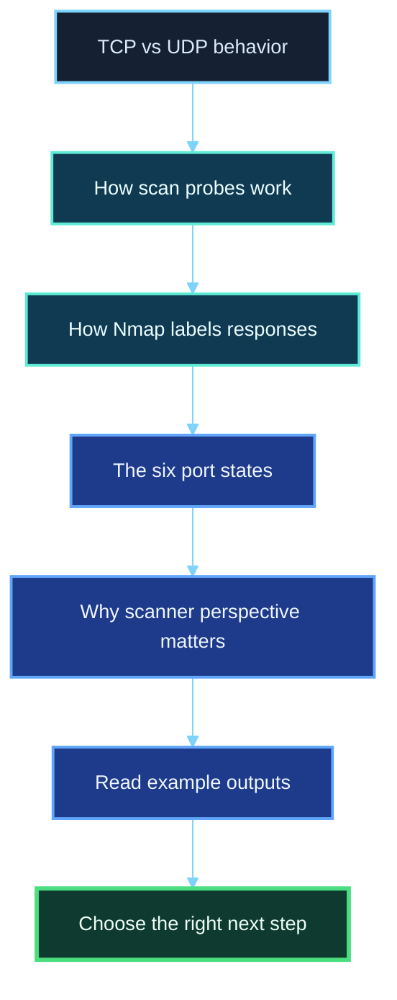
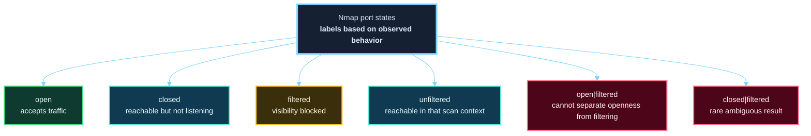

<div align="center">

**Hack the Basics · Phase I**

`Module 02 · Network Enumeration with Nmap`

</div>

# Lesson 2.3 — TCP, UDP, and Port State Interpretation

---

> **🎯 Lesson Objective**  
> By the end of this lesson, we will be able to understand **what TCP and UDP scans are actually observing, why different scan types produce different evidence, and how to interpret Nmap port states without confusing scanner perspective with objective truth**.

| **Course** | **Module** | **Lesson** | **Estimated Time** | **Difficulty** |
|---|---|---|---:|---|
| Hack the Basics | Module 02 — Network Enumeration with Nmap | 2.3 — TCP, UDP, and Port State Interpretation | 50–70 min | Beginner |

| **Prerequisites** | **You will practice** | **Main outcome** |
|---|---|---|
| Lessons 2.1–2.2, basic TCP/IP vocabulary, basic command-line use | Comparing TCP and UDP behavior, recognizing scan types, and reading Nmap port states correctly | Building the mental model required to stop treating scan output like magic and start treating it like network evidence |

> **🚨 Important**
>
> This lesson is where many learners either level up or stay shallow.
>
> It is easy to memorize that `open` is good, `closed` is bad, and `filtered` is annoying.
> It is much more valuable to understand **why Nmap arrived at those labels, what each one really means, and what uncertainty still remains**.

---

## Table of Contents

- [Lesson Map](#lesson-map)
- [Why This Lesson Matters](#why-this-lesson-matters)
- [Learning Objectives](#learning-objectives)
- [The Practical Problem This Lesson Solves](#the-practical-problem-this-lesson-solves)
- [Why We Need to Separate Protocol Behavior from Scan Output](#why-we-need-to-separate-protocol-behavior-from-scan-output)
- [TCP and UDP at a High Level](#tcp-and-udp-at-a-high-level)
- [Why TCP Scanning Often Feels Clearer Than UDP Scanning](#why-tcp-scanning-often-feels-clearer-than-udp-scanning)
- [What a Port Scan Is Actually Trying to Learn](#what-a-port-scan-is-actually-trying-to-learn)
- [Common TCP Scan Behavior in Practice](#common-tcp-scan-behavior-in-practice)
- [SYN Scan vs Connect Scan](#syn-scan-vs-connect-scan)
- [UDP Scan and Why It Is Harder to Interpret](#udp-scan-and-why-it-is-harder-to-interpret)
- [The Six Nmap Port States](#the-six-nmap-port-states)
- [Open Is Not the Same as Safe](#open-is-not-the-same-as-safe)
- [Closed Is Not the Same as Irrelevant](#closed-is-not-the-same-as-irrelevant)
- [Filtered Means Uncertainty, Not Absence](#filtered-means-uncertainty-not-absence)
- [What `open|filtered` and `closed|filtered` Really Mean](#what-openfiltered-and-closedfiltered-really-mean)
- [Why the Same Port Can Look Different from Different Places](#why-the-same-port-can-look-different-from-different-places)
- [First Command Walkthrough: A Basic TCP SYN Scan](#first-command-walkthrough-a-basic-tcp-syn-scan)
- [Reading TCP Output Like an Analyst](#reading-tcp-output-like-an-analyst)
- [Second Command Walkthrough: A TCP Connect Scan](#second-command-walkthrough-a-tcp-connect-scan)
- [Third Command Walkthrough: A UDP Scan](#third-command-walkthrough-a-udp-scan)
- [A Practical Port-State Interpretation Workflow](#a-practical-port-state-interpretation-workflow)
- [Stop and Think](#stop-and-think)
- [Common Mistakes and Misconceptions](#common-mistakes-and-misconceptions)
- [Defender’s View](#defenders-view)
- [Key Takeaways](#key-takeaways)
- [Knowledge Check Quiz](#knowledge-check-quiz)
- [Quiz Answers](#quiz-answers)
- [Mini Practice Task](#mini-practice-task)
- [Next Lesson Bridge](#next-lesson-bridge)

---

## Lesson Map



> **💡 Tip**
>
> A port state is not a magical property that Nmap “discovers inside” a machine.  
> It is the result of **sending a probe, observing behavior, and assigning the best label Nmap can justify from that evidence**.

---

## Why This Lesson Matters

By the time most beginners reach port scanning, they start feeling more confident.

They can run a scan.
They can see service names.
They can point at output and say:

- “Port 22 is open.”
- “Port 80 is filtered.”
- “UDP is slow.”

But that confidence is often fragile.

The moment scan output becomes messy, they lose the thread.

Examples:

- Why does one TCP scan say `filtered`, while another says `closed`?
- Why does UDP so often return `open|filtered`?
- Why would a scan from one network show a port as open while another network shows it as filtered?
- What is the real difference between a SYN scan and a connect scan?
- If a port is closed, does that still tell us anything useful?

Those questions matter because professional enumeration is not about running commands only when the network behaves politely.

Professional enumeration means being able to say:

> “Based on the protocol, the scan type, the response behavior, and my network position, this is what I can conclude — and this is what still remains uncertain.”

That is the skill this lesson is building.

---

## Learning Objectives

By the end of this lesson, we should be able to:

- explain the practical difference between TCP and UDP from a scanning perspective
- describe how TCP SYN scans and TCP connect scans differ
- explain why UDP scans often produce more ambiguous results
- interpret Nmap’s six port states in plain language
- recognize that port states describe **how Nmap sees the port**, not an absolute universal truth
- choose sensible follow-up actions based on whether a port appears open, closed, filtered, or ambiguous

---

## The Practical Problem This Lesson Solves

Suppose we already completed host discovery and now have a few live systems worth deeper inspection.

Our next question becomes:

> “What is actually reachable on these systems?”

That sounds straightforward until we remember that different protocols and different scan types produce different levels of certainty.

For example:

- TCP often gives clearer answers because the protocol itself is more structured.
- UDP often gives weaker answers because silence is common.
- Firewalls may change what we see more than the service itself.
- A port state can tell us something useful even when the answer is not “open.”

This lesson solves the problem of **how to read scan output like evidence instead of labels to memorize**.

That means learning how to think through:

- what the probe was
- what response or non-response occurred
- what Nmap can justify from that behavior
- what we should do next

---

## Why We Need to Separate Protocol Behavior from Scan Output

One of the easiest mistakes in scanning is to look only at the final label and ignore the mechanics behind it.

Example:

```text
53/udp open|filtered domain
```

A beginner may read that as:

> “Nmap could not figure this out. Useless.”

A better reader sees something more precise:

- this was a UDP probe
- there was no decisive response
- UDP commonly behaves this way
- a filter may have dropped the traffic, or the service may be open but silent
- this result is not useless; it is an ambiguity that shapes follow-up work

That is why protocol behavior matters.

Without it, output feels random.
With it, output becomes explainable.

> **📝 Note**
>
> Good interpretation starts one step earlier than most people realize.  
> It starts with asking: **what kind of conversation was Nmap trying to have with the target?**

---

## TCP and UDP at a High Level

Before we think about scanning, we need a clean mental model of the two protocols that matter most here.

### TCP in practical terms

TCP is connection-oriented.

That does **not** mean “safe” or “better.”
It means TCP has a more structured exchange when endpoints communicate.

In practice, that gives scanners more chances to observe decisive behavior.

At a very high level:

- a client attempts to begin a connection
- a service may accept that connection
- a host may reject it
- a firewall may interfere with it

That is why TCP scans often produce clearer state distinctions.

### UDP in practical terms

UDP is connectionless.

There is no handshake equivalent that guarantees a tidy back-and-forth before application data starts flowing.

In practice, that means scanners often face a difficult question:

- if nothing came back, was the port open?
- was it filtered?
- did the target drop the packet?
- did some device in the path drop the packet?
- did the service simply choose not to answer?

That is why UDP is so often associated with ambiguity.

### A useful comparison

| **Protocol** | **Scanner experience** | **Why it matters** |
|---|---|---|
| TCP | More structured responses, often clearer outcomes | Easier to distinguish open, closed, and filtered behavior |
| UDP | Less structured, more silence, more ambiguity | More care needed when interpreting non-response |

> **💡 Tip**
>
> TCP often tells us more quickly whether a conversation was accepted, rejected, or blocked.  
> UDP often forces us to interpret silence.

---

## Why TCP Scanning Often Feels Clearer Than UDP Scanning

This is not because TCP is “better” in every application sense.

It is because from a scanning perspective, TCP tends to produce more explicit signals.

For example, in many common cases:

- **open TCP port** → service replies in a way consistent with accepting a connection attempt
- **closed TCP port** → target responds with a reset or other rejection behavior
- **filtered TCP port** → no useful reply arrives, or filtering errors appear

With UDP, the picture is rougher:

- an open UDP service may reply
- an open UDP service may stay silent
- a filtered port may stay silent
- only some error conditions clearly tell us “closed”

So the interpretation burden is heavier.

That is one reason many workflows start with TCP and then proceed into UDP more deliberately.

---

## What a Port Scan Is Actually Trying to Learn

A port scan is not really asking:

> “Tell me the truth about this machine.”

It is asking a narrower question:

> “When I send this kind of probe to this port from here, what response pattern do I observe?”

From that, Nmap assigns a state.

This is extremely important because it keeps us honest.

### A port state is an interpretation layer

The underlying reality might involve:

- an application listening
- no application listening
- a host firewall
- a router ACL
- packet loss
- a load balancer
- a proxy
- network asymmetry
- rate limiting

Nmap does not magically bypass all of that.

It sees what the probe path allows it to see.

### The real process

```mermaid
%%{init: {"theme":"base","flowchart":{"curve":"basis","htmlLabels":true},"themeVariables":{"fontSize":"14px","primaryTextColor":"#e5eef8","lineColor":"#7dd3fc","primaryColor":"#0f172a","clusterBkg":"#0b1220","clusterBorder":"#334155"}}}%%
flowchart LR
    A["Choose protocol<br/>and scan type"] --> B["Send probe"]
    B --> C["Observe<br/>reply, silence, or error"]
    C --> D["Assign state<br/>best-fit Nmap label"]
    D --> E["Decide next step<br/>validate, enrich, or defer"]

    classDef select fill:#162033,stroke:#7dd3fc,color:#dbeafe,stroke-width:2px;
    classDef action fill:#0f3a52,stroke:#5eead4,color:#ecfeff,stroke-width:2px;
    classDef evidence fill:#1e3a8a,stroke:#60a5fa,color:#eff6ff,stroke-width:2px;
    classDef decision fill:#3b2f0b,stroke:#fbbf24,color:#fffbeb,stroke-width:3px;

    class A select;
    class B action;
    class C,D evidence;
    class E decision;
```



> **🚨 Important**
>
> Port states are **scanner conclusions**, not direct windows into the target’s internal truth.

---

## Common TCP Scan Behavior in Practice

Let’s stay at a high level and think in practical terms.

When Nmap performs a TCP scan, it usually wants to learn whether a port appears to be:

- accepting connection attempts
- rejecting them cleanly
- hidden behind filtering or interference

That makes TCP a strong first protocol for surface mapping.

### Typical interpretation pattern

| **Observed behavior** | **Likely interpretation** |
|---|---|
| Target responds as though it will accept the connection | Port appears open |
| Target responds with rejection behavior | Port appears closed |
| No decisive response arrives, or filtering indications appear | Port appears filtered |

This does not mean every environment behaves perfectly.

Some devices manipulate traffic.
Some middleboxes normalize or block probes.
Some applications respond in odd ways.
But this pattern is still the core model.

---

## SYN Scan vs Connect Scan

These are two of the most important TCP scan types to understand early.

### SYN scan: the usual workhorse

A SYN scan is commonly the default TCP scan when raw-packet privileges are available.

Conceptually, it does this:

1. send a TCP SYN
2. observe whether the target responds in a way consistent with acceptance, rejection, or filtering
3. stop after learning what it needs rather than fully completing a normal connection

Why people like it:

- efficient
- widely used
- usually gives strong TCP state information
- often lighter than fully completing every connection

### Connect scan: the fallback when raw packet handling is unavailable

A connect scan uses the operating system’s normal connection mechanism rather than hand-crafting raw packet logic in the same way.

Conceptually, that means:

1. ask the operating system to attempt a full connection
2. let the OS report whether the connection succeeded or failed
3. interpret that result

Why this matters:

- it is often the default when SYN scan is not available
- it may be noisier from a logging perspective
- it usually completes the connection to open ports rather than stopping earlier

### The mindset difference

| **Scan Type** | **What it feels like conceptually** | **Why we care** |
|---|---|---|
| SYN scan (`-sS`) | “Test whether the target looks willing to start a TCP conversation.” | Fast, common, strong first-choice TCP scan when available |
| Connect scan (`-sT`) | “Ask the OS to try a normal TCP connection and report the result.” | Useful when raw-packet scanning is not available |

> **📝 Note**
>
> The point is not to romanticize one scan type and dismiss the other.  
> The point is to understand what evidence each one is really based on.

---

## UDP Scan and Why It Is Harder to Interpret

UDP scanning is one of the best examples of why scanning requires humility.

When Nmap probes a UDP port, several things might happen:

- the service replies
- the host sends an ICMP error indicating no service is listening
- a firewall interferes
- nothing comes back at all

That last case is the difficult one.

Silence in UDP does not neatly translate to one answer.

It may mean:

- the service is open and simply silent
- the service is open but application-level behavior is not obvious yet
- the probe was filtered on the way in
- the response was filtered on the way back
- some device rate-limited or dropped the traffic

That is why UDP scanning so often requires:

- patience
- careful follow-up
- service-specific validation
- realistic expectations about ambiguity

### Practical examples of why UDP matters anyway

Even though it is harder to interpret, UDP still matters because important services often use it.

Examples learners frequently encounter include:

- DNS
- SNMP
- NTP
- TFTP
- some VPN and VoIP-related services

So the right posture is not:

> “UDP is annoying, so I’ll skip it forever.”

It is:

> “UDP results often need more careful interpretation and validation.”

---

## The Six Nmap Port States

One of the most important ideas in this module is that Nmap recognizes six port states.

These states are more nuanced than simply open or closed.

They help us express uncertainty honestly.



### The six states at a glance

| **State** | **Plain-language meaning** | **What it tells us** |
|---|---|---|
| `open` | The port appears to be accepting traffic for the protocol being tested | There is likely a reachable service or listener there |
| `closed` | The port is reachable, but nothing is listening there | The host is reachable on that path, but not serving that port |
| `filtered` | Nmap cannot tell whether it is open because filtering blocks useful observation | A firewall or similar control is interfering with visibility |
| `unfiltered` | The port is reachable, but this scan type cannot tell whether it is open or closed | Usually a sign to use a different scan for clarity |
| `open|filtered` | Nmap cannot distinguish between open and filtered | Common when open ports may be silent, especially in UDP |
| `closed|filtered` | Nmap cannot distinguish between closed and filtered | A rarer uncertainty state in certain scan types |

> **🚨 Important**
>
> These are not intrinsic properties of the port itself.  
> They are labels describing **how Nmap sees the port from this scan, with these probes, from this position**.

---

## Open Is Not the Same as Safe

When learners first see `open`, they often feel like they have found the answer.

In reality, `open` means the question is just getting interesting.

An open port suggests:

- something is listening
- the path is reachable from your current position
- deeper service enumeration is probably worthwhile

But it does **not** tell us by itself:

- what software is really behind the port
- whether authentication is required
- whether the service is securely configured
- whether the service is proxied or masked
- whether the service is actually relevant to the current objective

### Example thinking

| **Observed state** | **Bad conclusion** | **Better conclusion** |
|---|---|---|
| `22/tcp open` | “SSH is confirmed and I’m done.” | “A TCP service consistent with SSH is reachable here; I should validate details next.” |
| `80/tcp open` | “This is a normal website.” | “Something HTTP-like is reachable; I need to inspect headers, content, and behavior.” |
| `161/udp open` | “SNMP is definitely there and fully exposed.” | “A UDP service responded in a way consistent with openness; I should validate service behavior.” |

---

## Closed Is Not the Same as Irrelevant

Beginners sometimes mentally discard closed ports as useless.

That is a mistake.

A closed port still tells us something meaningful:

- the host is reachable on that path
- the target is responding
- the network is not totally blind here
- the service is not currently listening on that port

In some situations, closed ports also help:

- confirm host liveness
- support operating system fingerprinting logic
- show that the route is not entirely filtered

So closed does **not** mean “garbage result.”
It means “not listening here, but still informative.”

---

## Filtered Means Uncertainty, Not Absence

This is one of the biggest interpretation upgrades a learner can make.

When Nmap says `filtered`, the wrong conclusion is:

> “Nothing is there.”

The better conclusion is:

> “I do not currently have enough visibility to tell whether the port is open or closed because filtering is getting in the way.”

That filtering could come from:

- a network firewall
- a router ACL
- a host-based firewall
- a security appliance
- a middlebox dropping probes or responses

### Why filtered matters operationally

A filtered result tells us at least three things:

1. visibility is incomplete
2. simple negative conclusions are unsafe
3. scan type, vantage point, or follow-up method may need to change

> **💡 Tip**
>
> `filtered` is not a dead end.  
> It is a clue about **control boundaries** and **visibility limits**.

---

## What `open|filtered` and `closed|filtered` Really Mean

These combined states are where many people mentally give up.

Don’t.

They are actually very honest and useful labels.

### `open|filtered`

This means Nmap cannot distinguish between:

- the port being open
- the port being filtered

Why would that happen?

Because some scan types, especially UDP, may receive **no response at all** from an open port.

If no response arrives, Nmap must consider both possibilities:

- open but silent
- filtered

This is why `open|filtered` is especially common in UDP work.

### `closed|filtered`

This is a rarer ambiguity state that appears in some scan types where the observed behavior does not allow Nmap to cleanly separate those two conditions.

The main lesson is not memorizing where it appears most often.
The main lesson is understanding what the label is telling you:

- the evidence was insufficient for a single decisive state
- Nmap is choosing honesty over false precision

### Why these states are good, not bad

Ambiguous states can feel frustrating, but they are actually signs that the tool is being careful.

A worse tool would pretend certainty.
Nmap is telling you the truth about the limits of what it observed.

---

## Why the Same Port Can Look Different from Different Places

This is one of the most important mental models in all of scanning.

A port is not observed in a vacuum.
It is observed:

- from a particular source
- across a particular path
- with a particular probe type
- through particular filtering controls

That means one scan might see:

```text
445/tcp open microsoft-ds
```

while another scan, from a different network, might see:

```text
445/tcp filtered microsoft-ds
```

Those results are not necessarily contradictory.
They may both be accurate from their own vantage points.

### Why this happens

Possible reasons include:

- internal-only exposure
- different firewall policies by source network
- host-based allowlists
- VPN vs non-VPN position
- NAT or proxy behavior
- routing asymmetry

> **📝 Note**
>
> Nmap reports **how the target looks from where you are**, not how it looks from everywhere.

---

## First Command Walkthrough: A Basic TCP SYN Scan

Let’s begin with a straightforward lab example:

```bash
sudo nmap -sS -p 22,80,443 192.168.57.25
```

### Command anatomy

| **Command Part** | **Meaning** |
|---|---|
| `sudo` | Gives the privileges often needed for raw-packet scan types |
| `nmap` | Launches the scanner |
| `-sS` | Requests a TCP SYN scan |
| `-p 22,80,443` | Restricts the scan to three TCP ports |
| `192.168.57.25` | The target host |

### What this is trying to answer

- Does port 22 look reachable and accepting?
- Does port 80 look reachable and accepting?
- Does port 443 look reachable and accepting?
- Do any of these look closed or filtered instead?

### Representative output

```text
Starting Nmap 7.xx at 2026-03-29 09:00 UTC
Nmap scan report for 192.168.57.25
Host is up (0.0041s latency).

PORT    STATE    SERVICE
22/tcp  open     ssh
80/tcp  closed   http
443/tcp filtered https

Nmap done: 1 IP address (1 host up) scanned in 0.42 seconds
```

---

## Reading TCP Output Like an Analyst

Let’s read that line by line.

| **Output** | **What Nmap is telling us** | **What we should infer carefully** |
|---|---|---|
| `Host is up` | The host responded meaningfully | We have host reachability evidence, not total visibility |
| `22/tcp open` | Port 22 appears to accept TCP traffic | SSH-like follow-up is reasonable |
| `80/tcp closed` | Port 80 is reachable, but nothing is listening there | The path is visible enough to get a clear negative result |
| `443/tcp filtered` | Nmap cannot determine openness because filtering blocks visibility | HTTPS may or may not be there; filtering is part of the story |

### Why this output is powerful

In only a few lines, we learned:

- the host is alive
- at least one service is likely reachable
- at least one port is definitively not serving a listener right now
- at least one path is subject to filtering behavior

That is a strong example of why closed and filtered both matter.
They are not just “not open.”
They tell different stories.

---

## Second Command Walkthrough: A TCP Connect Scan

Now let’s imagine we do not have the privileges or environment needed for a SYN scan.

```bash
nmap -sT -p 22,80,443 192.168.57.25
```

### Why we might do this

This is a normal TCP connect scan.

The goal is still to understand port reachability, but the mechanics differ:

- the operating system attempts the connection
- Nmap learns from the OS-level result
- open ports may be fully connected rather than just partially tested

### Representative output

```text
Starting Nmap 7.xx at 2026-03-29 09:05 UTC
Nmap scan report for 192.168.57.25
Host is up (0.0050s latency).

PORT    STATE    SERVICE
22/tcp  open     ssh
80/tcp  closed   http
443/tcp filtered https

Nmap done: 1 IP address (1 host up) scanned in 0.67 seconds
```

### Why the output may look similar

The state labels can look almost identical to a SYN scan.

But that does **not** mean the underlying behavior was identical.

That distinction matters because:

- logging may differ
- packet counts may differ
- timing may differ
- the target may observe the interaction differently

So one lesson here is:

> identical-looking results do not always mean identical network behavior under the hood.

---

## Third Command Walkthrough: A UDP Scan

Now let’s look at an example where ambiguity becomes much more obvious.

```bash
sudo nmap -sU -p 53,67,161 192.168.57.25
```

### Command anatomy

| **Command Part** | **Meaning** |
|---|---|
| `sudo` | Often needed for full packet-level behavior |
| `-sU` | Requests a UDP scan |
| `-p 53,67,161` | Targets three UDP ports |
| `192.168.57.25` | The target host |

### Representative output

```text
Starting Nmap 7.xx at 2026-03-29 09:12 UTC
Nmap scan report for 192.168.57.25
Host is up.

PORT     STATE         SERVICE
53/udp   open|filtered domain
67/udp   closed        dhcps
161/udp  open          snmp

Nmap done: 1 IP address (1 host up) scanned in 12.84 seconds
```

### How to read this carefully

| **Output** | **What it suggests** | **Why interpretation matters** |
|---|---|---|
| `53/udp open\|filtered` | No decisive response separated open from filtered | Could be reachable but silent, or blocked |
| `67/udp closed` | The host returned behavior consistent with a closed UDP port | Good negative evidence |
| `161/udp open` | A UDP response indicated openness | Strong follow-up candidate |

### What changed compared to TCP

Notice how ambiguity appears more naturally here.

That is not because the scan failed.
It is because UDP often provides less decisive evidence.

---

## A Practical Port-State Interpretation Workflow

When reading scan results, use a disciplined sequence.

### Step 1: Identify the protocol and scan type

Ask:

- Is this TCP or UDP?
- Was this SYN, connect, or something else?
- Should I expect clean rejection behavior or possible silence?

### Step 2: Separate direct observation from assigned label

Ask:

- Did the target reply clearly?
- Was there no response?
- Was there an error?
- How did that lead Nmap to this state?

### Step 3: Decide what the state really tells you

Use language like:

- “This port appears reachable and accepting.”
- “This port is reachable but not listening.”
- “Visibility here is incomplete due to filtering.”
- “This result is ambiguous and needs validation.”

### Step 4: Choose the next action

| **State** | **Typical next move** |
|---|---|
| `open` | Validate the service and enumerate it further |
| `closed` | Note reachability and move on unless the port matters strategically |
| `filtered` | Consider vantage point, firewall context, or alternate scan/follow-up |
| `open\|filtered` | Use service-aware validation, compare with other probes, or gather more context |
| `unfiltered` | Use another scan type to resolve open vs closed |
| `closed\|filtered` | Record ambiguity and choose a more clarifying method if needed |

> **💡 Tip**
>
> The best habit is to translate each state into a sentence you could defend in a report or lab note.

---

## Stop and Think

Pause here and answer these mentally before revealing the guidance.

### Question 1

If a UDP port shows `open|filtered`, does that mean the scan failed?

<details>
<summary><strong>✅ Reveal guidance</strong></summary>

No.

It means Nmap did not receive enough decisive evidence to separate “open” from “filtered.” That is often normal in UDP scanning because open UDP services may remain silent.

</details>

### Question 2

If a TCP port is `closed`, is that result useless?

<details>
<summary><strong>✅ Reveal guidance</strong></summary>

No.

A closed port still proves something important: the host and the path were reachable enough for the target to reject the probe. That can support host discovery and help distinguish “reachable but not listening” from “hidden behind filtering.”

</details>

### Question 3

If two people scan the same host and get different port states, must one of them be wrong?

<details>
<summary><strong>✅ Reveal guidance</strong></summary>

Not necessarily.

Different source positions, firewall rules, routing paths, and scan types can all produce different valid observations.

</details>

### Question 4

If a port is `open`, should we trust the service label completely?

<details>
<summary><strong>✅ Reveal guidance</strong></summary>

No.

`open` tells us the port appears to accept traffic. The service label is a helpful clue, but it still needs validation through service detection, manual interaction, or both.

</details>

---

## Common Mistakes and Misconceptions

> **⚠️ Warning**
>
> These mistakes cause more bad enumeration than lack of tool knowledge does.

### Mistake 1: Treating port states as intrinsic truth

This sounds like:

- “The port is filtered.”
- “The port is definitely closed everywhere.”
- “Nmap discovered the actual ground truth.”

A better phrasing is:

- “Nmap saw it as filtered from here.”
- “This scan suggests the port is closed from this vantage point.”
- “This result reflects the observed probe behavior.”

---

### Mistake 2: Thinking only `open` matters

Closed, filtered, and ambiguous states all tell us something important.

- `closed` shows reachable rejection
- `filtered` shows visibility boundaries
- `open|filtered` shows uncertainty that needs careful handling

---

### Mistake 3: Over-trusting UDP silence

No response in UDP does not automatically mean “nothing there.”

That is one of the easiest ways to miss services or misunderstand filtering.

---

### Mistake 4: Confusing service names with confirmed identity

A service label is often useful, but it is still a classification step, not the last word.

---

### Mistake 5: Forgetting that scan type changes evidence quality

A SYN scan and a connect scan may both say `open`, but the underlying interaction and operational footprint differ.

That matters for performance, logging, and interpretation.

---

## Defender’s View

From the defender’s side, these scan types may look quite different.

A defender might notice:

- repeated TCP SYN activity across many ports
- full TCP connections that open and close quickly
- UDP traffic to services that usually receive little legitimate probing
- ICMP responses generated by closed UDP services
- bursts of traffic that suggest systematic enumeration rather than normal client behavior

This matters because it reminds us of two things:

1. scanning is observable
2. the scan type influences not only our evidence, but also the defender’s evidence

> **📝 Note**
>
> Understanding scan behavior helps offensive operators interpret results more accurately and helps defenders recognize reconnaissance patterns more confidently.

---

## Key Takeaways

> **💡 Tip**
>
> If you only keep a handful of ideas from this lesson, keep these:

- TCP and UDP behave differently enough that we should not interpret them the same way.
- TCP scans often produce clearer outcomes because the protocol gives more structured response patterns.
- UDP scans often produce ambiguity because silence can mean multiple things.
- SYN scans and connect scans may answer similar questions, but they do so through different mechanics.
- Nmap’s six port states are labels describing **what Nmap observed**, not universal truths about the port.
- `filtered` means incomplete visibility, not proof of absence.
- `open|filtered` is often honest ambiguity, especially in UDP work.
- Good interpretation always leads to the next deliberate step.

### What changed in our understanding?

| **Before this lesson, we might have thought...** | **After this lesson, we should understand...** |
|---|---|
| “TCP and UDP scans are basically the same.” | They behave differently enough that interpretation must change with the protocol. |
| “A port state is just the truth.” | A port state is Nmap’s evidence-based view from a specific scan context. |
| “Closed means useless.” | Closed still provides valuable reachability information. |
| “Filtered means nothing is there.” | Filtered means visibility is blocked or incomplete. |
| “`open|filtered` means Nmap failed.” | `open|filtered` means the evidence honestly supports more than one possibility. |

---

## Knowledge Check Quiz

### 1. Why are UDP scan results often more ambiguous than TCP scan results?

A. Because Nmap does not really support UDP  
B. Because UDP commonly provides less decisive response behavior, including silence  
C. Because UDP ports cannot be scanned  
D. Because Nmap converts all UDP results into guesses

---

### 2. Which statement best describes Nmap port states?

A. They are permanent truths stored on the target machine  
B. They describe how Nmap observed the port during that scan  
C. They only apply to TCP  
D. They are just service names in another format

---

### 3. What does `filtered` usually mean?

A. The service is definitely absent  
B. The service is definitely open  
C. Filtering prevents Nmap from determining whether the port is open or closed  
D. The port belongs to a different host

---

### 4. Which of the following is true about a `closed` port?

A. It provides no useful information  
B. It shows the path was reachable enough to get a rejection  
C. It always means the host is offline  
D. It means the scan was misconfigured

---

### 5. What is the practical difference between a SYN scan and a connect scan?

A. SYN scan is for web only; connect scan is for databases only  
B. SYN scan typically tests connection acceptance without completing a normal full connection, while connect scan uses the OS to attempt a normal connection  
C. They are the same thing with different names  
D. Connect scan works only on UDP

---

### 6. If Nmap reports `53/udp open|filtered`, what is the best reading?

A. DNS is definitely running and fully exposed  
B. The port is definitely blocked  
C. Nmap could not distinguish between open and filtered from the observed behavior  
D. The host is down

---

## Quiz Answers

<details>
<summary><strong>Reveal quiz answers</strong></summary>

### 1. Correct answer: B

UDP often gives less decisive evidence because no response can mean more than one thing.

### 2. Correct answer: B

Port states describe how Nmap saw the port in that scan context.

### 3. Correct answer: C

`filtered` means filtering prevented Nmap from determining whether the port is open or closed.

### 4. Correct answer: B

A closed port still tells us the path and host were reachable enough to respond.

### 5. Correct answer: B

A SYN scan and connect scan may answer similar questions, but the underlying mechanics differ.

### 6. Correct answer: C

`open|filtered` is an ambiguity state, not a guaranteed positive or guaranteed negative.

</details>

---

## Mini Practice Task

> **🚨 Important**
>
> Keep this small and lab-based. The goal is interpretation quality, not scan volume.

### Task

Against the Module 01 baseline, run one small TCP scan and one small UDP-oriented scan, and save both results.

For example:

```bash
sudo nmap -sS -p 22,80,443 -oA assessment-workspace/02-evidence/scans/module-02/meta-tgt-tcp-small-YYYY-MM-DD 192.168.57.25
sudo nmap -sU -p 53,88,137 -oA assessment-workspace/02-evidence/scans/module-02/goad-mini-dc01-udp-small-YYYY-MM-DD 192.168.57.10
```

### In your notes, answer the following

1. Which protocol gave you clearer results, and why?
2. Which ports appeared `open`, `closed`, `filtered`, or `open|filtered`?
3. For each state, what direct evidence likely produced that label?
4. Which ports deserve immediate manual validation?
5. Which results reflect uncertainty rather than decisive knowledge?
6. What line should be added to `host-tracking.md` for each host?

### Suggested note-taking format

| **Observed Output** | **What Nmap is telling me** | **What still needs validation** |
|---|---|---|
| `22/tcp open` on `192.168.57.25` | A TCP service appears to be accepting traffic | Actual service details and configuration |
| `80/tcp closed` on `192.168.57.25` | Port is reachable but not listening | Whether the service exists elsewhere or behind another route |
| `53/udp open\|filtered` on `192.168.57.10` | Nmap cannot separate openness from filtering | Service-aware validation or alternative context |
| `137/udp open` on `192.168.57.10` | A UDP response strongly suggests a live service | Actual service behavior and exposure |

> **💡 Tip**
>
> The quality of your notes matters more here than the number of ports you scan.

---

## Next Lesson Bridge

In this lesson, we learned how to think about **protocol behavior, scan types, and port-state interpretation**.

In the next lesson, we will build on that by moving into **service detection, OS clues, and script-assisted enumeration**.

That means the next question becomes:

- now that we know which ports appear reachable,
- how do we learn more about what is actually behind them?

> **📝 Note**
>
> Lesson 2.2 helped us decide **which hosts are worth scanning**.  
> Lesson 2.3 helped us decide **how to interpret what the ports seem to be doing**.  
> Lesson 2.4 will help us turn that into **richer service understanding**.

---

## End-of-Lesson Recap

> **One-sentence summary:**  
> Good port scanning is not about memorizing labels — it is about understanding how TCP and UDP behave, how scan types gather evidence, and how Nmap turns that evidence into states we can interpret honestly.

---
