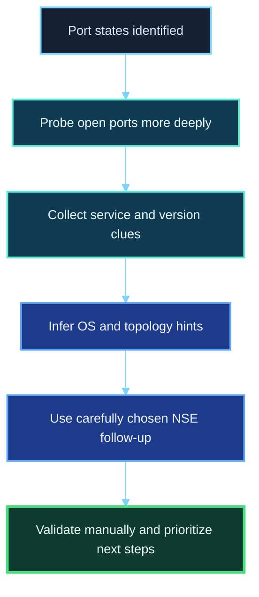
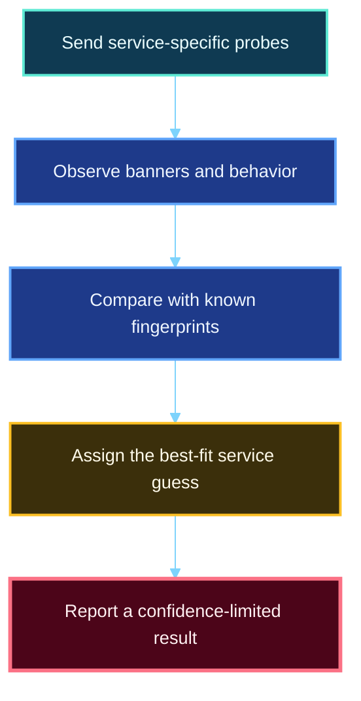
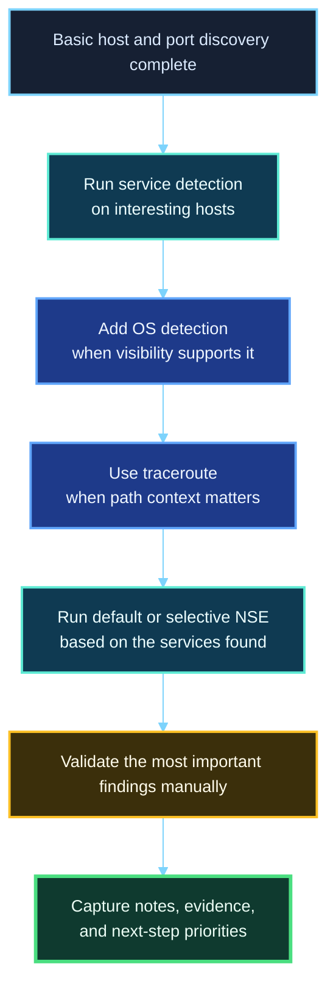

<div align="center">

**Hack the Basics · Phase I**

`Module 02 · Network Enumeration with Nmap`

</div>

# Lesson 2.4 — Service Detection, OS Clues, and Script-Assisted Enumeration

---

> **🎯 Lesson Objective**  
> By the end of this lesson, we will be able to move beyond “these ports are open” and start building a more useful picture of the target through **service detection, version clues, operating system inference, topology hints, and carefully chosen script-assisted follow-up**.

| **Course** | **Module** | **Lesson** | **Estimated Time** | **Difficulty** |
|---|---|---|---:|---|
| Hack the Basics | Module 02 — Network Enumeration with Nmap | 2.4 — Service Detection, OS Clues, and Script-Assisted Enumeration | 55–75 min | Beginner |

| **Prerequisites** | **You will practice** | **Main outcome** |
|---|---|---|
| Lessons 2.1–2.3, basic TCP/IP vocabulary, basic command-line use | Enriching a basic port scan with service, OS, route, and NSE-driven context | Learning how to turn open-port evidence into a stronger hypothesis about **what the host is, what it is running, and what deserves deeper follow-up** |

> **🚨 Important**
>
> This lesson is about **enrichment**, not magic.
>
> Service detection, OS detection, and NSE do not replace thinking. They give us better clues, better context, and better follow-up options. The professional skill is learning how much trust to place in those clues.

---

## Table of Contents

- [Lesson Map](#lesson-map)
- [Why This Lesson Matters](#why-this-lesson-matters)
- [Learning Objectives](#learning-objectives)
- [The Practical Problem This Lesson Solves](#the-practical-problem-this-lesson-solves)
- [Why Open Ports Alone Are Not Enough](#why-open-ports-alone-are-not-enough)
- [What Nmap Tries to Learn After Port Discovery](#what-nmap-tries-to-learn-after-port-discovery)
- [Service Detection at a High Level](#service-detection-at-a-high-level)
- [How Version Detection Actually Works](#how-version-detection-actually-works)
- [Banners, Fingerprints, and Ambiguity](#banners-fingerprints-and-ambiguity)
- [Reading Service Detection Output Correctly](#reading-service-detection-output-correctly)
- [When Service Names Mislead You](#when-service-names-mislead-you)
- [OS Detection and Why It Is Always an Inference](#os-detection-and-why-it-is-always-an-inference)
- [What OS Detection Needs in Order to Work Well](#what-os-detection-needs-in-order-to-work-well)
- [Device Type, Network Distance, and Topology Clues](#device-type-network-distance-and-topology-clues)
- [Traceroute and Why Path Context Matters](#traceroute-and-why-path-context-matters)
- [NSE Foundations: What the Scripting Engine Adds](#nse-foundations-what-the-scripting-engine-adds)
- [Useful NSE Categories for Early Enumeration](#useful-nse-categories-for-early-enumeration)
- [Why You Should Not Treat NSE Like a Slot Machine](#why-you-should-not-treat-nse-like-a-slot-machine)
- [First Command Walkthrough: Service Detection](#first-command-walkthrough-service-detection)
- [Second Command Walkthrough: OS Detection and Traceroute](#second-command-walkthrough-os-detection-and-traceroute)
- [Third Command Walkthrough: Default Scripts and Selective NSE](#third-command-walkthrough-default-scripts-and-selective-nse)
- [A Practical Enrichment Workflow](#a-practical-enrichment-workflow)
- [Stop and Think](#stop-and-think)
- [Common Mistakes and Misconceptions](#common-mistakes-and-misconceptions)
- [Defender’s View](#defenders-view)
- [Key Takeaways](#key-takeaways)
- [Knowledge Check Quiz](#knowledge-check-quiz)
- [Quiz Answers](#quiz-answers)
- [Mini Practice Task](#mini-practice-task)
- [Next Lesson Bridge](#next-lesson-bridge)

---

## Lesson Map



> **💡 Tip**
>
> A basic port scan tells us **where to look**.  
> Enrichment tells us **what we may be looking at**.

---

## Why This Lesson Matters

After host discovery and port scanning, beginners often feel like they have “the answer.”

They say things like:

- “22 is SSH.”
- “80 is HTTP.”
- “445 is SMB.”
- “We are done with this host.”

But those statements are only a shallow first pass.

What we really want to know next is:

- what service is actually behind that port?
- does the service appear to be a common implementation or something unusual?
- are there version clues that shape later enumeration?
- what does the host seem to be: workstation, server, network device, appliance?
- how far away is it and what path are we likely reaching it through?
- can script-assisted checks reveal low-friction details that would take much longer to gather manually?

That is where this lesson lives.

It teaches the move from **exposure mapping** to **service understanding**.

That move matters because real enumeration is not just about proving that a port responds. It is about building a working model of the system on the other side of that response.

> **📝 Note**
>
> In practice, this is the point where an operator starts moving from “scan output” into “target profile.”

---

## Learning Objectives

By the end of this lesson, we should be able to:

- explain what Nmap service detection is trying to learn
- distinguish between banners, fingerprint matches, and confident identification
- interpret version detection output without overtrusting it
- explain what Nmap OS detection is inferring and why it may fail or stay uncertain
- describe how traceroute and related clues help us understand topology
- use NSE as a focused enumeration aid instead of an indiscriminate noise generator
- build a practical enrichment workflow that follows a basic port scan

---

## The Practical Problem This Lesson Solves

Suppose we already know that a host is alive and several ports respond.

That still leaves us with serious unanswered questions.

Consider this example:

```text
22/tcp   open  ssh
80/tcp   open  http
443/tcp  open  https
3306/tcp open  mysql
```

This is useful, but still incomplete.

It does **not** yet tell us:

- which SSH implementation is present
- whether the HTTP service is a simple landing page, an admin portal, a reverse proxy, or something custom
- whether 443 presents a certificate that gives away internal naming or organizational context
- whether MySQL is exposed directly, proxied, restricted, or even the service we think it is
- whether the host looks like Linux, Windows, or a specialized device
- whether it appears close on the network or several hops away

So the practical problem is this:

> “How do we turn basic port-state evidence into a more useful understanding of the host without pretending that guesses are facts?”

That is what this lesson solves.

---

## Why Open Ports Alone Are Not Enough

An open port is a doorway, not a description.

When Nmap reports:

```text
80/tcp open http
```

it is telling us something valuable, but limited.

At minimum, it means:

- Nmap observed behavior consistent with an open TCP port
- the service looked HTTP-like enough to be labeled `http`

But it does **not** prove:

- the server software family
- the application framework
- the operating system
- whether the service is stock or heavily customized
- whether the port is directly exposed or sitting behind some intermediary

A strong operator does not stop at “the port is open.”
A strong operator asks:

- what is it exactly?
- how sure am I?
- what does that suggest about the host’s role?
- what should I do next to validate that picture?

---

## What Nmap Tries to Learn After Port Discovery

Once ports are identified, Nmap can help answer richer questions.

```mermaid
%%{init: {"theme":"base","flowchart":{"curve":"basis","htmlLabels":true},"themeVariables":{"fontSize":"14px","primaryTextColor":"#e5eef8","lineColor":"#7dd3fc","primaryColor":"#0f172a","clusterBkg":"#0b1220","clusterBorder":"#334155"}}}%%
flowchart LR
    A["Open port<br/>starting clue"] --> B["Service identity<br/>what is this likely to be?"]
    B --> C["Version clues<br/>how specific is the fingerprint?"]
    C --> D["Host profile<br/>what does the system resemble?"]
    D --> E["Script-assisted detail<br/>what low-friction data can we gather?"]
    E --> F["Manual validation<br/>what still needs confirmation?"]

    classDef start fill:#162033,stroke:#7dd3fc,color:#dbeafe,stroke-width:2px;
    classDef enrich fill:#0f3a52,stroke:#5eead4,color:#ecfeff,stroke-width:2px;
    classDef profile fill:#1e3a8a,stroke:#60a5fa,color:#eff6ff,stroke-width:2px;
    classDef validate fill:#3b2f0b,stroke:#fbbf24,color:#fffbeb,stroke-width:3px;

    class A start;
    class B,C enrich;
    class D,E profile;
    class F validate;
```



At a high level, enrichment after port discovery often includes:

1. **Service detection** — what protocol or application seems to be there?
2. **Version clues** — what implementation or software family appears likely?
3. **OS detection** — what kind of operating system or device does the host resemble?
4. **Topology hints** — how many hops away is the host and what path clues appear?
5. **Script-assisted follow-up** — can safe, focused checks reveal useful extra detail?

These are not separate worlds.
They build on each other.

For example:

- service detection may help OS detection make more sense
- OS clues may help explain odd service behavior
- NSE output may confirm details suggested by version detection
- traceroute may explain why some probes look inconsistent or filtered

> **💡 Tip**
>
> The goal is not to collect “more output.”  
> The goal is to produce a clearer, more defensible model of the target.

---

## Service Detection at a High Level

Service detection is Nmap’s attempt to move from:

> “A port is open.”

...to:

> “This open port appears to be running a particular protocol or application, possibly with version clues.”

This is often done with:

- protocol-aware probes
- banner collection
- response comparison against known fingerprints
- targeted follow-up exchanges that try to provoke identifying behavior

In practical terms, service detection answers questions like:

- Is this really SSH, or is it something unexpected on port 22?
- Is this HTTP service Apache, Nginx, IIS, Jetty, or something else?
- Does this database service reveal a recognizable version family?
- Is the service on a nonstandard port still identifiable by behavior?

That last point matters a lot.

Service detection is especially useful because ports are only conventions.
A service can run on a strange port, and a strange service can sit on a familiar port.

### Why this matters operationally

This is the difference between:

- assuming based on the port number
- identifying based on observed behavior

That difference makes follow-up much more accurate.

---

## How Version Detection Actually Works

When people say “Nmap grabbed the version,” they often picture the target simply volunteering a clean software name and build number.

Sometimes that happens.
Often it does not.

Version detection is better understood as a combination of:

- direct banners
- protocol responses
- known patterns in how implementations behave
- matches against Nmap’s fingerprint database

### A useful mental model



### What this means in practice

Nmap may identify a service through:

- a banner that clearly names the software
- a TLS certificate or HTTP header clue
- a protocol-specific reply with recognizable formatting
- a sequence of responses that resembles a known implementation

That means service detection ranges from:

- **high confidence** — clear banner, obvious protocol, familiar product string
- **moderate confidence** — several clues align, but some ambiguity remains
- **low confidence** — service looks like a known family, but details are incomplete or odd

> **🚨 Important**
>
> Version detection is not the same as authoritative product inventory.  
> It is a network-based attempt to identify what the service appears to be.

---

## Banners, Fingerprints, and Ambiguity

These three ideas need to stay separate in your head.

### 1. Banners

A **banner** is information the service gives us directly or almost directly.

Examples include:

- an SSH version string
- an SMTP greeting banner
- an HTTP `Server` header
- a TLS certificate subject or issuer

Banners are useful, but they can be:

- incomplete
- misleading
- customized
- intentionally hidden
- reverse-proxied or rewritten

### 2. Fingerprints

A **fingerprint** is a pattern of behavior that resembles a known service or implementation.

Examples:

- specific response ordering
- unusual error formatting
- protocol field behavior
- how the service responds to different probe types

This is not the same as a clean banner string.
It is more like behavior-based recognition.

### 3. Ambiguity

Ambiguity appears when:

- multiple services look similar enough from the network
- the banner is generic or missing
- some probes are filtered or rate-limited
- the service is behind a proxy or intermediary
- the implementation is custom or niche

A mature reader does not panic when ambiguity appears.
They simply downgrade confidence and plan validation.

| **Source of clue** | **What it gives us** | **What can go wrong** |
|---|---|---|
| Banner | Direct-looking identifier or metadata | Can be hidden, changed, incomplete, or deceptive |
| Fingerprint | Behavior-based match to known service patterns | May be approximate or confused by unusual implementations |
| Port number | Default-service expectation | Can be wrong or misleading on its own |
| NSE follow-up | Extra service-specific detail | Can still reflect limited visibility or changing conditions |

---

## Reading Service Detection Output Correctly

Let’s look at a representative enriched scan result.

```text
PORT     STATE SERVICE VERSION
22/tcp   open  ssh     OpenSSH 8.4p1 Ubuntu 5ubuntu1.5
80/tcp   open  http    nginx 1.18.0
111/tcp  open  rpcbind 2-4 (RPC #100000)
3306/tcp open  mysql   MySQL 8.0.31
```

This output is richer than a basic scan, but it still needs disciplined reading.

| **Output** | **What we should think** | **What we should still verify** |
|---|---|---|
| `OpenSSH 8.4p1 Ubuntu ...` | Strong clue about SSH implementation and likely platform family | Confirm manually if needed; consider whether the banner is stock or proxied |
| `nginx 1.18.0` | Strong HTTP server clue | Does it front a custom application? Is it reverse proxying to something else? |
| `rpcbind 2-4` | Service family recognized | What other RPC-linked services might matter? |
| `MySQL 8.0.31` | Strong DB version clue | Is the service directly reachable? Does auth behave normally? |

### The mindset we want

When reading this table, we should think in layers:

1. **What appears to be true?**
2. **How confident am I?**
3. **What does this suggest about the host’s role?**
4. **What follow-up should I prioritize?**

That is far more useful than simply copying the service names into notes.

---

## When Service Names Mislead You

One of the most important habits in enumeration is refusing to overtrust labels.

Consider these realities:

- an HTTP reverse proxy may sit in front of the real application
- a port labeled `ssl/http` may expose a certificate that names something more specific than the server header does
- a custom service may imitate a common protocol enough to be guessed incorrectly
- a nonstandard port may host a familiar service
- a familiar port may host something entirely unexpected

### Common failure mode

A beginner sees:

```text
8080/tcp open http-proxy
```

and concludes:

> “It is definitely just a proxy.”

A better reader thinks:

- Nmap saw HTTP-like or proxy-like behavior
- 8080 often hosts many different things
- I should validate with actual HTTP requests, headers, and page behavior

> **📝 Note**
>
> Service labels are starting points for better questions, not permission to stop asking questions.

---

## OS Detection and Why It Is Always an Inference

OS detection sounds more magical than it really is.

Nmap is not logging into the host and reading `/etc/os-release` or the Windows registry.
It is inferring likely operating system characteristics from network behavior.

That behavior may include:

- TCP/IP stack quirks
- response patterns to unusual probes
- TTL-related clues
- window-size behavior
- how the host handles certain combinations of packet flags and options

### A more accurate definition

> **OS detection is Nmap’s attempt to identify the most likely operating system or device family by comparing observed network-stack behavior against known fingerprints.**

That means OS detection can be:

- impressive when conditions are favorable
- incomplete when visibility is weak
- misleading when intermediaries alter traffic
- impossible when too few suitable signals exist

### Why this matters

Even imperfect OS clues are useful because they help us reason about:

- likely toolchains and services
- file-system and path expectations later in the workflow
- whether a host may be a server, workstation, firewall, printer, or embedded device
- whether certain service combinations make sense together

---

## What OS Detection Needs in Order to Work Well

OS detection is not guaranteed to work on every scan.
It depends on visibility and usable evidence.

### Conditions that often help

- at least one responsive open TCP port
- at least one responsive closed TCP port
- minimal interference from filters or proxies
- a path where packet behavior reaches the target without being heavily normalized

### Conditions that often hurt

- too few responsive ports
- heavy filtering
- load balancers or intermediaries
- network devices that normalize or rewrite behavior
- unusual or niche operating systems
- virtualized or containerized setups that blur obvious signatures

### Why this matters in practice

If OS detection fails, that does **not** mean:

- Nmap is broken
- the host is strange beyond reason
- the scan was useless

It usually means:

- the evidence was insufficient
- the evidence was distorted
- Nmap was not confident enough to claim more than it could justify

> **⚠️ Warning**
>
> A failed OS guess is often a sign of **healthy restraint** by the tool, not tool failure.

---

## Device Type, Network Distance, and Topology Clues

Service and OS clues often become more meaningful when combined with other hints in the output.

These can include:

- device type suggestions
- network distance estimates
- MAC address vendor information on local networks
- traceroute hop count
- latency patterns

### Why device type clues matter

If Nmap suggests the host looks like a:

- general-purpose server
- workstation
- network appliance
- router
- printer
- embedded device

...that can shape our expectations.

For example:

- SSH + HTTP + SNMP on one host may suggest an appliance
- SMB + RDP + WinRM strongly suggests a Windows system role
- NFS + RPC + SSH may suggest a Unix/Linux server pattern

These are not proofs.
They are interpretation aids.

### Why network distance matters

If Nmap reports something like:

```text
Network Distance: 3 hops
```

that tells us the host is not directly adjacent on the local segment.

That can influence our expectations around:

- latency
- packet loss
- filtering points in the path
- why some discovery or OS probes behave differently than local scans

> **💡 Tip**
>
> A good operator reads enrichment output like a mosaic.  
> No single tile tells the whole story, but several tiles together can become persuasive.

---

## Traceroute and Why Path Context Matters

Traceroute gives us path context.

That path context matters because scanning does not happen in a vacuum.
If packets move through several devices before reaching the target, those devices may influence:

- latency
- filtering
- rate limiting
- path consistency
- whether the host appears closer or stranger than it really is

### What traceroute can help answer

- How many hops away does the target appear to be?
- Are there obvious routing points between me and the target?
- Is there likely a gateway or filtering device in the path?
- Does the route context help explain inconsistent scan behavior?

### What traceroute cannot guarantee

- a full and perfect path map
- visibility into every routing device
- a stable route across time
- certainty that the visible path is the only path of interest

### How to think about it

Traceroute is not just an extra line of output.
It helps us place the scan result in a network-path context.

That matters most when:

- OS detection feels uncertain
- ports look inconsistently filtered
- some probes succeed but others do not
- the target appears to sit behind one or more control points

---

## NSE Foundations: What the Scripting Engine Adds

The Nmap Scripting Engine, usually called **NSE**, lets Nmap perform targeted script-assisted interactions after or alongside scanning.

This is where many learners get overexcited too early.

NSE is powerful, but its real value is not “run everything.”
Its real value is:

- asking smarter follow-up questions
- gathering detail that matches the services we already found
- saving time on repetitive low-friction checks

### What scripts can do

Depending on the script and service, NSE can help:

- identify supported protocols or features
- gather banners, titles, and metadata
- enumerate shares, users, or service properties
- inspect certificates
- collect HTTP headers or titles
- run discovery-oriented checks that would otherwise require manual repetition

### A better mental model

> **NSE extends scanning into lightweight, service-aware follow-up.**

That is much better than thinking:

> “NSE is where Nmap starts hacking for me.”

Because that mindset leads directly to noisy, sloppy, low-understanding workflows.

---

## Useful NSE Categories for Early Enumeration

At this stage of the course, the most useful script categories are the ones that support **discovery and understanding**, not indiscriminate noise.

Examples of useful early categories and patterns include:

- **default** — a curated set of generally useful scripts Nmap considers broadly helpful
- **safe** — lower-risk scripts intended to avoid disruptive behavior
- **discovery** — scripts oriented toward revealing service or host information
- **version** — scripts that assist or extend version-related discovery
- **broadcast** — useful in specific network positions, especially local segments, though context matters a lot
- **auth** — sometimes useful when understanding exposed authentication surfaces, but still requires care

### What this means in practice

Early in a workflow, good uses often look like:

- getting HTTP titles or headers
- inspecting TLS certificates
- learning whether SMB exposes shares or security mode clues
- gathering basic DNS or RPC information
- collecting service-specific metadata that sharpens follow-up work

### Why categories matter

Categories help us avoid treating scripts like a random bag of tricks.
They remind us to ask:

- what question am I trying to answer?
- what service did I already observe?
- what level of noise is appropriate here?
- do I actually need this script right now?

---

## Why You Should Not Treat NSE Like a Slot Machine

This mistake is incredibly common.

A learner discovers NSE and thinks:

- “There are hundreds of scripts.”
- “More scripts means more value.”
- “I should just throw categories at the target and see what happens.”

That is not disciplined enumeration.
That is noisy hope.

### Problems with indiscriminate script use

- increased scan time
- increased network noise
- higher chance of confusing output
- easier detection from the defender side
- more irrelevant data to sort through
- less understanding of which result came from which hypothesis

### Better approach

Use scripts the same way we use any other follow-up technique:

1. observe something interesting
2. choose a script that answers a specific next question
3. read the result critically
4. validate what matters manually

> **🚨 Important**
>
> NSE is strongest when it is used with intent.  
> It is weakest when it is used as a substitute for reasoning.

---

## First Command Walkthrough: Service Detection

A common first enrichment step is service and version detection.

```bash
nmap -sV 192.168.57.25
```

### Command anatomy

| **Command Part** | **Meaning** |
|---|---|
| `nmap` | Launches Nmap |
| `-sV` | Enables service/version detection against discovered open ports |
| `192.168.57.25` | The target host |

### What we are trying to learn

This command is not re-solving host discovery from scratch.
It is asking:

- what do these open ports appear to be running?
- do we get recognizable product or version clues?
- do these results sharpen later manual enumeration?

### Representative output

```text
PORT     STATE SERVICE VERSION
22/tcp   open  ssh     OpenSSH 8.4p1 Ubuntu 5ubuntu1.5
80/tcp   open  http    nginx 1.18.0
443/tcp  open  ssl/http nginx 1.18.0
3306/tcp open  mysql   MySQL 8.0.31
Service Info: OS: Linux; CPE: cpe:/o:linux:linux_kernel
```

### How we should read it

- `OpenSSH 8.4p1 Ubuntu ...` suggests a strong Linux/Ubuntu clue
- `nginx` on both 80 and 443 suggests a likely web-server or reverse-proxy role
- `mysql` exposed on 3306 may be important from a segmentation and service-hardening perspective
- the `Service Info` line may provide broader platform hints, but still needs caution

### What we should do next

- validate web behavior manually with browser or HTTP tooling
- note the possible Linux platform clue
- consider whether 3306 exposure deserves immediate follow-up or simple documentation first
- avoid assuming that the web server product is the same thing as the underlying application

---

## Second Command Walkthrough: OS Detection and Traceroute

Once we have useful responsive ports, we may ask for broader host context.

```bash
nmap -O --traceroute 192.168.57.25
```

### Command anatomy

| **Command Part** | **Meaning** |
|---|---|
| `-O` | Attempts OS detection |
| `--traceroute` | Attempts to map the network path toward the target |

### Representative output

```text
Device type: general purpose
Running: Linux 5.X
OS CPE: cpe:/o:linux:linux_kernel:5
OS details: Linux 5.4 - 5.15
Network Distance: 1 hop
TRACEROUTE
HOP RTT     ADDRESS
1   0.87 ms 192.168.57.25
```

### How we should interpret this

- Nmap believes the host resembles a general-purpose Linux system
- the version range is not perfectly precise, but still useful
- in the Module 01 baseline, a one-hop traceroute often simply confirms that the host is directly reachable on the lab segment from our current position

### What we should **not** do

We should not write in our notes:

> “Confirmed: Linux 5.10 server.”

That would overstate the certainty.

A better note in the Module 01 lab would be:

> “Nmap OS detection suggests a general-purpose Linux host on the local lab segment. The host appears directly reachable from the current Kali WSL position, but exact OS details still need validation.”

That wording preserves evidence quality.

---

## Third Command Walkthrough: Default Scripts and Selective NSE

A common next step is to use Nmap’s default scripts or specific discovery-oriented scripts.

```bash
nmap -sC -sV 192.168.57.25
```

### What `-sC` means here

`-sC` runs Nmap’s default script set.
This is often a reasonable first script-assisted enrichment pass because it tends to provide broadly useful information without requiring us to select each script manually.

### Representative output fragments

```text
PORT   STATE SERVICE VERSION
80/tcp open  http    nginx 1.18.0
|_http-title: Internal Dashboard
| http-headers:
|   Server: nginx/1.18.0
|   X-Frame-Options: DENY
|_  X-Content-Type-Options: nosniff
443/tcp open  ssl/http nginx 1.18.0
| ssl-cert: Subject: commonName=internal-app.lab.local
| Subject Alternative Name: DNS:internal-app.lab.local
| Not valid before: 2026-01-10T00:00:00
|_Not valid after:  2027-01-10T23:59:59
```

### What this adds

Now we have much richer clues:

- the HTTP title suggests the service role or app identity
- headers suggest security posture and front-end configuration choices
- the certificate reveals likely internal naming

This is extremely useful for later recon and validation.

### Selective example

Sometimes we do not want the whole default set. We want one focused script.

```bash
nmap --script http-title,ssl-cert -p 80,443 192.168.57.25
```

This is a good example of using NSE with intent.

We are not gambling for random output.
We are answering very specific questions:

- what does the web service call itself?
- what certificate naming and metadata does HTTPS expose?

---

## A Practical Enrichment Workflow

A useful workflow after basic port scanning often looks like this:



### Step 1: Start with confirmed exposure

Do not jump into enrichment on random address space before you know what is alive and what ports matter.

### Step 2: Enrich intelligently

Use `-sV` to understand open ports better.

### Step 3: Add host-level context

Use `-O` and `--traceroute` when they are likely to add value and when conditions support useful output.

### Step 4: Use scripts deliberately

Use `-sC` or selected scripts to answer targeted follow-up questions.

### Step 5: Validate manually

Check web services in a browser or with HTTP tooling.
Review certificates directly.
Interact with SSH, SMB, or other services using appropriate clients.

### Step 6: Write notes that preserve uncertainty honestly

Examples:

- “Nmap service detection suggests Apache httpd 2.4.x.”
- “OS detection indicates likely Windows Server family, but confidence is limited.”
- “TLS certificate reveals internal hostname `portal.lab.local`.”
- “Traceroute suggests target is behind one internal routing hop.”

This style of note-taking is much more professional than pretending every inference is confirmed fact.

---

## Stop and Think

> **📝 Note**
>
> Pause here and answer mentally before revealing the guidance.

### Question 1

If Nmap reports:

```text
80/tcp open http nginx 1.18.0
```

does that prove the target is simply a static Nginx website?

<details>
<summary><strong>✅ Reveal guidance</strong></summary>

No.

It suggests the web-facing service behaves like Nginx and may expose an Nginx banner or recognizable fingerprint. But Nginx may be serving static content, reverse proxying to an application, fronting an admin panel, or sitting in front of something much more complex.

</details>

### Question 2

If OS detection fails, does that mean the scan was not useful?

<details>
<summary><strong>✅ Reveal guidance</strong></summary>

No.

OS detection is only one enrichment layer. It can fail because of insufficient evidence, filtering, or path conditions. Service detection and manual validation may still provide excellent context even when OS guessing stays uncertain.

</details>

### Question 3

Should we automatically run large numbers of NSE scripts on every host we find?

<details>
<summary><strong>✅ Reveal guidance</strong></summary>

No.

That increases noise, time, and confusion. Scripts should be chosen because they answer a specific next question about a service or host.

</details>

---

## Common Mistakes and Misconceptions

> **⚠️ Warning**
>
> These mistakes usually come from excitement about richer output, but they often weaken the quality of enumeration.

### Mistake 1: Treating service detection like certainty

Seeing a product name in output does not mean the host has fully identified itself beyond doubt.

### Mistake 2: Assuming the server product is the application

`nginx`, `Apache`, or `IIS` may describe the front-end server, not the real application logic behind it.

### Mistake 3: Overstating OS guesses in notes

Saying “Nmap confirmed Ubuntu 22.04” when the tool only suggested a Linux family clue is poor evidence discipline.

### Mistake 4: Using NSE without a question

Scripts are most valuable when tied to an actual hypothesis or follow-up need.

### Mistake 5: Skipping manual validation because enriched output looks impressive

No matter how polished the output looks, a browser, client, or manual protocol interaction may still reveal important differences.

### Mistake 6: Forgetting that network position shapes everything

A service or OS clue observed from one vantage point may look different from another vantage point because filtering, proxies, or path changes alter what is visible.

---

## Defender’s View

From the defender side, enrichment scans often stand out more clearly than basic reachability checks.

Why?
Because they tend to involve:

- protocol-specific probing
- repeated service interactions
- TLS inspection
- HTTP title and header collection
- service-aware script activity
- route discovery attempts

That means enrichment is often more informative for the operator **and** more observable for the environment.

This matters because later in the course we will care more about:

- scan tuning
- noise control
- selective probing
- understanding what our traffic looks like from the other side

> **📝 Note**
>
> Even in a lab, it is worth thinking about what logs, network sensors, or service telemetry would see as these probes arrive.

---

## Key Takeaways

> **💡 Tip**
>
> If you only keep a handful of ideas from this lesson, keep these:

- Open ports tell us where to look; enrichment helps us understand what may be there.
- Service detection uses banners, behavior, and fingerprints to build a best-fit identification.
- Version information can be highly useful, but it should still be read as evidence, not inventory truth.
- OS detection is always an inference from network behavior, not direct host introspection.
- Traceroute and topology clues help explain how path context may shape scan results.
- NSE is strongest when used to answer specific service-aware follow-up questions.
- Manual validation still matters, even after enriched scan results look convincing.

### What changed in our understanding?

| **Before this lesson, we might have thought...** | **After this lesson, we should understand...** |
|---|---|
| “Open ports already tell me the important part.” | Open ports are the starting point, not the full target picture. |
| “A product string means the service is confirmed.” | Product strings and version clues can be strong, but they still require judgment. |
| “OS detection tells me exactly what machine it is.” | OS detection is a fingerprint-based inference with varying confidence. |
| “More NSE scripts always means better enumeration.” | Script-assisted follow-up is best when it is focused, relevant, and deliberate. |

---

## Knowledge Check Quiz

### 1. What is the main purpose of Nmap service detection?

A. To exploit the target automatically  
B. To guess what service or application is behind an open port  
C. To replace manual validation entirely  
D. To map user accounts directly from the host

---

### 2. Which of the following is the best way to think about version detection output?

A. It is guaranteed asset inventory data  
B. It is often a strong clue based on banners and fingerprints, but still requires judgment  
C. It is meaningless and should never be used  
D. It only works on HTTP services

---

### 3. Why can OS detection fail even when a host is real and reachable?

A. Because Nmap only supports Linux  
B. Because OS detection depends on usable response patterns and favorable visibility  
C. Because closed ports automatically disable OS guessing  
D. Because traceroute must succeed first

---

### 4. What is the best reason to use NSE during early enumeration?

A. To run every script category on every host  
B. To replace all service-specific tools  
C. To gather focused, service-aware follow-up information efficiently  
D. To avoid taking notes manually

---

### 5. If Nmap reports `nginx 1.18.0` on port 80, what is the most professional interpretation?

A. The target is definitely a simple static website  
B. The web-facing service appears to be Nginx, but manual validation is still needed to understand the real application behind it  
C. The host must be Linux  
D. The operating system is confirmed

---

### 6. Why is traceroute useful in this lesson’s context?

A. It guarantees exploitation paths  
B. It helps place scan results in a network-path context by showing approximate hop distance and route clues  
C. It reveals local passwords  
D. It replaces host discovery

---

## Quiz Answers

<details>
<summary><strong>Reveal quiz answers</strong></summary>

### 1. Correct answer: B

Service detection is about identifying what likely sits behind an open port.

### 2. Correct answer: B

Version detection can be highly useful, but it is still based on network-visible clues rather than perfect internal knowledge.

### 3. Correct answer: B

OS detection depends on good evidence and favorable conditions. Filters and limited visibility can reduce confidence or prevent a useful guess.

### 4. Correct answer: C

NSE is best used to gather focused, service-aware follow-up information efficiently.

### 5. Correct answer: B

Nginx may be the web server or reverse proxy in front of something more complex. Manual validation still matters.

### 6. Correct answer: B

Traceroute helps us understand path context, hop distance, and possible explanations for visibility differences.

</details>

---

## Mini Practice Task

> **🚨 Important**
>
> The goal here is not to run the loudest possible scan. The goal is to compare a **basic scan** with an **enriched scan** and learn what each layer adds.

### Task

Against one baseline host from your `host-tracking.md`, perform a basic pass and an enriched pass, and save both artifacts.

```bash
nmap -oA assessment-workspace/02-evidence/scans/m02/<host>-basic-YYYY-MM-DD <target-ip>
nmap -sV -sC -oA assessment-workspace/02-evidence/scans/m02/<host>-enriched-YYYY-MM-DD <target-ip>
```

If conditions support it, optionally add:

```bash
nmap -O --traceroute -oA assessment-workspace/02-evidence/scans/m02/<host>-os-YYYY-MM-DD <target-ip>
```

### As you review the output, answer these questions in your notes

1. Which open ports were visible in the basic scan?
2. What extra information did `-sV` provide?
3. What extra information did `-sC` provide?
4. Did the enriched output change how you think about the host’s role?
5. Which findings feel strong, and which still need manual validation?
6. If you used `-O` or `--traceroute`, what path or platform clues were added?
7. What should be written into `host-tracking.md` and `follow-up-queue.md` before moving on?

### Suggested note-taking format

| **Observed Output** | **What it suggests** | **What I still need to verify** |
|---|---|---|
| `80/tcp open http` | HTTP-like service is reachable | What app or content is actually served |
| `http-title: Internal Dashboard` | Likely web application role clue | Whether the title matches the real function or only a landing page |
| `ssl-cert: ... internal-app.lab.local` | Internal hostname clue | Whether the hostname resolves elsewhere and what trust boundary it suggests |
| `OS details: Linux 5.x` | Likely Linux-family host | Exact distro/version if that matters later |

> **💡 Tip**
>
> This exercise is about learning to separate **visibility**, **inference**, and **validation**. That separation is one of the most important habits in the entire course.

---

## Next Lesson Bridge

In this lesson, we learned how to enrich a basic scan with service, version, OS, route, and script-assisted context.

In the next lesson, we will focus on turning all of Module 2 into a **repeatable Nmap workflow** by covering:

- saving results in useful formats
- tuning scans for signal, speed, and discipline
- structuring scan passes instead of running one-off commands
- building a repeatable workflow we can reuse across labs and assessments

> **📝 Note**
>
> Think of this lesson as the enrichment layer.  
> The next lesson turns all of Module 2 into a practical scanning routine you can repeat with confidence.

---

## End-of-Lesson Recap

> **One-sentence summary:**  
> Service detection, OS clues, topology hints, and focused NSE usage help us turn open-port evidence into a stronger working model of the target without pretending that inference is certainty.

---
