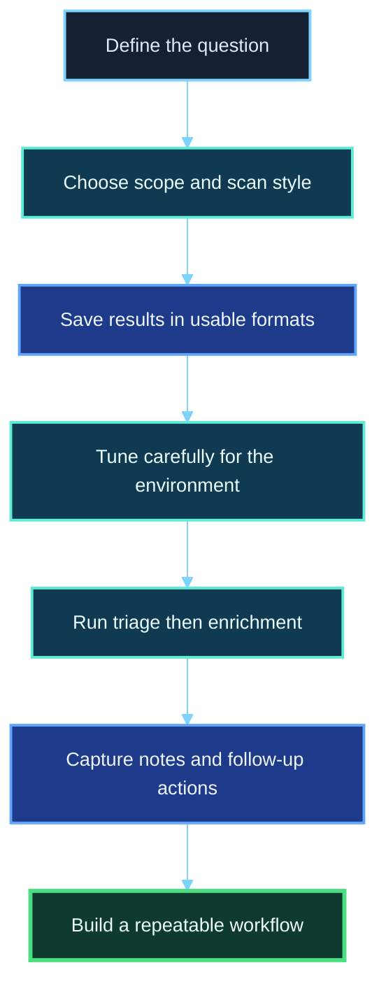
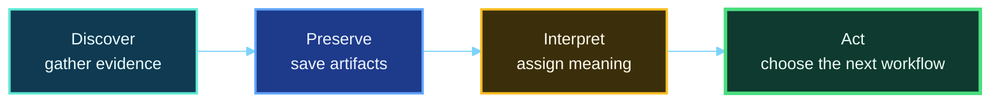
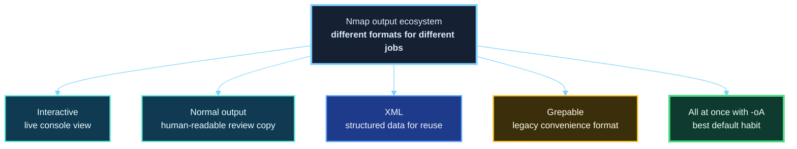
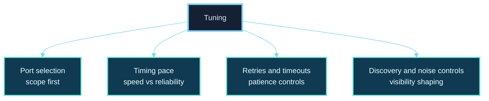
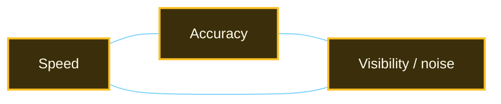
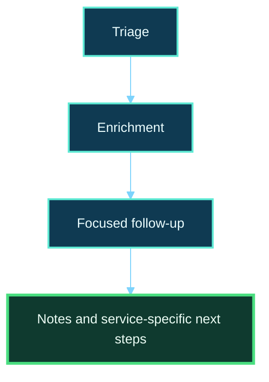

<div align="center">

**Hack the Basics · Phase I**

`Module 02 · Network Enumeration with Nmap`

</div>

# Lesson 2.5 — Saving Results, Tuning Scans, and Building a Repeatable Nmap Workflow

---

> **🎯 Lesson Objective**  
> By the end of this lesson, we will be able to turn one-off Nmap usage into a **repeatable enumeration workflow** that captures useful artifacts, tunes scans deliberately, and produces output we can actually return to, compare, and act on later.

| **Course** | **Module** | **Lesson** | **Estimated Time** | **Difficulty** |
|---|---|---|---:|---|
| Hack the Basics | Module 02 — Network Enumeration with Nmap | 2.5 — Saving Results, Tuning Scans, and Building a Repeatable Nmap Workflow | 60–80 min | Beginner |

| **Prerequisites** | **You will practice** | **Main outcome** |
|---|---|---|
| Lessons 2.1–2.4, basic shell usage, basic file and directory navigation | Saving scan results, choosing output formats, adjusting scan scope and speed, and structuring a multi-pass workflow | Learning how to run Nmap in a way that is **repeatable, reviewable, and useful after the terminal scrollback is gone** |

> **🚨 Important**
>
> The goal of this lesson is not to make us reckless or “fast.”
>
> The goal is to make us **deliberate**.
>
> A tuned scan is not automatically a better scan. A better scan is one that matches the question we are asking, respects the environment we are observing, and leaves behind artifacts we can trust later.

---

## Table of Contents

- [Lesson Map](#lesson-map)
- [Why This Lesson Matters](#why-this-lesson-matters)
- [Learning Objectives](#learning-objectives)
- [The Practical Problem This Lesson Solves](#the-practical-problem-this-lesson-solves)
- [Why Good Scans Still Fail in Real Workflows](#why-good-scans-still-fail-in-real-workflows)
- [The Three Jobs of a Professional Nmap Workflow](#the-three-jobs-of-a-professional-nmap-workflow)
- [Why Saving Results Is Not Optional](#why-saving-results-is-not-optional)
- [Nmap Output Formats at a High Level](#nmap-output-formats-at-a-high-level)
- [Interactive Output vs Saved Output](#interactive-output-vs-saved-output)
- [Normal Output: Readable Records for Humans](#normal-output-readable-records-for-humans)
- [XML Output: Structured Data for Reuse and Parsing](#xml-output-structured-data-for-reuse-and-parsing)
- [Grepable Output and the Right Way to Think About It](#grepable-output-and-the-right-way-to-think-about-it)
- [Using -oA to Build Better Habits by Default](#using--oa-to-build-better-habits-by-default)
- [Naming Conventions and Scan Directory Hygiene](#naming-conventions-and-scan-directory-hygiene)
- [What to Save Alongside the Scan Output](#what-to-save-alongside-the-scan-output)
- [Tuning Is About Tradeoffs, Not Bravery](#tuning-is-about-tradeoffs-not-bravery)
- [The Four Main Tuning Levers](#the-four-main-tuning-levers)
- [Lever 1: Port Selection and Why Scope Beats Aggression](#lever-1-port-selection-and-why-scope-beats-aggression)
- [Lever 2: Timing Templates and Scan Pace](#lever-2-timing-templates-and-scan-pace)
- [Lever 3: Retries, Host Timeouts, and Patience](#lever-3-retries-host-timeouts-and-patience)
- [Lever 4: Name Resolution, Discovery Choices, and Noise Control](#lever-4-name-resolution-discovery-choices-and-noise-control)
- [A Word About Speed, Accuracy, and Visibility](#a-word-about-speed-accuracy-and-visibility)
- [Building a Repeatable Nmap Workflow](#building-a-repeatable-nmap-workflow)
- [Workflow Pattern 1: Triage Scan](#workflow-pattern-1-triage-scan)
- [Workflow Pattern 2: Enrichment Scan](#workflow-pattern-2-enrichment-scan)
- [Workflow Pattern 3: Focused Follow-Up Scan](#workflow-pattern-3-focused-follow-up-scan)
- [Command Walkthrough 1: Saving a Clean First-Pass Scan](#command-walkthrough-1-saving-a-clean-first-pass-scan)
- [Command Walkthrough 2: Structured Enrichment with Artifacts](#command-walkthrough-2-structured-enrichment-with-artifacts)
- [Command Walkthrough 3: Larger Target Sets and Input Files](#command-walkthrough-3-larger-target-sets-and-input-files)
- [How to Read Your Own Scan Artifacts After the Fact](#how-to-read-your-own-scan-artifacts-after-the-fact)
- [A Repeatable Note-Taking Pattern for Nmap Work](#a-repeatable-note-taking-pattern-for-nmap-work)
- [Turning Nmap Output Into Next Actions](#turning-nmap-output-into-next-actions)
- [Stop and Think](#stop-and-think)
- [Common Mistakes and Misconceptions](#common-mistakes-and-misconceptions)
- [Defender’s View](#defenders-view)
- [Key Takeaways](#key-takeaways)
- [Knowledge Check Quiz](#knowledge-check-quiz)
- [Quiz Answers](#quiz-answers)
- [Module Practice Lab](#module-practice-lab)
- [Next Module Bridge](#next-module-bridge)

---

## Lesson Map



> **💡 Tip**
>
> The scan itself is only part of the job.  
> The rest of the job is making sure the result is **preserved, interpretable, and reusable**.

---

## Why This Lesson Matters

By the time people reach this point in Nmap learning, they often know enough to be dangerous to their own workflow.

They can discover hosts.
They can scan ports.
They can enrich results with service detection and scripts.

But they still do things like this:

- run a scan and never save the output
- copy one or two “interesting” lines into notes and lose the rest
- use the same command against every target regardless of size or network position
- crank up speed without understanding the tradeoffs
- re-scan the same host repeatedly because they did not preserve prior results
- forget which scan answered which question

That is where a lot of beginner friction lives.

The problem is no longer “I do not know how to scan.”
The problem is now:

> “How do I scan in a way that supports real enumeration work instead of creating chaos?”

This lesson answers that question.

It teaches us how to:

- save results in formats that are useful later
- tune scans deliberately instead of impulsively
- move from one-off commands into a repeatable multi-pass workflow
- leave behind clean artifacts that support service footprinting, reporting, and later comparison

> **📝 Note**
>
> This is where the module stops being about “using Nmap” and starts becoming about **operating with Nmap**.

---

## Learning Objectives

By the end of this lesson, we should be able to:

- explain why saving scan results is essential in real workflows
- distinguish between Nmap’s major output formats and choose among them appropriately
- describe the tradeoffs involved in timing, retries, scope, and port selection
- explain why reducing scope is often smarter than blindly increasing speed
- build a simple triage → enrichment → follow-up scan pattern
- create a repeatable directory, naming, and note-taking structure for Nmap work
- interpret saved artifacts in a way that drives the next phase of enumeration

---

## The Practical Problem This Lesson Solves

Imagine we scanned a host yesterday and found:

- 22/tcp open
- 80/tcp open
- 443/tcp open
- 445/tcp open

Today we want to answer a few basic questions:

- Did we save the original evidence?
- Which command produced that result?
- Was it a host discovery pass, a SYN scan, or an enriched scan?
- Did we also collect service/version details?
- Did we save structured output for later parsing or comparison?
- Did we note what we planned to do next?

If the answer is “not really,” then the technical problem is no longer Nmap.
It is workflow discipline.

This lesson exists because repeated offensive work creates repeated evidence.
If we do not preserve that evidence cleanly, we waste time, create confusion, and weaken every next step.

---

## Why Good Scans Still Fail in Real Workflows

A scan can be technically correct and still operationally weak.

For example, imagine this command:

```bash
nmap -sV -O -sC 192.168.57.25
```

That may produce a useful result.
But the workflow can still fail if:

- the output was never saved
- the operator does not remember when it was run
- the scan mixed several goals together without note-taking
- the operator cannot compare it against later runs
- the scan was too broad or too aggressive for the environment
- the open services were never turned into concrete next actions

So we need to separate two ideas:

1. **Can Nmap gather useful data?**
2. **Can we turn that data into a repeatable professional workflow?**

This lesson is about the second idea.

---

## The Three Jobs of a Professional Nmap Workflow

A disciplined Nmap workflow usually has to do three things well.



### 1. Discover

We need to gather evidence about hosts, ports, services, and network context.

### 2. Preserve

We need to save that evidence in a way that survives the session.

### 3. Interpret and act

We need to turn the output into:

- deeper scans
- service-specific follow-up
- notes
- route maps
- host profiles
- reporting artifacts

A workflow is weak if any one of those breaks.

---

## Why Saving Results Is Not Optional

The terminal is a terrible long-term memory system.

Interactive output is useful while we are watching a scan happen, but it is not enough for real work.

If we do not save results, we create avoidable problems:

- we cannot compare earlier and later scans
- we lose context on when a service first appeared
- we waste time re-running scans for information we already had
- we make reporting harder
- we increase the chance of copying details incorrectly into notes
- we weaken collaboration and handoff quality

Saving output matters because scan results are not just transient observations.
They are part of the assessment record.

> **🚨 Important**
>
> A good scan you did not save is often only slightly better than a scan you never ran.

---

## Nmap Output Formats at a High Level

Nmap supports several output styles, and they do not all serve the same purpose.



At a practical level, beginners should think about them like this:

| **Format** | **Best For** | **Strength** | **Weakness** |
|---|---|---|---|
| Interactive stdout | Watching a scan live | Immediate feedback | Easy to lose once the session ends |
| Normal (`-oN`) | Human review later | Clean and readable | Not ideal for structured parsing |
| XML (`-oX`) | Parsing, conversion, automation, comparison | Rich structured data | Less pleasant to read directly |
| Grepable (`-oG`) | Legacy quick text extraction habits | Familiar for simple text workflows | Limited and deprecated mindset |
| All major formats (`-oA`) | Repeatable workflows | Captures multiple needs at once | Requires slightly better file hygiene |

---

## Interactive Output vs Saved Output

By default, Nmap prints interactive output to standard output.

That is useful for:

- seeing progress
- spotting obvious open ports in real time
- checking whether a command is behaving as expected

But interactive output is designed for **observation during execution**, not long-term reuse.

Once the screen scrolls away, that context often disappears.

A saved output file has different value:

- it can be reopened later
- it can be compared with another file
- it can be attached to notes or evidence folders
- it can be parsed or transformed
- it becomes part of the assessment artifact trail

This is why serious workflows should assume that saved output is normal, not optional.

---

## Normal Output: Readable Records for Humans

Normal output is a saved, human-readable version of scan results.

Example:

```bash
nmap -oN assessment-workspace/02-evidence/scans/module-02/meta-tgt-initial.nmap 192.168.57.25
```

Why it is useful:

- easy to read later without extra tooling
- cleaner than relying on shell scrollback
- keeps core findings in a format that feels familiar
- good for quick review during note-taking

Normal output is often what we reopen when asking:

- what did the scan show again?
- which ports were open?
- what hostnames or latency values were reported?
- what did the service table look like?

Think of normal output as the **human review copy**.

---

## XML Output: Structured Data for Reuse and Parsing

XML output exists for a different reason.

Example:

```bash
nmap -oX assessment-workspace/02-evidence/scans/module-02/meta-tgt-initial.xml 192.168.57.25
```

XML is useful when we want:

- structured parsing
- later conversion into HTML or other formats
- ingestion into scripts, tools, or reporting pipelines
- consistent field extraction without fragile text scraping

For beginners, the most important mental model is this:

> **Normal output is for us to read. XML is for systems and structured workflows to consume.**

Even if we are not automating yet, XML is worth saving because it gives us future flexibility.

---

## Grepable Output and the Right Way to Think About It

Grepable output has historically been popular because it is easy to search and pipe through basic text-processing habits.

Example:

```bash
nmap -oG assessment-workspace/02-evidence/scans/module-02/meta-tgt-initial.gnmap 192.168.57.25
```

But there is an important mindset correction here:

- grepable output is not the richest format
- it is not the most future-proof format
- it encourages shallow parsing habits when used as the only artifact

It can still be convenient for quick text filtering or ad hoc review.
But it should not be the only thing we rely on.

If normal output is the **human review copy** and XML is the **structured data copy**, grepable output is best thought of as a **legacy convenience format**.

---

## Using `-oA` to Build Better Habits by Default

One of the easiest good habits we can build is using `-oA` with a basename.

Example:

```bash
nmap -oA assessment-workspace/02-evidence/scans/module-02/meta-tgt-initial 192.168.57.25
```

This tells Nmap to save the major formats at once using one common basename.

That means we get files such as:

- `assessment-workspace/02-evidence/scans/module-02/meta-tgt-initial.nmap`
- `assessment-workspace/02-evidence/scans/module-02/meta-tgt-initial.xml`
- `assessment-workspace/02-evidence/scans/module-02/meta-tgt-initial.gnmap`

This is useful because it reduces decision friction.
Instead of asking:

- should I save this one as normal?
- do I also want XML?
- do I need grepable too?

we simply build the habit of preserving the scan in several useful forms.

> **💡 Tip**
>
> For many beginner-to-intermediate workflows, `-oA` is one of the best defaults to adopt.

---

## Naming Conventions and Scan Directory Hygiene

Saving output is not enough if the filenames are chaotic.

Compare these two approaches.

### Weak naming

- `scan1.txt`
- `nmap-output.xml`
- `final-scan.txt`
- `really-final-scan.txt`

### Better naming

- `assessment-workspace/02-evidence/scans/module-02/meta-tgt-triage-2026-03-29`
- `assessment-workspace/02-evidence/scans/module-02/meta-tgt-enriched-2026-03-29`
- `assessment-workspace/02-evidence/scans/module-02/lab-net-discovery-2026-03-29`

A good naming convention usually captures:

- the target or target set
- the purpose of the scan
- the date or run context

### Example directory structure

```text
assessment-workspace/
├── 01-target-notes/
│   └── host-tracking.md
├── 02-evidence/
│   └── scans/
│       └── module-02/
│           ├── lab-net-discovery-2026-03-29.nmap
│           ├── lab-net-discovery-2026-03-29.xml
│           ├── lab-net-discovery-2026-03-29.gnmap
│           ├── meta-tgt-triage-2026-03-29.nmap
│           ├── meta-tgt-triage-2026-03-29.xml
│           ├── meta-tgt-enriched-2026-03-29.nmap
│           └── module-02-targets.txt
└── 03-analysis/
    └── follow-up-queue.md
```

That structure is not magical.
It is simply organized enough that we can return to it later without friction.

---

## What to Save Alongside the Scan Output

The scan files are important, but they are not the whole record.

A stronger workflow also preserves:

- the exact command used
- the target scope
- the network position or vantage point
- key observations
- the next actions the scan suggests

For example, a note entry might include:

| **Field** | **Example** |
|---|---|
| Date | 2026-03-29 |
| Target | `META-TGT (192.168.57.25)` |
| Scan purpose | Initial triage |
| Command | `nmap -oA assessment-workspace/02-evidence/scans/module-02/meta-tgt-triage-2026-03-29 192.168.57.25` |
| Summary | 22, 80, 443, 445 open |
| Next step | Enrich with service detection and OS clues |

That tiny amount of discipline dramatically improves later clarity.

---

## Tuning Is About Tradeoffs, Not Bravery

Scan tuning is where many learners start making unnecessary mistakes.

They hear words like:

- faster
- stealthier
- more aggressive
- optimized

and begin to think tuning is about choosing the “best” or “most advanced” settings.

That is the wrong mindset.

The correct mindset is:

> “What tradeoff am I making, and does that tradeoff fit this target set and this question?”

Because tuning always affects something:

- coverage
- speed
- reliability
- noise
- detectability
- operator confidence

This is why blindly copying an aggressive command from a cheatsheet is weaker than using a simpler command we actually understand.

---

## The Four Main Tuning Levers

For this lesson, we will keep tuning grounded in four practical levers.



These four levers cover most of what beginners need to reason well about:

1. **Port selection** — how much are we scanning?
2. **Timing pace** — how fast are we asking Nmap to work?
3. **Retries and timeouts** — how patient are we with uncertain responses?
4. **Discovery and noise controls** — which supporting behaviors are we enabling or disabling?

---

## Lever 1: Port Selection and Why Scope Beats Aggression

One of the most important lessons in scan tuning is this:

> **Reducing scope intelligently is often better than increasing aggression blindly.**

Why?
Because the number of targets and ports heavily affects scan time and noise.

### Common port-selection patterns

#### Default top ports mindset

```bash
nmap 192.168.57.25
```

Good for:

- fast initial triage
- first-pass visibility
- finding obvious services quickly

#### Fast scan of fewer common ports

```bash
nmap -F 192.168.57.25
```

Good for:

- very lightweight reconnaissance
- quick spot checks

But remember: reduced scope means reduced coverage.

#### Specific ports only

```bash
nmap -p 22,80,443,445 192.168.57.25
```

Good for:

- validating known services
- focused follow-up
- rescanning important ports without redoing everything

#### Full TCP port range

```bash
nmap -p- 192.168.57.25
```

Good for:

- deeper host-level coverage
- catching non-standard service placement

But it is slower and broader.
It should be a deliberate choice, not a reflex.

#### Top-N port strategies

```bash
nmap --top-ports 1000 192.168.57.25
```

Good for:

- balancing speed and reasonable coverage
- more deliberate triage than a tiny fast scan

### The key idea

If our question is:

- “Is anything obvious exposed?” then smaller scope may be fine.
- “What is the real TCP attack surface?” then broader scope may be necessary.

So the first tuning question should often be:

> “Do I need more speed, or do I just need to scan less?”

---

## Lever 2: Timing Templates and Scan Pace

Nmap supports timing templates that let us adjust overall scan pace.

Common examples:

- `-T0` paranoid
- `-T1` sneaky
- `-T2` polite
- `-T3` normal
- `-T4` aggressive
- `-T5` insane

The biggest beginner mistake is assuming higher is always better.
It is not.

### Practical beginner guidance

#### `-T3`

A reasonable default mindset when we do not need to get fancy.

#### `-T4`

Often useful on faster, more reliable networks or when we need more responsive scanning and understand the environment well enough.

#### `-T5`

Usually not where beginners should live.
It is easy to overuse and easier still to create misleading results or unnecessary noise with it.

### Timing mindset

Timing templates are not “power levels.”
They are convenience bundles that trade pacing against reliability, visibility, and environmental friendliness.

> **⚠️ Warning**
>
> If a scan is too slow, do not assume the answer is always “raise the timing template.”  
> Often the better answer is:
>
> - reduce the target set
> - reduce the port set
> - split the scan into phases
> - run a triage pass first

---

## Lever 3: Retries, Host Timeouts, and Patience

Real networks are imperfect.

Packets get dropped.
Rate limiting happens.
Devices respond slowly.
Middleboxes interfere.

That means we should think carefully before telling Nmap to give up too quickly.

### Retries

Retries influence how stubborn Nmap is when probing uncertain responses.

Too many retries can make broad scans slow.
Too few retries can make unstable environments look quieter than they are.

### Host timeouts

A host timeout can prevent one slow system from consuming an unreasonable amount of scan time.

Conceptually, this is useful when:

- scanning larger target sets
- dealing with unstable or latent environments
- wanting a scan to fail fast on pathological hosts rather than stall everything

### The patience tradeoff

The tuning question is not:

> “How do I make Nmap stop waiting?”

It is:

> “How much patience does this environment deserve before I conclude that the signal is not worth more time?”

That is a much better professional question.

---

## Lever 4: Name Resolution, Discovery Choices, and Noise Control

Not all tuning is about raw port-scan pace.
Some of it is about surrounding behavior.

### DNS resolution

Example:

```bash
nmap -n 192.168.57.25
```

Using `-n` tells Nmap not to do reverse DNS resolution.

Why that matters:

- it can reduce scan overhead
- it can avoid extra DNS-related noise
- it can make results appear faster and cleaner in some environments

But it also means we give up hostnames that might have been useful.

### Host discovery choices

Sometimes we want to use discovery first.
Sometimes we deliberately skip it.

Example:

```bash
nmap -Pn 192.168.57.25
```

This tells Nmap to treat the host as up and skip normal host discovery assumptions.

That can be useful when discovery traffic is likely to fail even though the host may still answer service probes.
But it should be used deliberately, not automatically.

### Noise control mindset

Noise control is about reducing unnecessary behavior while preserving the answer we care about.

That can involve:

- scanning fewer ports
- disabling DNS lookups when they are not useful
- focusing on specific hosts
- separating discovery from enrichment
- avoiding giant “do everything” commands too early

---

## A Word About Speed, Accuracy, and Visibility

There is a triangle we should keep in mind.



In practice:

- faster scans may increase noise or reduce confidence
- more patient scans may improve accuracy but cost time
- broader scans may reveal more but also create more traffic and more data to process

There is rarely a perfect answer.
That is why workflow matters.

A multi-pass workflow is often the cleanest solution because it avoids forcing every question into one command.

---

## Building a Repeatable Nmap Workflow

A repeatable workflow is simply a scan routine that we can use again without reinventing our thinking every time.

For this module, a good beginner pattern looks like this:

1. **Triage scan** — find the obvious surface quickly
2. **Enrichment scan** — add service, version, OS, and script context where appropriate
3. **Focused follow-up** — re-scan specific ports or hosts based on what matters
4. **Capture notes and next actions** — convert output into workflow decisions



That is simple enough to use consistently, but strong enough to support real work.

---

## Workflow Pattern 1: Triage Scan

The triage scan answers questions like:

- Is the host up?
- Which obvious ports are exposed?
- Which hosts in a small subnet deserve deeper attention?

Example mindset:

```bash
nmap -oA assessment-workspace/02-evidence/scans/module-02/meta-tgt-triage-2026-03-29 192.168.57.25
```

Why this works:

- simple command
- saved artifacts by default
- quick first-pass evidence
- easy handoff into deeper scanning

For multiple targets:

```bash
nmap -sn -oA assessment-workspace/02-evidence/scans/module-02/lab-net-discovery-2026-03-29 192.168.57.0/24
```

That keeps the discovery question separate from deeper port work.

---

## Workflow Pattern 2: Enrichment Scan

Once triage reveals worthwhile hosts, we enrich.

Example:

```bash
nmap -sV -O --traceroute -oA assessment-workspace/02-evidence/scans/module-02/meta-tgt-enriched-2026-03-29 192.168.57.25
```

This asks richer questions:

- what service/version clues exist?
- what does the host resemble?
- how far away is it and what path context appears?

Sometimes we may also include focused default scripts:

```bash
nmap -sV -sC -oA assessment-workspace/02-evidence/scans/module-02/meta-tgt-default-scripts-2026-03-29 192.168.57.25
```

The key idea is not that every host needs every enrichment feature.
The key idea is that enrichment is a separate step with a separate purpose.

---

## Workflow Pattern 3: Focused Follow-Up Scan

This is where we stop treating the host as a generic Nmap target and start treating it as a service-specific investigation.

Examples:

### Re-check only open or important ports

```bash
nmap -p 22,80,443,445 -sV -oA assessment-workspace/02-evidence/scans/module-02/meta-tgt-focused-2026-03-29 192.168.57.25
```

### Go broader after triage suggests it is worthwhile

```bash
nmap -p- -oA assessment-workspace/02-evidence/scans/module-02/meta-tgt-fulltcp-2026-03-29 192.168.57.25
```

### Focus on a specific service family later

```bash
nmap -p 445 --script smb-os-discovery,smb-enum-shares -oA assessment-workspace/02-evidence/scans/module-02/goad-mini-dc01-smb-2026-03-29 192.168.57.10
```

That is the real power of workflow discipline.
We no longer ask one giant command to solve every problem.
We use different scans for different questions.

---

## Command Walkthrough 1: Saving a Clean First-Pass Scan

```bash
mkdir -p assessment-workspace/02-evidence/scans/module-02
nmap -oA assessment-workspace/02-evidence/scans/module-02/meta-tgt-triage-2026-03-29 192.168.57.25
```

### What this does well

| **Part** | **Meaning** | **Why it matters** |
|---|---|---|
| `mkdir -p assessment-workspace/02-evidence/scans/module-02` | Creates the shared scan output directory if needed | Builds clean artifact habits in the course-wide workspace |
| `nmap` | Runs the scan | Starts with a simple first pass |
| `-oA assessment-workspace/02-evidence/scans/module-02/meta-tgt-triage-2026-03-29` | Saves the major output formats using one basename | Preserves evidence in multiple useful forms |
| `192.168.57.25` | Defines the target | Keeps the question narrow and clear |

### Why this is a strong beginner command

Because it solves two problems at once:

1. it performs a real first-pass scan
2. it guarantees that the evidence survives after the terminal closes

---

## Command Walkthrough 2: Structured Enrichment with Artifacts

```bash
nmap -sV -O --traceroute -oA assessment-workspace/02-evidence/scans/module-02/meta-tgt-enriched-2026-03-29 192.168.57.25
```

### What this adds

| **Part** | **Meaning** | **Why it matters** |
|---|---|---|
| `-sV` | Service/version detection | Adds service context beyond open ports |
| `-O` | OS detection | Adds platform inference |
| `--traceroute` | Route/path context | Adds topology clues |
| `-oA ...` | Saves artifacts in major formats | Makes the enriched scan reusable later |

### When this makes sense

This is not necessarily the first command we run against everything.
It makes the most sense after the target already looks interesting enough to justify deeper attention.

---

## Command Walkthrough 3: Larger Target Sets and Input Files

For repeated work, file-based targeting is often cleaner than giant inline target strings.

Example `assessment-workspace/02-evidence/scans/module-02/module-02-targets.txt`:

```text
192.168.57.10
192.168.57.25
192.168.57.31
```

Scan example:

```bash
nmap -iL assessment-workspace/02-evidence/scans/module-02/module-02-targets.txt -oA assessment-workspace/02-evidence/scans/module-02/module-02-hostset-triage-2026-03-29
```

### Why this is useful

- the target list becomes an artifact too
- the scope is easier to review later
- repeating or adjusting the scan becomes simpler
- it reduces the chance of typo-driven target errors

This is especially valuable once our work expands from one host to a small set or subnet-derived shortlist.

---

## How to Read Your Own Scan Artifacts After the Fact

A saved scan is not useful just because it exists.
We still need to know how to return to it and interpret it.

A simple review pattern looks like this:

1. Open the normal output for human review
2. Confirm the target, date, and scan purpose
3. Identify open ports and notable host status details
4. Compare against the enriched output if one exists
5. Extract next-step actions into notes

### Example review questions

- Is this a discovery scan or a deeper scan?
- Did I save output for the right scope?
- Which ports are open, filtered, or worth revisiting?
- Which services now deserve protocol-specific enumeration?
- Do I need a broader scan, or just a narrower follow-up?

That review step is how scan output becomes workflow input.

---

## A Repeatable Note-Taking Pattern for Nmap Work

Here is a simple host note format that scales well for beginners.

```markdown
## Host: META-TGT (192.168.57.25)

### Scan history
- 2026-03-29 — triage — `nmap -oA assessment-workspace/02-evidence/scans/module-02/meta-tgt-triage-2026-03-29 192.168.57.25`
- 2026-03-29 — enriched — `nmap -sV -O --traceroute -oA assessment-workspace/02-evidence/scans/module-02/meta-tgt-enriched-2026-03-29 192.168.57.25`

### Key observations
- Host appears up
- 22/tcp open ssh
- 80/tcp open http
- 443/tcp open https
- 445/tcp open microsoft-ds

### Interpretation
- Likely mixed admin + web + SMB exposure
- Worth deeper web validation on 80/443
- Worth SMB-specific follow-up on 445

### Next actions
- Browse 80/443 manually
- Check HTTP headers and TLS certificate details
- Run focused SMB enumeration
```

This is simple, but it works because it preserves:

- what was done
- what was seen
- what it likely means
- what happens next

---

## Turning Nmap Output Into Next Actions

Nmap is only useful if it changes what we do next.

| **Observed Result** | **What it suggests** | **Likely next action** |
|---|---|---|
| `22/tcp open ssh` | Remote administration surface | Validate banner, auth behavior, and host role clues |
| `80/tcp open http` | Web surface | Browse, fingerprint, inspect headers, map routes |
| `443/tcp open https` | Encrypted web surface | Check certificate details, redirects, and app behavior |
| `445/tcp open microsoft-ds` | SMB exposure | Enumerate shares, host info, and authentication behavior |
| Many filtered ports | Middlebox or policy interference | Reassess network position, patience, and scan strategy |
| Sparse results on a large host | Maybe limited scope or incomplete visibility | Consider broader or more focused rescanning |

The workflow does not stop when Nmap prints results.
That is where the real routing begins.

---

## Stop and Think

> **📝 Note**
>
> Try to answer these mentally before opening the guidance.

### Question 1

If a scan feels too slow, is `-T5` usually the smartest first fix?

<details>
<summary><strong>✅ Reveal guidance</strong></summary>

Usually no.

A smarter first question is whether the scope is appropriate.
Often the better fix is to:

- reduce the target set
- reduce the port set
- split the work into triage and enrichment
- disable unneeded extras such as name resolution in the moment

Faster is only helpful if the result still answers the question reliably.

</details>

### Question 2

Why is saving only the terminal screenshot of Nmap output usually weaker than saving actual scan files?

<details>
<summary><strong>✅ Reveal guidance</strong></summary>

Because screenshots are poor scan artifacts.

They are harder to search, harder to compare, harder to parse, and easier to miss details in. A saved `.nmap`, `.xml`, or `.gnmap` file preserves the scan in a form we can actually work with later.

</details>

### Question 3

If we already ran a triage scan, why might we still run a second scan against the same host?

<details>
<summary><strong>✅ Reveal guidance</strong></summary>

Because the second scan may answer a different question.

A triage scan asks, “what is obviously exposed?”
An enrichment or focused follow-up scan asks, “what exactly is behind these ports, and what matters most next?”

Different questions justify different scans.

</details>

---

## Common Mistakes and Misconceptions

### Mistake 1: Treating saved output like an optional extra

This creates fragile workflows and needless rescanning.

---

### Mistake 2: Running one giant “do everything” command against everything

This often creates:

- extra scan time
- more noise
- harder interpretation
- weaker alignment between question and method

---

### Mistake 3: Tuning for ego instead of purpose

Commands are not better because they look more advanced.
They are better if they fit the target, the question, and the environment.

---

### Mistake 4: Confusing aggressive timing with operator skill

Good operators do not prove themselves by making Nmap loud or unstable.
They prove themselves by getting usable answers efficiently and reliably.

---

### Mistake 5: Forgetting that scope is a tuning control

Many beginners think tuning means only timing flags.
In reality, target and port selection are often the biggest performance levers.

---

### Mistake 6: Saving output but not saving context

A `.xml` file named `scan-final.xml` is better than nothing, but still weak if we do not know:

- when it was run
- why it was run
- what target set it covered
- what follow-up it drove

> **💡 Tip**
>
> Good Nmap habits are less about exotic flags and more about **clarity, preservation, and intent**.

---

## Defender’s View

A repeatable scan workflow is not only meaningful to the operator. It is also meaningful to anyone observing the traffic.

From a defender’s perspective, tuning decisions can affect:

- scan rate
- burstiness
- protocol mix
- host discovery patterns
- DNS activity
- how easily the scanning behavior stands out in logs and monitoring

This matters because scan tuning does not just change our experience.
It changes the traffic pattern seen by the environment.

Even in a lab, that is worth understanding.
It helps us think like both sides of the interaction.

---

## Key Takeaways

> **💡 Tip**
>
> If you only remember a few ideas from this lesson, make them these:

- Saving scan output is part of the job, not an optional convenience.
- Normal output is great for humans; XML is great for structure and reuse.
- `-oA` is a simple way to build better artifact habits.
- Tuning is about tradeoffs, not bravado.
- Reducing scope intelligently is often smarter than blindly increasing speed.
- A strong workflow separates triage, enrichment, and focused follow-up.
- Nmap output becomes valuable when it drives the next action.

### What changed in our understanding?

| **Before this lesson, we might have thought...** | **After this lesson, we should understand...** |
|---|---|
| “I ran the scan, so I’m done.” | A scan is only complete when its artifacts and follow-up value are preserved. |
| “Tuning means making it faster.” | Tuning means choosing tradeoffs that fit the environment and question. |
| “One big command is more efficient.” | Multi-pass workflows are often clearer and more reliable. |
| “The terminal output is enough.” | Saved output plus notes creates a reusable evidence trail. |

---

## Knowledge Check Quiz

### 1. Which statement best describes why saving Nmap output matters?

A. It makes the terminal look more professional  
B. It preserves evidence for review, comparison, parsing, and follow-up  
C. It guarantees the scan was accurate  
D. It makes service detection unnecessary

---

### 2. Which output format is generally the best fit for structured parsing and reuse by other tools?

A. Interactive stdout  
B. Normal output only  
C. XML output  
D. A screenshot of the terminal

---

### 3. What is often a smarter first response to a slow scan than immediately raising the timing template?

A. Assume Nmap is broken  
B. Reduce target or port scope and split the scan into phases  
C. Delete retries completely  
D. Stop saving output

---

### 4. Which of the following best describes `-oA`?

A. It enables OS detection  
B. It saves the major output formats using one basename  
C. It forces UDP scanning  
D. It hides all filtered ports

---

### 5. Why is a triage → enrichment → focused follow-up pattern useful?

A. Because it makes every host take longer  
B. Because it separates different questions into clearer, purpose-built scan stages  
C. Because it removes the need for manual validation  
D. Because it only works on Linux systems

---

### 6. Which is the strongest mindset for scan tuning?

A. Higher timing templates always mean better operators  
B. Tuning is about choosing tradeoffs that fit the environment and objective  
C. The loudest scan is the most complete scan  
D. Saving XML is useless unless we are already automating everything

---

## Quiz Answers

<details>
<summary><strong>Reveal quiz answers</strong></summary>

### 1. Correct answer: B

Saving output preserves results for later review, comparison, reporting, and structured reuse.

### 2. Correct answer: C

XML is the strongest choice for structured parsing and downstream tool use.

### 3. Correct answer: B

A slow scan often suggests a scope or workflow problem before it suggests a timing-template problem.

### 4. Correct answer: B

`-oA` saves the major output formats with one shared basename.

### 5. Correct answer: B

That workflow is useful because it separates discovery, enrichment, and service-specific follow-up into cleaner phases.

### 6. Correct answer: B

Good tuning is about deliberate tradeoffs, not ego or blind aggression.

</details>

---

## Module Practice Lab

> **🚨 Important**
>
> This lab is meant to close Module 02 by making us use Nmap like a workflow tool instead of a one-command toy.

### Goal

Against the Module 01 baseline, perform a three-pass Nmap workflow that writes into the shared `assessment-workspace/` and ends with a clear Module 03 handoff.

### Suggested workflow

#### Step 1: Discovery or triage

Run a first-pass scan appropriate to your target set and save the results in `assessment-workspace/02-evidence/scans/module-02/`.

Examples:

```bash
nmap -sn -oA assessment-workspace/02-evidence/scans/module-02/lab-net-discovery-YYYY-MM-DD 192.168.57.0/24
```

or

```bash
nmap -oA assessment-workspace/02-evidence/scans/module-02/meta-tgt-triage-YYYY-MM-DD 192.168.57.25
```

#### Step 2: Enrichment

Choose one interesting host and enrich the scan.

Example:

```bash
nmap -sV -O --traceroute -oA assessment-workspace/02-evidence/scans/module-02/meta-tgt-enriched-YYYY-MM-DD 192.168.57.25
```

#### Step 3: Focused follow-up

Pick a few relevant ports and perform a narrower, more purposeful follow-up.

Example:

```bash
nmap -p 22,80,443,445 -sV -oA assessment-workspace/02-evidence/scans/module-02/meta-tgt-focused-YYYY-MM-DD 192.168.57.25
```

### In your notes, answer these questions

1. What question was each scan trying to answer?
2. Why did you choose that scope?
3. Which output files did you save?
4. What changed between the first and second pass?
5. Which open services now deserve protocol-specific follow-up outside Nmap?
6. What did you add to `host-tracking.md` and `follow-up-queue.md`?

### Suggested artifact checklist

- scan output directory
- at least one `.nmap` file
- at least one `.xml` file
- target list or scope record
- an updated host-tracking entry
- a follow-up queue entry describing the Module 03 handoff

### Suggested note table

| **Scan Stage** | **Question** | **Command** | **Key Result** | **Next Action** |
|---|---|---|---|---|
| Triage | What is exposed? | `nmap ...` | 22, 80, 443 open | Run enrichment |
| Enrichment | What services and host clues are present? | `nmap -sV -O ...` | Web stack clues, platform hints, service nouns captured | Run focused follow-up |
| Focused follow-up | Which services deserve deeper testing? | `nmap -p ...` | Web and service clues preserved for notes | Move into Module 03 service footprinting |

> **💡 Tip**
>
> If this lab feels less exciting than a flashy exploit demo, that is okay.  
> This kind of discipline is what makes later modules smoother, cleaner, and more professional.

---

## Next Module Bridge

Module 02 taught us how to:

- discover hosts
- define target scope
- interpret TCP and UDP results
- enrich open-port findings with service, OS, and script clues
- preserve and structure scan results like reusable evidence

That means we are now ready for the next step:

> turning open ports and service labels into **actual service understanding**.

In **Module 03 — Service Footprinting and Common Infrastructure Enumeration**, we will move from broad network mapping into protocol- and service-specific reasoning.

We will stop asking only:

- “Which ports are open?”

and start asking:

- “What kind of system is this likely to be?”
- “What role does this service play?”
- “What concrete information can this protocol give us?”
- “Which services are most important to prioritize next?”

> **📝 Note**
>
> Module 02 taught us how to build the map.  
> Module 03 begins teaching us how to read the systems that appear on it.

---

## End-of-Module Recap

> **One-sentence summary:**  
> Strong Nmap work is not just about finding hosts and ports — it is about saving evidence, tuning deliberately, and using a repeatable workflow that turns scan output into disciplined next steps.
