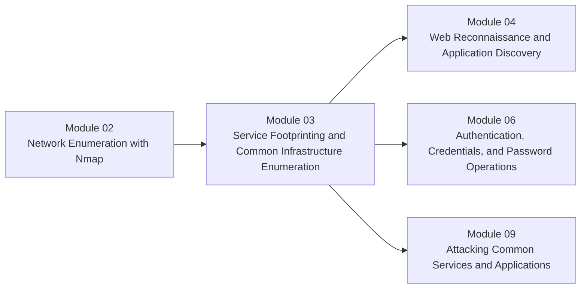

# Module 03 - Service Footprinting and Common Infrastructure Enumeration

**Phase I - Orientation and Surface Mapping**

### Learn to turn open ports into host-role, trust, and follow-up insight.

*This module teaches how to read exposed infrastructure services as environment functions, not just protocol names, so the learner can move from scan output into meaningful attack-surface interpretation.*

---

> **🧭 Start Here**
>
> Begin with [Lesson 3.1](lessons/module-03-lesson-3-1-how-common-infrastructure-services-behave-under-the-hood.md), then work through the protocol families before finishing with prioritization in Lesson 3.4. Keep the [reference cheat sheet](references/module-03-reference-cheat-sheet.md) open while practicing.

## Module Overview

Module 03 is the bridge between seeing exposure and understanding what that exposure means.

Module 02 taught us how to discover hosts, ports, and service clues.
This module teaches us how to interpret those clues as:

- host role
- trust context
- likely business function
- identity relevance
- high-value next steps

This is where the course starts to feel less like tool usage and more like infrastructure reasoning.

---

## At a Glance

| Area | Details |
|---|---|
| **Series** | Hack the Basics |
| **Phase** | Phase I - Orientation and Surface Mapping |
| **Module** | 03 - Service Footprinting and Common Infrastructure Enumeration |
| **Role** | Turn service exposure into host-role and follow-up understanding |
| **Level** | Beginner to early intermediate |
| **Format** | Self-paced, Markdown-first, GitHub-native |

| Builds On | Prepares Next | Core Artifacts |
|---|---|---|
| Module 02 scanning and output interpretation | Web recon, authentication reasoning, common service attack paths, later AD and foothold logic | service-role matrix, service triage lab, service cheat sheet, host-role notes |

---

## Why This Module Exists

An open port list is useful, but it is still shallow.

Strong offensive workflow needs a learner to ask:

- what kind of system is this likely to be?
- what does this service do for the environment?
- where might trust, data, or administrative value sit?
- what should we enumerate next, and what should wait?

That is the role of this module.

It teaches the learner to read infrastructure exposure as a story about systems, not just ports.

---

## Module Position in the Course

> **🧠 Mental Model**
>
> Module 02 answers, "What can we see?"
>
> Module 03 answers, "What does what we can see probably mean, and where should we go next?"

---

## Lesson Path

| Lesson | Role in the Journey | What the learner leaves with |
|---|---|---|
| [Lesson 3.1](lessons/module-03-lesson-3-1-how-common-infrastructure-services-behave-under-the-hood.md) | Establishes service roles and host-function reasoning before protocol tactics | A cleaner model for naming, identity, storage, messaging, data, and management services |
| [Lesson 3.2](lessons/module-03-lesson-3-2-enumerating-file-name-and-messaging-services.md) | Covers high-frequency protocols that reveal names, files, and communication context | Better protocol-aware first-pass enumeration habits |
| [Lesson 3.3](lessons/module-03-lesson-3-3-enumerating-databases-monitoring-and-management-services.md) | Covers high-signal admin, monitoring, and data services | Better understanding of why certain services immediately raise priority |
| [Lesson 3.4](lessons/module-03-lesson-3-4-prioritizing-follow-up-from-service-footprints.md) | Turns footprinting into triage and routing decisions | A repeatable way to convert service clues into the next workflow |

---

## What to Use During the Module

| Artifact | Purpose | When to use it |
|---|---|---|
| [Reference Cheat Sheet](references/module-03-reference-cheat-sheet.md) | Fast service-role, protocol, and triage reference | During labs, box work, and later review |
| [Service Role Matrix](references/module-03-service-role-matrix.md) | Helps classify services by role, trust, and likely host meaning | While reading Lesson 3.1 and triaging real outputs |
| [Module Lab](labs/module-03-lab-01-service-triage-and-follow-up-planning.md) | Forces learners to convert service clues into a prioritized plan | After Lesson 3.4 |

---

## Reading Strategy

### If this is your first pass

1. Start with service roles, not protocol memorization.
2. Capture exact nouns as you go: hostnames, domains, shares, records, versions, instance names.
3. Keep observation separate from inference in your notes.
4. End each lesson by writing down the most natural next-step workflow.

### If you are returning as a reference

- start with the [reference cheat sheet](references/module-03-reference-cheat-sheet.md)
- jump to the service family that matches your current target
- use Lesson 3.4 when you need help deciding what to prioritize

---

## What Makes This Module Different

Most service-enumeration content either collapses into trivia or jumps straight to one-off attack tricks.

This module aims for a stronger middle:

- service-first reasoning
- host-role interpretation
- protocol-aware evidence gathering
- cross-service correlation
- disciplined handoff into later workflows

The goal is not simply to recognize `445`, `389`, `3389`, or `3306`.
The goal is to understand what those exposures suggest about identity, administration, storage, trust, and attack priority.

---

## Module Navigation

| Previous | Next |
|---|---|
| [Module 02 - Network Enumeration with Nmap](../02-enumeration-using-nmap/README.md) | [Module 04 - Web Reconnaissance and Application Discovery](../04-web-reconnaissance-and-application-discovery/README.md) |

---

**Read services like systems: ask what role they play, what trust they imply, and which workflow should own the next step.**

