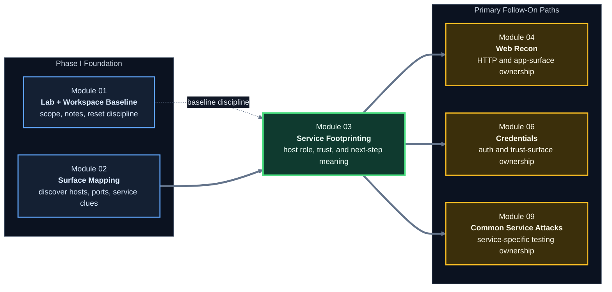

# Module 03 - Service Footprinting and Common Infrastructure Enumeration

**Phase I - Orientation and Surface Mapping**

### Learn to turn open ports into host-role, trust, and follow-up insight using the real Module 01 lab as a progressive service-footprinting workshop.

*This module teaches how to read exposed infrastructure services as environment functions, not just protocol names, so the learner can move from scan output into meaningful attack-surface interpretation, captured evidence, and a clean next-step queue.*

---

> **🧭 Start Here**
>
> Work through this module in order:
> [Lesson 3.1](lessons/module-03-lesson-3-1-how-common-infrastructure-services-behave-under-the-hood.md) ->
> [Checkpoint A](labs/module-03-lab-01-service-triage-and-follow-up-planning.md#checkpoint-a---lesson-31) ->
> [Lesson 3.2](lessons/module-03-lesson-3-2-enumerating-file-name-and-messaging-services.md) ->
> [Checkpoint B](labs/module-03-lab-01-service-triage-and-follow-up-planning.md#checkpoint-b---lesson-32) ->
> [Lesson 3.3](lessons/module-03-lesson-3-3-enumerating-databases-monitoring-and-management-services.md) ->
> [Checkpoint C](labs/module-03-lab-01-service-triage-and-follow-up-planning.md#checkpoint-c---lesson-33) ->
> [Lesson 3.4](lessons/module-03-lesson-3-4-prioritizing-follow-up-from-service-footprints.md) ->
> [Checkpoint D](labs/module-03-lab-01-service-triage-and-follow-up-planning.md#checkpoint-d---lesson-34).
>
> Do not treat the standalone lab as something to open only at the end. In this module, the lab is the progressive practice spine that ties the lesson theory back to the real course baseline.

## Module Overview

Module 03 is the bridge between seeing exposure and understanding what that exposure means.

Module 02 taught us how to discover hosts, ports, and service clues.
This module teaches us how to interpret those clues as:

- host role
- trust context
- likely business function
- identity relevance
- high-value next steps

This is where the course starts to feel less like tool usage and more like infrastructure reasoning.

It is also where the course should start to feel more cumulative:

- Module 01 gave us the environment, note structure, and reset model
- Module 02 gave us saved scan evidence and first-pass host clues
- Module 03 should now teach us to reuse those artifacts, run small service-aware checks, and turn them into a follow-up plan

---

## At a Glance

| Area | Details |
|---|---|
| **Series** | Hack the Basics |
| **Phase** | Phase I - Orientation and Surface Mapping |
| **Module** | 03 - Service Footprinting and Common Infrastructure Enumeration |
| **Role** | Turn service exposure into host-role and follow-up understanding |
| **Level** | Beginner to early intermediate |
| **Format** | Self-paced, Markdown-first, GitHub-native |

| Builds On | Prepares Next | Core Artifacts |
|---|---|---|
| Module 02 scanning and output interpretation | Web recon, authentication reasoning, common service attack paths, later AD and foothold logic | host-role notes, service evidence notes, service-role matrix, triage queue, module lab, service cheat sheet |

---

## Working Baseline For This Module

Module 03 should default to the same baseline established in Module 01 and exercised in Module 02.

| Layer | Expected baseline |
|---|---|
| Operator position | Kali WSL |
| Virtualization platform | VMware Workstation Pro on the Windows 11 host |
| Target subnet | `LAB-NET` on `192.168.57.0/24` |
| Canonical Windows infrastructure host | `GOAD-Mini-DC01` at `192.168.57.10` |
| Canonical Windows workstation | `GOAD-Mini-WS01` at `192.168.57.31` |
| Canonical Linux target | `META-TGT` at `192.168.57.25` |

> **🧠 Mental Model**
>
> Module 02 taught us to save and preserve first-pass surface evidence.
> Module 03 should now reuse that same evidence and the same hosts instead of pretending we are working in a brand-new environment.

---

## Why This Module Exists

An open port list is useful, but it is still shallow.

Strong offensive workflow needs a learner to ask:

- what kind of system is this likely to be?
- what does this service do for the environment?
- where might trust, data, or administrative value sit?
- what should we enumerate next, and what should wait?

That is the role of this module.

It teaches the learner to read infrastructure exposure as a story about systems, not just ports.

---

## Module Position in the Course

> **🧠 Mental Model**
>
> Module 02 answers, "What can we see?"
>
> Module 03 answers, "What does what we can see probably mean, and where should we go next?"

---

## Lesson Path

| Lesson | Role in the Journey | Required learner checkpoint |
|---|---|---|
| [Lesson 3.1](lessons/module-03-lesson-3-1-how-common-infrastructure-services-behave-under-the-hood.md) | Establishes service roles and host-function reasoning before protocol tactics | Use saved Module 02 scans to classify the baseline hosts by service role and record host-role hypotheses |
| [Lesson 3.2](lessons/module-03-lesson-3-2-enumerating-file-name-and-messaging-services.md) | Covers high-frequency protocols that reveal names, files, and communication context | Run small live file / naming checks against the baseline and capture exact nouns into notes |
| [Lesson 3.3](lessons/module-03-lesson-3-3-enumerating-databases-monitoring-and-management-services.md) | Covers high-signal admin, monitoring, and data services | Perform small management-surface checks on the baseline and record which service families are live, optional, or reference-only |
| [Lesson 3.4](lessons/module-03-lesson-3-4-prioritizing-follow-up-from-service-footprints.md) | Turns footprinting into triage and routing decisions | Build a prioritized follow-up queue in the shared analysis workspace |

---

## Shared Workspace Use

Module 03 should keep using the same `assessment-workspace/` created in Module 01 and populated in Module 02.

Recommended working locations:

- `assessment-workspace/01-target-notes/host-tracking.md`
- `assessment-workspace/02-evidence/scans/module-02/`
- `assessment-workspace/02-evidence/services/module-03/`
- `assessment-workspace/03-analysis/follow-up-queue.md`
- `assessment-workspace/03-analysis/module-03-host-role-notes.md`

If service-footprinting notes and follow-up decisions live somewhere else, the handoff into Modules 04, 06, and 09 becomes weaker immediately.

---

## What to Use During the Module

| Artifact | Purpose | When to use it |
|---|---|---|
| [Reference Cheat Sheet](references/module-03-reference-cheat-sheet.md) | Fast service-role, protocol, and triage reference | During labs, box work, and later review |
| [Service Role Matrix](references/module-03-service-role-matrix.md) | Helps classify services by role, trust, and likely host meaning | While reading Lesson 3.1 and triaging real outputs |
| [Module Lab](labs/module-03-lab-01-service-triage-and-follow-up-planning.md) | Acts as the progressive checkpoint system for the entire module | During the module, not only after Lesson 3.4 |

---

## Command Coverage And Practice Model

The footprinting cheat sheet in `_misc/Footprinting - cheatsheet.pdf` expands the command families this module should preserve.

The right way to use that command coverage is:

| Mode | Meaning |
|---|---|
| **Baseline-live** | Required hands-on commands against `GOAD-Mini-DC01`, `GOAD-Mini-WS01`, and `META-TGT` |
| **Optional-if-service-exists** | Useful live commands if the learner's environment exposes that service family |
| **Reference-only / future-state** | Commands the module should teach and preserve, but not require live in the default baseline |

| Service family | Examples preserved in this module | Practice mode |
|---|---|---|
| FTP | `ftp`, `nc -nv`, `telnet`, `openssl s_client -starttls ftp`, `wget -m --no-passive` | baseline-live on `META-TGT` where appropriate |
| SMB / RPC | `smbclient`, `rpcclient`, `samrdump.py`, `smbmap`, `crackmapexec smb`, `enum4linux-ng.py` | baseline-live where tools are available |
| DNS | `dig`, `host`, `dnsenum` | baseline-live for simple queries; broader brute or transfer work is optional |
| Linux management | `ssh`, `ssh -i`, `ssh -o PreferredAuthentications=password`, `ssh-audit.py` | baseline-live where practical |
| Windows management | `rdp-sec-check.pl`, `xfreerdp`, `evil-winrm`, `wmiexec.py` | partial baseline-live plus optional / reference-only depending on exposed services |
| Mail, NFS, SNMP, MySQL, MSSQL, Oracle TNS, IPMI, public recon | `telnet 25`, `curl imaps://`, `showmount`, `snmpwalk`, `mysql`, `mssqlclient.py`, `odat.py`, `crt.sh`, `shodan` | optional or reference-only unless the learner has those services live |

---

## Reading Strategy

### If this is your first pass

1. Start with service roles, not protocol memorization.
2. Open the module lab immediately and complete the matching checkpoint after each lesson.
3. Reuse Module 02 scan artifacts before you generate new noise.
4. Capture exact nouns as you go: hostnames, domains, shares, records, versions, instance names.
5. Keep observation separate from inference in your notes.
6. End each checkpoint by recording the cleanest next-step workflow.

### If you are returning as a reference

- start with the [reference cheat sheet](references/module-03-reference-cheat-sheet.md)
- jump to the service family that matches your current target
- reopen the matching checkpoint in the [module lab](labs/module-03-lab-01-service-triage-and-follow-up-planning.md) if you need to rebuild your note flow
- use Lesson 3.4 when you need help deciding what to prioritize

---

## What Makes This Module Different

Most service-enumeration content either collapses into trivia or jumps straight to one-off attack tricks.

This module aims for a stronger middle:

- service-first reasoning
- host-role interpretation
- protocol-aware evidence gathering
- cross-service correlation
- repeated artifact updates
- disciplined handoff into later workflows

The goal is not simply to recognize `445`, `389`, `3389`, or `3306`.
The goal is to understand what those exposures suggest about identity, administration, storage, trust, and attack priority.

---

## Module Navigation

| Previous | Next |
|---|---|
| [Module 02 - Network Enumeration with Nmap](../02-enumeration-using-nmap/README.md) | [Module 04 - Web Reconnaissance and Application Discovery](../04-web-reconnaissance-and-application-discovery/README.md) |

---

**Read services like systems: ask what role they play, what trust they imply, and which workflow should own the next step.**

