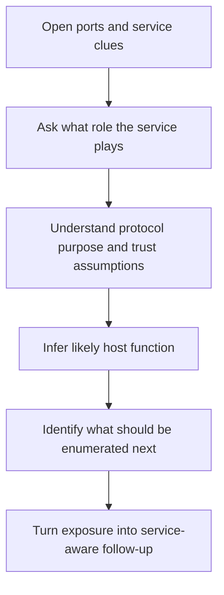
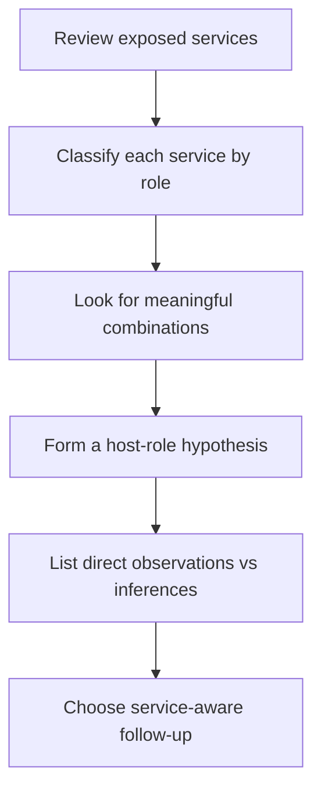

<div align="center">

**Hack the Basics · Phase I**

`Module 03 · Service Footprinting and Common Infrastructure Enumeration`

</div>

# Lesson 3.1 — How Common Infrastructure Services Behave Under the Hood

---

> **🎯 Lesson Objective**
> By the end of this lesson, we will be able to treat common infrastructure services as **real systems with roles, trust relationships, and operational meaning** rather than just names attached to open ports.

| **Course** | **Module** | **Lesson** | **Estimated Time** | **Difficulty** |
|---|---|---|---:|---|
| Hack the Basics | Module 03 — Service Footprinting and Common Infrastructure Enumeration | 3.1 — How Common Infrastructure Services Behave Under the Hood | 50–70 min | Beginner |

| **Prerequisites** | **You will practice** | **Main outcome** |
|---|---|---|
| Module 02 or equivalent Nmap basics, basic networking vocabulary, basic command-line comfort | Reading exposed services as clues about host role, trust, and likely follow-up questions | Building the service mental model needed before protocol-specific enumeration begins |

> **🚨 Important**
>
> This lesson is deliberately conceptual before it becomes tactical.
>
> We are not trying to memorize every protocol flag yet.
> We are trying to understand **why these services exist, what they do for the environment, and what service exposure actually tells us**.

---

## Table of Contents

- [Lesson Map](#lesson-map)
- [Why This Lesson Matters](#why-this-lesson-matters)
- [Learning Objectives](#learning-objectives)
- [The Practical Problem This Lesson Solves](#the-practical-problem-this-lesson-solves)
- [Why Open Ports Still Leave Big Questions Unanswered](#why-open-ports-still-leave-big-questions-unanswered)
- [What We Mean by Common Infrastructure Services](#what-we-mean-by-common-infrastructure-services)
- [Why These Services Exist in Real Environments](#why-these-services-exist-in-real-environments)
- [Service Roles at a Glance](#service-roles-at-a-glance)
- [Identity, Naming, Storage, Messaging, and Management as Environment Functions](#identity-naming-storage-messaging-and-management-as-environment-functions)
- [A Service Is More Than Its Default Port](#a-service-is-more-than-its-default-port)
- [Protocol Thinking: What Question Is This Service Designed to Answer?](#protocol-thinking-what-question-is-this-service-designed-to-answer)
- [Server, Client, and Trust Relationships](#server-client-and-trust-relationships)
- [What Service Exposure Suggests About Host Role](#what-service-exposure-suggests-about-host-role)
- [Observation vs Inference in Service Footprinting](#observation-vs-inference-in-service-footprinting)
- [How Multiple Services Change the Story](#how-multiple-services-change-the-story)
- [A Practical Host-Role Reasoning Workflow](#a-practical-host-role-reasoning-workflow)
- [Walkthrough 1: Reading a Small Port List Like an Analyst](#walkthrough-1-reading-a-small-port-list-like-an-analyst)
- [Walkthrough 2: What a Certificate, Banner, or Share Name Can Add](#walkthrough-2-what-a-certificate-banner-or-share-name-can-add)
- [Walkthrough 3: From Service Exposure to Follow-Up Questions](#walkthrough-3-from-service-exposure-to-follow-up-questions)
- [Appendix: Identity Services (LDAP and Kerberos) What to Look for First](#appendix-identity-services-ldap-and-kerberos-what-to-look-for-first)
- [Stop and Think](#stop-and-think)
- [Common Mistakes and Misconceptions](#common-mistakes-and-misconceptions)
- [Defender’s View](#defenders-view)
- [Key Takeaways](#key-takeaways)
- [Knowledge Check Quiz](#knowledge-check-quiz)
- [Quiz Answers](#quiz-answers)
- [Mini Practice Task](#mini-practice-task)
- [Next Lesson Bridge](#next-lesson-bridge)
- [End-of-Lesson Recap](#end-of-lesson-recap)

---

## Lesson Map



> **💡 Tip**
>
> Good service footprinting begins when we stop asking only:
>
> "What port is open?"
>
> ...and start asking:
>
> "What job is this system likely performing, and what does that imply about trust, data, and next steps?"

---

## Why This Lesson Matters

By the end of Module 02, we learned how to discover hosts, scan ports, and enrich results with service clues.

That gives us useful output such as:

```text
22/tcp   open  ssh
53/tcp   open  domain
80/tcp   open  http
139/tcp  open  netbios-ssn
445/tcp  open  microsoft-ds
```

A beginner may look at that and think:

- "SSH is open."
- "DNS is open."
- "SMB is open."
- "This host has several services."

Those statements are not wrong, but they are still shallow.

They do not yet answer the more important questions:

- what kind of system is this likely to be?
- which of these services matter most?
- which services may expose identity, file access, naming information, or administrative control?
- which trust relationships might exist behind them?
- what should be enumerated first, and why?

That is the purpose of Lesson 3.1.

Before we learn how to enumerate specific service families in Lessons 3.2 and 3.3, we need a cleaner model of what these common enterprise services actually *do*.

> **📝 Note**
>
> This lesson is the bridge from "scan output" into "environment understanding."

---

## Learning Objectives

By the end of this lesson, we should be able to:

- explain what common infrastructure services are doing inside real environments
- distinguish between major service roles such as naming, storage, messaging, identity, and management
- reason about a service as a function, not just a port number
- describe how service exposure can suggest host role and trust relationships
- separate direct observation from inference during service footprinting
- build a more deliberate workflow for turning exposed services into follow-up questions

---

## The Practical Problem This Lesson Solves

Suppose we scan three hosts and see:

### Host A

```text
22/tcp open ssh
80/tcp open http
443/tcp open https
```

### Host B

```text
53/tcp  open domain
53/udp  open domain
88/tcp  open kerberos-sec
389/tcp open ldap
445/tcp open microsoft-ds
```

### Host C

```text
25/tcp  open smtp
110/tcp open pop3
143/tcp open imap
993/tcp open imaps
995/tcp open pop3s
```

A beginner may simply label these as:

- web server
- Windows server
- mail server

That might be directionally right, but strong footprinting asks for more.

We should want to know:

- what each service family is for
- why these services tend to appear together
- what trust assumptions often sit behind them
- what metadata or behavior may be exposed next
- what each host likely contributes to the environment

This lesson solves the problem of moving from:

- exposed service names

to:

- a working model of host role, environment function, and next-step enumeration

---

## Why Open Ports Still Leave Big Questions Unanswered

An open port is evidence of reachable behavior.
It is not a full explanation.

For example:

```text
445/tcp open microsoft-ds
```

This tells us something valuable:

- a service consistent with SMB is reachable

But it does **not** yet tell us:

- whether this is a workstation, member server, or domain controller
- whether anonymous access is possible
- whether shares are exposed
- whether the host is Windows, Samba on Linux, or something appliance-like
- whether authentication is local, domain-backed, or heavily restricted

The same pattern holds for many common services.

```text
53/udp open domain
```

Useful?
Yes.

Complete?
Not even close.

It does not yet tell us:

- whether the host is authoritative, recursive, or both
- whether zone transfer is possible
- whether internal names may be exposed
- whether the service is central to identity and host discovery in the environment

> **🚨 Important**
>
> The job of service footprinting is to turn exposed service behavior into a clearer model of:
>
> - host role
> - protocol function
> - trust boundaries
> - next-step questions

---

## What We Mean by Common Infrastructure Services

In this module, "common infrastructure services" means the protocols and services that help an environment function day to day.

These are not just applications users happen to browse.
They are often the systems that support:

- identity
- naming
- storage
- messaging
- remote management
- monitoring
- back-end application data

Examples include:

- DNS
- SMB
- NFS
- FTP
- SMTP
- IMAP
- POP3
- LDAP
- Kerberos
- MySQL
- MSSQL
- SSH
- RDP
- WinRM
- SNMP
- IPMI

These services matter because they often reveal:

- names
- users
- host roles
- shares
- records
- certificates
- software versions
- trust relationships
- management surfaces

### Why these services are high-value for us

They often sit close to the environment's operational core.

A web application may be one business-facing surface.
But the infrastructure services beneath and around it often tell us:

- how systems are organized
- where credentials may be accepted
- where files may be stored
- where administrators connect
- where naming and identity are managed

That is why service footprinting matters so much after network enumeration.

---

## Why These Services Exist in Real Environments

It helps to step back and ask a simpler question:

> Why would an environment run these services at all?

Because systems need to solve recurring operational problems.

Examples:

- users and machines need names resolved to addresses
- systems need to authenticate identities
- files need to be shared
- email needs to move between senders, servers, and users
- administrators need remote access
- applications need back-end data stores
- devices need centralized monitoring and control

Infrastructure services exist because environments need these functions repeatedly.

That means service exposure is rarely random.
It usually reflects a real job in the environment.

> **🧠 Mental Model**
>
> A protocol is often the network-visible shape of an environment function.
>
> If we learn what function a protocol serves, open ports start telling a much richer story.

---

## Service Roles at a Glance

| **Service role** | **What it helps the environment do** | **Example services** | **Why we care during enumeration** |
|---|---|---|---|
| Identity | Prove who users and systems are | Kerberos, LDAP, SMB auth, WinRM auth | May reveal users, domains, trust, and credential relevance |
| Naming | Translate names and support discovery | DNS, NetBIOS naming | May reveal internal hostnames, domains, records, and network structure |
| Storage / file sharing | Move or expose files and shared resources | SMB, NFS, FTP, SFTP | May reveal shares, data, backups, configs, scripts, and access posture |
| Messaging | Send and retrieve mail or notifications | SMTP, IMAP, POP3 | May reveal usernames, hostnames, routing info, and communication surfaces |
| Management | Remotely administer systems and devices | SSH, RDP, WinRM, IPMI | May reveal administrative pathways and high-value access points |
| Monitoring / telemetry | Observe devices and system state | SNMP, monitoring agents | May expose device details, config clues, and environment inventory |
| Data services | Store and serve application or operational data | MySQL, MSSQL, PostgreSQL, Oracle | May reveal database exposure, app architecture, and sensitive back-end roles |

> **💡 Tip**
>
> When you see a port, try to classify the service by role before worrying about deep tool syntax.
> That one habit makes later enumeration much more deliberate.

---

## Identity, Naming, Storage, Messaging, and Management as Environment Functions

One of the easiest ways to stay organized is to think in **service functions**, not only protocol names.

### Identity services

Identity-related services help answer questions such as:

- who are you?
- which system or domain recognizes that identity?
- what permissions may follow from successful authentication?

Examples:

- Kerberos
- LDAP
- SMB-backed domain auth flows
- WinRM or SSH when tied to centralized credentials

These services often matter because they sit close to:

- user accounts
- machine accounts
- domains
- group structures
- trust relationships

### Naming services

Naming services help environments find things.

Examples:

- DNS resolving names to IPs
- reverse lookups
- service records
- naming conventions that expose internal structure

During enumeration, naming services often reveal:

- internal domains
- subdomains
- mail hosts
- domain controllers
- service naming patterns

### Storage and file-sharing services

These services help people and systems store, retrieve, and transfer files.

Examples:

- SMB shares
- NFS exports
- FTP repositories
- backup drops

These are valuable because they may expose:

- documents
- scripts
- installers
- credential artifacts
- config files
- deployment material

### Messaging services

Messaging protocols support mail flow and retrieval.

Examples:

- SMTP for mail transfer
- IMAP and POP3 for mailbox access

These may reveal:

- valid usernames
- mail hostnames
- internal routing clues
- TLS certificate naming
- authentication behavior

### Management services

Management services are especially important because they often exist for administrators, operators, or automation systems.

Examples:

- SSH
- RDP
- WinRM
- IPMI

These services can matter disproportionately because they may indicate:

- remote administrative pathways
- high-value host roles
- strong credential relevance
- potential routes to command execution if access is gained later

---

## A Service Is More Than Its Default Port

Beginners often learn protocols as simple pairings:

- `53` means DNS
- `445` means SMB
- `25` means SMTP
- `22` means SSH

That is useful as a starting point, but only a starting point.

### Why default ports help

Default ports are conventions.
They let clients and administrators know where services often live.

That means port numbers can give us a fast first hint.

### Why default ports are not the whole truth

A service can:

- run on a nonstandard port
- be fronted by a proxy
- be partially hidden behind ACLs
- appear through a wrapper or appliance
- be mislabeled by a simplistic scan if deeper validation has not happened yet

So a better model is:

| **What we see** | **What we should think** |
|---|---|
| Common service on common port | Good first clue, but still validate behavior |
| Common service on uncommon port | Service detection and interaction matter more than port expectation |
| Unusual combination of ports | Host role may be more complex than a single label suggests |
| Missing "expected" companion ports | Service may be segmented, filtered, proxied, or only partially exposed |

> **📝 Note**
>
> Ports suggest. Protocol behavior confirms more. Host role emerges from the combination.

---

## Protocol Thinking: What Question Is This Service Designed to Answer?

A useful way to think about protocols is to ask:

> What job is this service designed to perform for the environment?

Examples:

| **Service** | **Operational question it helps answer** |
|---|---|
| DNS | "What address should I use for this name?" |
| LDAP | "What directory information exists about users, groups, and systems?" |
| Kerberos | "Can this identity prove itself to the domain?" |
| SMB | "Can I access this file share, printer, or named resource?" |
| NFS | "Can this client mount and use this exported filesystem?" |
| SMTP | "Where should this mail be transferred next?" |
| IMAP / POP3 | "How does this user retrieve mailbox contents?" |
| SSH | "Can this client establish a remote administrative session?" |
| WinRM | "Can this host be managed remotely through Windows remoting?" |
| SNMP | "What does this device expose about its state, config, and identity?" |

This framing matters because it sharpens our next-step reasoning.

For example:

- DNS is not just "something on 53"; it may be a map of internal names
- SMB is not just "Windows file sharing"; it may be a path to shares, auth context, and host identity
- SMTP is not just "mail"; it may help us learn domains, users, and relay posture

That shift is the heart of service footprinting.

---

## Server, Client, and Trust Relationships

Infrastructure services rarely exist in isolation.
They usually mediate relationships between clients, servers, and trust decisions.

### Client/server relationships

Some services are straightforward:

- a client requests data or access
- a server responds or denies

Examples:

- an SSH client attempts remote login
- an SMB client requests a share listing
- a mail client retrieves messages over IMAP

### Trust relationships

Many services are more meaningful because they sit inside trust boundaries.

Examples:

- a domain controller is trusted to validate Kerberos and LDAP-related identity operations
- an SMB server may trust domain auth rather than only local auth
- a DNS server may be trusted to resolve internal names across the environment
- a WinRM endpoint may trust certain users or groups for remote administration

### Why this matters for us

If we understand who trusts whom, service exposure becomes much more informative.

An open service may suggest:

- local-only utility
- shared enterprise infrastructure
- delegated management
- identity-backed access
- a high-value trust anchor

> **🚨 Important**
>
> We are not just enumerating protocols.
> We are enumerating **relationships**, and those relationships often matter more than the port itself.

---

## What Service Exposure Suggests About Host Role

One of the most valuable things common services can tell us is what a host is likely *for*.

### Example patterns

| **Observed services** | **What they may suggest** |
|---|---|
| `80`, `443`, maybe `22` | Web-facing Linux or Unix-like server, reverse proxy, app host, or admin-managed appliance |
| `53`, `88`, `389`, `445` | Identity and naming role, often domain-related Windows infrastructure |
| `25`, `110`, `143`, `993`, `995` | Mail transfer and mailbox retrieval role |
| `139`, `445` with Windows clues | File server, workstation, or broader Windows infrastructure role |
| `3306`, `5432`, `1433` | Back-end data service or application database role |
| `161/udp`, `22`, `80` on a device-like host | Network device, appliance, or monitored infrastructure component |
| `3389`, `5985`, `5986` | Windows administrative or managed endpoint role |

### Host role is a hypothesis, not a guarantee

We should stay careful.

For example:

- a Linux host can expose SMB through Samba
- a Windows host can run web services and databases too
- an appliance can expose standard services but behave very differently from a general-purpose OS
- a load balancer or reverse proxy can distort how we interpret the host beneath it

So a strong note looks like this:

> "Service combination suggests likely Windows identity or file-serving role."

Not like this:

> "Confirmed domain controller."

Unless we truly have enough evidence.

---

## Observation vs Inference in Service Footprinting

This distinction matters everywhere in offensive work, and this module is a perfect place to practice it.

### Observation

Observation is what we directly saw.

Examples:

- port `445/tcp` responded as open
- the service matched `microsoft-ds`
- a TLS certificate exposed `mail.lab.local`
- an SMB share listing included `HR` and `Finance`

### Inference

Inference is what we believe those observations likely mean.

Examples:

- the host may be a Windows file server
- the certificate suggests an internal mail role
- the environment likely uses structured departmental share naming
- the host may participate in domain-based identity

### Validation

Validation is the next step that would test the inference.

Examples:

- use a service-aware client or script
- compare with other hosts
- inspect banner details or certificates further
- enumerate accessible shares or records
- test auth behavior in a controlled way

| **Stage** | **Example** |
|---|---|
| Observation | `25/tcp open smtp` |
| Inference | This host may be involved in mail transfer |
| Validation | Connect with an SMTP-aware client and inspect greeting, supported features, and domain clues |

> **💡 Tip**
>
> If your notes clearly separate what you saw from what you think it means, your service footprinting quality rises immediately.

---

## How Multiple Services Change the Story

A single open service gives one clue.
A service combination gives a much stronger story.

### Example 1: Naming + identity + file services

```text
53/tcp  open domain
88/tcp  open kerberos-sec
389/tcp open ldap
445/tcp open microsoft-ds
```

This combination is much more meaningful together than apart.

It may suggest:

- domain-related infrastructure
- centralized identity
- naming and file-service relationships
- high-value host role

### Example 2: Web + database

```text
22/tcp   open ssh
80/tcp   open http
443/tcp  open https
3306/tcp open mysql
```

This may suggest:

- an application server with direct database exposure
- a development or lab stack
- weaker segmentation than expected

### Example 3: Mail transfer + mailbox retrieval

```text
25/tcp  open smtp
110/tcp open pop3
143/tcp open imap
993/tcp open imaps
995/tcp open pop3s
```

This may suggest:

- a mail server or gateway
- user-facing message retrieval
- multiple auth and TLS surfaces

### Why combinations matter

They help us ask better questions:

- Is this host central to identity?
- Is this internet-facing infrastructure with internal back-end ties?
- Is this a user service or an admin service?
- Does this exposure suggest poor segmentation, expected function, or unusually broad trust?

---

## A Practical Host-Role Reasoning Workflow

A simple workflow helps keep service interpretation deliberate.



### Step 1: Review exposed services

Start with what is actually visible.
Do not jump ahead.

### Step 2: Classify each service by role

Ask whether each service relates mainly to:

- naming
- identity
- storage
- messaging
- management
- monitoring
- data

### Step 3: Look for combinations

Some services make more sense together than alone.

### Step 4: Form a host-role hypothesis

Examples:

- likely web application host
- likely Windows file server
- likely domain-related infrastructure
- likely mail system
- likely management or monitoring device

### Step 5: Separate observation from inference

This keeps our notes honest.

### Step 6: Choose the next service-aware action

Examples:

- enumerate DNS records
- inspect SMB shares
- review mail greetings and auth posture
- inspect certificates
- validate management surfaces

---

## Walkthrough 1: Reading a Small Port List Like an Analyst

Consider this scan result:

```text
PORT     STATE SERVICE
53/tcp   open  domain
53/udp   open  domain
88/tcp   open  kerberos-sec
135/tcp  open  msrpc
139/tcp  open  netbios-ssn
389/tcp  open  ldap
445/tcp  open  microsoft-ds
464/tcp  open  kpasswd5
593/tcp  open  http-rpc-epmap
636/tcp  open  ldapssl
3268/tcp open  ldap
3269/tcp open  globalcatLDAPssl
```

### Step 1: What do we directly observe?

- naming-related service exposure on `53`
- identity-related services such as Kerberos and LDAP
- Windows-oriented service exposure such as RPC and SMB
- secure and non-secure LDAP-like surfaces

### Step 2: What does the combination suggest?

This is not just "a host with many services."
It strongly suggests:

- directory and identity relevance
- Windows domain-related behavior
- a host with a central trust role in the environment

### Step 3: What should we avoid saying too early?

We should avoid writing:

> "Confirmed domain controller."

unless later evidence fully supports it.

A better note would be:

> "Service combination strongly suggests Windows directory / identity infrastructure, likely a highly trusted environment role."

### Step 4: What would follow-up look like?

Possible next questions:

- what domain naming does the host reveal?
- what LDAP information is available?
- what SMB naming or auth context is exposed?
- how does the host identify itself in banners, certificates, or naming data?

That is service footprinting working correctly.

---

## Walkthrough 2: What a Certificate, Banner, or Share Name Can Add

Let us say a host exposes:

```text
25/tcp  open smtp
143/tcp open imap
993/tcp open imaps
```

And an enriched check reveals:

```text
220 mail.corp.lab ESMTP Postfix
```

Plus a certificate subject:

```text
CN=mail.corp.lab
```

### What changed?

Now we have more than protocol names.
We also have:

- a host naming clue
- a likely mail role
- a domain naming pattern
- a software family clue

### Why this matters

These details may inform later work such as:

- identifying valid internal naming conventions
- mapping likely user-facing auth surfaces
- understanding whether this host is internet-facing or internal
- identifying likely companion records such as MX or related DNS entries

### Another example: SMB share names

Suppose an anonymous or low-friction enumeration result reveals:

```text
ADMIN$
C$
HR
Engineering
Backups
```

The existence and naming of shares can reveal:

- operating system style
- organizational structure
- likely data value
- whether admin shares are present
- whether backups or scripts may be stored nearby

> **📝 Note**
>
> Small details often do not confirm a full story, but they can dramatically strengthen a working model.

---

## Walkthrough 3: From Service Exposure to Follow-Up Questions

Consider this host:

```text
22/tcp   open  ssh
111/tcp  open  rpcbind
2049/tcp open  nfs
```

### What do these services suggest?

Likely:

- Unix-like or Linux-oriented infrastructure
- network file-sharing behavior
- a host or appliance exporting filesystems

### What should our next questions be?

Not:

- "How do I attack this immediately?"

But:

- what exports are visible?
- who is allowed to mount them?
- what naming or permission clues appear?
- does this host seem to be a general-purpose server, storage server, or support system?

### Why this is the right mindset

Because professional enumeration is about reducing uncertainty in the right order.

This service combination points naturally toward:

- file-access enumeration
- export visibility
- host-role interpretation

That is a cleaner next step than random tool hopping.

---

## Appendix: Identity Services (LDAP and Kerberos) What to Look for First

> **📝 Note**
>
> This is a bounded bridge, not a full Active Directory lesson.
> The goal here is to give self-learners a clean first-pass playbook for identity services so that the rest of Module 03 stays operationally complete.

Identity services have been important throughout this lesson, but they deserve one compact operational checkpoint of their own because they often sit so close to:

- domains
- trust boundaries
- user and machine identity
- later credential and Windows workflows

### What we are trying to learn first

When we see services like:

```text
88/tcp  open kerberos-sec
389/tcp open ldap
636/tcp open ldapssl
464/tcp open kpasswd5
```

our first-pass job is usually **not** to jump into deep identity testing.
It is to answer simpler questions such as:

- what domain or realm clues appear?
- does LDAP reveal naming contexts or directory identity?
- do LDAP, SMB, RDP, and DNS all point to the same host and domain names?
- does the service mix suggest shared trust or central identity importance?

### Good first-pass questions

| **Service** | **Good first questions** | **What to capture** |
|---|---|---|
| LDAP | Does the root DSE or base query reveal naming contexts, domain components, or directory identity? | `defaultNamingContext`, domain components, directory naming, host naming |
| Kerberos | Does the presence of `88` align with other domain-oriented services and names? | realm or domain clues, companion identity services, host-role relevance |
| Kerberos password service | Does `464` reinforce a domain / identity-service story? | supporting evidence for shared identity context |

### Low-friction first checks

```bash
nmap --script ldap-rootdse -p 389,636 <target>
ldapsearch -x -H ldap://<target> -s base namingcontexts defaultnamingcontext
nmap -sV -p 88,389,636,464 <target>
```

### What a useful early result looks like

```text
defaultNamingContext: DC=corp,DC=lab
```

or:

```text
DNS_Computer_Name: DC01.corp.lab
NetBIOS_Domain_Name: CORP
```

or simply:

```text
88/tcp open kerberos-sec
389/tcp open ldap
445/tcp open microsoft-ds
```

when that service combination repeats consistently with domain-like naming elsewhere.

### Why this matters

These results can quickly tell us:

- this host likely participates in centralized identity
- the environment likely has a specific domain or naming context
- later Windows, credential, and trust workflows should preserve this host carefully

### What this appendix is **not**

It is not:

- a full LDAP enumeration playbook
- a Kerberos attack lesson
- a replacement for later AD-focused material

It is the missing bridge between:

- "identity services matter conceptually"

and:

- "here is what I should actually look for first when I encounter them."

> **💡 Tip**
>
> If LDAP or Kerberos appears, your first move should usually be to capture domain / naming context cleanly and correlate it with DNS, SMB, and host identity clues before doing anything deeper.

---

## Stop and Think

> **📝 Note**
>
> Try to answer these mentally before opening the guidance.

### Question 1

If you see `445/tcp open microsoft-ds`, is it safe to conclude the host is definitely a Windows file server?

<details>
<summary><strong>✅ Reveal guidance</strong></summary>

No.

It is a strong clue, but not complete proof.

Why?

- SMB can appear on different host types
- Samba can expose SMB from Linux
- workstations, servers, and domain infrastructure may all expose related services
- the role depends on the broader service combination and later validation

</details>

### Question 2

Why is it useful to classify services by role, not only by protocol name?

<details>
<summary><strong>✅ Reveal guidance</strong></summary>

Because role-based thinking helps us understand what the service is doing for the environment.

That makes follow-up much easier.

For example:

- a naming service suggests host and domain discovery value
- a storage service suggests files, shares, and permission relevance
- a management service suggests administrative access pathways

</details>

### Question 3

If one host exposes DNS, Kerberos, LDAP, and SMB together, what should that change about your reasoning?

<details>
<summary><strong>✅ Reveal guidance</strong></summary>

It should shift your thinking from isolated service names toward a likely identity- and trust-related role.

The combination matters more than any one port by itself.

</details>

---

## Common Mistakes and Misconceptions

### Mistake 1: Treating service names like final answers

Seeing `smtp`, `ldap`, or `microsoft-ds` is a good start.
It is not the end of the reasoning process.

### Mistake 2: Forgetting that services exist for functions

If we memorize ports without understanding service purpose, enumeration becomes random and fragile.

### Mistake 3: Ignoring service combinations

One service may be ambiguous.
Several related services together may sharply narrow the likely host role.

### Mistake 4: Overstating inferences in notes

Writing "confirmed domain controller" when we only have partial service evidence weakens evidence quality.

### Mistake 5: Jumping straight to exploitation thinking

At this stage, we usually need clearer footprinting first:

- what is the service?
- what does it do?
- what trust may sit behind it?
- what should be enumerated next?

### Mistake 6: Assuming default port equals default behavior

Common ports help, but protocol behavior, banners, certificates, and companion services still matter.

> **⚠️ Warning**
>
> Service footprinting gets sloppy fast when we confuse:
>
> - familiar port numbers
> - scan labels
> - and verified environment truth

---

## Defender’s View

This lesson is useful from the defender side too.

Why?

Because the same service exposure that helps an operator reason about the environment also helps a defender see what the environment is unintentionally revealing.

Common infrastructure services can leak:

- internal names
- domain structure
- user patterns
- device identity
- share naming
- software family clues
- certificates and trust relationships

A defender should care about:

- unnecessary exposure
- inconsistent segmentation
- verbose banners
- weak anonymous access
- naming information that reveals too much too easily

> **💡 Tip**
>
> Good defensive exposure management is not only about "closing ports."
> It is also about reducing how much infrastructure meaning a service reveals to the wrong audience.

---

## Key Takeaways

> **💡 Tip**
>
> If you only keep a handful of ideas from this lesson, keep these:

- Common infrastructure services represent environment functions such as naming, identity, storage, messaging, management, and monitoring.
- An open port is a clue about behavior, not a complete description of host role.
- Service combinations often tell a stronger story than single ports alone.
- Strong service footprinting separates direct observation from analyst inference.
- Host role should be treated as a working hypothesis until more evidence confirms it.
- Good follow-up begins by asking what question the service is designed to answer for the environment.

### What changed in our understanding?

| **Before this lesson, we might have thought...** | **After this lesson, we should understand...** |
|---|---|
| "A service is basically a port label." | A service is usually the network-visible shape of an environment function. |
| "One open port tells me what the host is." | Host role usually emerges from service combinations, context, and validation. |
| "Memorizing default ports is enough." | Default ports help, but protocol purpose and trust relationships matter more. |
| "Scan output already tells the story." | Scan output begins the story; service footprinting is how we interpret it responsibly. |

---

## Knowledge Check Quiz

### 1. What is the most useful way to think about a common infrastructure service?

A. As a random background process that happens to answer on a port
B. As a network-visible function the environment depends on
C. As a guaranteed vulnerability
D. As a port number and nothing more

---

### 2. Why is it risky to overinterpret `445/tcp open microsoft-ds` by itself?

A. Because port `445` is never useful
B. Because a single service clue does not fully define host role or trust context
C. Because Nmap cannot detect SMB at all
D. Because SMB only runs on printers

---

### 3. Which service role is most closely associated with translating names into network locations?

A. Messaging
B. Naming
C. Storage
D. Monitoring

---

### 4. What is the best reason to pay attention to service combinations rather than isolated ports?

A. Because one port by itself is always wrong
B. Because combinations often reveal stronger clues about host role and trust relationships
C. Because only combinations can be scanned
D. Because default ports no longer matter at all

---

### 5. Which of the following is the clearest example of an inference rather than a direct observation?

A. `389/tcp` responded as open
B. The service fingerprint matched `ldap`
C. This host may be involved in centralized identity services
D. A certificate subject includes `mail.corp.lab`

---

### 6. What is usually the most professional next step after seeing a meaningful service footprint?

A. Assume exploitation is the next move no matter what
B. Choose service-aware follow-up questions and validate the host-role hypothesis
C. Ignore the result unless a CVE immediately appears
D. Replace all notes with screenshots only

---

## Quiz Answers

<details>
<summary><strong>Reveal quiz answers</strong></summary>

### 1. Correct answer: B

Common infrastructure services are best understood as network-visible functions the environment depends on.

### 2. Correct answer: B

A single service clue is valuable, but it does not fully define the host's role, operating system, or trust context.

### 3. Correct answer: B

Naming services, especially DNS-related ones, help the environment resolve names into network locations.

### 4. Correct answer: B

Combinations often create much stronger clues about host role, identity relevance, and trust relationships than any one port alone.

### 5. Correct answer: C

"This host may be involved in centralized identity services" is an inference based on observed service evidence.

### 6. Correct answer: B

Professional follow-up means choosing service-aware next questions and validating what the footprint likely suggests.

</details>

---

## Mini Practice Task

> **🚨 Important**
>
> This is a reasoning exercise first.
> The goal is not to run the loudest possible scan.
> The goal is to practice turning service exposure into a host-role hypothesis.

### Task

Choose one lab host or one saved scan result that contains at least three open services.

Examples:

- a Windows-like infrastructure host
- a Linux host with SSH and file-sharing services
- a web host with database exposure
- a mail-oriented host

### In your notes, answer these questions

1. Which services are exposed?
2. What role does each service play: naming, identity, storage, messaging, management, monitoring, or data?
3. Which services seem to reinforce each other?
4. What host role does the combination suggest?
5. What parts of that host-role idea are direct observations, and what parts are inference?
6. What is the cleanest service-aware next step?

### Suggested note-taking format

| **Observed Service** | **Role** | **What it may suggest** | **What still needs validation** |
|---|---|---|---|
| `53/tcp open domain` | Naming | Host may provide DNS-related infrastructure | Whether it is authoritative, recursive, internal-only, or domain-related |
| `389/tcp open ldap` | Identity / directory | Directory or identity relevance | What naming and directory info are exposed |
| `445/tcp open microsoft-ds` | Storage / identity context | Windows-oriented file or auth relevance | Whether shares, hostnames, or auth behavior are exposed |

> **💡 Tip**
>
> If you can explain *why* a service exists in the environment, your next-step enumeration choices usually get much better.

---

## Next Lesson Bridge

In this lesson, we built the mental model for what common infrastructure services *are* and why they matter.

In the next lesson, we will start applying that model to specific high-frequency service families:

- file-sharing services
- naming services
- messaging services

That means we will move from:

- "What does this service role suggest?"

to:

- "What should I actually look for when enumerating SMB, NFS, FTP, DNS, SMTP, IMAP, and POP3?"

> **📝 Note**
>
> Lesson 3.1 built the service-role map.
> Lesson 3.2 begins using that map against real protocol families.

---

## End-of-Lesson Recap

> **One-sentence summary:**
> Common infrastructure services are not just open ports to label; they are environment functions whose exposure helps us infer host role, trust relationships, and the most useful next step in enumeration.
