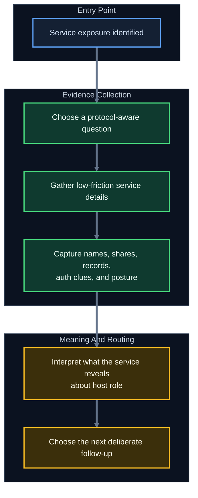
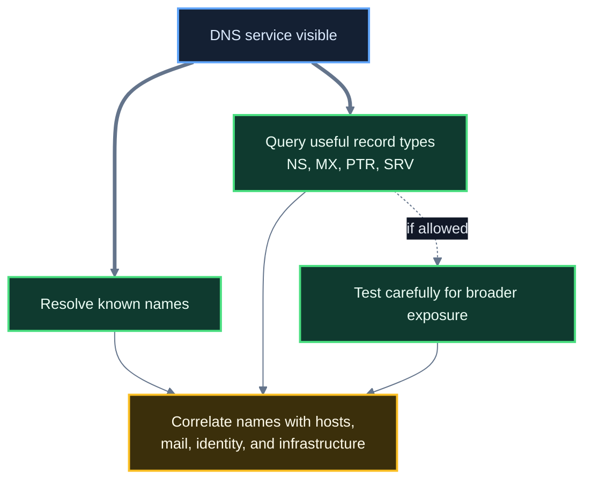

<div align="center">

**Hack the Basics · Phase I**

`Module 03 · Service Footprinting and Common Infrastructure Enumeration`

</div>

# Lesson 3.2 — Enumerating File, Name, and Messaging Services

---

> **🎯 Lesson Objective**
> By the end of this lesson, we will be able to enumerate common file, naming, and messaging services in a way that turns exposed protocols into **hostnames, shares, records, users, access posture, and practical next-step evidence**.

| **Course** | **Module** | **Lesson** | **Estimated Time** | **Difficulty** |
|---|---|---|---:|---|
| Hack the Basics | Module 03 — Service Footprinting and Common Infrastructure Enumeration | 3.2 — Enumerating File, Name, and Messaging Services | 60–85 min | Beginner |

| **Prerequisites** | **You will practice** | **Main outcome** |
|---|---|---|
| Lesson 3.1, Module 02 or equivalent Nmap basics, basic shell usage | Turning service exposure into structured follow-up across FTP, SMB, NFS, DNS, SMTP, IMAP, and POP3 | Learning what to look for first, what clues matter most, and how to interpret service results like an analyst |

> **🚨 Important**
>
> This lesson is about **enumeration discipline**, not exploitation shortcuts.
>
> Our goal is to ask better protocol-aware questions, gather meaningful evidence, and understand what each service reveals before later modules move into deeper attack-path reasoning.

---

## Table of Contents

- [Lesson Map](#lesson-map)
- [Why This Lesson Matters](#why-this-lesson-matters)
- [Learning Objectives](#learning-objectives)
- [The Practical Problem This Lesson Solves](#the-practical-problem-this-lesson-solves)
- [Why These Service Families Come First](#why-these-service-families-come-first)
- [A Protocol-Aware Enumeration Mindset](#a-protocol-aware-enumeration-mindset)
- [What Counts as a Strong Enumeration Outcome?](#what-counts-as-a-strong-enumeration-outcome)
- [File and Share Protocols at a Glance](#file-and-share-protocols-at-a-glance)
- [FTP: What to Look for First](#ftp-what-to-look-for-first)
- [SMB: What to Look for First](#smb-what-to-look-for-first)
- [NFS: What to Look for First](#nfs-what-to-look-for-first)
- [Naming Services: DNS as Environment Map](#naming-services-dns-as-environment-map)
- [DNS: What to Look for First](#dns-what-to-look-for-first)
- [Messaging Services at a Glance](#messaging-services-at-a-glance)
- [SMTP: What to Look for First](#smtp-what-to-look-for-first)
- [IMAP and POP3: What to Look for First](#imap-and-pop3-what-to-look-for-first)
- [How to Read Service Output Like an Analyst](#how-to-read-service-output-like-an-analyst)
- [A Cross-Protocol Service Enumeration Workflow](#a-cross-protocol-service-enumeration-workflow)
- [Walkthrough 1: Enumerating SMB and File-Sharing Clues](#walkthrough-1-enumerating-smb-and-file-sharing-clues)
- [Walkthrough 2: Enumerating DNS Like a Naming Service](#walkthrough-2-enumerating-dns-like-a-naming-service)
- [Walkthrough 3: Enumerating SMTP, IMAP, and POP3](#walkthrough-3-enumerating-smtp-imap-and-pop3)
- [Micro-Drills](#micro-drills)
- [Stop and Think](#stop-and-think)
- [Common Mistakes and Misconceptions](#common-mistakes-and-misconceptions)
- [Defender’s View](#defenders-view)
- [Key Takeaways](#key-takeaways)
- [Knowledge Check Quiz](#knowledge-check-quiz)
- [Quiz Answers](#quiz-answers)
- [Mini Practice Task](#mini-practice-task)
- [Next Lesson Bridge](#next-lesson-bridge)
- [End-of-Lesson Recap](#end-of-lesson-recap)

---

## Lesson Map



> **💡 Tip**
>
> Good enumeration usually begins with the question:
>
> "What useful information does this protocol normally reveal when handled correctly?"

---

## Why This Lesson Matters

After Lesson 3.1, we now understand that services exist because environments need functions such as:

- naming
- storage
- messaging
- identity
- management

That mental model matters, but on its own it is still incomplete.

When we see services like:

```text
21/tcp  open ftp
53/tcp  open domain
139/tcp open netbios-ssn
445/tcp open microsoft-ds
25/tcp  open smtp
143/tcp open imap
```

we need more than a conceptual label.
We need to know what to *do* next.

Examples:

- If FTP is open, should we look for anonymous access, banners, or exposed directories first?
- If SMB is open, what matters most: share names, hostnames, signing, users, or auth posture?
- If DNS is open, should we think only "resolves names," or should we ask about records, zone transfer, naming patterns, and internal topology clues?
- If SMTP, IMAP, or POP3 are visible, what can greetings, TLS details, capabilities, and auth behavior tell us?

This lesson answers those questions.

It moves us from:

- service-role understanding

into:

- service-family enumeration practice

That is why this lesson sits exactly here in the course progression.

> **📝 Note**
>
> This is where Module 03 becomes operational.
> We are no longer only interpreting what a service probably *is*.
> We are learning how to ask each service useful first questions.

---

## Learning Objectives

By the end of this lesson, we should be able to:

- explain what high-value information file, naming, and messaging services often reveal
- identify low-friction first checks for FTP, SMB, NFS, DNS, SMTP, IMAP, and POP3
- distinguish between protocol metadata, access clues, and stronger validation results
- interpret banners, share names, records, greetings, TLS details, and capability output carefully
- build a repeatable service-aware workflow for early enumeration
- capture service results in notes that preserve both evidence and uncertainty

---

## The Practical Problem This Lesson Solves

Suppose a first-pass scan gives us:

```text
21/tcp   open  ftp
53/tcp   open  domain
139/tcp  open  netbios-ssn
445/tcp  open  microsoft-ds
25/tcp   open  smtp
110/tcp  open  pop3
143/tcp  open  imap
2049/tcp open  nfs
```

That is already useful, but it still leaves several real questions unanswered:

- Which services may expose useful names or records?
- Which services might reveal users, shares, or directories?
- Which of them may allow low-friction or anonymous interaction?
- Which services give host-role clues even before authentication?
- Which results should go into notes as direct observation versus analyst interpretation?

The problem is not that we lack ports.
The problem is that we need a cleaner protocol-aware method for turning those ports into actionable understanding.

This lesson solves that by teaching:

- what to look for first
- what good early service output looks like
- what not to overclaim from minimal evidence
- how to turn service responses into a structured next step

---

## Why These Service Families Come First

We start with file, name, and messaging services because they appear constantly in labs and real enterprise environments.

They also tend to reveal high-signal information early.

### File and share services matter because they may reveal:

- readable or writable locations
- share names
- naming conventions
- backup material
- scripts and configs
- host role clues

### Naming services matter because they may reveal:

- internal domains
- hostnames
- service records
- mail infrastructure
- environment structure

### Messaging services matter because they may reveal:

- mail host identity
- valid domains
- auth posture
- TLS naming
- user-facing access surfaces

> **🚨 Important**
>
> Early enumeration is often won by asking simple, protocol-correct questions first.
> You do not need a fancy exploit to learn a lot from a badly exposed service.

---

## A Protocol-Aware Enumeration Mindset

One of the easiest mistakes in service work is running tools without knowing what question they are supposed to answer.

A stronger approach is:


### Questions worth asking first

| **Service family** | **Good first questions** |
|---|---|
| FTP | Does it allow anonymous access? What banner or directory clues appear? |
| SMB | What is the host called? What shares exist? What auth posture is visible? |
| NFS | What exports are exposed? Who appears allowed to mount them? |
| DNS | What names, records, and trust boundaries are visible? |
| SMTP | What mail identity, capabilities, and auth clues appear in the greeting? |
| IMAP / POP3 | What mailbox capabilities and TLS/auth clues are exposed? |

### What makes a good first check?

A good first check is usually:

- low friction
- protocol-correct
- minimally assumptive
- likely to reveal metadata
- easy to interpret and save in notes

That means we often start with:

- greetings
- banners
- share or export listings
- capability output
- certificates
- record lookups

before worrying about deeper testing.

---

## What Counts as a Strong Enumeration Outcome?

Many beginners stop too early with notes like:

- "SMB open"
- "DNS open"
- "Mail open"

Those are not wrong, but they are too weak to help much later.

A stronger enumeration outcome usually includes at least one of these:

- hostnames
- domain names
- share names
- export paths
- visible records
- service software clues
- auth mechanisms
- capability lists
- certificate subjects or SANs
- indications of anonymous or restricted access

| **Weak result** | **Stronger result** |
|---|---|
| `53/tcp open domain` | DNS service responds; MX and host records reveal `mail.lab.local` and `dc01.lab.local` |
| `445/tcp open microsoft-ds` | SMB service reachable; host identifies as `FS01`; shares `Engineering` and `Backups` visible; signing required |
| `25/tcp open smtp` | SMTP greeting shows `mail.corp.lab ESMTP Postfix`; STARTTLS and AUTH methods visible |
| `2049/tcp open nfs` | NFS export `/srv/backups` visible and restricted to a small subnet |

> **💡 Tip**
>
> A good service note should help future-you answer:
>
> "What exactly did this service tell me, and what should I do next?"

---

## File and Share Protocols at a Glance

File and share services are some of the most useful first targets in service footprinting because they often expose structure and data-adjacent clues quickly.

| **Protocol** | **Typical role** | **Common clues** | **Why it matters** |
|---|---|---|---|
| FTP | File transfer | Banner, anonymous access, directory names, writable locations | May reveal files, staging areas, backups, or misconfigurations |
| SMB | File / printer sharing, Windows resource access | Hostname, domain/workgroup, shares, auth posture, OS clues | Often reveals names, shares, trust context, and Windows posture |
| NFS | Unix-like remote filesystem sharing | Export paths, allowed clients, mount posture | May reveal shared storage and access scope |

---

## FTP: What to Look for First

FTP is simple enough that beginners sometimes underestimate how much it can reveal.

### High-value first questions

- What banner appears when the service responds?
- Is anonymous access enabled?
- If access is possible, what directories or files are visible?
- Do directory names reveal users, apps, uploads, backups, or staging workflows?
- Is the service clearly legacy, weakly configured, or unusually exposed?

### Early clues that matter

| **Clue** | **Why it matters** |
|---|---|
| Greeting / banner | May reveal software family, hostname, or version hints |
| Anonymous login allowed | May expose files or writable paths without credentials |
| Directory naming | May reveal users, business units, app pipelines, or backup habits |
| Write permissions | May suggest a later abuse path if scope and module context justify it |

### Example first interaction

```text
220 ftp.lab.local FTP server ready
```

That already tells us more than just "FTP open."
It may give:

- hostname or domain naming
- software family clues
- confirmation that the service is intended for direct interaction

> **📝 Note**
>
> Even when FTP is not ultimately the key path, it can still reveal naming, environment hygiene, and operational habits quickly.

---

## SMB: What to Look for First

SMB is one of the most information-rich services in early infrastructure enumeration.

### High-value first questions

- What is the host called?
- Does the host reveal a domain or workgroup?
- Which shares are visible?
- Is anonymous listing possible?
- Do share names reveal department, purpose, backup habits, or application structure?
- What clues appear about signing, protocol support, or OS family?

### Why SMB matters so much

It often sits close to:

- user workflows
- Windows host identity
- file access
- domain-backed authentication
- administrative shares

### Early clues that matter

| **Clue** | **Why it matters** |
|---|---|
| NetBIOS / SMB hostname | Supports host-role reasoning and cross-service correlation |
| Domain / workgroup name | May reveal identity context and environment structure |
| Share names | Can expose departments, backups, printers, installers, or sensitive data zones |
| Signing posture | Helps characterize security controls and follow-up expectations |
| Anonymous or guest behavior | Strong clue about access posture and exposure quality |

### Example share listing result

```text
Sharename       Type      Comment
---------       ----      -------
ADMIN$          Disk      Remote Admin
C$              Disk      Default share
Engineering     Disk
Backups         Disk
IPC$            IPC       Remote IPC
```

This tells us much more than "SMB is open."
It suggests:

- Windows-like administrative conventions
- potentially valuable shared data
- organizational naming
- a host that may be serving more than one operational purpose

---

## NFS: What to Look for First

NFS often appears in Unix-like or mixed environments where systems mount shared storage remotely.

### High-value first questions

- Which exports are visible?
- Which clients or subnets appear allowed to mount them?
- Do export paths reveal application, backup, or user-home structure?
- Does the service look narrowly scoped or broadly exposed?

### Why NFS matters

NFS can reveal:

- shared storage layout
- Linux or Unix-like infrastructure habits
- trust assumptions based on client IP ranges
- places where application data or backups may live

### Example export-style result

```text
Export list for 10.10.10.30:
/srv/backups 10.10.10.0/24
/home/dev     10.10.10.15
```

That may immediately suggest:

- environment segmentation assumptions
- backup storage
- developer or user-home relevance
- host role beyond a generic "Linux box"

> **💡 Tip**
>
> NFS is a good reminder that sometimes the *path name itself* is the most useful clue in the first pass.

---

## Naming Services: DNS as Environment Map

DNS is often one of the most valuable early services because it can function like an environment map.

It helps answer:

- what systems exist?
- what are they called?
- where does mail go?
- how are services named?
- what domains or subdomains appear in use?

That means DNS enumeration is usually not just "does it resolve?"

It is often about:

- discovering records
- identifying naming patterns
- finding infrastructure relationships
- mapping environment function through names



---

## DNS: What to Look for First

### High-value first questions

- Which domain names are associated with this environment?
- What A, AAAA, PTR, MX, or NS records are visible?
- Does the service allow recursion or zone transfer?
- Do record names reveal domain controllers, mail hosts, VPNs, apps, or management nodes?
- Does reverse lookup expose useful host naming?

### Record types that commonly matter

| **Record type** | **Why it matters** |
|---|---|
| `A` / `AAAA` | Maps names to addresses |
| `PTR` | Maps addresses back to names |
| `MX` | Reveals mail routing infrastructure |
| `NS` | Reveals authoritative name servers |
| `TXT` | May expose verification data or descriptive metadata |
| `SRV` | May reveal service-specific infrastructure in richer environments |

### Early clues that matter

| **Clue** | **Why it matters** |
|---|---|
| Internal hostname patterns | Reveals naming standards and likely host roles |
| Mail-related records | Links naming to messaging infrastructure |
| PTR names | Helps correlate IPs to likely roles |
| Zone transfer behavior | May expose unusually broad naming visibility |

### Example lookups

```bash
dig @10.10.10.20 lab.local ANY
dig @10.10.10.20 -x 10.10.10.15
dig @10.10.10.20 MX lab.local
```

The goal is not to memorize `dig` syntax first.
The goal is to understand what each query is asking the naming service to reveal.

---

## Messaging Services at a Glance

Messaging services often expose subtle but important information very quickly.

| **Protocol** | **Typical role** | **Common clues** | **Why it matters** |
|---|---|---|---|
| SMTP | Mail transfer | Greeting banner, hostname, capabilities, auth support, TLS posture | Reveals mail identity, domain context, and transfer behavior |
| IMAP | Mailbox access | CAPABILITY output, TLS naming, auth methods | Reveals user-facing mailbox access posture |
| POP3 | Mailbox retrieval | Greeting, capability output, TLS/auth clues | Reveals legacy or simpler retrieval posture and auth surface |

### Why mail protocols are useful early

They often reveal:

- mail hostnames
- domain naming
- auth posture
- capability support
- whether the host is a gateway, mailbox server, or related mail role

Even before valid credentials exist, greetings and capability responses can still teach us a lot.

---

## SMTP: What to Look for First

SMTP is often one of the most cooperative services for basic enumeration.

### High-value first questions

- What hostname appears in the greeting?
- What capabilities are returned after `EHLO`?
- Is `STARTTLS` supported?
- Are authentication methods advertised?
- Do commands like `VRFY` or `EXPN` appear enabled, disabled, or filtered?

### Example interaction

```text
220 mail.corp.lab ESMTP Postfix
EHLO analyst.lab
250-mail.corp.lab
250-PIPELINING
250-SIZE 52428800
250-VRFY
250-STARTTLS
250-AUTH PLAIN LOGIN
250 HELP
```

### What this reveals

- a likely mail hostname
- software-family clue
- message-size limits
- whether TLS can be negotiated
- whether auth is exposed
- whether user-enumeration-adjacent commands may exist

### What not to overclaim

This does **not** automatically prove:

- the server is externally relayable
- auth works for any tested user
- `VRFY` is unrestricted in a practically useful way

But it does give meaningful posture clues.

> **📝 Note**
>
> SMTP often rewards simple, protocol-correct interaction.
> A clean greeting and `EHLO` response can reveal more than a vague scan label ever will.

---

## IMAP and POP3: What to Look for First

IMAP and POP3 are often less flashy than SMTP, but they still expose important information.

### Good first questions

- What greeting does the service present?
- Does it advertise TLS or secure variants?
- What capabilities are exposed?
- Which auth methods are visible?
- Does the hostname or certificate reveal useful naming?

### IMAP example

```text
* OK [CAPABILITY IMAP4rev1 AUTH=PLAIN AUTH=LOGIN STARTTLS] mail.corp.lab ready
a001 CAPABILITY
* CAPABILITY IMAP4rev1 AUTH=PLAIN AUTH=LOGIN STARTTLS IDLE
a001 OK Completed
```

### POP3 example

```text
+OK POP3 server ready <1892.171171@example>
CAPA
+OK Capability list follows
TOP
UIDL
USER
STLS
.
```

### Why this matters

These results may reveal:

- host identity
- whether secure transport is available
- auth style
- whether the mail surface looks modern, legacy, or mixed
- whether the service aligns with the SMTP identity seen elsewhere

### What to capture in notes

- greeting hostname
- secure vs insecure availability
- capability list
- auth-related clues
- certificate subject or SANs where relevant

> **💡 Tip**
>
> Messaging services become much easier to reason about when you treat them as:
>
> - transfer behavior
> - mailbox access behavior
> - and identity / naming clues
>
> ...instead of one generic bucket called "mail."

---

## How to Read Service Output Like an Analyst

The biggest leap in quality often comes from how we interpret output, not from running more tools.

### Example 1: DNS

```text
dc01.lab.local.     3600 IN A 10.10.10.10
mail.lab.local.     3600 IN A 10.10.10.20
fs01.lab.local.     3600 IN A 10.10.10.30
```

Direct observations:

- three named hosts appear in the domain
- their names suggest directory, mail, and file-serving roles

Inference:

- the environment may be organized around conventional role-based naming
- the file server may be worth SMB or NFS follow-up

### Example 2: SMB

```text
Sharename       Type
Engineering     Disk
Deploy          Disk
IPC$            IPC
```

Direct observations:

- at least two named shares are visible

Inference:

- engineering and deployment workflows may have dedicated storage
- the host may support user or operational file exchange

### Example 3: SMTP

```text
220 mail.lab.local ESMTP Postfix
250-STARTTLS
250-AUTH PLAIN LOGIN
```

Direct observations:

- the host identifies as `mail.lab.local`
- STARTTLS and authentication support are advertised

Inference:

- this is likely a mail-transfer-capable host with user-facing or service-facing auth behavior

> **🚨 Important**
>
> A strong note should preserve both layers:
>
> - what the service directly revealed
> - what we think that likely means

---

## A Cross-Protocol Service Enumeration Workflow

A useful early workflow across these service families often looks like this:

```mermaid
%%{init: {"theme":"base","flowchart":{"curve":"basis","htmlLabels":true},"themeVariables":{"primaryColor":"#0f172a","primaryTextColor":"#e2e8f0","primaryBorderColor":"#7dd3fc","lineColor":"#64748b","secondaryColor":"#111827","tertiaryColor":"#0b1220","clusterBkg":"#0b1220","clusterBorder":"#334155","fontSize":"14px"}}}%%
flowchart LR
    subgraph START["Start"]
        A["Identify service from scan results"]
    end
    subgraph GATHER["Gather"]
        B["Choose low-friction manual<br/>or protocol-aware check"]
        C["Capture banner, names, shares,<br/>records, or capabilities"]
    end
    subgraph INTERPRET["Interpret"]
        D["Correlate results with host role"]
        E["Record direct observations<br/>and inferences"]
    end
    subgraph ROUTE["Route"]
        F["Choose focused next-step enumeration"]
    end

    A ==> B ==> C ==> D ==> E ==> F

    classDef source fill:#142033,stroke:#60a5fa,color:#dbeafe,stroke-width:2px;
    classDef analysis fill:#0f3a2f,stroke:#4ade80,color:#ecfdf5,stroke-width:2px;
    classDef action fill:#3b2f0b,stroke:#fbbf24,color:#fffbeb,stroke-width:2px;

    class A source;
    class B,C,D,E analysis;
    class F action;

    style START fill:#0b1220,stroke:#334155,color:#cbd5e1
    style GATHER fill:#0b1220,stroke:#334155,color:#cbd5e1
    style INTERPRET fill:#0b1220,stroke:#334155,color:#cbd5e1
    style ROUTE fill:#0b1220,stroke:#334155,color:#cbd5e1
```



### Step 1: Start with protocol identity

Do not treat every open service the same.
Ask what the protocol is built to reveal.

### Step 2: Gather low-friction metadata

Examples:

- banner
- greeting
- certificate
- share listing
- export list
- DNS record
- capability output

### Step 3: Correlate with other visible services

Examples:

- DNS mail record plus SMTP greeting
- SMB share names plus Windows host clues
- NFS exports plus Linux-style service stack

### Step 4: Capture both evidence and meaning

A note should preserve:

- direct output
- likely implication
- what still needs validation

### Step 5: Move to focused follow-up

That may mean:

- deeper SMB share enumeration
- richer DNS record review
- mail TLS inspection
- user-enumeration posture checks where authorized
- cross-host correlation across naming and service roles

---

## Walkthrough 1: Enumerating SMB and File-Sharing Clues

Suppose a host shows:

```text
139/tcp open netbios-ssn
445/tcp open microsoft-ds
```

### A reasonable first check

```bash
smbclient -L //10.10.10.30/ -N
```

### Representative output

```text
Sharename       Type      Comment
---------       ----      -------
ADMIN$          Disk      Remote Admin
IPC$            IPC       Remote IPC
Engineering     Disk
Backups         Disk
```

### What we directly observe

- the service allowed share listing without credentials or guest restriction blocked differently
- visible shares include `Engineering` and `Backups`
- administrative shares are present

### What we may infer

- the host likely serves operational or departmental file-storage functions
- backups may represent a high-value follow-up area
- this is likely not just a generic user workstation

### What should happen next

- note host and share names exactly
- determine whether access is list-only or readable
- correlate the host with DNS or other naming clues
- avoid overstating access until tested carefully

### File-service mindset

The point is not merely "SMB open."
The point is:

- what file resources are exposed?
- what do their names suggest?
- what does the auth posture imply?

---

## Walkthrough 2: Enumerating DNS Like a Naming Service

Suppose a host exposes:

```text
53/tcp open domain
53/udp open domain
```

### Reasonable first checks

```bash
dig @10.10.10.20 lab.local NS
dig @10.10.10.20 lab.local MX
dig @10.10.10.20 -x 10.10.10.30
```

Optional follow-up where appropriate:

```bash
dig @10.10.10.20 axfr lab.local
```

### Representative output

```text
lab.local.     3600 IN NS dc01.lab.local.
lab.local.     3600 IN MX 10 mail.lab.local.
30.10.10.10.in-addr.arpa. 3600 IN PTR fs01.lab.local.
```

### What we directly observe

- `dc01.lab.local` appears to provide authoritative naming
- `mail.lab.local` appears involved in mail routing
- `10.10.10.30` reverse-resolves to `fs01.lab.local`

### What we may infer

- the environment likely uses conventional role-based naming
- multiple infrastructure roles can now be correlated across services
- a host previously seen via SMB may now align with a file-server identity

### Why this is powerful

DNS often turns isolated hosts into a coherent environment map.

That is why strong DNS enumeration often improves:

- host prioritization
- note quality
- cross-service reasoning

---

## Walkthrough 3: Enumerating SMTP, IMAP, and POP3

Suppose one host exposes:

```text
25/tcp  open smtp
110/tcp open pop3
143/tcp open imap
993/tcp open imaps
995/tcp open pop3s
```

### Reasonable first interactions

```text
nc 10.10.10.20 25
EHLO analyst.lab
```

```text
nc 10.10.10.20 143
a001 CAPABILITY
```

```text
nc 10.10.10.20 110
CAPA
```

### Representative results

```text
220 mail.lab.local ESMTP Postfix
250-STARTTLS
250-AUTH PLAIN LOGIN
```

```text
* OK [CAPABILITY IMAP4rev1 AUTH=PLAIN AUTH=LOGIN STARTTLS] mail.lab.local ready
```

```text
+OK POP3 server ready
+OK Capability list follows
USER
STLS
.
```

### What we directly observe

- a consistent mail hostname appears across services
- both mailbox-access protocols advertise capability information
- TLS-related support is visible
- auth behavior is exposed at the capability level

### What we may infer

- the host likely serves a real mail role, not just a relay stub
- the environment uses a consistent mail naming pattern
- further mail-surface validation may be worthwhile later

### What should happen next

- capture hostnames and capability details precisely
- compare DNS MX records against observed service identity
- inspect certificates where secure variants are present
- keep notes clear about what is observed versus assumed

---

## Micro-Drills

> **🛠 Practice**
>
> These are intentionally short.
> The point is to force quick interpretation and note quality, not long tool sessions.

### Micro-Drill 1: DNS plus SMB correlation

Read the two fragments below:

```text
lab.local.     3600 IN A 10.10.10.30 fs01.lab.local.
```

```text
Sharename       Type
Engineering     Disk
Backups         Disk
```

In your notes, answer:

1. What exact nouns belong in the notes?
2. What host role does the combination suggest?
3. What is direct observation vs inference?
4. What should happen next?

### Micro-Drill 2: Messaging posture

Read the fragment below:

```text
220 mail.lab.local ESMTP Postfix
250-STARTTLS
250-AUTH PLAIN LOGIN
* OK [CAPABILITY IMAP4rev1 AUTH=PLAIN STARTTLS] mail.lab.local ready
```

In your notes, answer:

1. Which hostnames, capabilities, and auth clues are explicit?
2. What does this suggest about the host's role?
3. What details would you capture verbatim?
4. What still needs validation before you claim too much?

> **💡 Tip**
>
> If you cannot produce a clean two-column note of "observed" and "inferred" here, slow down before moving on.

---

## Stop and Think

> **📝 Note**
>
> Try to answer these mentally before opening the guidance.

### Question 1

If an SMTP server greets you with `220 mail.corp.lab ESMTP Postfix`, what is the most important thing to capture first?

<details>
<summary><strong>✅ Reveal guidance</strong></summary>

Capture the direct evidence clearly:

- hostname
- software-family clue
- service role implication

Do not jump straight from the greeting to a full mail-architecture conclusion.
Start with the evidence, then correlate with DNS and other service results.

</details>

### Question 2

Why is `Backups` a more useful SMB share name to write down than a generic note like "some shares visible"?

<details>
<summary><strong>✅ Reveal guidance</strong></summary>

Because specific share names carry meaning.

`Backups` suggests:

- likely data value
- operational function
- possible follow-up relevance

Generic notes lose the part that makes the result useful later.

</details>

### Question 3

What makes a DNS result especially powerful compared with an isolated service banner?

<details>
<summary><strong>✅ Reveal guidance</strong></summary>

DNS often helps connect hosts into a coherent naming model.

It can reveal:

- role-based names
- mail paths
- reverse mappings
- internal structure

That makes other service findings easier to interpret and prioritize.

</details>

---

## Common Mistakes and Misconceptions

### Mistake 1: Treating every service the same way

DNS, SMB, SMTP, and NFS do not reward the same first questions.
Protocol-aware enumeration matters.

### Mistake 2: Stopping at the scan label

Notes like "FTP open" or "mail open" are too weak to help much later.

### Mistake 3: Forgetting to capture exact names

Hostnames, share names, export paths, and mail identities are often the most useful part of the output.

### Mistake 4: Overstating access

A visible share name is not the same as confirmed readable content.
A visible mail auth mechanism is not the same as valid credentials.

### Mistake 5: Ignoring service correlation

A DNS name, SMB hostname, and SMTP greeting may all refer to the same environment structure.
Missing those links weakens host-role reasoning.

### Mistake 6: Running deeper checks before asking simple questions

Many high-value clues appear in:

- greetings
- banners
- capability lists
- share and export listings
- record queries

before any advanced move is needed.

> **⚠️ Warning**
>
> Enumeration quality often drops when we chase complexity before we capture the easy, high-signal metadata the service already offers.

---

## Defender’s View

These service families are valuable to defenders for the same reason they are valuable to us:

they often reveal operational truth quickly.

Examples:

- SMB may reveal sensitive share names or guest behavior
- DNS may reveal internal naming patterns and service relationships
- SMTP and IMAP may reveal host identity, auth style, and TLS posture
- FTP or NFS may reveal exposed storage paths and weak access controls

A defender should care about:

- unnecessary anonymous exposure
- over-descriptive banners and greetings
- weakly scoped file-sharing surfaces
- naming data that leaks too much structure
- service configurations that reveal more than they need to

> **💡 Tip**
>
> Good defensive hardening often means asking:
>
> "If someone interacted with this service correctly but unauthenticated, how much would they learn too quickly?"

---

## Key Takeaways

> **💡 Tip**
>
> If you only keep a handful of ideas from this lesson, keep these:

- File, naming, and messaging protocols often reveal high-value metadata very early.
- Strong service enumeration starts with protocol-aware first questions, not random tool usage.
- Good outcomes include names, shares, exports, records, greetings, capability lists, and auth posture clues.
- Specific nouns matter: exact hostnames, share names, export paths, and certificate subjects are often more useful than generic notes.
- Cross-service correlation is one of the most important habits in infrastructure enumeration.
- Observation, inference, and validation should stay separate in notes.

### What changed in our understanding?

| **Before this lesson, we might have thought...** | **After this lesson, we should understand...** |
|---|---|
| "SMB open" is enough to capture | Share names, hostnames, and auth posture are what make the result useful |
| DNS is just name resolution | DNS can act like an environment map |
| Mail protocols only matter once we have credentials | Greetings, capabilities, and TLS details already reveal important posture clues |
| More commands means better enumeration | Better questions usually matter more than more commands |

---

## Knowledge Check Quiz

### 1. What is usually the best first mindset when enumerating a service like SMB or SMTP?

A. Run the loudest available tool immediately
B. Ask what the protocol is designed to reveal and choose a low-friction first check
C. Skip banners because they are never useful
D. Assume authentication is the only thing that matters

---

### 2. Which of the following is the strongest early SMB outcome?

A. "SMB open"
B. "Host reachable"
C. Hostname, visible shares, and access posture clues captured in notes
D. "Probably Windows"

---

### 3. Why is DNS often especially valuable during service footprinting?

A. Because it only confirms ping responses
B. Because it can reveal records, naming structure, and infrastructure relationships
C. Because it replaces every other enumeration step
D. Because zone transfer is always allowed

---

### 4. What is one of the most useful things an SMTP greeting can reveal?

A. Kernel patch level
B. Mail host identity and service posture clues
C. Exact mailbox contents
D. Domain admin credentials

---

### 5. Which statement best reflects strong early service-note quality?

A. "Mail open"
B. "Some shares visible"
C. "SMTP greeting identifies host as `mail.corp.lab`; STARTTLS and AUTH PLAIN/LOGIN advertised"
D. "Probably important server"

---

### 6. What is the professional way to handle a useful service clue like a visible NFS export path?

A. Treat it as confirmed broad access
B. Record the path exactly, note what it may imply, and validate access separately
C. Ignore it unless a vulnerability scanner flags it
D. Assume it is unimportant because NFS is old

---

## Quiz Answers

<details>
<summary><strong>Reveal quiz answers</strong></summary>

### 1. Correct answer: B

Strong service enumeration begins with the protocol's purpose and a low-friction, protocol-correct first question.

### 2. Correct answer: C

Useful SMB results usually include concrete hostnames, share names, and access posture details.

### 3. Correct answer: B

DNS can reveal records, hostnames, role naming, mail paths, and infrastructure relationships.

### 4. Correct answer: B

An SMTP greeting often reveals host identity and other service posture clues immediately.

### 5. Correct answer: C

Strong notes preserve the specific evidence that makes the result actionable later.

### 6. Correct answer: B

A visible export path is valuable, but access and impact should still be validated carefully and separately.

</details>

---

## Mini Practice Task

> **🚨 Important**
>
> Keep this exercise small and deliberate.
> The goal is to practice service-aware interpretation, not accumulate noisy output.

### Task

Choose one or two authorized lab hosts that expose at least one protocol from each of these groups if possible:

- file / share: FTP, SMB, or NFS
- naming: DNS
- messaging: SMTP, IMAP, or POP3

### For each service, capture:

1. The first low-friction check you chose
2. The direct evidence it returned
3. What host-role or environment clue that evidence suggests
4. What still needs validation

### Suggested note-taking format

| **Service** | **First check** | **Direct evidence** | **What it suggests** | **What still needs validation** |
|---|---|---|---|---|
| SMB | `smbclient -L ...` | Shares `Engineering`, `Backups` visible | File-serving role with likely departmental data | Read/write posture and auth limits |
| DNS | `dig MX`, `dig -x` | `mail.lab.local`, `fs01.lab.local` | Naming map and likely role-based host naming | Whether more records or transfers are available |
| SMTP | `EHLO` | `STARTTLS`, `AUTH PLAIN LOGIN` | Mail identity and auth surface | Whether auth actually works and how restricted it is |

> **💡 Tip**
>
> If your final notes contain exact names and concrete protocol output, you are usually doing better enumeration than if they only contain service labels.

---

## Next Lesson Bridge

In this lesson, we focused on three high-signal service families:

- file and share services
- naming services
- messaging services

In the next lesson, we will expand outward into another major cluster of infrastructure exposure:

- databases
- monitoring services
- management and remote administration services

That means the next question becomes:

- once we understand names, shares, and mail surfaces,
- how do we enumerate the services that often expose admin context, application data, and device control?

> **📝 Note**
>
> Lesson 3.2 teaches us how to extract useful first-pass information from highly common services.
> Lesson 3.3 will move into the services that often carry even stronger administrative and operational signal.

---

## End-of-Lesson Recap

> **One-sentence summary:**
> Strong file, naming, and messaging enumeration means asking each protocol the right first question, capturing exact metadata and access clues, and turning those results into clearer host-role understanding and better follow-up decisions.
