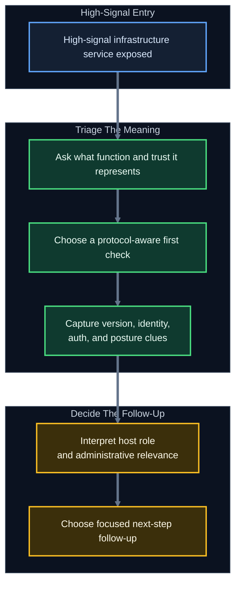

<div align="center">

**Hack the Basics · Phase I**

`Module 03 · Service Footprinting and Common Infrastructure Enumeration`

</div>

# Lesson 3.3 — Enumerating Databases, Monitoring, and Management Services

---

> **🎯 Lesson Objective**
> By the end of this lesson, we will be able to enumerate common database, monitoring, and management services in a way that turns exposed ports into **software clues, host role insight, administrative context, and risk-centered next steps**.

| **Course** | **Module** | **Lesson** | **Estimated Time** | **Difficulty** |
|---|---|---|---:|---|
| Hack the Basics | Module 03 — Service Footprinting and Common Infrastructure Enumeration | 3.3 — Enumerating Databases, Monitoring, and Management Services | 65–90 min | Beginner |

| **Prerequisites** | **You will practice** | **Main outcome** |
|---|---|---|
| Lessons 3.1–3.2, Module 02 or equivalent Nmap basics, basic shell usage | Reading back-end, monitoring, and admin-facing services as high-signal infrastructure surfaces | Learning how to pull version clues, management posture, and environment meaning from MySQL, MSSQL, Oracle TNS, SNMP, IPMI, SSH, WinRM, and RDP |

> **🚨 Important**
>
> These services often matter because they sit unusually close to:
>
> - application data
> - system administration
> - device control
> - operational trust
>
> That means our job is not just to notice them. Our job is to enumerate them carefully enough to understand **why they are exposed, what role they play, and what risks or follow-up questions they create**.

---

## Table of Contents

- [Lesson Map](#lesson-map)
- [Why This Lesson Matters](#why-this-lesson-matters)
- [Learning Objectives](#learning-objectives)
- [The Practical Problem This Lesson Solves](#the-practical-problem-this-lesson-solves)
- [Why These Service Families Matter So Much](#why-these-service-families-matter-so-much)
- [A Risk-Centered Enumeration Mindset](#a-risk-centered-enumeration-mindset)
- [What Counts as a Strong Result for These Services?](#what-counts-as-a-strong-result-for-these-services)
- [Red Flags That Immediately Raise Priority](#red-flags-that-immediately-raise-priority)
- [Database Services at a Glance](#database-services-at-a-glance)
- [MySQL: What to Look for First](#mysql-what-to-look-for-first)
- [MSSQL: What to Look for First](#mssql-what-to-look-for-first)
- [Oracle TNS: What to Look for First](#oracle-tns-what-to-look-for-first)
- [Monitoring and Telemetry Services at a Glance](#monitoring-and-telemetry-services-at-a-glance)
- [SNMP: What to Look for First](#snmp-what-to-look-for-first)
- [IPMI: What to Look for First](#ipmi-what-to-look-for-first)
- [Management and Remote Administration Services at a Glance](#management-and-remote-administration-services-at-a-glance)
- [SSH: What to Look for First](#ssh-what-to-look-for-first)
- [WinRM: What to Look for First](#winrm-what-to-look-for-first)
- [RDP: What to Look for First](#rdp-what-to-look-for-first)
- [How to Read Admin and Data-Service Output Like an Analyst](#how-to-read-admin-and-data-service-output-like-an-analyst)
- [A Cross-Service Workflow for High-Signal Infrastructure Enumeration](#a-cross-service-workflow-for-high-signal-infrastructure-enumeration)
- [Walkthrough 1: Enumerating Database Exposure Without Overclaiming](#walkthrough-1-enumerating-database-exposure-without-overclaiming)
- [Walkthrough 2: Enumerating SNMP and Device Context](#walkthrough-2-enumerating-snmp-and-device-context)
- [Walkthrough 3: Enumerating Remote Management Surfaces](#walkthrough-3-enumerating-remote-management-surfaces)
- [Micro-Drills](#micro-drills)
- [Stop and Think](#stop-and-think)
- [Common Mistakes and Misconceptions](#common-mistakes-and-misconceptions)
- [Defender’s View](#defenders-view)
- [Key Takeaways](#key-takeaways)
- [Knowledge Check Quiz](#knowledge-check-quiz)
- [Quiz Answers](#quiz-answers)
- [Mini Practice Task](#mini-practice-task)
- [Next Lesson Bridge](#next-lesson-bridge)
- [End-of-Lesson Recap](#end-of-lesson-recap)

---

## Lesson Map



> **💡 Tip**
>
> These services usually become easier to reason about when we ask:
>
> "What would this service let an operator, admin, database client, or monitoring platform do in a normal environment?"

---

## Why This Lesson Matters

By this point in Module 03, we already know how to think about services as environment functions and how to enumerate common file, naming, and messaging surfaces.

Now we move into a service family cluster that often carries even stronger signal:

- databases
- monitoring services
- remote management services
- out-of-band administrative interfaces

When these services appear, beginners often react in one of two weak ways:

- "Interesting, but I do not know what to ask next."
- "This looks important, so I should jump straight to exploit thinking."

Neither response is strong enough.

These services deserve deliberate enumeration because they often reveal:

- application back-end structure
- software families and versions
- host identity and domain context
- authentication posture
- device inventory and system metadata
- remote administration pathways

Examples:

- A MySQL banner may reveal version family and whether a database is directly exposed.
- MSSQL may reveal Windows-integrated context and service naming that points to broader enterprise roles.
- SNMP may reveal device names, descriptions, interfaces, and contact/location metadata.
- SSH, WinRM, and RDP may reveal which hosts are meant for administration, which auth paths are relevant, and which systems likely matter most.

This lesson teaches us how to extract those clues without confusing early enumeration with full validation.

> **📝 Note**
>
> Lesson 3.2 taught us how to extract high-value metadata from common services.
> Lesson 3.3 applies the same discipline to services that often sit closer to data, administration, and operational control.

---

## Learning Objectives

By the end of this lesson, we should be able to:

- explain why exposed database, monitoring, and management services often deserve immediate attention
- identify strong low-friction first checks for MySQL, MSSQL, Oracle TNS, SNMP, IPMI, SSH, WinRM, and RDP
- interpret version, hostname, auth, and posture clues without overstating them
- reason about how these services affect host role and environment priority
- document direct observations, likely implications, and next-step validation cleanly
- build a repeatable workflow for early enumeration of these higher-signal service families

---

## The Practical Problem This Lesson Solves

Suppose a first-pass scan reveals:

```text
22/tcp    open  ssh
1433/tcp  open  ms-sql-s
161/udp   open  snmp
3389/tcp  open  ms-wbt-server
5985/tcp  open  wsman
3306/tcp  open  mysql
623/udp   open  asf-rmcp
1521/tcp  open  oracle
```

A beginner may correctly conclude:

- there are several important services here

But that still leaves several real questions:

- Which of these are application back-end services versus admin pathways?
- Which ones may reveal hostnames, versions, or environment metadata immediately?
- Which ones imply Windows or Linux management context?
- Which services point to device control rather than ordinary host software?
- Which services are misconfigured, unusually exposed, or simply expected for the host’s role?

This lesson solves the problem of turning that mixed exposure into a structured interpretation and next-step workflow.

We want to move from:

- "many important-looking services"

to:

- "this is likely an application DB host"
- "this is likely a managed Windows server"
- "this may be a network device or out-of-band controller"
- "these are the safest and most useful next checks"

---

## Why These Service Families Matter So Much

These services often matter because of the **kind of power or visibility they represent**.

### Database services matter because they may reveal:

- application architecture
- version families
- direct back-end exposure
- naming patterns
- auth posture and segmentation quality

### Monitoring services matter because they may reveal:

- device identity
- interfaces
- descriptions
- topology clues
- operational metadata

### Management services matter because they may reveal:

- administrative pathways
- expected operator workflows
- OS family or host purpose
- where credentials are likely useful later

### Out-of-band management matters because it may reveal:

- hardware management surfaces
- controller identities
- independent admin planes
- unusually sensitive infrastructure roles

> **🚨 Important**
>
> Many of these services are not important because they are "cool targets."
> They are important because they often tell us where the environment keeps control, visibility, and data.

---

## A Risk-Centered Enumeration Mindset

When we enumerate these services, we should think in two layers at once:

1. What does this service reveal technically?
2. Why does that matter operationally?

```mermaid
%%{init: {"theme":"base","flowchart":{"curve":"basis","htmlLabels":true},"themeVariables":{"primaryColor":"#0f172a","primaryTextColor":"#e2e8f0","primaryBorderColor":"#7dd3fc","lineColor":"#64748b","secondaryColor":"#111827","tertiaryColor":"#0b1220","clusterBkg":"#0b1220","clusterBorder":"#334155","fontSize":"14px"}}}%%
flowchart LR
    A["Service exposed"] ==> B["What does it identify?"]
    B ==> C["What role does it imply?"]
    C ==> D["What trust or risk does it suggest?"]
    D ==> E["What careful follow-up should come next?"]

    classDef source fill:#142033,stroke:#60a5fa,color:#dbeafe,stroke-width:2px;
    classDef analysis fill:#0f3a2f,stroke:#4ade80,color:#ecfdf5,stroke-width:2px;
    classDef action fill:#3b2f0b,stroke:#fbbf24,color:#fffbeb,stroke-width:2px;

    class A source;
    class B,C,D analysis;
    class E action;
```



### Useful first questions

| **Service family** | **Good first questions** |
|---|---|
| Databases | What version or instance clues appear? Is the service directly exposed? Does it reveal host or instance naming? |
| Monitoring | What device identity, interfaces, or metadata are visible? |
| Management | What auth methods, certificates, banners, or naming clues appear? |
| Out-of-band admin | Does the host expose a separate control plane or management controller identity? |

### What makes a strong first check here?

Usually something that reveals:

- banner or software family
- version range
- hostname or instance name
- auth or capability posture
- certificate naming
- management identity

without forcing premature assumptions.

---

## What Counts as a Strong Result for These Services?

Weak notes in this part of the workflow tend to look like:

- "MSSQL open"
- "RDP open"
- "SNMP responded"

Those are not wrong, but they are too vague to support later work.

A stronger result often includes:

- instance or service name
- software family and version clues
- hostname or certificate identity
- auth style or negotiation behavior
- device description or interface metadata
- evidence that the service is directly exposed rather than internal-only

| **Weak result** | **Stronger result** |
|---|---|
| `3306/tcp open mysql` | MySQL handshake reveals server version and likely DB host role |
| `1433/tcp open ms-sql-s` | MSSQL instance responds with version info and Windows-oriented naming clues |
| `161/udp open snmp` | SNMP response reveals device name, contact, location, and interface metadata |
| `5985/tcp open wsman` | WinRM endpoint responds with WSMan identity and Windows management context |
| `3389/tcp open ms-wbt-server` | RDP service reveals certificate hostname and Windows server identity clues |

> **💡 Tip**
>
> The strongest notes in this part of the module often answer:
>
> - what software or management role is this?
> - what does it seem to control or expose?
> - what makes it important?

---

## Red Flags That Immediately Raise Priority

Some findings should increase urgency quickly because they suggest unusually broad value, visibility, or control.

| **If you see this...** | **Raise priority because...** |
|---|---|
| Database listener directly reachable from your current position | It may indicate weak segmentation or unusually broad back-end exposure |
| SNMP revealing system name, location, or interface data | Operational identity and topology just became easier to map |
| IPMI reachable at all | An out-of-band management plane may be exposed |
| WinRM or RDP plus clear domain / hostname identity | Administrative relevance and host importance just increased |
| SSH banner plus role-aligned service mix on the same host | The host likely has both admin and application / data significance |
| Multiple management surfaces on one host | Credential or admin-path relevance may be disproportionately high |

### Use this table correctly

- A red flag is not automatic proof of weakness.
- It is a signal that the service deserves faster, cleaner follow-up.
- Capture the exact evidence that caused the priority jump.

---

## Database Services at a Glance

Database services are especially useful because they can reveal both **software identity** and **application architecture**.

| **Protocol / service** | **Typical role** | **Common clues** | **Why it matters** |
|---|---|---|---|
| MySQL | Application or service back-end database | Handshake version, server greeting, direct exposure | May reveal app-stack design and segmentation posture |
| MSSQL | Microsoft SQL Server database role | Instance info, version cues, Windows alignment | May suggest Windows enterprise context and app/data role |
| Oracle TNS | Oracle listener / instance routing | Listener behavior, service names, instance clues | May reveal enterprise back-end roles and service structure |

---

## MySQL: What to Look for First

MySQL exposure often suggests one of two possibilities:

- a deliberately reachable database service
- a segmentation or deployment decision that deserves scrutiny

### High-value first questions

- Does the service reveal a version or handshake banner?
- Is it directly reachable from our current position?
- Does the greeting reveal anything about the instance or software family?
- Does the exposure fit a likely app or lab architecture?

### Early clues that matter

| **Clue** | **Why it matters** |
|---|---|
| Server version in handshake | Helps frame age, stack, and possible follow-up research |
| Direct exposure on `3306` | Suggests segmentation quality and host role relevance |
| TLS or auth negotiation behavior | Helps characterize posture without assuming access |

### Example result

```text
3306/tcp open  mysql
| mysql-info:
|   Protocol: 10
|   Version: 8.0.31
|   Thread ID: 12
|   Capabilities flags: 65535
|_  Status: Autocommit
```

### What this gives us

- software family and version clue
- confirmation that a database listener is directly exposed
- stronger support for a DB-host or app-back-end role

### What it does not prove

- that valid credentials exist
- that data is accessible
- that the host is only a database server

> **📝 Note**
>
> Early database enumeration is often about visibility and role, not immediate data access.

---

## MSSQL: What to Look for First

MSSQL often matters because it can sit close to Windows application infrastructure, enterprise services, and administrative context.

### High-value first questions

- Does the service reveal version or instance information?
- Does it appear to be a default or named instance?
- What Windows or host identity clues appear around it?
- Is the service exposed in a way that seems expected or unusually broad?

### Why MSSQL is operationally interesting

It may imply:

- Windows application infrastructure
- enterprise back-end services
- integrated authentication context
- host roles worth prioritizing

### Example first-pass result

```text
1433/tcp open  ms-sql-s
| ms-sql-info:
|   10.10.10.40:1433:
|     Version:
|       name: Microsoft SQL Server 2019 RTM
|_      number: 15.00.2000.00
```

### What that suggests

- a Microsoft SQL Server instance is directly reachable
- the host likely plays an application or enterprise data role
- the environment may include Windows-aligned service relationships nearby

### What should happen next

- note exact version and instance clues
- correlate with Windows host naming, SMB, WinRM, or RDP where visible
- avoid writing "database compromised" or similar overstatements

---

## Oracle TNS: What to Look for First

Oracle environments can feel unfamiliar to beginners, which makes them easy to ignore or misread.

That is exactly why we need a calm first-pass model.

### High-value first questions

- Does the listener respond in a way that confirms Oracle-like behavior?
- Are service names, SIDs, or listener details visible?
- Does the exposure suggest enterprise application infrastructure?
- Is this likely a dedicated database role or one part of a larger stack?

### Why Oracle TNS matters

Oracle exposure may suggest:

- enterprise application back ends
- older or more specialized infrastructure
- service naming patterns that reveal app or environment structure

### Example result style

```text
1521/tcp open  oracle
| oracle-tns-version:
|   TNS listener
|   Version: 12.2.0.1.0
|_  Instance: PRODDB
```

### What to record carefully

- listener version clue
- service or instance naming
- exact host and port context

These details can be extremely useful later, even when access is not yet available.

---

## Monitoring and Telemetry Services at a Glance

Monitoring services can reveal a surprising amount about infrastructure because they often exist specifically to expose operational state.

| **Service** | **Typical role** | **Common clues** | **Why it matters** |
|---|---|---|---|
| SNMP | Device and system monitoring / management telemetry | System name, description, contact, location, interface info | Can reveal device identity, network role, and inventory metadata |
| IPMI | Out-of-band hardware management | Controller identity, hardware management plane | Suggests highly sensitive admin surface and device-control relevance |

---

## SNMP: What to Look for First

SNMP is one of the clearest examples of a service that can expose operational truth quickly when misconfigured or broadly readable.

### High-value first questions

- Does the service respond at all?
- If readable, what does it reveal about system name, description, contact, or location?
- What interfaces, addressing, or device-type clues appear?
- Does the host look like a server, switch, printer, appliance, or network device?

### Why SNMP matters

SNMP may reveal:

- hostnames
- device models
- interface descriptions
- location hints
- admin contact strings
- network role

### Example output style

```text
SNMPv2-MIB::sysName.0 = STRING: core-sw01
SNMPv2-MIB::sysDescr.0 = STRING: Cisco IOS Software, C2960 Software
SNMPv2-MIB::sysLocation.0 = STRING: Building 2 - MDF
SNMPv2-MIB::sysContact.0 = STRING: netops@corp.lab
```

### What this tells us

- likely device hostname
- vendor and platform family
- physical or operational location clue
- administrative ownership hint

This is much stronger than a generic note like:

> "SNMP responded."

> **💡 Tip**
>
> SNMP is often less about "is this exploitable right now?" and more about "how much infrastructure meaning just got exposed?"

---

## IPMI: What to Look for First

IPMI often signals an out-of-band hardware management plane rather than a normal host service.

That alone makes it operationally important.

### High-value first questions

- Does the service identify as an IPMI or BMC-style management surface?
- What vendor or controller clues appear?
- Does this suggest server hardware with independent management access?
- Is the service exposed more broadly than it should be?

### Why IPMI matters

IPMI may imply:

- hardware-level management
- server or chassis control
- a separate trust plane from the main operating system
- unusually sensitive infrastructure exposure

### What to capture in notes

- vendor or BMC identity clues
- exact exposed host and port
- why this likely represents out-of-band admin relevance

### What not to forget

IPMI is often meaningful even when the first result is sparse.
The exposure itself is often part of the story.

> **🚨 Important**
>
> An exposed out-of-band management surface should usually affect prioritization, even before deeper validation begins.

---

## Management and Remote Administration Services at a Glance

Management services often reveal which hosts are intended for operator or administrator access.

| **Service** | **Typical role** | **Common clues** | **Why it matters** |
|---|---|---|---|
| SSH | Remote shell / admin access | Banner, host key, software family | Strong Linux / Unix admin signal, sometimes appliance admin too |
| WinRM | Windows remote management | WSMan identity, HTTP(S) management surface | Indicates PowerShell / Windows remoting context |
| RDP | Windows graphical remote administration | Certificate naming, Windows-oriented role clue | Strong signal of interactive Windows management surface |

---

## SSH: What to Look for First

SSH is one of the most familiar admin services, but it still rewards careful first-pass enumeration.

### High-value first questions

- What banner or software family appears?
- Does the host key or greeting reveal hostname or OS-style clues?
- Does the service align with the rest of the host’s role?
- Is this a general-purpose server, appliance, or edge device?

### Example result

```text
22/tcp open  ssh
| ssh-hostkey:
|   3072 SHA256:abcd... (RSA)
|_  256 SHA256:efgh... (ECDSA)
|_banner: SSH-2.0-OpenSSH_8.4p1 Ubuntu-5ubuntu1.5
```

### What this reveals

- SSH is genuinely present, not just guessed from port convention
- the service likely aligns with a Linux or Ubuntu-family stack
- host keys create a useful identity artifact for later comparison

### What to note

- banner text
- software family
- host key fingerprints where available
- whether the service seems ordinary, legacy, or appliance-like

> **📝 Note**
>
> SSH is common enough that people sometimes stop at "port 22 open."
> That leaves useful identity and OS clues behind.

---

## WinRM: What to Look for First

WinRM matters because it often signals a deliberate Windows administration pathway.

### High-value first questions

- Does the endpoint respond as WSMan / WinRM?
- Is it HTTP or HTTPS based?
- Does the endpoint reveal hostname or certificate naming?
- Does its presence fit a managed Windows server role?

### Why WinRM matters

WinRM often suggests:

- PowerShell remoting
- administrative automation
- Windows server management
- likely credential relevance in later modules

### Example result style

```text
5985/tcp open  wsman
| http-title: Not Found
|_http-server-header: Microsoft-HTTPAPI/2.0
|_wsman: Windows Remote Management service enabled
```

### What this gives us

- Windows management relevance
- HTTP-based admin surface
- stronger support for a Windows host role

### What should happen next

- correlate with SMB, RDP, hostname, or certificate data
- note that this is an admin-relevant service, not just another web listener

---

## RDP: What to Look for First

RDP often signals a host that supports interactive Windows administration or user sessions.

### High-value first questions

- Does the service clearly present as RDP?
- What certificate or naming clues appear?
- Does the host look like a workstation, jump box, or Windows server?
- Is the service exposed in a way that seems expected or unusually broad?

### Example result style

```text
3389/tcp open  ms-wbt-server
| ssl-cert: Subject: commonName=APP-SRV-01.corp.lab
| rdp-ntlm-info:
|   Target_Name: CORP
|   NetBIOS_Computer_Name: APP-SRV-01
|   NetBIOS_Domain_Name: CORP
|_  DNS_Computer_Name: APP-SRV-01.corp.lab
```

### Why this is valuable

It may reveal:

- hostname
- domain name
- Windows host role
- much stronger enterprise context than the port label alone

### What to capture

- subject or DNS name
- NetBIOS and domain naming
- whether the host feels like a server, workstation, or admin entry point

---

## How to Read Admin and Data-Service Output Like an Analyst

The quality of this lesson depends heavily on interpretation.

### Example 1: MySQL

```text
Version: 8.0.31
```

Direct observation:

- the service reveals a MySQL version clue

Inference:

- this is likely a directly exposed database listener, possibly tied to an application or lab stack

### Example 2: SNMP

```text
sysName.0 = core-sw01
sysLocation.0 = Building 2 - MDF
```

Direct observation:

- the service identifies as `core-sw01`
- a location clue is exposed

Inference:

- this is likely a network infrastructure device with operational significance

### Example 3: RDP

```text
DNS_Computer_Name: APP-SRV-01.corp.lab
```

Direct observation:

- the RDP surface reveals a Windows DNS hostname

Inference:

- this host likely participates in a Windows enterprise naming structure and may be a managed application server

> **💡 Tip**
>
> With these services especially, even one or two lines of protocol-aware output can sharply change how we prioritize a host.

---

## A Cross-Service Workflow for High-Signal Infrastructure Enumeration

These services are easiest to handle with a clean multi-step rhythm.

```mermaid
%%{init: {"theme":"base","flowchart":{"curve":"basis","htmlLabels":true},"themeVariables":{"primaryColor":"#0f172a","primaryTextColor":"#e2e8f0","primaryBorderColor":"#7dd3fc","lineColor":"#64748b","secondaryColor":"#111827","tertiaryColor":"#0b1220","clusterBkg":"#0b1220","clusterBorder":"#334155","fontSize":"14px"}}}%%
flowchart LR
    subgraph DISCOVER["Discover"]
        A["Identify high-signal service exposure"]
        B["Gather version and identity clues"]
    end
    subgraph ASSESS["Assess"]
        C["Capture auth or management posture"]
        D["Correlate with host role<br/>and neighboring services"]
    end
    subgraph DECIDE["Decide"]
        E["Write evidence and inference separately"]
        F["Choose focused next-step follow-up"]
    end

    A ==> B ==> C ==> D ==> E ==> F

    classDef source fill:#142033,stroke:#60a5fa,color:#dbeafe,stroke-width:2px;
    classDef analysis fill:#0f3a2f,stroke:#4ade80,color:#ecfdf5,stroke-width:2px;
    classDef action fill:#3b2f0b,stroke:#fbbf24,color:#fffbeb,stroke-width:2px;

    class A,B source;
    class C,D,E analysis;
    class F action;

    style DISCOVER fill:#0b1220,stroke:#334155,color:#cbd5e1
    style ASSESS fill:#0b1220,stroke:#334155,color:#cbd5e1
    style DECIDE fill:#0b1220,stroke:#334155,color:#cbd5e1
```



### Step 1: Decide what kind of service this is

Ask:

- data service?
- monitoring service?
- in-band admin service?
- out-of-band admin surface?

### Step 2: Gather low-friction metadata first

Examples:

- version banner
- instance or listener name
- system name
- host certificate identity
- management header
- device description

### Step 3: Capture why the service matters

Examples:

- app back-end relevance
- admin path relevance
- device-control relevance
- operational trust significance

### Step 4: Correlate with other clues

Examples:

- MSSQL plus WinRM plus RDP
- SSH plus MySQL plus app-facing web stack
- SNMP plus device-like HTTP or SSH exposure

### Step 5: Keep notes honest

Write:

- what was observed
- what it likely suggests
- what still needs validation

---

## Walkthrough 1: Enumerating Database Exposure Without Overclaiming

Suppose a host exposes:

```text
3306/tcp  open  mysql
8080/tcp  open  http-proxy
```

And the database probe returns:

```text
Version: 8.0.31
```

### What we directly observe

- MySQL is directly reachable
- a version clue is exposed
- the same host also exposes a web-facing service

### What we may infer

- this may be an application host or an insufficiently segmented lab-style stack
- the host likely has back-end data relevance

### What we should avoid saying too early

We should not write:

> "Confirmed production database with accessible data."

A better note would be:

> "Directly exposed MySQL listener with version clue present; host may serve application back-end or mixed-role function."

### What should happen next

- capture the exact version
- correlate with the web service
- note the segmentation implication
- choose service-aware follow-up, not guesswork

---

## Walkthrough 2: Enumerating SNMP and Device Context

Suppose a host exposes:

```text
161/udp open snmp
```

And a first safe query reveals:

```text
SNMPv2-MIB::sysName.0 = STRING: dist-sw02
SNMPv2-MIB::sysDescr.0 = STRING: Cisco IOS XE Software
IF-MIB::ifDescr.1 = STRING: GigabitEthernet0/1
```

### What we directly observe

- the host identifies as `dist-sw02`
- the device appears Cisco-like
- interface metadata is visible

### What we may infer

- this is likely a distribution switch or similar network device
- the service exposes meaningful infrastructure inventory data
- this host may be more important to topology reasoning than an ordinary endpoint

### Why this matters

Now the host is no longer just:

> "something with UDP 161 open"

It is:

> "a likely network infrastructure device revealing operational identity and interface context"

That is a huge leap in understanding.

---

## Walkthrough 3: Enumerating Remote Management Surfaces

Suppose one host exposes:

```text
5985/tcp open  wsman
3389/tcp open  ms-wbt-server
445/tcp  open  microsoft-ds
```

And the richer output includes:

```text
NetBIOS_Computer_Name: APP-SRV-01
NetBIOS_Domain_Name: CORP
DNS_Computer_Name: APP-SRV-01.corp.lab
```

### What we directly observe

- the host exposes multiple Windows administration-relevant services
- the system reveals both computer and domain naming
- the naming is consistent across the management surface

### What we may infer

- this is likely a Windows server with real administrative importance
- the host may be application-related and domain-joined
- credentials that work here later may be operationally valuable

### What should happen next

- preserve exact hostname and domain values
- correlate with DNS and SMB context
- note the host as management-relevant for future prioritization

> **📝 Note**
>
> Multiple admin-facing services together often tell a stronger story than any one service by itself.

---

## Micro-Drills

> **🛠 Practice**
>
> These drills are meant to build speed at reading high-signal infrastructure output without overclaiming.

### Micro-Drill 1: Database plus app context

Read the fragment below:

```text
3306/tcp open  mysql
Version: 8.0.31
443/tcp  open  https
22/tcp   open  ssh
```

In your notes, answer:

1. What should be captured verbatim?
2. Why is this host more important than a generic single-service host?
3. What is direct observation vs inference?
4. Which workflow should probably own the next step first?

### Micro-Drill 2: Windows management context

Read the fragment below:

```text
5985/tcp open  wsman
3389/tcp open  ms-wbt-server
DNS_Computer_Name: APP-SRV-01.corp.lab
NetBIOS_Domain_Name: CORP
```

In your notes, answer:

1. Which exact identity clues belong in the notes?
2. What does the service combination suggest about host role?
3. Why might this host rise in priority?
4. What still needs validation before you claim administrative access?

> **💡 Tip**
>
> Fast, careful note-taking is part of the skill here. Treat these drills like mini report-writing reps, not only recognition reps.

---

## Stop and Think

> **📝 Note**
>
> Try to answer these mentally before opening the guidance.

### Question 1

Why is an exposed MySQL or MSSQL service often important even before we know whether credentials exist?

<details>
<summary><strong>✅ Reveal guidance</strong></summary>

Because direct database exposure already tells us something useful about:

- host role
- application architecture
- segmentation quality
- potential data relevance

It is meaningful even before confirmed access.

</details>

### Question 2

What makes SNMP especially valuable during early service footprinting?

<details>
<summary><strong>✅ Reveal guidance</strong></summary>

SNMP can reveal operational identity directly.

Examples:

- system name
- device description
- interface metadata
- contact or location data

That can sharply improve both asset understanding and prioritization.

</details>

### Question 3

If a host exposes RDP, WinRM, and SMB together, what should that change about your reasoning?

<details>
<summary><strong>✅ Reveal guidance</strong></summary>

It should shift your thinking toward a management-relevant Windows role.

The service combination suggests more than generic Windows presence.
It suggests:

- admin pathways
- domain relevance
- host importance

</details>

---

## Common Mistakes and Misconceptions

### Mistake 1: Treating database exposure as only a future exploitation problem

Even without access, exposed databases reveal architecture, role, and segmentation clues.

### Mistake 2: Treating SNMP as just another UDP port

SNMP often reveals far more infrastructure meaning than a typical scan label suggests.

### Mistake 3: Missing the difference between in-band and out-of-band management

SSH, WinRM, and RDP usually relate to the operating system or user/admin workflows.
IPMI often represents a separate control plane.
That difference matters.

### Mistake 4: Capturing only generic notes

Notes like "RDP open" or "Oracle open" lose the specific nouns that make later reasoning possible.

### Mistake 5: Overstating access from identity clues

A hostname, version, or WSMan response is valuable.
It is not the same as confirmed credentialed access.

### Mistake 6: Failing to correlate service combinations

MySQL plus app-facing HTTP may suggest one kind of host.
WinRM plus RDP plus SMB suggests another.
SNMP plus SSH may suggest yet another.

> **⚠️ Warning**
>
> These service families are so operationally significant that sloppy notes create bigger downstream problems than usual.
> Capture exact values and keep evidence separate from assumptions.

---

## Defender’s View

From a defender perspective, these services are often some of the most sensitive surfaces in the environment.

Why?

Because they can reveal:

- back-end application architecture
- device inventory and topology
- administrative pathways
- host naming and domain alignment
- hardware-management exposure

A defender should care about:

- databases exposed farther than intended
- readable SNMP metadata leaking too much operational detail
- unnecessary WinRM or RDP reachability
- IPMI or BMC surfaces visible outside tightly controlled management networks
- verbose banners and certificates that make role inference too easy

> **💡 Tip**
>
> Strong defensive segmentation and exposure control often shows up here more clearly than in almost any other service family.

---

## Key Takeaways

> **💡 Tip**
>
> If you only keep a handful of ideas from this lesson, keep these:

- Database, monitoring, and management services often reveal unusually strong signals about data, control, and host priority.
- Strong first-pass enumeration captures software clues, naming, management posture, and why the service matters operationally.
- SNMP and certificate / hostname output are often disproportionately valuable.
- A database listener or management port can be important even before confirmed access exists.
- Service combinations frequently reveal role and trust much more clearly than single ports.
- Exact values matter: versions, instance names, hostnames, domains, system descriptions, and controller clues belong in notes.

### What changed in our understanding?

| **Before this lesson, we might have thought...** | **After this lesson, we should understand...** |
|---|---|
| "A DB port matters only if I can log in." | Database exposure already reveals architecture and host-role significance. |
| "SNMP is just a weird UDP service." | SNMP can expose rich operational identity and device metadata. |
| "RDP or WinRM just means Windows." | These services often reveal Windows management context and host importance. |
| "All admin services are basically the same." | SSH, WinRM, RDP, and IPMI imply different types of control and trust. |

---

## Knowledge Check Quiz

### 1. Why is directly exposed database service valuable during early enumeration even before valid credentials are known?

A. Because it guarantees data theft
B. Because it reveals architecture, role, and segmentation clues
C. Because all databases allow anonymous access
D. Because databases replace the need to enumerate the host

---

### 2. Which of the following is one of the most useful early SNMP outcomes?

A. "UDP responded"
B. System name, description, interface, or location metadata
C. Guaranteed device takeover
D. Password hashes by default

---

### 3. What is the best interpretation of exposed WinRM on `5985/tcp`?

A. It is just a generic web service
B. It is usually a Windows remote management surface with administrative relevance
C. It proves local admin access
D. It means the host is not Windows

---

### 4. Why should IPMI exposure affect prioritization quickly?

A. Because it often represents an out-of-band management plane with high operational sensitivity
B. Because it always runs on domain controllers only
C. Because it replaces SSH completely
D. Because it is irrelevant until later modules

---

### 5. Which note is strongest?

A. "RDP open"
B. "SNMP there"
C. "RDP reveals `APP-SRV-01.corp.lab`; WinRM also present; host appears management-relevant Windows server"
D. "Probably something important"

---

### 6. What is the professional way to handle a useful version clue from MSSQL or Oracle TNS?

A. Treat it as confirmed full platform inventory truth
B. Record the exact version clue, note what it may imply, and validate further later
C. Ignore it unless exploitation is immediate
D. Replace it with a generic phrase like "database software"

---

## Quiz Answers

<details>
<summary><strong>Reveal quiz answers</strong></summary>

### 1. Correct answer: B

Direct database exposure already reveals architecture, role, and segmentation significance even before confirmed access exists.

### 2. Correct answer: B

SNMP often becomes valuable because it reveals concrete identity and operational metadata.

### 3. Correct answer: B

WinRM usually indicates a Windows remote management surface with real administrative meaning.

### 4. Correct answer: A

IPMI often represents a separate management plane and therefore deserves quick attention in prioritization.

### 5. Correct answer: C

Strong notes preserve exact values and explain why the service combination matters.

### 6. Correct answer: B

Version clues are useful evidence, but they should still be recorded carefully and validated further where needed.

</details>

---

## Mini Practice Task

> **🚨 Important**
>
> Keep this exercise small and evidence-focused.
> The goal is not to prove access.
> The goal is to practice turning high-signal services into strong host-role and risk notes.

### Task

Choose one or two authorized lab hosts that expose at least one service from each of these categories if possible:

- database: MySQL, MSSQL, or Oracle TNS
- monitoring: SNMP
- management: SSH, WinRM, RDP, or IPMI

### For each service, capture:

1. The first protocol-aware check you used
2. The direct evidence it returned
3. What role or risk that evidence suggests
4. What still needs validation

### Suggested note-taking format

| **Service** | **First check** | **Direct evidence** | **What it suggests** | **What still needs validation** |
|---|---|---|---|---|
| MySQL | `mysql-info` or handshake capture | Version `8.0.31` visible | Directly exposed DB listener with app-stack relevance | Auth posture and actual instance accessibility |
| SNMP | basic system query | `sysName = core-sw01`, location visible | Network infrastructure device with operational importance | Scope of readable OIDs and broader metadata exposure |
| WinRM / RDP | protocol-aware banner / identity check | `APP-SRV-01.corp.lab`, domain `CORP` | Management-relevant Windows host | Credential validity and exact admin role |

> **💡 Tip**
>
> If your notes explain not only what the service said but why that matters, you are doing this lesson correctly.

---

## Next Lesson Bridge

In this lesson, we learned how to enumerate services that often expose:

- database relevance
- device identity
- monitoring metadata
- remote administration pathways

That means we are now ready for the final move in Module 03:

- deciding what to prioritize next
- deciding which services matter most
- deciding how service footprints should hand off into later credential, web, foothold, and common-service attack modules

> **📝 Note**
>
> Lesson 3.3 helped us read high-signal infrastructure services correctly.
> Lesson 3.4 will teach us how to turn the full service picture into deliberate follow-up and attack-path prioritization.

---

## End-of-Lesson Recap

> **One-sentence summary:**
> Strong database, monitoring, and management-service enumeration means capturing exact software, identity, and posture clues, interpreting why those services matter operationally, and using that evidence to prioritize the most meaningful next step.
