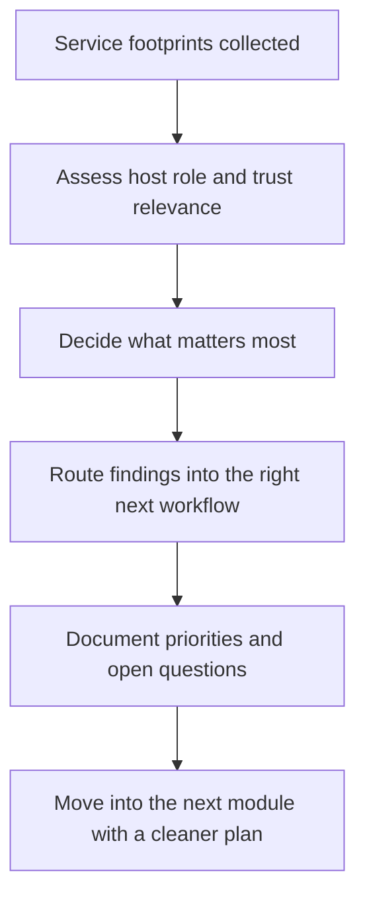
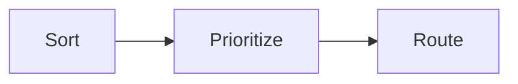
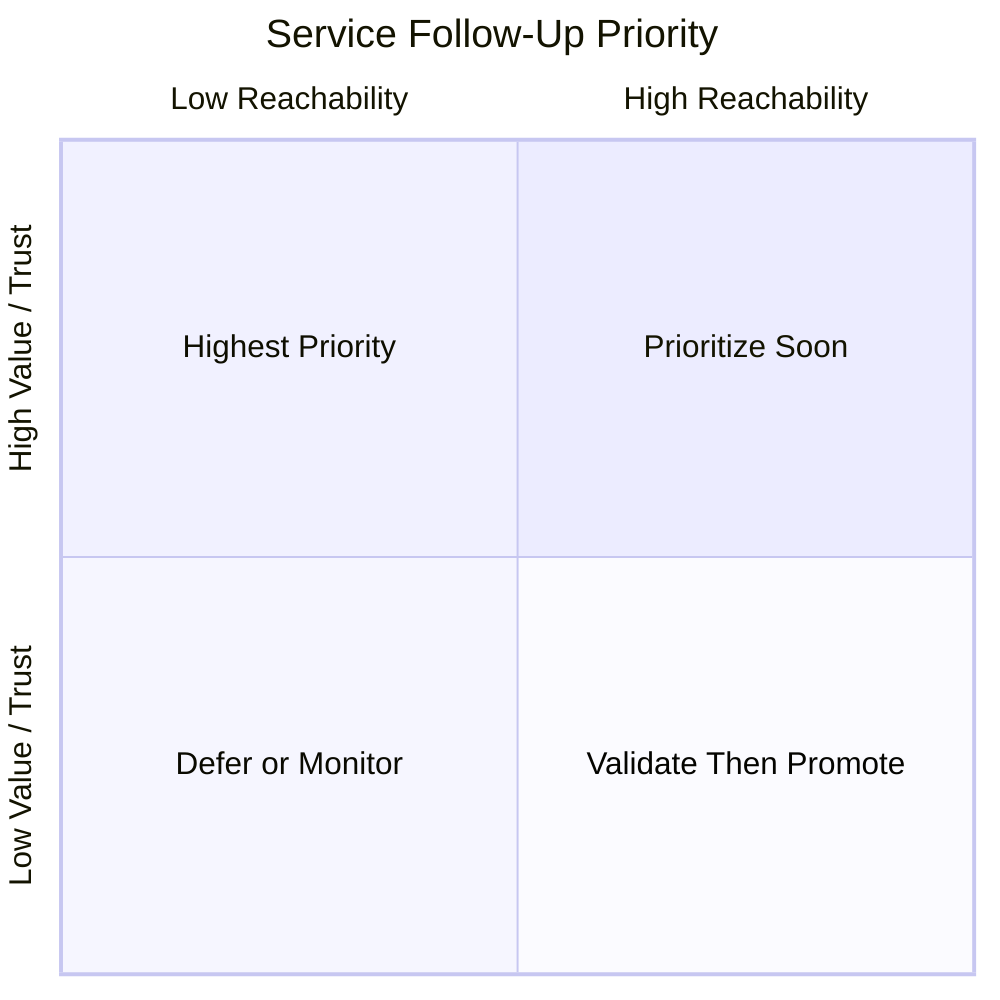
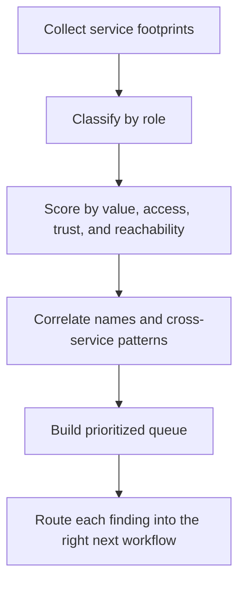

<div align="center">

**Hack the Basics · Phase I**

`Module 03 · Service Footprinting and Common Infrastructure Enumeration`

</div>

# Lesson 3.4 — Prioritizing Follow-Up from Service Footprints

---

> **🎯 Lesson Objective**
> By the end of this lesson, we will be able to turn raw service footprinting results into a **prioritized follow-up plan** that reflects host role, trust boundaries, likely value, and the most meaningful next step in the assessment workflow.

| **Course** | **Module** | **Lesson** | **Estimated Time** | **Difficulty** |
|---|---|---|---:|---|
| Hack the Basics | Module 03 — Service Footprinting and Common Infrastructure Enumeration | 3.4 — Prioritizing Follow-Up from Service Footprints | 60–85 min | Beginner |

| **Prerequisites** | **You will practice** | **Main outcome** |
|---|---|---|
| Lessons 3.1–3.3, Module 02 or equivalent Nmap basics, basic note-taking discipline | Converting service findings into triage decisions, host-priority logic, and clean module handoffs | Learning how to decide what matters first, what can wait, and which later module should own the next step |

> **🚨 Important**
>
> Enumeration only becomes strategically useful when it changes what we do next.
>
> This lesson is about building that decision layer.
> We are not just asking:
>
> - what services are present?
>
> We are asking:
>
> - which service matters most?
> - what question should come next?
> - what belongs to later credential, web, service-attack, or foothold workflows?

---

## Table of Contents

- [Lesson Map](#lesson-map)
- [Why This Lesson Matters](#why-this-lesson-matters)
- [Learning Objectives](#learning-objectives)
- [The Practical Problem This Lesson Solves](#the-practical-problem-this-lesson-solves)
- [Why Enumeration Without Prioritization Breaks Down](#why-enumeration-without-prioritization-breaks-down)
- [The Real Job of Service Triage](#the-real-job-of-service-triage)
- [What Makes a Service High Priority?](#what-makes-a-service-high-priority)
- [A Practical Priority Model: Value, Access, Trust, and Reachability](#a-practical-priority-model-value-access-trust-and-reachability)
- [High-Value Questions to Ask First](#high-value-questions-to-ask-first)
- [Where Credentials May Be Validated](#where-credentials-may-be-validated)
- [Where Sensitive Data May Reside](#where-sensitive-data-may-reside)
- [Where Remote Execution or Admin Pathways May Emerge](#where-remote-execution-or-admin-pathways-may-emerge)
- [Cross-Service Patterns That Raise Priority](#cross-service-patterns-that-raise-priority)
- [Overlapping Names and Shared Identity Context](#overlapping-names-and-shared-identity-context)
- [When Technology Duplication Changes the Story](#when-technology-duplication-changes-the-story)
- [Service Families and Their Most Natural Follow-Up Paths](#service-families-and-their-most-natural-follow-up-paths)
- [Handoff Discipline: What Belongs to Later Modules](#handoff-discipline-what-belongs-to-later-modules)
- [Building a Prioritized Follow-Up Queue](#building-a-prioritized-follow-up-queue)
- [A Repeatable Service-Triage Workflow](#a-repeatable-service-triage-workflow)
- [Walkthrough 1: Prioritizing a Windows Identity and Management Host](#walkthrough-1-prioritizing-a-windows-identity-and-management-host)
- [Walkthrough 2: Prioritizing a Mixed Web and Database Host](#walkthrough-2-prioritizing-a-mixed-web-and-database-host)
- [Walkthrough 3: Prioritizing File, Naming, and Messaging Clues Together](#walkthrough-3-prioritizing-file-naming-and-messaging-clues-together)
- [Stop and Think](#stop-and-think)
- [Common Mistakes and Misconceptions](#common-mistakes-and-misconceptions)
- [Defender’s View](#defenders-view)
- [Key Takeaways](#key-takeaways)
- [Knowledge Check Quiz](#knowledge-check-quiz)
- [Quiz Answers](#quiz-answers)
- [Module Practice Lab](#module-practice-lab)
- [Next Module Bridge](#next-module-bridge)
- [End-of-Module Recap](#end-of-module-recap)

---

## Lesson Map



> **💡 Tip**
>
> Good prioritization is not about chasing the most exotic service.
> It is about choosing the follow-up that most efficiently reduces uncertainty and advances the assessment.

---

## Why This Lesson Matters

By the end of Lessons 3.1 through 3.3, we can now do something important:

- interpret what services are for
- enumerate common infrastructure surfaces
- collect hostnames, shares, records, versions, management clues, and service posture

That is strong progress.

But it still leaves a critical problem unsolved:

> what do we do first when several services all look potentially useful?

This is where beginners often get stuck.

They end up with notes like:

- "SMB open"
- "WinRM open"
- "DNS records found"
- "MySQL exposed"
- "Web service on 443"

All of those are useful observations.
But without prioritization, they can produce:

- random tool hopping
- duplicated effort
- shallow follow-up across too many services at once
- missed high-value paths
- notes that do not support the next module cleanly

This lesson fixes that by teaching a more professional question:

> Based on what we have learned from service footprinting, which service or host deserves attention first, why, and which workflow should own the next step?

> **📝 Note**
>
> This lesson is the decision layer that turns Module 03 from a set of protocol skills into a usable assessment workflow.

---

## Learning Objectives

By the end of this lesson, we should be able to:

- explain why service footprinting needs a prioritization layer
- identify the main factors that make one service more important than another
- ask high-value triage questions about credentials, data, and administrative pathways
- recognize cross-service patterns that raise or lower priority
- decide which findings belong to later web, credential, service-attack, or foothold workflows
- build a repeatable triage queue from service output instead of chasing random leads

---

## The Practical Problem This Lesson Solves

Suppose our early enumeration on several hosts reveals:

### Host A

```text
53/tcp   open  domain
88/tcp   open  kerberos-sec
389/tcp  open  ldap
445/tcp  open  microsoft-ds
5985/tcp open  wsman
```

### Host B

```text
80/tcp   open  http
443/tcp  open  https
3306/tcp open  mysql
22/tcp   open  ssh
```

### Host C

```text
25/tcp   open  smtp
110/tcp  open  pop3
143/tcp  open  imap
445/tcp  open  microsoft-ds
```

### Host D

```text
161/udp  open  snmp
22/tcp   open  ssh
443/tcp  open  https
623/udp  open  asf-rmcp
```

This is already a lot of useful signal.
But now we need to choose:

- which host matters most right now?
- which service gives the cleanest next-step value?
- which clues point toward credentials?
- which clues point toward sensitive data?
- which clues point toward remote execution or administrative control?
- which findings should wait for later modules rather than being forced too early?

This lesson teaches us how to answer those questions deliberately.

---

## Why Enumeration Without Prioritization Breaks Down

Enumeration is supposed to reduce uncertainty.
But if we collect evidence without sorting it, we create a different problem:

- too many plausible next steps
- unclear handoffs
- weak momentum

This often leads to one of three failure modes.

### Failure mode 1: Random chasing

The learner bounces from DNS to SMB to web headers to SSH banners without deciding which thread matters most.

### Failure mode 2: Everything feels equally important

Because many services *are* interesting, the learner does not know how to rank them.

### Failure mode 3: Early over-commitment

A single interesting clue gets treated like the only path, even when stronger, cleaner options exist nearby.

> **🚨 Important**
>
> Good prioritization is not guessing which host will "be vulnerable."
> It is deciding which follow-up best fits the evidence, the workflow stage, and the likely value of the result.

---

## The Real Job of Service Triage

Service triage is not just "pick a service."

It usually has to do three jobs well:



### 1. Sort

We sort findings by what kind of opportunity they may represent:

- identity
- data
- admin access
- naming
- infrastructure visibility
- application follow-up

### 2. Prioritize

We decide which ones matter first based on:

- likely value
- likely reachability
- host role
- trust context
- quality of next-step validation

### 3. Route

We decide which later workflow should own the next step:

- web recon / web analysis
- credential logic
- common service testing
- foothold-oriented work
- continued infrastructure enumeration

This routing step is what prevents service footprinting from becoming a pile of disconnected notes.

---

## What Makes a Service High Priority?

Not every visible service deserves the same amount of immediate attention.

Several factors usually raise priority.

| **Priority factor** | **Why it matters** |
|---|---|
| Identity relevance | Services tied to users, domains, auth, or trust boundaries often create high-value paths |
| Data relevance | Services likely to expose databases, shares, backups, or mail may hold sensitive information |
| Administrative relevance | SSH, WinRM, RDP, IPMI, and similar services may represent control pathways |
| Breadth of trust | Domain-like or central infrastructure roles affect more than one host or user |
| Quality of next-step follow-up | Some services offer a clean, low-friction next move with high information yield |
| Exposure quality | Anonymous access, verbose metadata, or broad reachability may sharply increase immediate value |
| Correlation with other clues | Repeated names, shared domains, and consistent host-role patterns strengthen confidence |

### A useful mental shortcut

Ask:

1. Does this service help me understand identity?
2. Does this service help me reach data?
3. Does this service help me understand or reach administration?
4. Does this service connect strongly to other clues already collected?

If the answer to several is yes, priority usually rises.

---

## A Practical Priority Model: Value, Access, Trust, and Reachability

A simple triage model can help us stay disciplined.



In practice, we can think through four lenses:

| **Lens** | **Question** |
|---|---|
| Value | If this path pays off, how much would it tell us or enable? |
| Access | Do we already have a clean first follow-up to perform? |
| Trust | Does this service sit close to identity, admin control, or shared infrastructure? |
| Reachability | Can we interact with it meaningfully from where we are now? |

### Example interpretation

| **Finding** | **Value** | **Access** | **Trust** | **Likely triage result** |
|---|---|---|---|---|
| Domain-like host exposing LDAP, Kerberos, SMB | High | Medium | High | Top priority |
| Web host plus exposed MySQL | High | Medium | Medium | High priority |
| SSH-only Linux host with no supporting clues | Medium | Low | Medium | Moderate priority |
| SNMP-revealing core switch identity | High | Medium | High | High priority for understanding environment |

> **💡 Tip**
>
> Priority is not only about "easy to attack."
> It is also about "high value to understand."

---

## High-Value Questions to Ask First

Before choosing the next step, we should ask a tighter set of questions about what the service footprint actually suggests.

### Questions that often change priority

- Where are credentials likely to be tested or validated?
- Where is sensitive data likely to live?
- Where might remote execution or administrative control exist?
- Which host appears to sit closest to identity or shared trust?
- Which service gives us the clearest next validation step?
- Which host has the strongest correlation across naming, role, and service behavior?

These questions matter because they map directly to the kinds of paths later modules care about.

---

## Where Credentials May Be Validated

Some services matter because they are likely places where credentials become relevant later.

Examples:

- SMB
- WinRM
- RDP
- SSH
- mail auth surfaces
- database auth surfaces
- domain-related identity services

### Why this raises priority

Even if we do not yet have credentials, a service that is likely to *consume* them later is important because it may become a bridge when credentials are discovered elsewhere.

### Practical examples

| **Service** | **Why it matters for credential logic** |
|---|---|
| SMB | Often tied to Windows auth, shares, and domain context |
| SSH | Common direct login path once credentials exist |
| WinRM | Strong Windows admin path relevance |
| RDP | Interactive Windows access relevance |
| IMAP / POP3 / SMTP AUTH | Mail credential validation relevance |
| MSSQL / MySQL | App, service, or DBA credential relevance |
| Kerberos / LDAP | Identity infrastructure relevance |

> **📝 Note**
>
> A service can be high-priority even when we cannot act on it immediately, if it is likely to become valuable the moment credentials or another clue appear.

---

## Where Sensitive Data May Reside

Some services are important not because they validate identities, but because they are likely to expose or point toward data.

Examples:

- SMB shares
- NFS exports
- FTP repositories
- databases
- mail infrastructure
- backups or deployment locations

### Questions to ask

- Does this host likely store business data?
- Does the service reveal share names like `Backups`, `Finance`, or `Deploy`?
- Does the database exposure suggest app back-end data?
- Does the mail role imply message or account relevance?

### Why this matters

A strong data clue can raise priority because:

- it may reveal sensitive content later
- it may expose configuration or credential artifacts
- it may matter directly to assessment objectives

---

## Where Remote Execution or Admin Pathways May Emerge

Services tied to administration often deserve early attention because they represent control pathways.

Examples:

- SSH
- WinRM
- RDP
- IPMI
- certain management portals
- admin-capable SMB or file-transfer contexts

### Why these services matter

They may indicate:

- hosts intended for operator access
- systems likely to matter for lateral movement later
- endpoints where valid credentials would become immediately useful
- out-of-band or highly privileged control surfaces

### Triage effect

A host exposing multiple admin-facing services usually rises in priority, especially when those services align with:

- domain naming
- app-server naming
- central infrastructure role

---

## Cross-Service Patterns That Raise Priority

Some of the strongest service clues are not individual findings.
They are combinations.

### Pattern 1: Identity plus management

Example:

```text
88/tcp   open kerberos-sec
389/tcp  open ldap
445/tcp  open microsoft-ds
5985/tcp open wsman
```

Why priority rises:

- identity relevance
- Windows admin relevance
- likely shared trust

### Pattern 2: Web plus database plus admin

Example:

```text
80/tcp   open http
443/tcp  open https
3306/tcp open mysql
22/tcp   open ssh
```

Why priority rises:

- app stack likely visible
- direct back-end exposure
- admin pathway nearby

### Pattern 3: Naming plus mail plus file services

Example:

```text
53/tcp  open domain
25/tcp  open smtp
445/tcp open microsoft-ds
```

Why priority rises:

- shared naming structure
- likely organizational relevance
- multiple information-rich follow-up options

> **💡 Tip**
>
> When several services point to the same story, that story usually deserves faster attention than a lone interesting port.

---

## Overlapping Names and Shared Identity Context

One of the strongest ways service footprinting becomes actionable is through repeated names.

Examples:

- DNS reveals `fs01.corp.lab`
- SMB identifies the host as `FS01`
- RDP certificate says `FS01.corp.lab`

Or:

- SMTP greeting identifies `mail.corp.lab`
- MX records point to `mail.corp.lab`
- IMAP greeting uses the same name

These overlaps matter because they:

- strengthen confidence
- reduce ambiguity
- help us connect hosts, roles, and services into one system picture

### Why repeated identity raises priority

Repeated names often mean:

- the host role is real, not speculative
- later module handoffs will be cleaner
- a single host may support several valuable threads

---

## When Technology Duplication Changes the Story

Seeing the same technology repeated across hosts or services can also raise priority.

Examples:

- multiple hosts expose the same mail naming pattern
- several web hosts point to the same database family
- multiple Windows hosts expose WinRM and consistent domain naming

This matters because duplicated technology may indicate:

- shared admin practices
- shared credentials or naming logic
- standardized deployment
- broader assessment impact if one pattern proves weak later

### Practical implication

A single service may be interesting.
A repeated stack may be strategically important.

---

## Service Families and Their Most Natural Follow-Up Paths

Once priority is understood, the next question is:

> what kind of workflow should own the next step?

| **Service family** | **Natural follow-up direction** |
|---|---|
| DNS, LDAP, Kerberos, SMB naming | Deeper infrastructure reasoning, identity context, later credential and Windows workflows |
| HTTP / HTTPS | Web recon and application discovery workflows |
| FTP, SMB, NFS | File-access and common service enumeration workflows |
| SMTP / IMAP / POP3 | Messaging enumeration, credential-surface reasoning |
| MySQL / MSSQL / Oracle | Database-aware follow-up and app-stack reasoning |
| SSH / WinRM / RDP / IPMI | Management, common service testing, and later foothold / admin-path reasoning |
| SNMP | Device and topology understanding, environment mapping |

This does not mean only one module can ever touch a finding.
It means we need a **primary owner** for the next step.

That keeps the workflow clean.

---

## Handoff Discipline: What Belongs to Later Modules

One of the most useful habits in a structured course is knowing when **not** to force a finding too early.

### Web-related findings

Examples:

- login portals
- admin pages
- application frameworks
- route clues

Natural handoff:

- Module 04 and the web track

### Credential-relevant findings

Examples:

- auth-capable services
- domain or mail login surfaces
- SMB / SSH / WinRM / RDP relevance

Natural handoff:

- Module 06 and later credential operations

### Common service attack paths

Examples:

- SMB misconfigurations
- mail-service weaknesses
- DB exposure with meaningful follow-up
- management interfaces with service-specific testing value

Natural handoff:

- Module 09

### Foothold-oriented implications

Examples:

- admin surfaces that may matter once access exists
- file paths that could support movement or tool transfer later

Natural handoff:

- Module 10 and beyond

> **🚨 Important**
>
> Handoff discipline is not avoidance.
> It is sequencing.
>
> The point is to capture the clue now, route it correctly, and avoid forcing a later-stage workflow into the current stage without enough evidence.

---

## Building a Prioritized Follow-Up Queue

A queue is often more useful than a vague feeling that "several things look important."

### A simple follow-up queue format

| **Priority** | **Host / Service** | **Why it matters** | **Next question** | **Owning workflow** |
|---|---|---|---|---|
| 1 | `dc01.corp.lab` / LDAP + Kerberos + SMB | Identity and trust relevance | What naming and directory clues can be confirmed next? | Infrastructure / later Windows-identity path |
| 2 | `app01.corp.lab` / HTTPS + MySQL + SSH | App stack plus direct DB exposure | Is this a mixed-role app host with weak segmentation? | Web + service attack handoff |
| 3 | `core-sw01` / SNMP | Device identity and topology value | What inventory or role context is exposed? | Infrastructure mapping |
| 4 | `mail.corp.lab` / SMTP + IMAP | Mail identity and credential relevance | What auth and naming clues matter most? | Messaging / credential handoff |

### Why a queue helps

It forces us to answer:

- what is first?
- what is second?
- why?
- what workflow owns it?

That is much stronger than a flat note list.

---

## A Repeatable Service-Triage Workflow

At the end of Module 03, a repeatable workflow should feel like this:



### Step 1: Classify

What kind of service is it?

### Step 2: Score

How valuable, reachable, trusted, and actionable is it?

### Step 3: Correlate

What names or service combinations strengthen confidence?

### Step 4: Queue

What deserves attention first?

### Step 5: Route

What later module or workflow should own the next step?

This is the habit that turns footprinting into professional assessment momentum.

---

## Walkthrough 1: Prioritizing a Windows Identity and Management Host

Suppose one host reveals:

```text
53/tcp   open  domain
88/tcp   open  kerberos-sec
389/tcp  open  ldap
445/tcp  open  microsoft-ds
5985/tcp open  wsman
3389/tcp open  ms-wbt-server
```

And richer output gives:

```text
DNS_Computer_Name: DC01.corp.lab
NetBIOS_Domain_Name: CORP
```

### What we directly observe

- naming, identity, file-service context, and Windows management services all appear together
- the host identifies as `DC01.corp.lab`
- the domain context appears to be `CORP`

### What we may infer

- this is likely central Windows identity infrastructure
- the host sits close to shared trust
- multiple later workflows may care about it

### How should we prioritize it?

Very highly.

Why?

- identity relevance is high
- trust relevance is high
- management relevance is high
- repeated naming strengthens confidence

### What should the next step be?

Not random exploitation.

A cleaner next step is:

- preserve the naming and service evidence
- deepen infrastructure and identity-context notes
- prepare a careful handoff to later Windows / credential / AD-oriented workflows

### Why this is a strong triage decision

Because the host is not just "interesting."
It is likely central.

---

## Walkthrough 2: Prioritizing a Mixed Web and Database Host

Suppose another host reveals:

```text
80/tcp   open  http
443/tcp  open  https
3306/tcp open  mysql
22/tcp   open  ssh
```

And the details suggest:

- web app naming on `443`
- MySQL version visible
- SSH banner consistent with Ubuntu

### What we directly observe

- the host exposes both application-facing and data-back-end services
- SSH suggests an admin surface
- the stack likely includes a Linux-family system

### What we may infer

- this may be a mixed-role application host
- segmentation may be weaker than ideal
- the web workflow and the service workflow both matter here

### How should we prioritize it?

Also highly, but differently than the domain-like host above.

Why?

- likely data relevance
- likely app-stack relevance
- likely admin relevance
- clean handoff into the upcoming web module

### What should the next step be?

Primary owner:

- the web track

Secondary notes:

- database exposure matters and should be preserved for later common-service or app-stack reasoning
- SSH matters as admin context, not necessarily as the immediate next path

### Why this is a strong triage decision

Because it keeps the workflow honest:

- web-visible surfaces go to web recon first
- database and SSH clues stay attached as supporting context

---

## Walkthrough 3: Prioritizing File, Naming, and Messaging Clues Together

Suppose a third host reveals:

```text
25/tcp  open  smtp
110/tcp open  pop3
143/tcp open  imap
445/tcp open  microsoft-ds
53/tcp  open  domain
```

And supporting clues show:

- SMTP greeting: `mail.corp.lab`
- MX records point to the same host
- SMB host naming aligns with `MAIL01`

### What we directly observe

- mail services are clearly present
- naming supports the mail role
- SMB suggests Windows-style or file-service context alongside messaging

### What we may infer

- this may be a mail server with both messaging and Windows / file-sharing relevance
- the host may be important for credential logic later
- several different follow-up threads are possible

### How should we prioritize it?

Moderate-to-high.

Why?

- naming and messaging clues reinforce each other
- auth surfaces likely matter later
- the host appears operationally important

### What should the next step be?

Primary owner:

- messaging / credential reasoning

Secondary owner:

- service-specific follow-up later in common service testing

### Why this is a strong triage decision

Because the host is valuable, but its most natural immediate role is not identical to either:

- pure web recon
- or central identity infrastructure

That distinction matters.

---

## Stop and Think

> **📝 Note**
>
> Try to answer these mentally before opening the guidance.

### Question 1

If one host exposes LDAP, Kerberos, SMB, and WinRM, while another exposes only SSH, which one usually deserves earlier attention?

<details>
<summary><strong>✅ Reveal guidance</strong></summary>

Usually the first host.

Why?

- broader trust significance
- stronger identity relevance
- richer cross-service correlation
- higher likelihood that later credential or Windows-oriented workflows will care about it

</details>

### Question 2

Why is a mixed web-and-database host often high priority even when the database should not be the immediate first path?

<details>
<summary><strong>✅ Reveal guidance</strong></summary>

Because the service combination suggests:

- app-stack visibility
- likely business relevance
- possible weak segmentation
- more than one promising follow-up path

But the cleanest immediate owner may still be the web workflow.

</details>

### Question 3

What is the difference between prioritizing a finding and forcing its full exploitation immediately?

<details>
<summary><strong>✅ Reveal guidance</strong></summary>

Prioritizing means:

- ranking its importance
- deciding the next best question
- routing it to the right workflow

It does **not** mean skipping the sequence and forcing a later-stage action without enough groundwork.

</details>

---

## Common Mistakes and Misconceptions

### Mistake 1: Treating all interesting findings as equal

They are not.
Some services sit closer to identity, trust, and control than others.

### Mistake 2: Confusing "interesting" with "first"

A service can be genuinely interesting but still not be the strongest next step.

### Mistake 3: Ignoring cross-service reinforcement

Repeated names, domains, and role-aligned service sets should change priority.

### Mistake 4: Failing to route findings into later modules

If we do not assign an owner workflow to the next step, the notes tend to stagnate.

### Mistake 5: Over-prioritizing admin surfaces without context

SSH alone is useful, but SSH plus database plus app context is much more meaningful.

### Mistake 6: Flattening host role into one label too early

A host can be:

- app-facing
- data-relevant
- and admin-relevant

at the same time.

The job is not to oversimplify.
The job is to choose the best next question.

> **⚠️ Warning**
>
> Poor triage often looks busy rather than obviously wrong.
> The clue is usually scattered notes, too many simultaneous threads, and no clear reason why one host is being followed before another.

---

## Defender’s View

This lesson has a strong defender parallel.

Attackers prioritize based on:

- trust
- data
- admin pathways
- correlation

Defenders should think the same way when hardening exposure.

Questions defenders should ask:

- Which exposed services reveal central identity or domain context?
- Which hosts combine application, data, and admin surfaces too broadly?
- Which services expose high-value control planes?
- Which naming patterns make role inference too easy?
- Which hosts would an attacker likely triage to the top first?

> **💡 Tip**
>
> Good defensive prioritization is often the mirror image of good offensive triage.

---

## Key Takeaways

> **💡 Tip**
>
> If you only keep a handful of ideas from this lesson, keep these:

- Service footprinting is incomplete until it produces a prioritized follow-up plan.
- High priority usually comes from some combination of value, access, trust, reachability, and cross-service correlation.
- Identity, data, and admin-path relevance are some of the strongest triage drivers.
- Repeated names and shared domain context often raise confidence and priority quickly.
- A good queue explains not just what is important, but why and which workflow owns the next step.
- Handoff discipline keeps this module connected to the rest of the course instead of turning it into disconnected note-taking.

### What changed in our understanding?

| **Before this lesson, we might have thought...** | **After this lesson, we should understand...** |
|---|---|
| "If many services are interesting, I should just poke all of them." | Good assessment flow depends on ranking and routing findings deliberately. |
| "Priority means easiest to exploit." | Priority often means most useful to understand or most central to trust and control. |
| "A clue belongs to whoever notices it first." | Findings should be handed to the workflow that is best suited to handle them next. |
| "Service footprinting ends when enumeration ends." | Service footprinting ends when the next-step plan is clear. |

---

## Knowledge Check Quiz

### 1. What is the main purpose of service triage after enumeration?

A. To prove exploitation immediately
B. To rank findings, choose the next question, and route each one into the right workflow
C. To avoid taking notes
D. To make every host seem equally important

---

### 2. Which combination usually raises priority more than a lone service?

A. One isolated SSH banner
B. Shared naming plus identity services plus management services
C. A single closed port
D. Reverse DNS disabled

---

### 3. Why can a database-exposed web host be high priority even if the database is not the first follow-up owner?

A. Because database exposure automatically replaces web testing
B. Because the service combination suggests application, data, and admin relevance together
C. Because web services no longer matter once a database is seen
D. Because all mixed-role hosts are domain controllers

---

### 4. Which of the following best reflects strong handoff discipline?

A. Forcing every finding into the current module no matter what
B. Routing web-facing findings into the web workflow while preserving service context for later modules
C. Ignoring any service that belongs to a later module
D. Waiting until the capstone to organize findings

---

### 5. What usually makes a host exposing LDAP, Kerberos, SMB, and WinRM important?

A. Only the number of ports
B. Its likely proximity to identity, trust, and management relevance
C. The fact that one port is TCP
D. Nothing until a vulnerability scanner confirms a CVE

---

### 6. What is the strongest outcome of this lesson?

A. A list of open ports only
B. A flat list of all services seen
C. A prioritized, workflow-owned follow-up queue
D. A completed exploit chain

---

## Quiz Answers

<details>
<summary><strong>Reveal quiz answers</strong></summary>

### 1. Correct answer: B

Service triage exists to rank findings, choose the next question, and route the findings into the right workflow.

### 2. Correct answer: B

Cross-service correlation around identity, naming, and management usually raises priority sharply.

### 3. Correct answer: B

That service combination suggests application, data, and admin relevance even if the web track remains the primary next-step owner.

### 4. Correct answer: B

Strong handoff discipline means routing findings into the workflow best suited for the next step while preserving context.

### 5. Correct answer: B

That host likely sits close to shared identity, trust, and administration, which makes it strategically important.

### 6. Correct answer: C

The strongest outcome here is a clear prioritized queue with named owners for the next step.

</details>

---

## Module Practice Lab

> **🚨 Important**
>
> This lab is meant to close Module 03 by forcing us to do what real enumeration work requires:
>
> - classify
> - prioritize
> - route
>
> ...instead of just collecting service facts.

### Goal

Using a small authorized lab environment or a saved set of scan / service results, build a prioritized follow-up queue for at least three hosts or three distinct service clusters.

### Suggested workflow

#### Step 1: Gather your service evidence

Use what you already collected in Module 03:

- file / share clues
- naming clues
- messaging clues
- database clues
- monitoring clues
- management clues

#### Step 2: Classify each finding

For each host or service cluster, note:

- identity relevance
- data relevance
- admin relevance
- host role hypothesis

#### Step 3: Score priority

For each finding, ask:

1. How valuable is this likely to be?
2. How reachable is it from here?
3. How close is it to trust, credentials, or control?
4. How clean is the next validation step?

#### Step 4: Build a queue

Produce a ranked queue of:

- what comes first
- what comes second
- what can wait
- which workflow owns each next step

### Suggested note table

| **Priority** | **Host / Service** | **Why it matters** | **Next question** | **Owning workflow** |
|---|---|---|---|---|
| 1 | `DC01.corp.lab` / LDAP + Kerberos + SMB | Identity and trust relevance | What stronger identity / directory context can be confirmed? | Windows / credential path |
| 2 | `app01.corp.lab` / HTTPS + MySQL | App plus data relevance | What does the web surface reveal, and how does DB exposure change its importance? | Web workflow |
| 3 | `core-sw01` / SNMP | Infrastructure identity and topology value | What device metadata and network role are exposed? | Infrastructure mapping |
| 4 | `mail.corp.lab` / SMTP + IMAP | Messaging and credential-surface relevance | What auth and naming clues matter most? | Messaging / credential handoff |

### What a strong module close-out looks like

By the end of this lab, you should be able to point to each major finding and explain:

- why it matters
- why it is ranked where it is
- what should happen next
- which later workflow owns that next step

> **💡 Tip**
>
> If your queue could guide another operator through the next stage without starting from scratch, you have probably done this lab well.

---

## Next Module Bridge

Module 03 taught us how to:

- interpret common infrastructure services as real environment functions
- enumerate file, naming, and messaging services
- enumerate databases, monitoring, and management services
- turn service footprints into prioritized follow-up decisions

That means we are now ready to move into the next major track of the course:

> **Module 04 — Web Reconnaissance and Application Discovery**

Why now?

Because service footprinting often reveals:

- web-facing hosts
- admin portals
- application naming
- TLS identities
- back-end stack clues

We now know enough to stop looking at web exposure as:

- "port 80 and 443 are open"

and start looking at it as:

- "what application surface exists here, what does it do, and how should we map it?"

> **📝 Note**
>
> Module 03 taught us how to read the infrastructure around the environment.
> Module 04 begins teaching us how to read the application layer directly.

---

## End-of-Module Recap

> **One-sentence summary:**
> Strong service footprinting is not just about recognizing protocols or collecting metadata; it is about turning those clues into a ranked, well-routed follow-up plan that points the rest of the assessment in the right direction.
