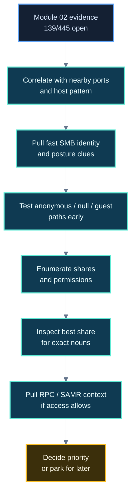

# SMB (139/tcp, 445/tcp) — Service Footprinting Playbook

---

> **Use This After**
>
> Module 02 or equivalent scanning already showed `139/tcp` and/or `445/tcp` open.
>
> This reference is not an SMB exploitation guide.
> It is a **first-pass service-footprinting playbook** for turning:
>
> - `139/tcp open netbios-ssn`
> - `445/tcp open microsoft-ds`
>
> into:
>
> - host-role clues
> - naming and identity context
> - share and access posture
> - exact nouns worth preserving
> - a defensible next-step decision

| Area | Value |
|---|---|
| **Module** | 03 — Service Footprinting and Common Infrastructure Enumeration |
| **Service family** | SMB / NetBIOS / RPC-adjacent Windows file and identity context |
| **Primary learner goal** | Understand what SMB reveals, how to test it cleanly, and when it deserves priority |
| **Best paired with** | Lesson 3.1, Lesson 3.2, Module 03 Lab Checkpoint B |
| **Practice model** | Baseline-live on `GOAD-Mini-DC01` and `GOAD-Mini-WS01` where tools and responses allow |

---

## Table of Contents

- [Why SMB Matters in Module 03](#why-smb-matters-in-module-03)
- [What 139 and 445 Actually Suggest](#what-139-and-445-actually-suggest)
- [Before You Touch the Keyboard](#before-you-touch-the-keyboard)
- [What Good SMB Footprinting Produces](#what-good-smb-footprinting-produces)
- [SMB Footprinting Workflow](#smb-footprinting-workflow)
- [Step 1: Correlate SMB With The Surrounding Port Picture](#step-1-correlate-smb-with-the-surrounding-port-picture)
- [Step 2: Get Fast SMB Identity and Posture Clues](#step-2-get-fast-smb-identity-and-posture-clues)
- [Step 3: Test Anonymous, Null, and Guest Paths Early](#step-3-test-anonymous-null-and-guest-paths-early)
- [Step 4: Enumerate Shares and Permissions Cleanly](#step-4-enumerate-shares-and-permissions-cleanly)
- [Step 5: Inspect the Best Shares Manually](#step-5-inspect-the-best-shares-manually)
- [Step 6: Pull RPC and SAMR Context When Access Allows](#step-6-pull-rpc-and-samr-context-when-access-allows)
- [Step 7: Revisit SMB Once Credentials Exist](#step-7-revisit-smb-once-credentials-exist)
- [How To Choose The Right Tool](#how-to-choose-the-right-tool)
- [What To Look For and Why It Matters](#what-to-look-for-and-why-it-matters)
- [Host-Role Interpretation Patterns](#host-role-interpretation-patterns)
- [Branching and Priority Decisions](#branching-and-priority-decisions)
- [What To Record in Notes](#what-to-record-in-notes)
- [Suggested Artifact Paths](#suggested-artifact-paths)
- [Mini Baseline Exercises](#mini-baseline-exercises)
- [One-Screen Command Summary](#one-screen-command-summary)

---

## Why SMB Matters in Module 03

In this course, SMB is not just "Windows file sharing."

SMB often reveals four high-value things at once:

- **host identity**
- **domain or workgroup context**
- **file and share exposure**
- **authentication and trust posture**

That makes it one of the strongest first-pass services for moving from open-port evidence into host-role reasoning.

If Module 02 told us:

```text
139/tcp open  netbios-ssn
445/tcp open  microsoft-ds
```

Module 03 should teach us to ask:

- does this look like a workstation, file server, or identity host?
- does SMB reveal a hostname, domain, or share naming scheme?
- can we enumerate anything without credentials?
- if we do gain credentials later, does SMB become an environment-wide branch?

> **🧠 Mental Model**
>
> SMB is a storage service, an identity-adjacent service, and often a Windows-environment clue at the same time.

---

## What 139 and 445 Actually Suggest

### `139/tcp` — NetBIOS Session Service

This often reflects older or NetBIOS-compatible SMB exposure.
It may provide:

- NetBIOS naming clues
- older Windows-style exposure
- SMB behavior reachable through a legacy transport path

### `445/tcp` — Direct SMB

This is the modern and more common SMB path.
It often provides:

- host and domain/workgroup information
- share enumeration opportunities
- signing and protocol posture clues
- RPC-adjacent enumeration paths

### What these ports do **not** prove by themselves

They do **not** prove:

- that the host is definitely a domain controller
- that the host is definitely Windows
- that shares are accessible
- that anonymous enumeration will work
- that exploitation is nearby

Linux systems running Samba can expose SMB too.
So can appliances, print systems, and specialized storage hosts.

That is why SMB interpretation must always combine:

- the SMB result itself
- nearby ports
- host naming
- share naming
- auth behavior

---

## Before You Touch the Keyboard

Start with the evidence you already have.

For Module 03, the best first move is usually to reuse Module 02 results rather than immediately generating new traffic.

### Minimum context to gather first

- target IP
- prior `nmap` evidence
- surrounding ports such as `53`, `88`, `135`, `389`, `445`, `3389`, `5985`
- any existing hostname clues
- whether the target is one of the course baseline hosts:
  - `GOAD-Mini-DC01`
  - `GOAD-Mini-WS01`

### Questions to ask before enumeration

1. Does SMB appear alone, or beside identity-related ports?
2. Does the port pattern suggest Windows infrastructure, a workstation, or generic file access?
3. Am I trying to answer a **host-role** question, an **access** question, or an **auth/depth** question?
4. What exact nouns do I want to capture if the service responds well?

> **📝 Note**
>
> In this module, the wrong start is:
> "SMB is open, so I will throw every SMB tool at it."
>
> The right start is:
> "What specific question about this host can SMB answer first?"

---

## What Good SMB Footprinting Produces

Good first-pass SMB work should usually produce some combination of:

- hostname
- domain or workgroup name
- SMB signing status
- OS or platform clue
- accessible shares
- read vs write posture
- user, group, or password-policy clues
- stronger host-role confidence
- a priority decision

### Exact nouns worth capturing

- NetBIOS name
- FQDN
- domain name
- workgroup name
- share names
- path names
- usernames
- group names
- policy details
- UNC paths
- script names
- deployment folder names
- backup folder names

These nouns matter because later modules care about:

- trust
- credentials
- web targets
- deployment surfaces
- Windows identity workflows

---

## SMB Footprinting Workflow



---

## Step 1: Correlate SMB With The Surrounding Port Picture

### Why

SMB means more when it appears beside the right neighboring services.

### Strong patterns

| Pattern | What it often suggests | Why it matters |
|---|---|---|
| `53 + 88 + 389 + 445` | Windows identity infrastructure | DNS + Kerberos + LDAP + SMB often means domain relevance |
| `135 + 139 + 445 + 3389` | Windows workstation or managed host | SMB plus RPC plus RDP is often operationally meaningful |
| `445` plus share names like `Backups`, `Finance`, `Deploy` | File or data relevance | The SMB branch may expose content or scripts worth preserving |
| `445` with Samba clues on Linux | Samba-backed file sharing | Useful, but not automatically AD or domain infrastructure |

### What to record

- surrounding ports
- whether those ports reinforce identity, storage, or management significance
- whether the target already looks like `DC01`, `WS01`, or something else

### Branch

- If SMB aligns with `53`, `88`, `389`, raise its priority immediately.
- If SMB aligns with `3389` or `5985`, treat it as a stronger Windows-management branch.
- If SMB appears mostly alone, start with posture and share visibility before overinterpreting.

---

## Step 2: Get Fast SMB Identity and Posture Clues

### Why

Before share crawling, establish the SMB posture:

- hostname
- domain or workgroup
- signing
- OS hint
- whether the host looks more like a DC, member server, or workstation

### Recommended tools

#### NetExec / CrackMapExec-style host posture check

```bash
nxc smb <target>
```

### What this answers

- is the host alive and speaking SMB?
- what hostname does it report?
- what domain/workgroup appears?
- is SMB signing enabled or required?
- does the OS clue reinforce a Windows identity?

### Nmap NSE check for SMB posture

```bash
nmap --script smb-os-discovery,smb-security-mode,smb-protocols -p 139,445 <target>
```

### Why keep an NSE option here

This course already uses Nmap as the learner’s base instrument.
The NSE pass helps tie Module 02 and Module 03 together.

### Optional NetBIOS naming check

```bash
nbtscan <target>
```

Use this when `139/tcp` is present and you want quick NetBIOS naming clues.

### What to record

- hostname / NetBIOS name
- domain or workgroup
- SMB signing status
- protocol support clues
- OS hint

### Why this matters

Signing status is not just trivia.
It matters because it helps answer:

- is the host modern and domain-managed?
- does this SMB service look security-aware?
- is this a later relay-relevant note, even if we do not act on it now?

### Branch

- If the hostname or domain clearly suggests a DC or file server, SMB becomes higher priority.
- If the host presents as a workstation, keep SMB important but narrower in scope.
- If all you get is minimal posture, move to access testing next.

---

## Step 3: Test Anonymous, Null, and Guest Paths Early

### Why

This is the highest-value early gate.

If anonymous, null, or guest access works, you may immediately obtain:

- share names
- user and group data
- password-policy details
- stronger host and domain context

### Manual share listing

```bash
smbclient -N -U "" -L //<target>/
```

### Null-session style checks with NetExec

```bash
nxc smb <target> -u '' -p ''
nxc smb <target> -u '' -p '' --shares
nxc smb <target> -u '' -p '' --users
nxc smb <target> -u '' -p '' --groups
nxc smb <target> -u '' -p '' --pass-pol
```

### RPC null attempt

```bash
rpcclient -U "" -N <target>
```

Useful interactive checks:

```text
enumdomusers
enumdomgroups
querydominfo
getusername
```

### What to look for

- can shares be listed anonymously?
- can users or groups be enumerated?
- is password policy exposed?
- does the host reveal domain naming even if deeper access fails?

### Why this matters

Null or guest enumeration is one of the clearest ways to separate:

- "SMB is just present"

from:

- "SMB is already yielding environment value"

### Common mistake

Do not treat "anonymous share listing failed" as "SMB is low value."
It only means one branch failed.
Posture and later authenticated reuse may still make SMB very important.

### Branch

- If shares, users, or password policy come back anonymously, raise SMB priority.
- If only hostname or domain context comes back, preserve it and continue.
- If nothing useful comes back, move to structured share and permission testing next.

---

## Step 4: Enumerate Shares and Permissions Cleanly

### Why

Once SMB is worth more attention, the next question becomes:

> Which shares are visible, and what level of access do they expose?

### Best tool for this question

`smbmap` is usually the cleanest first choice.

#### Anonymous or null attempt

```bash
smbmap -H <target> -u '' -p ''
```

#### Authenticated use

```bash
smbmap -H <target> -u <user> -p '<password>'
```

### What to look for

#### High-signal share names

- `NETLOGON`
- `SYSVOL`
- `Users`
- `Profiles`
- `Public`
- `Shared`
- `Software`
- `Backups`
- `Deploy`
- `Scripts`
- `IT`
- `Finance`
- `HR`

#### High-signal permission states

- `READ` -> loot and naming branch
- `WRITE` -> higher-risk, higher-priority follow-up branch
- `NO ACCESS` -> preserve and revisit if credentials appear later

### Why share names matter

Share names often reveal:

- business functions
- department names
- deployment workflows
- backup or staging areas
- whether the host is serving users, admins, or applications

### Why write access matters

Writable shares can indicate:

- deployment relevance
- user profile relevance
- staging or script relevance
- broader operational trust than the open port alone suggested

### Branch

- If you get readable shares, inspect the best one manually.
- If you get writable shares, mark SMB as high priority immediately.
- If you get no access, preserve the share names and posture anyway.

---

## Step 5: Inspect the Best Shares Manually

### Why

Once you know a share is interesting, manual inspection tells you what the share **actually contains**.

This is where SMB stops being a port and starts being an environment clue.

### Anonymous connection

```bash
smbclient //<target>/<share> -N
```

### Authenticated connection

```bash
smbclient //<target>/<share> -U <user>
```

### Useful `smbclient` commands

```text
ls
cd <dir>
pwd
get <file>
put <file>
recurse on
prompt off
mget *
```

### What to look for first

#### Credentials and secrets

- `.env`
- `.config`
- `.ini`
- `.conf`
- `.json`
- `.xml`
- `.yaml`
- `.yml`
- `Groups.xml`
- `unattend.xml`
- `sysprep.xml`

#### Scripts and automation

- `.ps1`
- `.bat`
- `.cmd`
- `.vbs`
- `.psm1`
- `.sh`

#### Access artifacts

- `id_rsa`
- `.kdbx`
- VPN configs
- RDP files
- SSH configs
- connection strings
- deployment manifests

#### High-value business and operational content

- backups
- inventories
- onboarding notes
- architecture documents
- exported spreadsheets
- install packages
- service account references

### Why this matters

The goal is not "download everything."
The goal is to answer:

- what kind of host is this serving?
- what names or paths does this reveal?
- do these files expose users, systems, credentials, or workflows?

### Branch

- If you find credentials, record exactly what they appear to belong to.
- If you find usernames, domains, or UNC paths only, preserve them for later credential and host-correlation work.
- If the share looks unimportant, note that too and move on cleanly.

---

## Step 6: Pull RPC and SAMR Context When Access Allows

### Why

SMB is often closely tied to RPC-backed identity and domain enumeration.

If access allows it, focused RPC and SAMR checks can turn a storage clue into a user and domain clue.

### `rpcclient`

```bash
rpcclient -U "" -N <target>
```

Useful interactive commands:

```text
enumdomusers
enumdomgroups
querydominfo
getusername
```

### What `rpcclient` is best for

- direct user and group questions
- quick domain info checks
- narrower RPC checks after null or authenticated access succeeds

### `samrdump.py`

```bash
samrdump.py <target>
samrdump.py CORP/user:'Password123!'@<target>
samrdump.py -hashes <LMHASH:NTHASH> CORP/user@<target>
```

### What `samrdump.py` is best for

- focused SAMR-backed user/domain enumeration
- cleaner user enumeration than broad wrappers when you know that is the question

### `lookupsid.py`

```bash
lookupsid.py <target>
lookupsid.py CORP/user:'Password123!'@<target>
lookupsid.py -hashes <LMHASH:NTHASH> CORP/user@<target>
```

### What `lookupsid.py` is best for

- targeted SID and RID-backed identity discovery
- situations where you want focused identity enumeration rather than share interaction
- validating whether a host exposes useful account naming through lookup paths

### `enum4linux-ng`

```bash
enum4linux-ng -A <target>
enum4linux-ng -As <target>
```

### Why it still belongs in the reference

It is useful when the question is:

> Give me a broad one-host SMB/RPC/NetBIOS picture before I pick narrower tools.

It is not a substitute for deliberate follow-up.

### Branch

- If users, groups, or password policy come back, preserve them immediately.
- If the wrapper returns strong results, pivot into the narrower tool that fits the result.
- If the wrapper returns little, do not keep rerunning it instead of thinking.

---

## Step 7: Revisit SMB Once Credentials Exist

### Why

The moment valid credentials appear, SMB changes from:

- "single-host file and posture triage"

into:

- "how much of the environment accepts this identity, and what else becomes visible?"

### High-value authenticated NetExec commands

#### Share access

```bash
nxc smb <target-or-subnet> -u <user> -p '<password>' --shares
nxc smb <target-or-subnet> -u <user> -p '<password>' --shares READ
nxc smb <target-or-subnet> -u <user> -p '<password>' --shares WRITE
```

#### Users and groups

```bash
nxc smb <target> -u <user> -p '<password>' --users
nxc smb <target> -u <user> -p '<password>' --groups
```

#### RID brute and password policy

```bash
nxc smb <target> -u <user> -p '<password>' --rid-brute
nxc smb <target> -u <user> -p '<password>' --pass-pol
```

### Why this matters

Authenticated SMB is one of the best places to answer:

- where else do these credentials work?
- which shares become readable or writable?
- what users, groups, or policies become visible now?

### `smbmap` for recursive authenticated triage

```bash
smbmap -H <target> -u <user> -p '<password>' -r
smbmap -H <target> -u <user> -p '<password>' -r 'SHARE'
smbmap -H <target> -u <user> -p '<password>' -r 'SHARE\\path'
```

### Filename hunting

```bash
smbmap -H <target> -u <user> -p '<password>' -r 'SHARE' -A '(?i)(password|cred|secret|config|groups\.xml|unattend|id_rsa|kdbx)'
```

### Safe write test

With `smbclient` inside a writable share:

```bash
put test.txt
```

With `smbmap`:

```bash
smbmap -H <target> -u <user> -p '<password>' --upload ./test.txt 'SHARE\\path\\test.txt'
```

### Why test write carefully

Writable access matters most when it lands in:

- `Scripts`
- `Deploy`
- profile or home paths
- application-linked areas
- staging or package-drop locations

A boring public dropbox is not equal to a script-consumed share.

### `smbclient.py` when Impacket-style access is a better fit

```bash
smbclient.py CORP/user:'Password123!'@<target>
smbclient.py -hashes <LMHASH:NTHASH> CORP/user@<target>
smbclient.py -k CORP/user@<target>
```

Use this when:

- you want an SMB client that fits Impacket-style workflows
- you need pass-the-hash support
- you need Kerberos-friendly access patterns
- you want to stay inside one tooling family with other Impacket checks

---

## How To Choose The Right Tool

Choose tools by question, not by brand familiarity.

| Question | Best first tool | Why |
|---|---|---|
| What hostname, domain, signing, and posture does SMB reveal? | `nxc smb` or Nmap NSE | Fast host-level context |
| Can I list shares without credentials? | `smbclient -N -L` | Direct yes/no share visibility |
| Which shares are readable or writable? | `smbmap` | Fast permission-oriented triage |
| What is actually inside this share? | `smbclient` | Manual confirmation and browsing |
| Can I pull broad one-host SMB/RPC context? | `enum4linux-ng` | Broad coverage before narrower follow-up |
| Can I pull users, groups, or domain info via RPC? | `rpcclient` | Focused direct RPC checks |
| Can I pull SAMR-backed user/domain data? | `samrdump.py` | Narrow targeted user enumeration |
| Can I test SID and RID-backed identity exposure? | `lookupsid.py` | Focused identity discovery path |
| Where else do my credentials work? | `nxc smb` | Best scaling and access fan-out |
| Do I need hash- or Kerberos-friendly SMB interaction? | `smbclient.py` | Flexible Impacket-style authenticated access |

---

## What To Look For and Why It Matters

### SMB signing

Look for:

- enabled
- required
- disabled or weak posture

Why it matters:

- it helps characterize the host’s defensive posture
- it may reinforce later relay relevance
- it helps distinguish rough environment maturity

### Share naming

Look for:

- departmental names
- backup names
- deployment names
- profile names
- public vs private naming

Why it matters:

- share names often expose business function before content does

### Anonymous or guest access

Look for:

- share listing
- readable shares
- policy visibility
- user and group data

Why it matters:

- this is one of the quickest ways SMB becomes a top-priority branch

### Administrative shares

Look for:

- `C$`
- `ADMIN$`
- `IPC$`

Why it matters:

- their presence alone is not a vulnerability
- but they reinforce Windows host type and possible later authenticated value

### Policy clues

Look for:

- password length
- complexity requirements
- lockout settings

Why it matters:

- this feeds later credential reasoning

### Naming and UNC paths

Look for:

- internal hostnames
- domains
- shared path patterns
- deployment destinations

Why it matters:

- these clues often connect SMB to web, application, or credential branches later

---

## Host-Role Interpretation Patterns

| SMB evidence | Likely meaning | Confidence | Common mistake |
|---|---|---|---|
| `445` plus `53`, `88`, `389` | Identity-oriented Windows infrastructure | High | Treating it as "just file sharing" |
| `445` plus `3389` and workstation naming | Managed Windows endpoint or workstation | Medium to high | Treating it like a file server immediately |
| Shares named `Backups`, `Finance`, `Deploy` | File or business-data relevance | Medium to high | Ignoring share names as mere labels |
| Samba clues on Linux | Samba-backed file service | Medium | Assuming Active Directory |
| Only `445` with little else | Unclear role yet | Low to medium | Declaring the host type too early |

> **🚨 Important**
>
> `445/tcp open microsoft-ds` is a strong clue.
> It is not a finished conclusion.

---

## Branching and Priority Decisions

### Make SMB high priority now if:

- null or guest enumeration works
- readable shares contain meaningful names or data
- writable shares exist
- SMB aligns with identity ports
- host naming clearly suggests DC, file, backup, or deployment role
- SMB reveals users, groups, or password policy

### Make SMB medium priority if:

- you only got hostname, domain, or signing clues
- share names exist but access is limited
- the host looks relevant but the access path is not open yet

### Park SMB for now if:

- no useful posture clues
- no readable shares
- no useful RPC output
- no credentials
- another branch is clearly producing stronger value right now

Parking does not mean "forget it."
It means:

- preserve what SMB already told you
- revisit after credentials, usernames, or stronger host-role context appear

---

## What To Record in Notes

At minimum, preserve:

- target IP
- hostname
- domain or workgroup
- signing status
- OS or platform hint
- surrounding relevant ports
- share names
- read/write posture
- usernames or groups discovered
- password-policy clues
- notable file paths
- exact filenames worth revisiting
- whether the host seems like a DC, workstation, file server, deploy host, or backup host

### A clean note pattern

```markdown
## SMB Footprint — <host>

### Observation
- 445/tcp open microsoft-ds
- SMB identifies as <hostname>
- Domain/workgroup: <value>
- Signing: <value>
- Shares visible: <names>

### Inference
- Likely <host role> because <supporting evidence>
- SMB appears low / medium / high priority because <reason>

### Validation Needed
- Confirm whether <share> is readable
- Confirm whether domain context aligns with DNS / LDAP / Kerberos clues

### Next Step
- Run <specific next command>
- Update `follow-up-queue.md` with <priority reason>
```

---

## Suggested Artifact Paths

Suggested Module 03 paths:

- `assessment-workspace/02-evidence/services/module-03/smb-<host>-notes.md`
- `assessment-workspace/02-evidence/services/module-03/smb-<host>-enum.txt`
- `assessment-workspace/03-analysis/follow-up-queue.md`
- `assessment-workspace/03-analysis/module-03-host-role-notes.md`

If you save broad wrapper output such as `enum4linux-ng`, keep it, but also extract the exact nouns into notes.

---

## Mini Baseline Exercises

### Exercise 1 — `GOAD-Mini-DC01`

Question:

> Does SMB on `192.168.57.10` reinforce an identity-host hypothesis, and what exact naming clues can I preserve?

Suggested path:

```bash
nxc smb 192.168.57.10
smbclient -N -U "" -L //192.168.57.10/
nmap --script smb-os-discovery,smb-security-mode,smb-protocols -p 139,445 192.168.57.10
```

Record:

- hostname
- domain/workgroup
- signing status
- any visible shares
- how SMB aligns with DNS / Kerberos / LDAP

### Exercise 2 — `GOAD-Mini-WS01`

Question:

> How does SMB on `192.168.57.31` feel different from the DC, and what does that change about host-role confidence?

Suggested path:

```bash
nxc smb 192.168.57.31
smbclient -N -U "" -L //192.168.57.31/
enum4linux-ng -As 192.168.57.31
```

Record:

- hostname
- workgroup/domain clues
- share names
- whether it looks more like a workstation or user-serving Windows host

---

## One-Screen Command Summary

### Fastest first-pass posture

```bash
nxc smb <target>
nmap --script smb-os-discovery,smb-security-mode,smb-protocols -p 139,445 <target>
nbtscan <target>
```

### Anonymous or null checks

```bash
smbclient -N -U "" -L //<target>/
nxc smb <target> -u '' -p ''
nxc smb <target> -u '' -p '' --shares
nxc smb <target> -u '' -p '' --users
nxc smb <target> -u '' -p '' --pass-pol
rpcclient -U "" -N <target>
```

### Share and access triage

```bash
smbmap -H <target> -u '' -p ''
smbclient //<target>/<share> -N
enum4linux-ng -A <target>
```

### Authenticated follow-up

```bash
nxc smb <target-or-subnet> -u <user> -p '<password>' --shares
nxc smb <target> -u <user> -p '<password>' --users
nxc smb <target> -u <user> -p '<password>' --pass-pol
smbmap -H <target> -u <user> -p '<password>' -r
samrdump.py CORP/user:'Password123!'@<target>
lookupsid.py CORP/user:'Password123!'@<target>
smbclient.py -hashes <LMHASH:NTHASH> CORP/user@<target>
```

---

> **Bottom Line**
>
> Good SMB footprinting is not about memorizing a pile of tools.
> It is about asking the right first question, capturing exact nouns, understanding how SMB changes host-role confidence, and deciding whether this branch deserves priority now or later.
