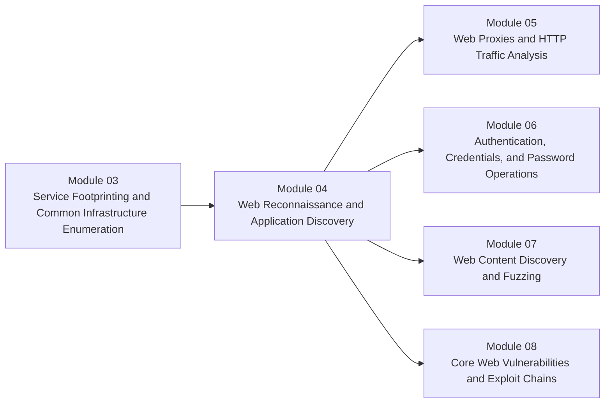

# Module 04 - Web Reconnaissance and Application Discovery

**Phase II - Web Understanding and Exposure Analysis**

### Learn to turn “HTTP is open” into a mapped application surface and a clean testing queue.

*This module starts the contiguous web arc by teaching learners how to identify web assets, classify routes and functionality, and convert first-pass discovery into the exact follow-up work that later proxy, authentication, fuzzing, and vulnerability modules will own.*

---

> **🧭 Start Here**
>
> Begin with [Lesson 4.1](lessons/module-04-lesson-4-1-how-web-applications-work-and-what-we-are-actually-discovering.md), work through passive and active recon in order, and finish with [Lesson 4.4](lessons/module-04-lesson-4-4-from-web-discovery-to-test-plan.md) so you leave the module with a route map and a practical next-step queue. Keep the [reference cheat sheet](references/module-04-reference-cheat-sheet.md) nearby while you practice.

## Module Overview

Module 04 is where the course shifts from general service interpretation into deliberate web-specific reasoning.

Modules 02 and 03 taught us how to:

- find exposed hosts and services
- interpret service roles and host meaning
- decide which targets deserve follow-up first

This module answers the next question:

> when a host exposes web services, what are we actually trying to discover before we start manipulating traffic or testing for vulnerabilities?

The job here is not deep exploitation.
The job is to map:

- which web assets exist
- how those assets are named and reached
- what technologies and frameworks appear likely
- which routes, functions, and user journeys matter most
- what should be captured next with a proxy

This is the first module in the contiguous web block, so its handoff quality matters.
If we do this module well, Module 05 starts with a cleaner application map and a clearer idea of which flows deserve interception first.

---

## At a Glance

| Area | Details |
|---|---|
| **Series** | Hack the Basics |
| **Phase** | Phase II - Web Understanding and Exposure Analysis |
| **Module** | 04 - Web Reconnaissance and Application Discovery |
| **Role** | Convert exposed web services into a mapped application surface and first-pass testing plan |
| **Level** | Beginner to early intermediate |
| **Format** | Self-paced, Markdown-first, GitHub-native |

| Builds On | Prepares Next | Core Artifacts |
|---|---|---|
| Modules 02-03 scanning, service reasoning, triage, and evidence habits | Module 05 proxy workflows, Module 06 auth reasoning, Module 07 content discovery, Module 08 web vulnerability analysis | web recon worksheet, route map template, module lab, web field reference |

---

## Why This Module Exists

Seeing `80/tcp` or `443/tcp` open is not enough.

Strong web recon needs the learner to ask:

- is this a single site, a multi-app platform, or an API plus front end?
- what hostnames, certificates, redirects, and virtual hosts shape what we can reach?
- what routes, roles, forms, parameters, and functionality appear visible already?
- what looks public, authenticated, administrative, API-driven, or operational?
- which flows should be captured and analyzed in the next module?

That is the role of Module 04.

It teaches the learner to treat web exposure as an application surface with structure, trust boundaries, and workflow implications, not just a page title and a server banner.

---

## Module Position in the Course

> **🧠 Mental Model**
>
> Module 03 taught us how to recognize that a web surface deserves attention.
> Module 04 teaches us how to map what that surface appears to contain.
> Module 05 then lets us instrument those flows and inspect the traffic directly.

---

## Lesson Path

| Lesson | Role in the Journey | What the learner leaves with |
|---|---|---|
| [Lesson 4.1](lessons/module-04-lesson-4-1-how-web-applications-work-and-what-we-are-actually-discovering.md) | Builds the mental model for web applications, routes, APIs, identity surfaces, and request flow before tactics | A cleaner definition of what “web surface” actually means |
| [Lesson 4.2](lessons/module-04-lesson-4-2-passive-recon-for-web-targets.md) | Teaches low-friction external visibility gathering and naming/context collection | A stronger way to build an initial asset inventory without rushing into requests |
| [Lesson 4.3](lessons/module-04-lesson-4-3-active-recon-and-surface-mapping.md) | Teaches controlled interaction with live targets to map routes, technologies, boundaries, and clues | A usable route map and better first-pass recon discipline |
| [Lesson 4.4](lessons/module-04-lesson-4-4-from-web-discovery-to-test-plan.md) | Turns discovery output into a prioritized test queue and explicit module handoffs | A repeatable process for deciding what Module 05 and later modules should inspect first |

---

## What to Use During the Module

| Artifact | Purpose | When to use it |
|---|---|---|
| [Reference Cheat Sheet](references/module-04-reference-cheat-sheet.md) | Fast field guide for passive recon, active mapping, route classification, and handoff decisions | During practice, labs, and later web work |
| [Web Recon Worksheet](references/module-04-web-recon-worksheet.md) | Helps track naming, certificates, technologies, redirects, and observed routes | During Lesson 4.2, Lesson 4.3, and the module lab |
| [Route Map Template](references/module-04-route-map-template.md) | Organizes routes, methods, auth context, roles, and follow-up ideas | During Lesson 4.4 and before starting Module 05 |
| [Module Lab](labs/module-04-lab-01-web-recon-and-surface-mapping.md) | Pulls the full module into a guided first-pass web recon operation | After Lesson 4.4 |

---

## Reading Strategy

### If this is your first pass

1. Start with the application mental model before touching recon tooling.
2. Keep naming, hostnames, certificates, technologies, and observed routes in separate note fields.
3. Write down what is observed versus what is only inferred.
4. End each lesson by updating your route map or testing queue.

### If you are returning as a reference

- start with the [reference cheat sheet](references/module-04-reference-cheat-sheet.md)
- use Lesson 4.2 when you need help inventorying names and external clues
- use Lesson 4.3 when you need a workflow for safe first-pass interaction
- use Lesson 4.4 when you need help deciding what the proxy should capture next

---

## What Makes This Module Different

A lot of web-recon material collapses into one of two weak patterns:

- it becomes a tool list with no explanation of what the learner is trying to discover
- it jumps too quickly into exploitation without building a clean surface map first

This module aims for a more durable middle:

- application-surface reasoning before tooling
- passive clues before noisy interaction
- route and function mapping before traffic manipulation
- explicit handoffs into proxy, authentication, fuzzing, and vulnerability workflows

The goal is not just to identify “a website.”
The goal is to understand what kind of web system appears to exist, how it is organized, and what deserves deeper testing next.

---

## Module Navigation

| Previous | Next |
|---|---|
| [Module 03 - Service Footprinting and Common Infrastructure Enumeration](../03-service-footprinting-and-common-infrastructure-enumeration/README.md) | [Module 05 - Web Proxies and HTTP Traffic Analysis](../05-web-proxies-and-http-traffic-analysis/README.md) |

---

**Read web exposure like an application analyst: capture the names, map the routes, classify the functions, and hand the next module a cleaner test queue.**

