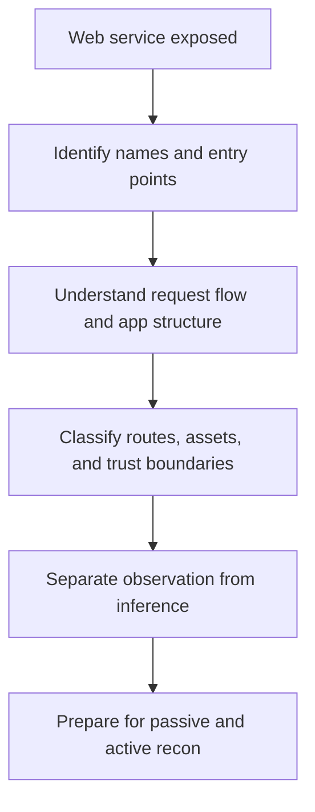
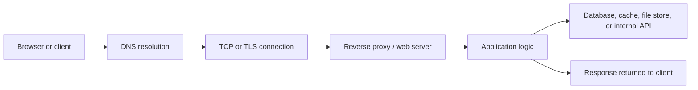
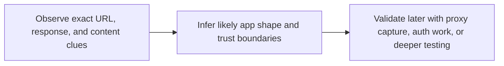
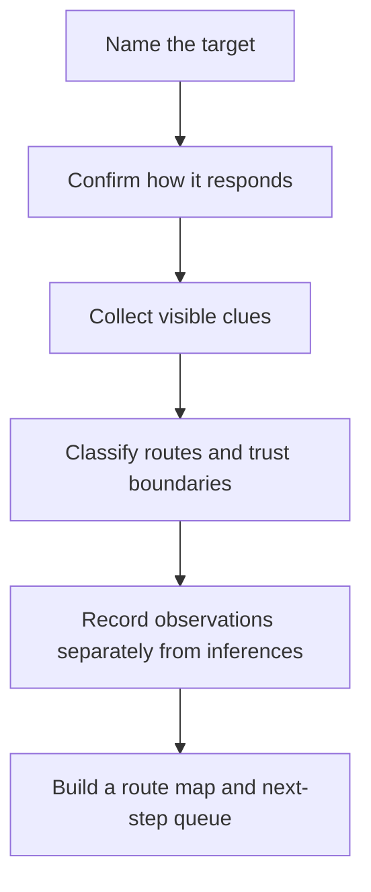

<div align="center">

**Hack the Basics · Phase II**

`Module 04 · Web Reconnaissance and Application Discovery`

</div>

# Lesson 4.1 — How Web Applications Work and What We Are Actually Discovering

---

> **🎯 Lesson Objective**
>
> By the end of this lesson, we will stop treating web recon like “open the site and click around” and start understanding it as the deliberate work of mapping **names, requests, routes, trust boundaries, and functionality**.

| **Course** | **Module** | **Lesson** | **Estimated Time** | **Difficulty** |
|---|---|---|---:|---|
| Hack the Basics | Module 04 — Web Reconnaissance and Application Discovery | 4.1 — How Web Applications Work and What We Are Actually Discovering | 45–60 min | Beginner |

| **Prerequisites** | **You will practice** | **Main outcome** |
|---|---|---|
| Modules 02-03 or equivalent exposure triage basics, basic browser familiarity, basic HTTP vocabulary | Thinking in routes, functions, roles, and trust boundaries instead of “pages” alone | Building the application-surface mental model that the rest of the module depends on |

> **🚨 Important**
>
> This lesson is deliberately foundational.
> We are not starting with proxies, fuzzers, or exploit techniques.
> We are building the model that makes later web tooling mean something.

---

## Table of Contents

- [Lesson Map](#lesson-map)
- [Why This Lesson Matters](#why-this-lesson-matters)
- [Learning Objectives](#learning-objectives)
- [The Practical Problem This Lesson Solves](#the-practical-problem-this-lesson-solves)
- [Why “HTTP Open” Still Leaves Big Questions Unanswered](#why-http-open-still-leaves-big-questions-unanswered)
- [What We Mean by a Web Application Surface](#what-we-mean-by-a-web-application-surface)
- [How a Real Web Request Usually Travels](#how-a-real-web-request-usually-travels)
- [Names, Hosts, Ports, and Virtual Hosts](#names-hosts-ports-and-virtual-hosts)
- [Pages, Routes, APIs, Actions, and Assets Are Not the Same Thing](#pages-routes-apis-actions-and-assets-are-not-the-same-thing)
- [Public, Authenticated, Administrative, and Operational Surfaces](#public-authenticated-administrative-and-operational-surfaces)
- [Why Identity Belongs in Web Recon From the Beginning](#why-identity-belongs-in-web-recon-from-the-beginning)
- [Technology Clues: Useful, but Easy to Overclaim](#technology-clues-useful-but-easy-to-overclaim)
- [Observation vs Inference in Web Discovery](#observation-vs-inference-in-web-discovery)
- [What Counts as a Strong First-Pass Web Recon Outcome?](#what-counts-as-a-strong-first-pass-web-recon-outcome)
- [A Practical Mental Model for the Rest of the Module](#a-practical-mental-model-for-the-rest-of-the-module)
- [Walkthrough 1: Reading a Simple HTTPS Target Like an Analyst](#walkthrough-1-reading-a-simple-https-target-like-an-analyst)
- [Walkthrough 2: Moving From a Landing Page to a Surface Map](#walkthrough-2-moving-from-a-landing-page-to-a-surface-map)
- [Walkthrough 3: Reading JavaScript and Naming Clues Without Overreaching](#walkthrough-3-reading-javascript-and-naming-clues-without-overreaching)
- [Stop and Think](#stop-and-think)
- [Common Mistakes and Misconceptions](#common-mistakes-and-misconceptions)
- [Defender’s View](#defenders-view)
- [Key Takeaways](#key-takeaways)
- [Knowledge Check Quiz](#knowledge-check-quiz)
- [Quiz Answers](#quiz-answers)
- [Mini Practice Task](#mini-practice-task)
- [Next Lesson Bridge](#next-lesson-bridge)
- [End-of-Lesson Recap](#end-of-lesson-recap)

---

## Lesson Map



> **💡 Tip**
>
> Good web recon starts before the first big tool run.
> It starts when we define what kinds of things we are actually looking for.

---

## Why This Lesson Matters

When learners first transition from service enumeration into web work, they often carry over a weak habit:

- “port 80 is open, so now I’ll open the site”
- “the title says something useful, so I understand the app”
- “WhatWeb says React and nginx, so I basically know what matters”

That is not enough.

A web target can be:

- one small static site
- a front end plus several APIs
- an application suite with user and admin portals
- a reverse-proxied platform with several virtual hosts
- an authenticated business app where the most important behavior is hidden until later

If we do not understand that up front, our recon becomes shallow.

We will collect:

- page titles without route meaning
- tech clues without trust context
- paths without role classification
- screenshots without a test plan

This lesson fixes that by teaching what the rest of Module 04 is actually trying to map.

> **📝 Note**
>
> Module 03 taught us how to decide that a web service deserves follow-up.
> Lesson 4.1 teaches what a strong web follow-up is trying to produce.

---

## Learning Objectives

By the end of this lesson, we should be able to:

- explain what “web application surface” means in practical assessment terms
- distinguish names, routes, APIs, assets, and trust boundaries
- describe how a request commonly moves from browser to application components
- recognize why identity and role context belong in web recon immediately
- separate direct observation from web-specific inference
- define what a strong first-pass recon output should contain

---

## The Practical Problem This Lesson Solves

Suppose earlier enumeration shows:

```text
80/tcp   open  http
443/tcp  open  ssl/http
8443/tcp open  ssl/http-alt
```

And early checks reveal:

- the certificate includes `portal.acme.lab`, `api.acme.lab`, and `admin.acme.lab`
- the landing page redirects to `/login`
- the HTML references `/static/app.js`
- the footer contains a link to `/docs`

That is useful evidence, but it still leaves major questions unanswered:

- Is this one app or several related apps?
- Is `admin.acme.lab` a different virtual host or just a cert entry?
- Does `/docs` expose public documentation, API docs, or product docs?
- Is the visible `/login` the only auth entry point?
- Are we looking at a traditional server-rendered app, a single-page app, or a front end talking to an API?
- Which of these clues belong to later proxy capture, and which can we already classify?

Lesson 4.1 gives us the conceptual frame to answer those questions cleanly instead of improvising.

---

## Why “HTTP Open” Still Leaves Big Questions Unanswered

When a scan or service check says “HTTP” or “HTTPS,” it is telling us something true but incomplete.

It tells us:

- a web-capable service appears reachable on this port
- a browser or HTTP client will probably get some kind of response
- the target likely exposes content, functionality, or both

It does **not** tell us:

- how many distinct applications exist
- what naming or routing logic controls access
- whether identity changes what each user can see
- whether the main risk lives in headers, routes, APIs, uploads, or admin features
- which requests matter enough to intercept later

> **🚨 Important**
>
> “Web found” is not a finished finding.
> It is the start of an application-mapping workflow.

### The web surface is usually layered

A beginner may see one visible page and think there is one target.

But the real surface may include:

- multiple hostnames
- redirects across domains
- login and password-reset flows
- front-end JavaScript talking to `/api/`
- admin-only routes
- operational routes like `/health`, `/metrics`, or `/status`
- download, export, upload, and reporting functions

The rest of this module exists to make those layers visible.

---

## What We Mean by a Web Application Surface

A web application surface is the set of reachable web-facing behaviors and clues that matter to an assessor.

That includes more than pages.

### It often includes

- hostnames and URLs
- protocols and ports
- redirects
- certificates and alternate names
- routes and endpoints
- forms and parameters
- APIs and documentation
- files, downloads, and uploads
- authentication and session entry points
- visible frameworks, products, and infrastructure clues

### It also includes trust boundaries

The same application may expose:

- public content for everyone
- authenticated content for ordinary users
- privileged content for administrators
- operational content for support or infrastructure teams

Those are not just UI differences.
They are different kinds of assessment surface.

| Surface element | What it may tell us |
|---|---|
| hostname or vhost | naming conventions and role separation |
| redirect chain | canonical target, SSO involvement, protocol enforcement |
| route | business function or technical function |
| parameter or form field | where user input enters the system |
| API endpoint | data exchange and backend interaction patterns |
| admin path | trust boundary and privileged workflow |
| file feature | upload, download, export, import, or report generation logic |

> **🧠 Mental Model**
>
> Think of web recon as building a map with four layers:
>
> - names
> - routes
> - functions
> - trust boundaries

---

## How a Real Web Request Usually Travels

A web request rarely goes straight from browser to one monolithic application process.

Even in simple environments, there is usually some chain of components involved.



### Why this matters for recon

Because the clues we see may come from different layers.

For example:

- a certificate may reveal alternate names
- a reverse proxy may add headers or redirect behavior
- the HTML may reveal front-end framework usage
- JavaScript may reveal API paths
- an API response may reveal versioning or role logic

If we do not think in layers, we may misattribute clues.

### Example

If we see:

```text
Server: nginx
X-Powered-By: Express
Location: /login
```

we should not jump to “the app is nginx.”

A stronger reading is:

- nginx likely sits in front of the app
- something behind it appears to use Express
- the route logic or access policy redirects users to `/login`

That is a layered interpretation, not a shallow label.

---

## Names, Hosts, Ports, and Virtual Hosts

Web recon often fails early because learners collapse several different things into one bucket.

### Hostnames are not just labels

A hostname may represent:

- a distinct app
- a role-specific portal
- a tenant or environment
- an API endpoint
- a staging or admin surface

### Ports are not whole applications

`443` may expose:

- one site
- many virtual hosts
- an SSO provider plus a business app
- a reverse proxy routing to several back-end services

### Virtual hosts matter because the name can change the response

The same IP may behave differently depending on:

- the `Host` header
- the TLS SNI value
- the URL path

That means “I visited the IP and got a page” is often weaker evidence than learners think.

| Item | Why it matters in recon |
|---|---|
| IP address | confirms network reachability |
| hostname | may control routing and app identity |
| TLS SNI | may change certificate and served content |
| `Host` header | may select a virtual host |
| path | selects the visible route or function |

> **⚠️ Warning**
>
> If the target is name-sensitive, browsing only to the raw IP can hide the real application shape.

---

## Pages, Routes, APIs, Actions, and Assets Are Not the Same Thing

Another common beginner mistake is to describe everything as “pages.”

That blurs important differences.

### A route

A route is a reachable application location or handler such as:

- `/login`
- `/admin`
- `/api/v1/users`
- `/health`

### A page

A page is a browser-rendered experience, usually HTML or something that behaves like it.

### An API endpoint

An API endpoint is a route intended for structured programmatic interaction, often JSON or GraphQL rather than rendered HTML.

### An action

An action is a state-changing behavior such as:

- submitting a login form
- uploading a file
- creating a new user
- exporting a report

### An asset

An asset is support material like:

- JavaScript
- CSS
- images
- downloadable files

Why does this distinction matter?
Because later modules care about different things:

- Module 05 wants to inspect specific requests and flows
- Module 06 cares about auth routes and identity logic
- Module 07 expands hidden content and parameter discovery
- Module 08 evaluates inputs, state changes, and vulnerability classes

If our recon notes say only “found some pages,” we have not created a usable handoff.

---

## Public, Authenticated, Administrative, and Operational Surfaces

Web recon is not only about what exists.
It is about what kind of trust the route appears to sit behind.

### Public surface

Things accessible to anyone without logging in:

- home pages
- marketing pages
- docs
- help content
- status pages

### Authenticated surface

Things intended for ordinary signed-in users:

- dashboards
- profiles
- settings
- order views
- reports

### Administrative surface

Privileged workflows such as:

- `/admin`
- `/manage`
- user-management interfaces
- configuration consoles

### Operational surface

Routes meant for infrastructure or monitoring:

- `/health`
- `/metrics`
- `/status`
- internal dashboards

| Surface class | Typical clues |
|---|---|
| Public | nav links, docs, about pages, basic search |
| Authenticated | redirects to login, user dashboards, session cookies later |
| Administrative | “admin,” “console,” RBAC hints, privileged terminology |
| Operational | metrics, health, status, internal naming, support tooling |

> **🔍 Interpretation**
>
> Route classification is already a form of risk reasoning.
> It tells us which flows likely deserve higher priority later.

---

## Why Identity Belongs in Web Recon From the Beginning

It is tempting to think authentication belongs only in Module 06.
That would be a mistake.

Module 06 will go deeper into:

- login mechanics
- credential operations
- password logic
- reuse and validation

But Module 04 still needs to record where identity shows up.

### Identity clues include

- `/login`, `/logout`, `/register`, `/forgot-password`
- SSO redirects
- role-specific nav elements
- user/account/profile concepts
- access-denied pages
- tenant selectors
- invitation or onboarding flows

Why capture these now?
Because identity context changes how we read the surface.

If we know an app pushes users into SSO immediately, that affects:

- how we interpret the visible routes
- what Module 05 should capture first
- which parts of the surface may stay hidden until authenticated later

---

## Technology Clues: Useful, but Easy to Overclaim

Web recon commonly produces technology indicators:

- `Server` headers
- framework clues in HTML
- JavaScript library names
- CMS fingerprints
- page structures

These are useful.
But they are not full truth.

### Strong uses of tech clues

- deciding whether the app appears API-heavy or server-rendered
- recognizing likely admin frameworks or product families
- identifying where JavaScript or API follow-up makes sense
- improving naming and route hypotheses

### Weak uses of tech clues

- assuming a full vulnerability just from a product name
- treating a single header as exact architecture proof
- assuming the framework visible in the browser is the whole backend stack

| Observation | Safer interpretation |
|---|---|
| `X-Powered-By: Express` | Express is likely involved somewhere in the stack |
| page uses bundled JS and `/api/` calls | front-end application likely depends on API routes |
| WordPress path patterns appear | WordPress or a similar structure may be present |
| nginx header plus app clues | reverse proxy and application layers may both be visible |

> **📝 Note**
>
> “Likely” is often the right word during web recon.
> Use it.

---

## Observation vs Inference in Web Discovery

This distinction becomes even more important in web work because the surface is so rich with indirect clues.

### Observation

What you can directly see:

- exact URL
- exact status code
- exact title
- exact redirect target
- exact header value
- exact route or script reference

### Inference

What you think those observations suggest:

- likely framework
- likely application role
- likely auth separation
- likely API architecture
- likely admin function

### Validation

What still needs later confirmation:

- whether a route truly requires auth
- whether a JavaScript clue corresponds to a live endpoint
- whether a visible admin path is reachable or only linked
- whether a technology clue matches the current deployment



### Example

```text
Observed: GET / returns 302 to /login
Observed: certificate SAN includes admin.acme.lab
Observed: HTML references /api/v1/profile in bundled JS
```

Stronger note:

```text
Inference: the app likely has authenticated user workflows and at least one API namespace; admin.acme.lab may host a separate privileged surface, but that still needs validation.
```

Weak note:

```text
Admin panel and API confirmed.
```

---

## What Counts as a Strong First-Pass Web Recon Outcome?

By the end of first-pass recon, a strong learner should usually be able to answer:

- Which names and URLs matter most?
- What kind of application appears to be present?
- Which routes are public, auth-related, administrative, or operational?
- Which functions accept input or perform meaningful actions?
- Which clues are strong enough to prioritize next?
- Which requests or flows deserve proxy capture first?

### A weak recon outcome

- “There is a website.”
- “Maybe React.”
- “Login page exists.”

### A strong recon outcome

- “`portal.acme.lab` redirects to `app.acme.lab/login`; cert SANs also include `api.acme.lab` and `admin.acme.lab`; public navigation exposes docs and help; JS references `/api/v1/` and `/graphql`; likely priorities for proxy capture are the redirect chain, login flow, profile API calls, and admin redirect behavior.”

That second note creates momentum for the rest of the course.

---

## A Practical Mental Model for the Rest of the Module

Use this mental workflow for everything that follows.



### The five working questions

1. What names and entry points exist?
2. What kind of app or app family appears to be here?
3. Which routes and functions can we already see?
4. Which parts of the surface seem most important?
5. What should the proxy inspect first next module?

Keep these questions visible during Lessons 4.2 through 4.4.

---

## Walkthrough 1: Reading a Simple HTTPS Target Like an Analyst

Suppose we check a new target and see:

```text
$ curl -kI https://portal.acme.lab
HTTP/1.1 302 Found
Location: /login
Server: nginx
```

From a certificate check:

```text
subject=CN = portal.acme.lab
X509v3 Subject Alternative Name:
    DNS:portal.acme.lab, DNS:api.acme.lab, DNS:admin.acme.lab
```

### What is directly observed?

- HTTPS is reachable
- the root path redirects to `/login`
- nginx is visible in a header
- the certificate includes three names

### What is inferred?

- the visible application likely expects authenticated use
- there may be separate API and admin-related hostnames
- name-based routing likely matters more than raw IP access

### What still needs validation?

- whether `api.acme.lab` serves distinct content
- whether `admin.acme.lab` is live and separate
- whether `/login` is local auth, SSO, or an intermediate redirect

This is already better than “HTTPS open.”

---

## Walkthrough 2: Moving From a Landing Page to a Surface Map

Now suppose we fetch the landing page and see:

```html
<nav>
  <a href="/login">Login</a>
  <a href="/docs">Docs</a>
  <a href="/status">System Status</a>
</nav>
<script src="/static/app.js"></script>
```

A beginner might write:

- login page
- docs page
- status page

That is not wrong, but it is weak.

A stronger note would classify the visible surface:

| Route | Likely class | Why it matters |
|---|---|---|
| `/login` | authentication | auth entry point and later proxy target |
| `/docs` | public or semi-public documentation | may expose product or API clues |
| `/status` | operational or support surface | possible trust boundary worth triage |
| `/static/app.js` | asset with architecture clues | may expose routes, API names, or role concepts |

That is the beginning of a real route map.

---

## Walkthrough 3: Reading JavaScript and Naming Clues Without Overreaching

Suppose the bundled JavaScript contains:

```text
/api/v1/profile
/api/v1/reports
/graphql
tenantId
isAdmin
```

### Useful interpretation

- the app likely relies on API routes
- user profile and report functions appear to exist
- some role or privilege concept may be present
- multi-tenant logic may exist

### Dangerous overclaim

- “GraphQL vulnerable”
- “Admin bypass exists”
- “Multi-tenant auth flaw confirmed”

At this stage, a disciplined learner records:

- the exact clues
- what they suggest
- what later module should validate them

> **💡 Tip**
>
> Web recon should make later testing smarter, not louder.

---

## Stop and Think

> **🛠 Practice**
>
> You discover a target where:
>
> - `https://shop.lab` returns a homepage
> - `https://shop.lab/login` exists
> - the certificate also includes `api.shop.lab`
> - bundled JavaScript references `/api/v2/cart`
> - the footer links to `/admin`
>
> Before reading on, write down:
>
> 1. three direct observations
> 2. two reasonable inferences
> 3. two things that still need later validation

<details>
<summary><strong>Possible answer</strong></summary>

Direct observations:

- `/login` exists on `shop.lab`
- certificate includes `api.shop.lab`
- JavaScript references `/api/v2/cart`

Reasonable inferences:

- the application likely has a separate API surface
- the app probably supports authenticated shopping or account workflows

Still needs validation:

- whether `/admin` is reachable and distinct in behavior
- whether `api.shop.lab` is live and how it actually responds

</details>

---

## Common Mistakes and Misconceptions

### Mistake 1: Treating one visible page as the whole app

This misses alternate routes, names, redirects, and role-separated surfaces.

### Mistake 2: Treating technology clues as architecture proof

Headers and fingerprints help, but they rarely describe the whole system.

### Mistake 3: Ignoring identity until later

If the app redirects to login or hints at SSO, that already changes how we should map it.

### Mistake 4: Recording vague notes

“Admin page found” is weaker than “`/admin` linked in footer, redirects to SSO.”

### Mistake 5: Jumping into exploit logic too early

This module is about mapping the surface first.
Later modules become better because of that discipline.

---

## Defender’s View

Defenders benefit from the same surface-thinking discipline.

They should know:

- which hostnames are actually exposed
- which redirects reveal internal structure
- which routes are public versus operational
- which assets leak API or role clues
- which admin or support surfaces remain too discoverable

Good web exposure management is partly a documentation and visibility problem.

---

## Key Takeaways

- Web recon is about mapping names, routes, functions, and trust boundaries.
- “HTTP open” is only the start of the problem.
- Hostnames, vhosts, redirects, and certificates often shape what the target really is.
- Pages, APIs, actions, and assets need different kinds of attention.
- Observation, inference, and validation must stay separate from the beginning.
- A strong first-pass outcome is a route map and a next-step queue, not just a title and tech guess.

---

## Knowledge Check Quiz

### 1. Why is “HTTPS open on 443” an incomplete recon conclusion?

A. Because HTTPS never matters during recon
B. Because it reveals reachability but not application shape, routes, roles, or trust boundaries
C. Because certificates make web recon unnecessary
D. Because port 443 always means the same app type

### 2. Which of the following is the best example of an observation?

A. “The app definitely uses microservices”
B. “The admin panel is vulnerable”
C. “The certificate SAN includes `admin.example.lab` and `api.example.lab`”
D. “The application uses broken access control”

### 3. Why do hostnames and virtual hosts matter during web recon?

A. Because browsers ignore them
B. Because the same IP may serve different applications or responses depending on the requested name
C. Because they only matter after exploitation
D. Because they replace route mapping

### 4. Which pair is matched correctly?

A. Asset -> always a login route
B. API endpoint -> always publicly documented
C. Action -> state-changing behavior like upload or create
D. Route -> only HTML pages

### 5. What is the best first-pass outcome for Module 04 style recon?

A. One screenshot and a guessed framework
B. A route map, naming clues, trust classification, and a queue of flows to inspect next
C. Immediate exploit attempts against every visible path
D. A list of ports copied from Nmap

---

## Quiz Answers

<details>
<summary><strong>Reveal quiz answers</strong></summary>

### 1. Correct answer: B

The service is reachable, but we still need to map names, redirects, routes, technologies, and trust boundaries.

### 2. Correct answer: C

Certificate names are directly observed.
Architecture and vulnerability claims would still be inference or later validation.

### 3. Correct answer: B

Name-based routing can completely change what content or app role is exposed from the same IP and port.

### 4. Correct answer: C

Actions are meaningful behaviors such as login, upload, create, delete, export, or update.

### 5. Correct answer: B

Module 04 is successful when it leaves behind a structured application map and a smart next-step queue.

</details>

---

## Mini Practice Task

Choose any legal lab web target and record the following before moving to Lesson 4.2:

1. primary URL or IP-based entry point
2. any redirect behavior you can already see
3. any certificate names or alternate names
4. three route classes you expect to find
5. one sentence describing what kind of web system you think this might be

Use careful language.
If something is only a guess, label it that way.

---

## Next Lesson Bridge

Now that we understand what the web surface actually consists of, we can start the first discovery stage that should happen before heavy interaction:

- collecting names
- gathering context
- using low-friction sources
- building the first asset inventory

That is the job of [Lesson 4.2](module-04-lesson-4-2-passive-recon-for-web-targets.md).

---

## End-of-Lesson Recap

Lesson 4.1 established the mental model for the entire web arc.

We now know that web recon is not just about opening pages.
It is about:

- identifying names and entry points
- understanding how requests move through layered systems
- classifying routes and functions
- noting auth and trust boundaries early
- capturing observations cleanly enough that later modules can validate them

With that model in place, the next step is to gather as much web context as we can with minimal friction before moving into active mapping.
