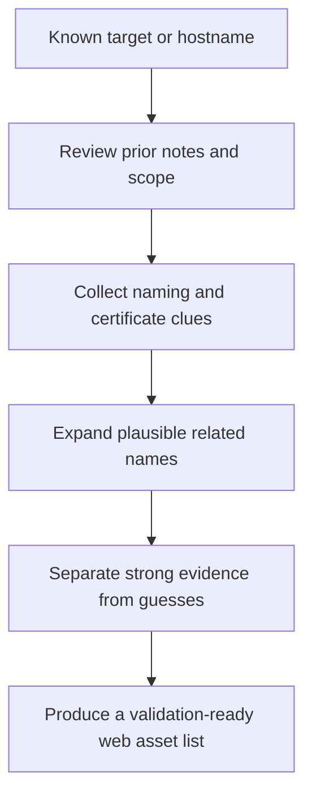
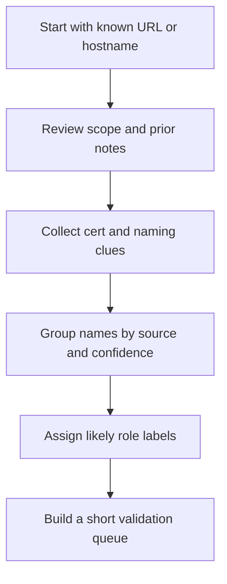

<div align="center">

**Hack the Basics · Phase II**

`Module 04 · Web Reconnaissance and Application Discovery`

</div>

# Lesson 4.2 — Passive Recon for Web Targets

---

> **🎯 Lesson Objective**
>
> By the end of this lesson, we will be able to gather a low-friction web asset inventory from existing clues, third-party visibility, and naming patterns so active recon starts with better targets and fewer guesses.

| **Course** | **Module** | **Lesson** | **Estimated Time** | **Difficulty** |
|---|---|---|---:|---|
| Hack the Basics | Module 04 — Web Reconnaissance and Application Discovery | 4.2 — Passive Recon for Web Targets | 45–65 min | Beginner |

| **Prerequisites** | **You will practice** | **Main outcome** |
|---|---|---|
| Lesson 4.1, Module 03 host-role and service context, basic DNS and certificate familiarity | Building an initial web inventory from names, certs, scope docs, and public clues | Learning how to collect useful web context before direct interaction with the target |

> **🚨 Important**
>
> Passive recon is not “do nothing.”
> It is deliberate information gathering that reduces uncertainty before you start touching the target directly.

---

## Table of Contents

- [Lesson Map](#lesson-map)
- [Why This Lesson Matters](#why-this-lesson-matters)
- [Learning Objectives](#learning-objectives)
- [The Practical Problem This Lesson Solves](#the-practical-problem-this-lesson-solves)
- [What We Mean by Passive Recon in This Module](#what-we-mean-by-passive-recon-in-this-module)
- [Why Passive Recon Belongs Before Active Mapping](#why-passive-recon-belongs-before-active-mapping)
- [Passive Sources at a Glance](#passive-sources-at-a-glance)
- [Starting With What You Already Have](#starting-with-what-you-already-have)
- [Using Naming Conventions as a Recon Multiplier](#using-naming-conventions-as-a-recon-multiplier)
- [Certificate Clues and Alternate Names](#certificate-clues-and-alternate-names)
- [DNS and Naming Context From Earlier Enumeration](#dns-and-naming-context-from-earlier-enumeration)
- [Public and Third-Party Visibility Sources](#public-and-third-party-visibility-sources)
- [When Passive Clues Conflict With Each Other](#when-passive-clues-conflict-with-each-other)
- [Observation vs Inference in Passive Recon](#observation-vs-inference-in-passive-recon)
- [What a Strong Passive Recon Output Looks Like](#what-a-strong-passive-recon-output-looks-like)
- [A Repeatable Passive Recon Workflow](#a-repeatable-passive-recon-workflow)
- [Walkthrough 1: Turning a Certificate Into an Asset Inventory](#walkthrough-1-turning-a-certificate-into-an-asset-inventory)
- [Walkthrough 2: Using Module 03 Notes to Predict Web Targets](#walkthrough-2-using-module-03-notes-to-predict-web-targets)
- [Walkthrough 3: Building a Validation List Instead of a Guess List](#walkthrough-3-building-a-validation-list-instead-of-a-guess-list)
- [Stop and Think](#stop-and-think)
- [Common Mistakes and Misconceptions](#common-mistakes-and-misconceptions)
- [Defender’s View](#defenders-view)
- [Key Takeaways](#key-takeaways)
- [Knowledge Check Quiz](#knowledge-check-quiz)
- [Quiz Answers](#quiz-answers)
- [Mini Practice Task](#mini-practice-task)
- [Next Lesson Bridge](#next-lesson-bridge)
- [End-of-Lesson Recap](#end-of-lesson-recap)

---

## Lesson Map



> **💡 Tip**
>
> Passive recon earns its value when it gives active recon better questions to ask, not when it produces the longest possible name list.

---

## Why This Lesson Matters

Many learners move into web recon too quickly.

They discover one hostname, send a few requests, and start drawing conclusions from a narrow slice of the surface.

That creates avoidable problems:

- missed alternate names
- ignored admin or API hostnames
- weak understanding of which assets belong together
- noisy active recon against the wrong entry points
- incomplete route maps later

Passive recon helps us start from a broader, cleaner picture.

The goal is not to avoid active work.
The goal is to make active work more precise.

> **📝 Note**
>
> In a professional workflow, passive recon is often the difference between “I checked the obvious page” and “I identified the actual application family and where its important routes probably live.”

---

## Learning Objectives

By the end of this lesson, we should be able to:

- define passive recon in a practical web-assessment context
- identify the most useful passive sources for early web target mapping
- turn naming, certificate, and prior-enumeration clues into a validation list
- recognize when an alternate hostname is strong evidence versus weak speculation
- keep passive observations separate from unvalidated assumptions
- build a useful first-pass asset inventory for active recon

---

## The Practical Problem This Lesson Solves

Suppose the only thing you start with is:

- `https://portal.acme.lab`

If you jump directly into active browsing, you may miss:

- `api.acme.lab`
- `admin.acme.lab`
- a related auth provider like `auth.acme.lab`
- separate docs or support portals
- naming patterns that predict staging or tenant-specific surfaces

Passive recon solves the problem of moving from:

- one observed web target

to:

- a better list of likely related names and surfaces that deserve deliberate validation

That list becomes the input for Lesson 4.3.

---

## What We Mean by Passive Recon in This Module

In this course, passive recon means gathering meaningful web context without relying primarily on direct, repeated interaction with the target itself.

### Common passive inputs

- scope documentation
- prior Nmap or service-footprinting notes
- certificate metadata already observed
- naming patterns from DNS and infrastructure context
- public references, cached references, or third-party visibility
- screenshots, notes, and artifacts from earlier work

### Why this definition matters

Some recon methods sit in a gray area.

For example:

- reading a certificate from an earlier scan result is passive in this workflow
- requesting the site again only to inspect its certificate is active

The line matters less than the learning goal here:

> collect low-friction context before making direct interaction the center of the workflow

---

## Why Passive Recon Belongs Before Active Mapping

Passive recon improves active mapping in four ways.

### 1. It expands the likely asset list

One known hostname may imply several related ones.

### 2. It improves naming accuracy

If the environment uses patterns like `portal`, `auth`, `api`, `admin`, and `files`, we can validate smarter.

### 3. It clarifies likely role separation

Different names often map to different trust or function boundaries.

### 4. It reduces noisy guessing

Instead of inventing random targets, we validate a smaller list of more plausible ones.

> **🚨 Important**
>
> Passive recon should narrow and strengthen the next step.
> If it only creates a giant unranked list, it is not doing its job.

---

## Passive Sources at a Glance

| Source | What it may reveal | Why it matters |
|---|---|---|
| scope docs | approved hostnames, URLs, exclusions | keeps recon aligned with authorization |
| prior scan output | HTTP ports, TLS services, certificate clues | connects web recon to earlier modules |
| certificate transparency or SAN data | alternate names, wildcard patterns | expands likely web targets |
| DNS and naming context | environment naming habits | helps predict related assets |
| public references and cached pages | product names, docs, subdomains | adds context without direct probing |
| earlier screenshots and notes | login pages, branding, route hints | avoids rediscovering known facts badly |

---

## Starting With What You Already Have

Before using any external source, start with your own existing evidence.

That usually includes:

- the original scan result
- certificates already collected
- Module 03 service triage notes
- scope or lab instructions
- any previously observed URLs

This matters because many learners overlook the simplest passive source:

> their own prior enumeration artifacts

### Example

If Module 03 notes say:

```text
443/tcp open https
ssl-cert: Subject CN=portal.acme.lab
Subject Alternative Name: portal.acme.lab, api.acme.lab, admin.acme.lab
```

then Lesson 4.2 should already produce:

- confirmed starting hostname: `portal.acme.lab`
- likely related names: `api.acme.lab`, `admin.acme.lab`
- likely validation order based on role guesses

That is a passive recon win before a single fresh request.

---

## Using Naming Conventions as a Recon Multiplier

Naming patterns are powerful because organizations often repeat them across services.

Common role-oriented names include:

- `portal`
- `app`
- `www`
- `api`
- `admin`
- `auth`
- `sso`
- `status`
- `docs`
- `files`

These names are not proof by themselves.
But they are excellent hypothesis generators.

### Strong use of naming patterns

- “The cert contains `api.acme.lab`, so `auth.acme.lab` may be worth validating if other clues support identity separation.”

### Weak use of naming patterns

- “I guessed 50 random subdomains and now assume half of them matter.”

| Naming clue | Reasonable inference |
|---|---|
| `api.example.lab` | likely programmatic endpoint or backend-facing surface |
| `admin.example.lab` | likely privileged or operational surface |
| `auth.example.lab` | likely identity or SSO-related component |
| `files.example.lab` | likely download, upload, or document surface |

> **🔍 Interpretation**
>
> Naming patterns are best treated as priority hints for later validation, not conclusions.

---

## Certificate Clues and Alternate Names

Certificates are one of the most useful passive recon sources in web work because they often reveal names beyond the first URL we saw.

### Useful certificate fields

- common name
- subject alternative names
- wildcard entries
- issuer patterns
- date ranges

### What certificate clues may tell us

- alternate hostnames in the same app family
- whether several names likely belong to one platform
- whether the environment separates app, API, and admin roles
- whether naming suggests tenants, staging, or support surfaces

### What they do not prove

- that every name is currently live
- that every name resolves the same way
- that every listed name is in scope

> **⚠️ Warning**
>
> Certificate evidence is strong for naming.
> It is weaker for claiming reachability or current route behavior.

---

## DNS and Naming Context From Earlier Enumeration

Module 03 already taught us that DNS, hostnames, mail records, and identity clues often reveal environment structure.

That same thinking applies here.

If earlier notes show:

- domain names
- SRV records
- mail names
- internal naming conventions
- reverse DNS patterns

those clues can strengthen our web asset hypotheses.

### Example

If the environment already contains:

- `vpn.acme.lab`
- `mail.acme.lab`
- `dc01.acme.lab`
- `portal.acme.lab`

then names like:

- `auth.acme.lab`
- `api.acme.lab`
- `admin.acme.lab`

become more plausible because they fit the environment’s naming style.

This is a good example of cross-module continuity:

- Module 03 gave us infrastructure context
- Module 04 uses that context to improve web recon

---

## Public and Third-Party Visibility Sources

In real assessments, passive recon may include sources outside your own notes.

Examples include:

- certificate transparency search
- search engine results
- cached page titles or snippets
- public documentation references
- leaked or indexed API documentation
- public screenshots or references in vendor documentation

These should be used carefully and ethically.

### The right mindset

- use them to expand or prioritize validation
- do not treat them as current truth automatically
- preserve where each clue came from
- keep authorization and scope boundaries in mind

### Why source tracking matters

If you later validate a hostname actively, you want to know:

- which names came from cert data
- which came from scope docs
- which came from public references

That prevents confusion and strengthens notes.

---

## When Passive Clues Conflict With Each Other

Passive recon is useful, but it is not perfectly clean.

You may see:

- a cert name that no longer resolves
- search results for an older hostname
- cached docs that mention legacy routes
- notes from earlier labs that no longer match the live app

That is normal.

### Strong response

- preserve the clue
- label the source
- rank it by confidence
- move it into the active-validation queue

### Weak response

- delete anything uncertain
- or treat every clue as confirmed truth

| Confidence level | Example |
|---|---|
| High | SAN entry taken from current observed certificate |
| Medium | hostname mentioned in recent scope notes or public docs |
| Lower | older cached reference with no confirming evidence yet |

---

## Observation vs Inference in Passive Recon

This distinction keeps passive recon honest.

### Observation

- cert SAN includes `api.acme.lab`
- scope doc lists `portal.acme.lab`
- cached page title references “Acme Admin Console”

### Inference

- `api.acme.lab` is likely part of the same platform
- the environment likely separates admin and user roles by hostname
- there may be a distinct admin surface worth validating early

### Validation need

- does `api.acme.lab` resolve and respond now?
- is the admin console live?
- do these names belong to the same target family in practice?

> **📝 Note**
>
> Passive recon becomes far more useful when each clue includes its source and confidence level.

---

## What a Strong Passive Recon Output Looks Like

A strong passive recon output is not just a list.
It is a structured inventory.

It should usually contain:

- the primary confirmed target
- related names or URLs grouped by source
- likely role labels such as app, auth, admin, or API
- a short note on why each name matters
- a ranked active-validation list

### Example

```text
Confirmed start point:
- portal.acme.lab

High-confidence related names:
- api.acme.lab (current certificate SAN)
- admin.acme.lab (current certificate SAN)

Medium-confidence related names:
- auth.acme.lab (fits naming pattern; likely SSO companion)

Validation order:
1. portal.acme.lab
2. api.acme.lab
3. admin.acme.lab
4. auth.acme.lab
```

That creates a disciplined handoff into active recon.

---

## A Repeatable Passive Recon Workflow

Use this workflow before deeper interaction.



### Practical sequence

1. Record the confirmed starting target.
2. Pull every existing naming clue from prior evidence.
3. Group clues by source: scope, cert, prior scan, public reference.
4. Mark confidence and likely role.
5. Build a short list for Lesson 4.3 to validate actively.

---

## Walkthrough 1: Turning a Certificate Into an Asset Inventory

Suppose prior scan output contains:

```text
Subject: CN=portal.acme.lab
X509v3 Subject Alternative Name:
    DNS:portal.acme.lab
    DNS:api.acme.lab
    DNS:admin.acme.lab
    DNS:docs.acme.lab
```

### Strong passive recon output

| Name | Source | Likely role | Confidence | Why validate |
|---|---|---|---|---|
| `portal.acme.lab` | current cert | user-facing app | high | primary entry point |
| `api.acme.lab` | current cert | API | high | likely core backend surface |
| `admin.acme.lab` | current cert | admin or ops | high | likely privileged surface |
| `docs.acme.lab` | current cert | docs or help | high | may reveal functionality or API details |

What matters here is not just the names.
It is that they are organized into a validation-ready list.

---

## Walkthrough 2: Using Module 03 Notes to Predict Web Targets

Suppose Module 03 notes show:

```text
10.10.20.15  443/tcp open https
PTR: app-gw01.acme.lab
SMTP banner references notifications@acme.lab
DNS records reveal support.acme.lab and mail.acme.lab
```

Reasonable web recon thoughts:

- `app-gw01` suggests an application gateway or reverse proxy role
- `support.acme.lab` may be a web target worth validating if in scope
- the environment already uses role-based naming

Reasonable next-step validation list:

- `portal.acme.lab` if already known
- `support.acme.lab`
- any cert-derived names tied to the same host or gateway

This is a good example of using cross-module evidence without overclaiming.

---

## Walkthrough 3: Building a Validation List Instead of a Guess List

Weak approach:

```text
Try:
admin, portal, api, www, app, auth, files, docs, hr, dev, qa, test, beta...
```

Strong approach:

```text
Validation queue:
1. portal.acme.lab (confirmed scope target)
2. api.acme.lab (cert SAN)
3. admin.acme.lab (cert SAN)
4. docs.acme.lab (cert SAN)
5. auth.acme.lab (naming inference; lower confidence)
```

The second list is better because:

- it is sourced
- it is ranked
- it preserves confidence
- it limits waste in Lesson 4.3

---

## Stop and Think

> **🛠 Practice**
>
> You have one approved URL: `https://portal.lab`.
> Existing notes show:
>
> - cert SAN: `portal.lab`, `api.lab`, `admin.lab`
> - prior DNS notes mention `auth.lab`
> - a cached snippet references “API Documentation”
>
> Before reading on, write:
>
> 1. the high-confidence validation list
> 2. the lower-confidence item
> 3. one sentence explaining why passive recon improved the next step

<details>
<summary><strong>Possible answer</strong></summary>

High-confidence validation list:

- `portal.lab`
- `api.lab`
- `admin.lab`

Lower-confidence item:

- `auth.lab`

Why passive recon helped:

It turned one known URL into a prioritized list of related names and likely roles, so active recon can validate likely surfaces instead of guessing blindly.

</details>

---

## Common Mistakes and Misconceptions

### Mistake 1: Treating passive recon as optional polish

It is a planning stage that improves the quality of every active request that follows.

### Mistake 2: Building giant speculative name lists

Breadth without confidence tracking creates noise, not clarity.

### Mistake 3: Ignoring sources

If you do not record where a clue came from, later notes become unreliable.

### Mistake 4: Treating certificate names as live proof

Certificates are strong naming evidence, not guaranteed reachability evidence.

### Mistake 5: Forgetting scope

A name may be visible publicly and still not be authorized for testing.

---

## Defender’s View

Defenders should expect passive recon to reveal more than the primary public URL.

If certificates, naming conventions, or public docs expose:

- admin naming
- internal role names
- stale subdomains
- operational routes

then an external assessor may build a more accurate map before sending many requests at all.

Reducing unnecessary exposure starts with asset and naming hygiene.

---

## Key Takeaways

- Passive recon gives active recon better starting points.
- Prior notes, scan output, and certificates are often your best first sources.
- Naming patterns help generate hypotheses, but they are not proof.
- Strong passive recon tracks source, confidence, and likely role.
- The right output is a short validation-ready asset list, not a giant speculative dump.

---

## Knowledge Check Quiz

### 1. What is the main goal of passive recon in this module?

A. To avoid active recon completely
B. To build a better asset inventory and validation queue before direct interaction
C. To exploit public targets quietly
D. To replace route mapping

### 2. Which is the strongest passive clue for alternate hostnames?

A. A guessed wordlist only
B. A current certificate SAN entry
C. A random browser autofill value
D. A single unrelated screenshot

### 3. What is the best way to record passive recon clues?

A. Merge them all into one unstructured list
B. Keep source, confidence, and likely role visible
C. Only keep the clues that are already confirmed live
D. Ignore anything that seems uncertain

### 4. Which statement is most correct?

A. Certificate names prove every listed host is reachable now
B. Naming patterns are useless until exploitation
C. Passive recon should narrow and strengthen the next active step
D. Public references are always current

### 5. Why does Module 03 matter to passive web recon?

A. It does not matter
B. It provides naming, service, and environment context that strengthens web asset hypotheses
C. It replaces web recon entirely
D. It only matters after a foothold

---

## Quiz Answers

### 1. Correct answer: B

Passive recon is meant to improve the quality of active mapping, not replace it.

### 2. Correct answer: B

Current certificate SAN entries are one of the strongest passive sources for alternate names.

### 3. Correct answer: B

Source and confidence tracking keep passive recon honest and reusable.

### 4. Correct answer: C

Passive recon should make the next active steps more precise and better justified.

### 5. Correct answer: B

Earlier modules give you domain, naming, and infrastructure context that makes web recon sharper.

---

## Mini Practice Task

Use the [web recon worksheet](../references/module-04-web-recon-worksheet.md) and fill in:

1. one confirmed starting target
2. three passive clues from prior evidence or legal third-party sources
3. a confidence level for each clue
4. a validation queue of three to five names or URLs for Lesson 4.3

Keep the list tight.
If a hostname has no real justification, leave it out.

---

## Next Lesson Bridge

Passive recon gives us a stronger starting list.

The next step is to touch those targets carefully and map:

- how they actually respond
- which routes and functions are visible
- which technologies and trust boundaries appear real

That is the job of [Lesson 4.3](module-04-lesson-4-3-active-recon-and-surface-mapping.md).

---

## End-of-Lesson Recap

Lesson 4.2 turned passive recon into a disciplined inventory-building workflow.

We now know how to:

- start with our own existing evidence
- use certs and naming conventions intelligently
- group clues by source and confidence
- avoid confusing possibility with proof
- produce a short list of assets that deserve direct validation next

That prepares us to move into active recon with far better context and far less waste.
