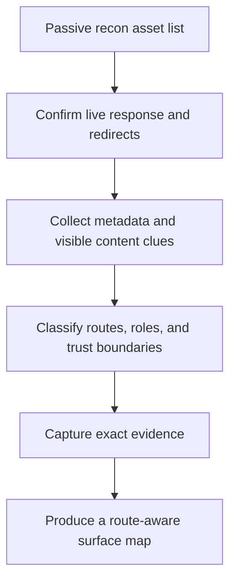
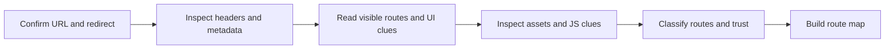
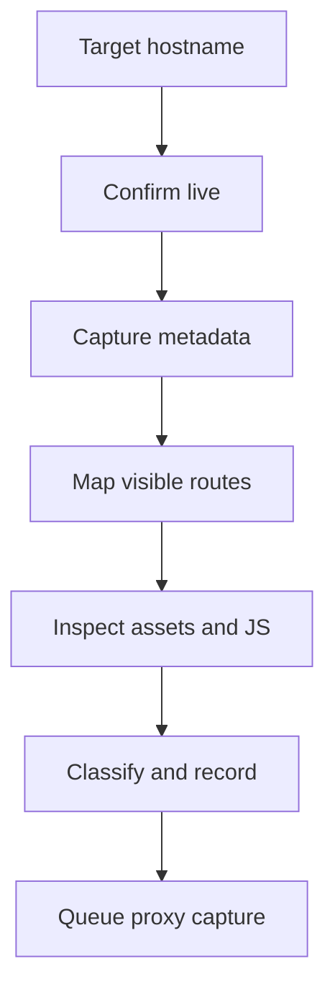

<div align="center">

**Hack the Basics · Phase II**

`Module 04 · Web Reconnaissance and Application Discovery`

</div>

# Lesson 4.3 — Active Recon and Surface Mapping

---

> **🎯 Lesson Objective**
>
> By the end of this lesson, we will be able to interact with live web targets deliberately enough to confirm hostnames, map visible routes, collect technology clues, and build a clean application surface map without collapsing into deep fuzzing or premature exploitation.

| **Course** | **Module** | **Lesson** | **Estimated Time** | **Difficulty** |
|---|---|---|---:|---|
| Hack the Basics | Module 04 — Web Reconnaissance and Application Discovery | 4.3 — Active Recon and Surface Mapping | 55–80 min | Beginner |

| **Prerequisites** | **You will practice** | **Main outcome** |
|---|---|---|
| Lessons 4.1-4.2, basic command-line web requests, basic understanding of headers and certificates | Confirming passive clues, mapping routes, classifying trust boundaries, and collecting evidence with low-friction active checks | Building a route-aware, evidence-backed surface map ready for Module 05 proxy work |

> **🚨 Important**
>
> This lesson is about controlled first-pass interaction.
> It is not the place to substitute brute-force discovery, aggressive fuzzing, or vulnerability scanning for understanding.

---

## Table of Contents

- [Lesson Map](#lesson-map)
- [Why This Lesson Matters](#why-this-lesson-matters)
- [Learning Objectives](#learning-objectives)
- [The Practical Problem This Lesson Solves](#the-practical-problem-this-lesson-solves)
- [What Active Recon Is Trying to Confirm](#what-active-recon-is-trying-to-confirm)
- [Why Controlled Interaction Matters](#why-controlled-interaction-matters)
- [A Layered Active Recon Workflow](#a-layered-active-recon-workflow)
- [Step 1: Confirm the Name, Protocol, and Redirect Behavior](#step-1-confirm-the-name-protocol-and-redirect-behavior)
- [Step 2: Inspect Headers and Response Metadata](#step-2-inspect-headers-and-response-metadata)
- [Step 3: Collect Title, Body, and Visible Function Clues](#step-3-collect-title-body-and-visible-function-clues)
- [Step 4: Review Certificates and Alternate Names Actively](#step-4-review-certificates-and-alternate-names-actively)
- [Step 5: Classify Routes by Function and Trust](#step-5-classify-routes-by-function-and-trust)
- [Step 6: Use Assets and JavaScript for Surface Clues](#step-6-use-assets-and-javascript-for-surface-clues)
- [Step 7: Recognize APIs, Docs, and Operational Paths](#step-7-recognize-apis-docs-and-operational-paths)
- [What to Capture in Notes While You Work](#what-to-capture-in-notes-while-you-work)
- [Observation vs Inference in Active Web Recon](#observation-vs-inference-in-active-web-recon)
- [What Counts as a Strong Surface Map](#what-counts-as-a-strong-surface-map)
- [A Repeatable Active Recon Workflow](#a-repeatable-active-recon-workflow)
- [Walkthrough 1: Confirming Redirects and Role-Specific Names](#walkthrough-1-confirming-redirects-and-role-specific-names)
- [Walkthrough 2: Mapping a Web App Without a Proxy Yet](#walkthrough-2-mapping-a-web-app-without-a-proxy-yet)
- [Walkthrough 3: Turning JavaScript and Docs Clues Into Route Inventory](#walkthrough-3-turning-javascript-and-docs-clues-into-route-inventory)
- [Stop and Think](#stop-and-think)
- [Common Mistakes and Misconceptions](#common-mistakes-and-misconceptions)
- [Defender’s View](#defenders-view)
- [Key Takeaways](#key-takeaways)
- [Knowledge Check Quiz](#knowledge-check-quiz)
- [Quiz Answers](#quiz-answers)
- [Mini Practice Task](#mini-practice-task)
- [Next Lesson Bridge](#next-lesson-bridge)
- [End-of-Lesson Recap](#end-of-lesson-recap)

---

## Lesson Map



> **💡 Tip**
>
> The first goal of active recon is not “touch everything.”
> It is “confirm the app shape with the smallest useful set of interactions.”

---

## Why This Lesson Matters

Passive recon can only take us so far.

At some point we need to confirm:

- which names are actually live
- where they redirect
- what they visibly expose
- which routes matter most
- how the surface should be classified

This is where beginners often lose discipline.

They may:

- run too many tools at once
- confuse content discovery with first-pass mapping
- skip note-taking because the browser “makes it obvious”
- collect screenshots without route-level meaning

Active recon fixes passive uncertainty, but only if it stays deliberate.

> **📝 Note**
>
> In this module, a good active recon pass should leave behind a clearer route map, not just a pile of response bodies.

---

## Learning Objectives

By the end of this lesson, we should be able to:

- confirm passive asset hypotheses with direct interaction
- capture redirect chains, headers, titles, and certificate details cleanly
- identify visible public, auth, admin, API, and operational routes
- use HTML and JavaScript clues to improve route classification
- document observations in a way that prepares proxy capture later
- avoid drifting into content discovery or exploit behavior too early

---

## The Practical Problem This Lesson Solves

Suppose passive recon gives us:

- `portal.acme.lab`
- `api.acme.lab`
- `admin.acme.lab`
- `docs.acme.lab`

That is helpful, but we still do not know:

- which names are live
- which ones redirect into each other
- whether the API is visible directly or only through front-end usage
- whether `/admin` is a path or a separate host
- whether docs are public, internal, or generated from the API

Active recon solves the problem of moving from:

- a likely asset inventory

to:

- a confirmed surface map with routes, functions, technologies, and trust boundaries

---

## What Active Recon Is Trying to Confirm

Active recon is not just “make requests.”

It is trying to answer specific questions:

1. Which hostnames and URLs respond meaningfully?
2. How do those targets redirect or normalize requests?
3. What titles, headers, and technologies appear visible?
4. Which routes are public, auth-related, administrative, or operational?
5. Where do APIs, docs, uploads, exports, or search features appear?
6. Which flows should the proxy inspect first next module?

If your active work is not helping answer those questions, it is probably drifting.

---

## Why Controlled Interaction Matters

The way you interact with a target changes the quality of your notes.

### Controlled interaction means

- starting with low-friction requests
- confirming one behavior at a time
- recording exact results
- classifying routes as you go
- avoiding unnecessary noise

### Uncontrolled interaction looks like

- clicking everywhere without recording paths
- running a full crawler before understanding the app shape
- mixing five tools worth of output into one note blob
- assuming the first rendered page explains the whole system

> **⚠️ Warning**
>
> A browser can hide important details by making requests feel invisible.
> Even without a proxy, you still need to think in terms of exact requests, paths, and responses.

---

## A Layered Active Recon Workflow



This layered approach keeps the work organized.

---

## Step 1: Confirm the Name, Protocol, and Redirect Behavior

Start small.

Useful first checks:

```bash
curl -I https://portal.acme.lab
curl -k -L -I https://portal.acme.lab
curl -I http://portal.acme.lab
```

### What to capture

- status code
- whether HTTP redirects to HTTPS
- whether `/` redirects to `/login`, `/app`, or another host
- whether canonicalization changes the hostname

### Why redirects matter

Redirects often reveal:

- the real entry point
- SSO involvement
- environment normalization
- role separation across hosts

### Example

```text
http://portal.acme.lab -> 301 https://portal.acme.lab/
https://portal.acme.lab/ -> 302 https://auth.acme.lab/login?return=portal
```

This is more than transport behavior.
It already reveals auth architecture clues and a likely cross-host flow for Module 05.

---

## Step 2: Inspect Headers and Response Metadata

Headers are compact, high-signal evidence.

Useful checks:

```bash
curl -kI https://portal.acme.lab
curl -vkI https://portal.acme.lab 2>&1 | sed -n '1,35p'
httpx -u https://portal.acme.lab -status-code -title -tech-detect -follow-redirects
```

### Capture carefully

- status code
- content type
- server header
- powered-by clues
- security headers if visible
- redirect locations
- cookies if visible in the response

### Why cookies matter even now

We are not analyzing sessions deeply yet.
But if the first response sets:

- session cookies
- CSRF tokens in HTML
- auth-related redirects

that already tells us the app likely depends on multi-step interaction that the proxy should capture later.

---

## Step 3: Collect Title, Body, and Visible Function Clues

Once headers are understood, fetch the page body and read it like a map.

Useful first checks:

```bash
curl -k https://portal.acme.lab/
curl -k https://portal.acme.lab/ | rg 'href=|form|api|login|admin|upload|export'
```

### Visible clues to look for

- title
- nav items
- login or register links
- search boxes
- upload buttons
- docs or help links
- admin references
- account or profile concepts

### Why this matters

UI clues often reveal business function earlier than raw tech fingerprints do.

For example:

- “Reports” suggests export or filtered data paths
- “Upload” suggests file handling
- “Manage Users” suggests administrative workflow
- “API Docs” suggests structured endpoints already exist

---

## Step 4: Review Certificates and Alternate Names Actively

If passive recon suggested alternate names, active recon should validate and deepen that picture.

Useful checks:

```bash
openssl s_client -connect portal.acme.lab:443 -servername portal.acme.lab </dev/null
curl -vkI https://portal.acme.lab 2>&1 | sed -n '1,30p'
```

### What to capture

- certificate subject
- SAN names
- mismatches or alternate names
- issuer clues if operationally useful

### Why do this during active recon if we already used passive clues?

Because this confirms:

- which specific live target produced the certificate
- whether the expected hostname and SNI behave correctly
- whether newly observed names should enter the route map or validation list

---

## Step 5: Classify Routes by Function and Trust

As routes appear, classify them immediately.

Do not wait until the end.

### Useful route classes

| Route class | Example | Why it matters |
|---|---|---|
| Public content | `/`, `/help`, `/docs` | reveals purpose and naming |
| Auth | `/login`, `/logout`, `/forgot-password` | prepares later auth work |
| User workflow | `/dashboard`, `/orders`, `/reports` | likely stateful or business-critical |
| Admin | `/admin`, `/manage`, `/console` | likely privileged surface |
| API | `/api/v1`, `/graphql` | key inputs for proxy and later testing |
| Operational | `/health`, `/metrics`, `/status` | may expose support or infrastructure clues |

### Why immediate classification helps

Because later prioritization becomes much easier when each path already has a role label.

---

## Step 6: Use Assets and JavaScript for Surface Clues

JavaScript and other assets often expose routes the visible page does not fully explain.

Useful checks:

```bash
curl -k https://portal.acme.lab/ | rg 'script src|static|bundle|app.js'
curl -k https://portal.acme.lab/static/app.js | rg '/api/|graphql|login|admin|upload|report'
```

### Useful things to capture

- API path prefixes
- role names like `isAdmin`
- feature names like `reports`, `billing`, or `upload`
- GraphQL references
- tenant or organization identifiers

### But stay disciplined

This is still first-pass mapping.
You are looking for route and function clues, not reverse engineering every client-side behavior in full detail.

---

## Step 7: Recognize APIs, Docs, and Operational Paths

Some paths deserve early special attention because they shape the next testing workflow.

Examples:

```bash
curl -k https://portal.acme.lab/robots.txt
curl -k https://portal.acme.lab/sitemap.xml
curl -k https://docs.acme.lab/
curl -k https://api.acme.lab/
curl -k https://portal.acme.lab/health
```

### Why these matter

- `robots.txt` and `sitemap.xml` may expose obvious route structure
- docs may reveal features, models, or API namespaces
- API roots may show response style and auth posture
- operational paths may reveal infrastructure boundaries

### Boundary check

Fetching a few obvious routes is still active recon.
Enumerating every possible hidden path is content discovery territory for Module 07.

---

## What to Capture in Notes While You Work

Strong active recon notes usually preserve:

- exact URL or host
- exact path
- status code
- redirect target if any
- title or visible label
- route class
- likely role or trust level
- interesting input or output
- whether proxy capture is needed next

### Minimal example

```text
Host: portal.acme.lab
Route: /
Observed: 302 to https://auth.acme.lab/login?return=portal
Class: auth handoff
Inference: likely centralized identity flow
Needs proxy next: yes
```

That is far more useful than “home page goes to login.”

---

## Observation vs Inference in Active Web Recon

This distinction is still critical once you start making requests.

### Observation

- `GET /` returns `302`
- `Location` points to `auth.acme.lab/login`
- `/docs` returns `200`
- `/api/` returns JSON error

### Inference

- the app likely uses centralized auth
- API and documentation surfaces appear distinct
- some routes may be intended for authenticated use only

### Validation needs

- whether the auth flow sets important cookies or tokens
- whether the API is public, authenticated, or role-limited
- whether `/admin` is reachable or only linked

> **🔍 Interpretation**
>
> The better your active recon notes are, the easier Module 05 becomes.

---

## What Counts as a Strong Surface Map

A strong surface map usually contains:

- confirmed hostnames and entry points
- redirect behavior and canonical paths
- visible route inventory
- role labels for each route
- technology clues recorded cautiously
- obvious APIs, docs, operational paths, or file features
- a short list of flows that need proxy capture next

### Weak result

- screenshots
- guessed tech stack
- “login page exists”

### Strong result

- route-aware notes with exact paths, trust classification, and handoff decisions

---

## A Repeatable Active Recon Workflow

Use this sequence for each promising hostname or app surface.

1. Confirm the target and redirect behavior.
2. Capture headers and lightweight metadata.
3. Read the body for visible routes and functions.
4. Inspect certs, assets, and JavaScript for additional clues.
5. Classify the visible routes.
6. Update the route map immediately.
7. Record which flows need proxy capture next.



---

## Walkthrough 1: Confirming Redirects and Role-Specific Names

Suppose active checks produce:

```text
portal.acme.lab  -> 302 -> auth.acme.lab/login
api.acme.lab     -> 401 JSON response
admin.acme.lab   -> 302 -> auth.acme.lab/login?service=admin
docs.acme.lab    -> 200 HTML docs page
```

### Strong interpretation

- `auth.acme.lab` likely acts as a shared identity surface
- `api.acme.lab` appears to exist independently and may expect auth
- `admin.acme.lab` likely represents a distinct privileged workflow
- `docs.acme.lab` may help explain API or app behavior

### Best next note

```text
Priority proxy targets:
1. portal -> auth redirect chain
2. admin -> auth redirect chain
3. docs page requests
4. any API calls triggered from visible user flows
```

---

## Walkthrough 2: Mapping a Web App Without a Proxy Yet

Suppose `curl -k https://portal.acme.lab/` returns HTML containing:

```html
<a href="/login">Login</a>
<a href="/reports">Reports</a>
<a href="/support">Support</a>
<a href="/api-docs">API Docs</a>
```

And:

```text
title: Acme Operations Portal
```

A good first-pass route map might look like:

| Route | Class | Interesting next-step value |
|---|---|---|
| `/login` | auth | capture redirect and form flow |
| `/reports` | user workflow | likely stateful data path |
| `/support` | public or semi-auth content | may reveal role boundaries or uploads |
| `/api-docs` | docs / API clue | may reveal endpoint structure |

We still do not know exactly how these behave under auth.
But the surface map is already meaningful.

---

## Walkthrough 3: Turning JavaScript and Docs Clues Into Route Inventory

Suppose we see:

```text
/api/v1/reports
/api/v1/users/me
/api/v1/export
/graphql
```

And docs mention:

- bearer tokens
- admin scopes
- report export endpoints

That should change the route map immediately.

### Route classes updated

| Route clue | Likely class | Why it matters |
|---|---|---|
| `/api/v1/users/me` | authenticated API | user/session-aware endpoint |
| `/api/v1/export` | file or data output | high-value stateful function |
| `/graphql` | structured API | likely central request surface |
| report export mention | user workflow with file output | important later testing target |

This is a good example of active recon producing a richer surface without yet needing deep request manipulation.

---

## Stop and Think

> **🛠 Practice**
>
> During active recon you observe:
>
> - `/` -> `302` to `/login`
> - `/api/` -> `401` with JSON content type
> - `/docs` -> `200`
> - bundled JS references `/api/v1/export`
> - `/admin` -> `302` to `auth.lab`
>
> Before reading on, write:
>
> 1. the routes that deserve “high” priority in the route map
> 2. one observation and one inference for `/api/`
> 3. two flows you would hand off to Module 05 first

<details>
<summary><strong>Possible answer</strong></summary>

High-priority routes:

- `/login`
- `/api/`
- `/admin`
- `/api/v1/export`

Observation for `/api/`:

- it returns `401` and JSON content type

Inference for `/api/`:

- it likely represents an authenticated API surface

Two proxy targets:

- the login flow
- any request path that reaches `/api/v1/export`

</details>

---

## Common Mistakes and Misconceptions

### Mistake 1: Letting the browser hide the request structure

Rendered pages feel intuitive, but they can make you forget exact paths and redirects.

### Mistake 2: Running too much automation too early

First-pass active recon should clarify the surface, not bury you in output.

### Mistake 3: Skipping route classification

If you do not label routes as public, auth, admin, API, or operational, your notes stay vague.

### Mistake 4: Treating every discovered path as equally important

Some routes matter much more because they touch auth, state change, or privileged function.

### Mistake 5: Drifting into Module 07 early

Heavy directory brute forcing and broad content discovery belong later.

---

## Defender’s View

Defenders should assume that careful first-pass interaction can quickly reveal:

- redirect architecture
- role separation
- API roots
- docs paths
- operational routes
- visible business functions

Even when the application is not exploited, shallow exposure often reveals more than teams expect.

Good surface reduction includes:

- minimizing unnecessary route exposure
- controlling docs and operational paths
- using clear auth boundaries
- removing stale or misleading naming

---

## Key Takeaways

- Active recon confirms and sharpens passive recon.
- Redirects, headers, titles, routes, and JavaScript clues all matter.
- Route classification should happen as you work, not after.
- Strong notes preserve exact paths and response behavior.
- The best output of active recon is a usable surface map and a queue of flows for the proxy to inspect next.

---

## Knowledge Check Quiz

### 1. What is the main goal of first-pass active web recon?

A. To brute force the site immediately
B. To confirm the app shape, map visible routes, and capture high-signal clues cleanly
C. To replace the proxy workflow entirely
D. To find every hidden path before reading the visible ones

### 2. Why do redirect chains matter so much?

A. They never matter
B. They often reveal canonical hosts, auth flows, and role boundaries
C. They only matter after exploitation
D. They replace route mapping

### 3. Which note is strongest?

A. “Website looks modern.”
B. “`/admin` exists.”
C. “`GET /admin` returns `302` to `https://auth.lab/login?service=admin`; likely privileged flow needing proxy capture.”
D. “Probably exploitable admin panel.”

### 4. Which activity belongs more naturally to Module 07 than Lesson 4.3?

A. Capturing a response header
B. Requesting `/robots.txt`
C. Running broad hidden-content fuzzing as the main workflow
D. Recording a redirect target

### 5. Why inspect JavaScript during active recon?

A. Because it can reveal route, API, and role clues even before deeper tooling is used
B. Because it proves vulnerability automatically
C. Because HTML no longer matters
D. Because it replaces proxy work

---

## Quiz Answers

### 1. Correct answer: B

Lesson 4.3 is about surface confirmation and mapping, not about brute-force discovery or exploitation.

### 2. Correct answer: B

Redirects often reveal the real structure of the application, especially around auth and canonical hostnames.

### 3. Correct answer: C

It preserves exact behavior, uses careful language, and identifies a meaningful next step.

### 4. Correct answer: C

Broad content discovery is important, but it belongs to the later fuzzing module.

### 5. Correct answer: A

JavaScript often exposes endpoints, route names, and role concepts that enrich the route map.

---

## Mini Practice Task

Choose one legal lab target from your Lesson 4.2 validation list and record:

1. its redirect behavior
2. its page title or response type
3. three visible routes or route clues
4. a route class for each
5. one reason the target should or should not be a high-priority proxy target next

Update both the worksheet and your route map as you work.

---

## Next Lesson Bridge

By now we can collect a real surface map.

The last step of the module is to convert that map into decisions:

- what matters most
- what the proxy should capture first
- what should be deferred to auth, fuzzing, or vulnerability modules

That is the job of [Lesson 4.4](module-04-lesson-4-4-from-web-discovery-to-test-plan.md).

---

## End-of-Lesson Recap

Lesson 4.3 turned active web recon into a controlled mapping workflow.

We now know how to:

- validate passive asset hypotheses
- read redirects, headers, and titles as evidence
- classify routes by function and trust
- use JavaScript and docs clues without overreaching
- produce a route-aware surface map instead of a vague page list

That leaves us ready to turn discovery into a prioritized testing plan and a clean handoff into proxy work.
