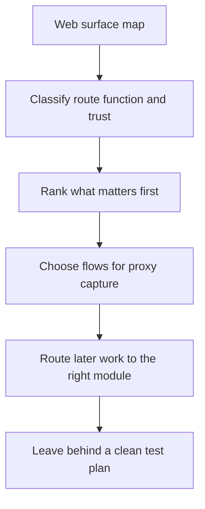
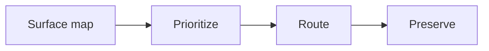
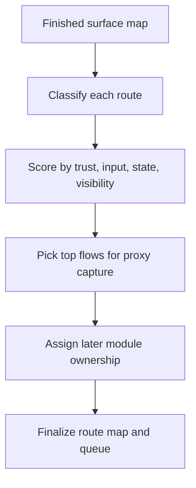

**Hack the Basics · Phase II**

`Module 04 · Web Reconnaissance and Application Discovery`

# Lesson 4.4 — From Web Discovery to Test Plan

---

> **🎯 Lesson Objective**
>
> By the end of this lesson, we will be able to turn web discovery output into a **prioritized test queue** that identifies which flows deserve proxy capture first, which routes matter most, and which later module should own each follow-up path.

| **Course** | **Module** | **Lesson** | **Estimated Time** | **Difficulty** |
|---|---|---|---:|---|
| Hack the Basics | Module 04 — Web Reconnaissance and Application Discovery | 4.4 — From Web Discovery to Test Plan | 55–75 min | Beginner |

| **Prerequisites** | **You will practice** | **Main outcome** |
|---|---|---|
| Lessons 4.1-4.3, route notes, recon worksheet, basic understanding of auth and state-changing actions | Prioritizing routes, building a first testing queue, and routing findings into the next modules | Learning how to convert a web surface map into a defensible next-step plan |

> **🚨 Important**
>
> Recon only becomes strategically useful when it changes what you do next.
> This lesson is the decision layer for Module 04.

---

## Table of Contents

- [Lesson Map](#lesson-map)
- [Why This Lesson Matters](#why-this-lesson-matters)
- [Learning Objectives](#learning-objectives)
- [The Practical Problem This Lesson Solves](#the-practical-problem-this-lesson-solves)
- [Why Web Recon Without a Test Plan Breaks Down](#why-web-recon-without-a-test-plan-breaks-down)
- [The Real Job of a Web Recon Test Plan](#the-real-job-of-a-web-recon-test-plan)
- [What Makes a Route High Priority?](#what-makes-a-route-high-priority)
- [A Practical Priority Model: Trust, Input, State, and Visibility](#a-practical-priority-model-trust-input-state-and-visibility)
- [Which Flows Should the Proxy Capture First?](#which-flows-should-the-proxy-capture-first)
- [Where Authentication Context Changes Priority](#where-authentication-context-changes-priority)
- [Where APIs and Docs Change the Story](#where-apis-and-docs-change-the-story)
- [Where File Features, Search, and Exports Deserve Attention](#where-file-features-search-and-exports-deserve-attention)
- [Building the Route Map Artifact](#building-the-route-map-artifact)
- [Building a First Testing Queue](#building-a-first-testing-queue)
- [Observation vs Inference in the Planning Stage](#observation-vs-inference-in-the-planning-stage)
- [Handoff Discipline: What Belongs to Modules 05, 06, 07, and 08](#handoff-discipline-what-belongs-to-modules-05-06-07-and-08)
- [A Repeatable Web Recon Planning Workflow](#a-repeatable-web-recon-planning-workflow)
- [Walkthrough 1: Prioritizing a Login-Centered Business App](#walkthrough-1-prioritizing-a-login-centered-business-app)
- [Walkthrough 2: Prioritizing an API-Heavy Surface](#walkthrough-2-prioritizing-an-api-heavy-surface)
- [Walkthrough 3: Prioritizing Admin, Upload, and Export Clues Together](#walkthrough-3-prioritizing-admin-upload-and-export-clues-together)
- [Stop and Think](#stop-and-think)
- [Common Mistakes and Misconceptions](#common-mistakes-and-misconceptions)
- [Defender’s View](#defenders-view)
- [Key Takeaways](#key-takeaways)
- [Knowledge Check Quiz](#knowledge-check-quiz)
- [Quiz Answers](#quiz-answers)
- [Module Practice Lab](#module-practice-lab)
- [Next Module Bridge](#next-module-bridge)
- [End-of-Module Recap](#end-of-module-recap)

---

## Lesson Map

> **💡 Tip**
>
> A good web test plan does not try to do every later module early.
> It decides what the next module should inspect first and why.

---

## Why This Lesson Matters

By the end of Lesson 4.3, we can now do something important:

- confirm hostnames
- capture redirects
- identify visible routes
- classify auth, API, admin, and operational clues
- build a first-pass route map

That is solid progress.

But it still leaves one critical problem unsolved:

> what should we inspect first, and which workflow should own each follow-up?

Without this step, learners often fall into one of three bad patterns:

- they proxy everything without a plan
- they jump into auth or fuzzing work randomly
- they produce notes that describe the app but do not guide the next action

This lesson fixes that by turning the surface map into a prioritized queue.

---

## Learning Objectives

By the end of this lesson, we should be able to:

- explain why a route map needs a prioritization layer
- rank web routes by trust, input, state change, and visibility
- decide which flows deserve proxy capture first
- identify which discoveries belong to later auth, fuzzing, or vulnerability workflows
- build a concise first testing queue from web recon evidence
- preserve the difference between planning, inference, and validation

---

## The Practical Problem This Lesson Solves

Suppose your surface map now contains:

- `/login`
- `/docs`
- `/api/v1/users/me`
- `/api/v1/export`
- `/reports`
- `/admin`
- `auth.acme.lab`
- `api.acme.lab`

That is useful, but now you must choose:

- Which route or host should be inspected first with a proxy?
- Which flows likely matter most because they involve auth, state changes, or privilege?
- Which clues belong to later content discovery instead of immediate proxy capture?
- Which routes are useful context but lower priority?

The problem is no longer finding the surface.
The problem is deciding how to spend attention.

---

## Why Web Recon Without a Test Plan Breaks Down

Recon is supposed to reduce uncertainty.
But if discovery ends with a pile of notes instead of a queue, the workflow weakens immediately.

Common failure modes:

### Failure mode 1: Everything feels equally interesting

This leads to scattered proxy captures and weak follow-through.

### Failure mode 2: The learner chases the coolest-looking route

Interesting is not the same as strategically important.

### Failure mode 3: Later modules inherit vague notes

If Module 05 starts with “there is login and maybe an API,” it wastes the work Module 04 should have done.

> **📝 Note**
>
> The product of recon is not just knowledge.
> It is a better next move.

---

## The Real Job of a Web Recon Test Plan

A good Module 04 test plan should do three jobs.

### 1. Prioritize

It decides which routes or hosts deserve attention first.

### 2. Route

It assigns the next action to the right later workflow.

### 3. Preserve

It leaves behind enough structured detail that later work does not have to rediscover the surface badly.

---

## What Makes a Route High Priority?

A route becomes higher priority when it is close to one or more of these:

- authentication or session change
- privileged function
- meaningful user input
- state-changing business logic
- file upload, export, or download
- API behavior that appears central to the app

### Examples

| Route | Why priority may rise |
|---|---|
| `/login` | central to auth and session behavior |
| `/admin` | likely privileged surface |
| `/api/v1/export` | file or data output path |
| `/upload` | strong input and file-handling significance |
| `/graphql` | central programmatic interaction surface |
| `/reports` | may mix user input, filtering, and export |

### Examples of lower immediate priority

- static help pages
- informational marketing content
- low-signal docs pages with no deeper route clues

Lower priority does not mean irrelevant.
It means not first.

---

## A Practical Priority Model: Trust, Input, State, and Visibility

Use this four-part model to rank the surface.

| Lens | What to ask |
|---|---|
| Trust | Is this public, authenticated, privileged, or operational? |
| Input | Does it accept search terms, IDs, file uploads, or structured data? |
| State | Does it create, update, delete, export, or otherwise change something? |
| Visibility | Can we inspect the behavior meaningfully now, or does it need a proxy first? |

### How to use the model

A route with:

- privileged trust
- meaningful input
- state-changing behavior
- and visible request flow

should usually rise toward the top of the queue.

---

## Which Flows Should the Proxy Capture First?

Module 05 is about instrumenting and reading traffic.
Lesson 4.4 decides what that traffic should be.

### Strong first proxy targets

- the landing-page redirect chain
- login or SSO flows
- a core authenticated-looking route
- a likely API request triggered by visible app use
- a state-changing path like upload, export, create, or update

### Why these are strong targets

They tend to reveal:

- cookies and tokens
- hidden parameters
- actual request methods
- redirect sequences
- state transitions
- role context

> **🚨 Important**
>
> Do not give Module 05 “the whole website.”
> Give it the most valuable flows to instrument first.

---

## Where Authentication Context Changes Priority

Some routes rise in priority simply because identity touches them.

Examples:

- `/login`
- `/logout`
- `/forgot-password`
- `/sso/callback`
- `/account`
- `/profile`
- redirects to `auth.example.lab`

### Why these matter

Even before deep auth analysis, these flows reveal:

- where identity is enforced
- whether auth is centralized
- what multi-step interactions exist
- which parts of the surface may change after login

That makes them prime handoff points to Modules 05 and 06.

---

## Where APIs and Docs Change the Story

APIs, API docs, and JavaScript route references often change the priority model.

### When APIs rise fast

- the visible app appears front-end heavy
- docs reveal structured endpoints
- JavaScript references core API namespaces
- API responses reveal auth expectations or data structures

### When docs rise fast

- they expose route names or endpoint families
- they reveal upload, export, or admin-related features
- they explain multi-step workflows better than the UI does

API-heavy surfaces often deserve earlier proxy planning because the most meaningful behavior may not be obvious from rendered pages alone.

---

## Where File Features, Search, and Exports Deserve Attention

Routes tied to file and data movement are often high-value because they blend:

- input handling
- state change
- output handling
- backend interaction

Examples:

- `/upload`
- `/import`
- `/export`
- `/download`
- `/reports`
- advanced search or filter builders

These features often deserve elevation in the queue even if they are not obviously admin-only.

Why?
Because they commonly involve:

- parameters
- file processing
- complex request bodies
- meaningful server-side behavior

Those are exactly the kinds of flows later modules need to inspect closely.

---

## Building the Route Map Artifact

By this point your route map should stop being a page list and become a planning artifact.

Each important entry should preserve:

- route or endpoint
- host or vhost
- how it was discovered
- likely role
- auth expectation
- interesting input or output
- priority
- next module owner

### Example

| Route | Host | Role | Auth | Interesting feature | Priority | Next owner |
|---|---|---|---|---|---|---|
| `/login` | `portal.acme.lab` | auth entry point | no | redirect chain, session start | high | Module 05 / Module 06 |
| `/api/v1/export` | `api.acme.lab` | authenticated API | likely yes | export behavior | high | Module 05 / Module 08 |
| `/docs` | `docs.acme.lab` | public docs | no | endpoint clues | medium | Module 05 |

This is the kind of artifact a later module can actually use.

---

## Building a First Testing Queue

A first testing queue is shorter than a full route map.
It is the ranked list of what to inspect next.

### Good first queue size

Usually three to five flows are enough for the first handoff.

### Example queue

1. landing page -> login redirect chain
2. login form and auth callback flow
3. first authenticated-looking API call from visible UI or JavaScript clues
4. export or upload route
5. admin redirect or admin entry flow

### Why short is better

Because it forces prioritization.
If everything is “first,” nothing is.

---

## Observation vs Inference in the Planning Stage

Planning still needs evidentiary discipline.

### Observation

- `/admin` redirects to `auth.acme.lab`
- `/api/v1/export` appears in JavaScript
- `/docs` returns `200`

### Inference

- the app likely has privileged admin workflows
- export behavior likely matters for later testing
- docs may help explain API structure

### Planning decision

- prioritize login, admin redirect, and export-related API capture first

Notice the difference:

- inference explains the likely meaning
- planning decides what to do next

Neither should be phrased as confirmed exploit or auth behavior yet.

---

## Handoff Discipline: What Belongs to Modules 05, 06, 07, and 08

This is where Module 04 must be especially clean.

| If the route or clue points to... | Natural next owner |
|---|---|
| request structure, redirects, cookies, headers, replay | Module 05 |
| login logic, SSO, reset, MFA, role changes, credential questions | Module 06 |
| hidden routes, vhost expansion, parameter brute force, broader discovery | Module 07 |
| input testing, state changes, uploads, file handling, core web vuln classes | Module 08 |

> **⚠️ Warning**
>
> Module 04 should prepare later modules, not cannibalize them.

---

## A Repeatable Web Recon Planning Workflow

### Practical sequence

1. Review the worksheet and route map.
2. Mark high-value routes and hostnames.
3. Choose the first three to five proxy targets.
4. Mark which findings belong to auth, fuzzing, or vulnerability work later.
5. Write a short close-out note explaining why those priorities were chosen.

---

## Walkthrough 1: Prioritizing a Login-Centered Business App

Suppose recon reveals:

- `/` -> `302` to `/login`
- `/dashboard`
- `/profile`
- `/reports`
- `/forgot-password`

### Strong first queue

1. landing page -> login flow
2. login form submission and redirect behavior
3. a report-related route if visible publicly or via JS clues

### Why this queue works

- auth appears central
- session behavior likely affects the whole app
- reports suggest meaningful state or data interaction

### What is deferred

- deeper password and auth logic to Module 06
- hidden route expansion to Module 07

---

## Walkthrough 2: Prioritizing an API-Heavy Surface

Suppose recon reveals:

- `api.acme.lab` returns JSON errors
- `/graphql` appears in JS
- `/api-docs` is public
- the visible front end is sparse

### Strong first queue

1. initial front-end load to see what API calls it triggers
2. direct API root response capture
3. docs or GraphQL-related requests

### Why this queue works

- the meaningful behavior likely lives in the request layer
- docs and GraphQL clues can reshape the whole test plan
- Module 05 becomes especially important here

---

## Walkthrough 3: Prioritizing Admin, Upload, and Export Clues Together

Suppose recon reveals:

- `/admin` redirects to SSO
- `/upload` appears in the navigation
- `/api/v1/export` appears in JS
- `/docs` exists but looks mostly informational

### Strong priority order

1. `/admin` redirect and auth flow
2. `/upload` interaction path
3. export-related API flow
4. docs only after those if docs seem likely to clarify the other routes

### Why this order works

- admin routes imply privilege
- upload and export imply meaningful inputs and outputs
- docs help, but they are support material rather than the highest-value flow themselves

---

## Stop and Think

> **🛠 Practice**
>
> Your route map contains:
>
> - `/login`
> - `/api/v1/search`
> - `/api/v1/export`
> - `/admin`
> - `/docs`
> - `/health`
>
> Before reading on, decide:
>
> 1. which three routes belong at the top of the first testing queue
> 2. which one is probably most useful to Module 06
> 3. which one may be more useful later to Module 07 than immediately to Module 05

<strong>Possible answer</strong>

Top three:

- `/login`
- `/admin`
- `/api/v1/export`

Most useful to Module 06:

- `/login`

Potentially more useful later to Module 07:

- `/docs`, if it mainly supports route expansion and discovery rather than a core first flow

---

## Common Mistakes and Misconceptions

### Mistake 1: Equating visibility with priority

Just because a route is obvious does not mean it is the best next target.

### Mistake 2: Sending every route to the proxy

The proxy needs a queue, not a flood.

### Mistake 3: Forgetting state-changing routes

Uploads, exports, create, and update flows often matter more than static admin pages.

### Mistake 4: Mixing planning with proof

A prioritized route is not the same thing as a confirmed weakness.

### Mistake 5: Doing later modules early

Module 04 should leave behind structure and decisions, not deep auth or fuzzing execution.

---

## Defender’s View

Defenders should assume that even clean recon can produce a strong operational picture:

- which routes matter most
- where privileged workflows begin
- which API and export paths deserve scrutiny
- how auth is likely structured

This is why minimizing unnecessary route exposure and clarifying intended trust boundaries are valuable defensive practices even before vulnerability remediation begins.

---

## Key Takeaways

- Recon becomes useful when it changes the next move.
- Priority usually rises with trust, input, state change, and visibility.
- The best first proxy targets are the flows most likely to reveal auth, parameters, or meaningful logic.
- Module 04 must hand work cleanly into Modules 05-08 instead of doing their jobs early.
- A route map and short testing queue are the real outputs of this module.

---

## Knowledge Check Quiz

### 1. What is the main purpose of the Module 04 test plan?

A. To replace later modules
B. To decide which discovered flows matter most and where they should hand off next
C. To prove vulnerabilities already exist
D. To document only low-priority routes

### 2. Which route usually deserves early priority because it is close to both identity and state?

A. a static logo asset
B. `/login`
C. a plain CSS file
D. a marketing footer link

### 3. Which is the strongest planning note?

A. “Admin vulnerable.”
B. “`/admin` probably bad.”
C. “`/admin` redirects to centralized auth; prioritize proxy capture of the redirect and callback flow.”
D. “Need to hack admin.”

### 4. Which finding most naturally routes into Module 07 rather than staying entirely inside Module 05?

A. a visible login redirect chain
B. a need to expand hidden content and alternate routes broadly
C. a single response header
D. a cert SAN entry

### 5. Why should the first testing queue stay short?

A. Because shorter notes look cleaner
B. Because prioritization is part of the learning goal, and a short queue forces meaningful ranking
C. Because the app probably has only three routes
D. Because the proxy cannot inspect more than five requests

---

## Quiz Answers

<strong>Reveal quiz answers</strong>

### 1. Correct answer: B

The test plan translates recon into decisions and handoffs.

### 2. Correct answer: B

Login flows are often central to how the application actually behaves.

### 3. Correct answer: C

It preserves observed behavior, uses careful language, and defines the next workflow clearly.

### 4. Correct answer: B

Broad hidden-content expansion belongs naturally to the later content-discovery module.

### 5. Correct answer: B

A short queue forces the learner to rank importance instead of avoiding the decision.

---

## Module Practice Lab

Use the [module lab](../labs/module-04-lab-01-web-recon-and-surface-mapping.md) to turn your worksheet and route map into a complete first-pass recon package:

- asset inventory
- route map
- proxy-capture queue
- close-out note

If you have not filled in the [route map template](../references/module-04-route-map-template.md), do that before starting the lab.

---

## Next Module Bridge

Module 04 should leave you with a clear answer to this question:

> which requests and flows are important enough to intercept, replay, and inspect first?

That is exactly where [Module 05 - Web Proxies and HTTP Traffic Analysis](../../05-web-proxies-and-http-traffic-analysis/README.md) begins conceptually:

- instrumenting the browser and app traffic
- reading requests and responses directly
- replaying and modifying flows
- turning mapped routes into visible HTTP behavior

If Module 04 was done well, Module 05 starts with direction instead of guesswork.

---

## End-of-Module Recap

Module 04 started the course’s contiguous web arc by teaching how to move from simple web exposure into structured application discovery.

Across the module, we learned how to:

- define what a web application surface actually includes
- gather passive clues before touching the target heavily
- confirm live names, redirects, routes, and technologies through controlled interaction
- build a route map that preserves trust, function, and role context
- convert that surface map into a practical first testing queue

The module does **not** finish the web workflow.
It prepares it.

From here, the next step is not “try random web attacks.”
The next step is to instrument the traffic and see the actual request and response flows behind the routes we have mapped.
